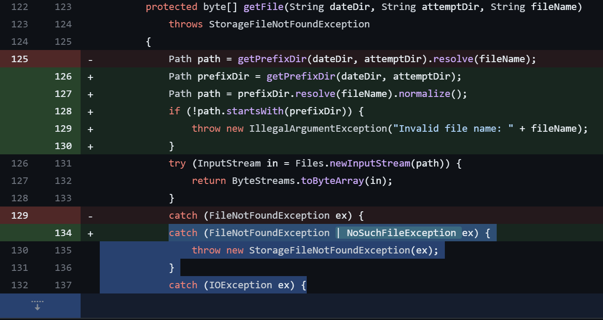

## URL

https://securitylab.github.com/advisories/GHSL-2023-221_digdag/

## Target

- digdag < 0.10.5.1

## Explain

Treasure Data사가 개발한 워크로드 자동화 도구인 digdag에서 Path traversal 취약점이 발견되었습니다.
```
protected byte[] getFile(String dateDir, String attemptDir, String fileName)
    throws StorageFileNotFoundException
{
    Path path = getPrefixDir(dateDir, attemptDir).resolve(fileName);
    try (InputStream in = Files.newInputStream(path)) {
        return ByteStreams.toByteArray(in);
    }
    catch (FileNotFoundException ex) {
        throw new StorageFileNotFoundException(ex);
    }
    catch (IOException ex) {
        throw ThrowablesUtil.propagate(ex);
    }
}
```
취약점은 `LocalFileLogServerFactory`클래스에 있는 `getFile`메소드에 존재합니다.

사용자는 `digdag --task-log <dir>`명령어를 통해 로그 파일을 로컬 디렉토리에 저장하도록 설정할 수 있고, 로그 파일 이름을 `getFile`메소드에 filename 인자로 전달해 로그 파일 내용을 확인할 수 있습니다.

취약점은 `getFile`메소드가 filename 값에 대한 검증 없이 `resolve`메소드를 호출해 발생합니다.
만약, `resolve`메소드의 인자로 절대 경로를 전달할 경우, 설정된 로컬 디렉토리 경로를 무시하고 절대 경로에 있는 파일 내용을 읽게 됩니다.

따라서, 공격자는 filename에 /etc/passwd와 같이 절대 경로를 넣어 서버에 저장된 민감한 파일을 읽을 수 있습니다.



해당 취약점은 `normalize`메소드를 사용해 상대 경로 접근을 제거하고 prefixDir 변수를 통해 상위 디렉토리로의 접근을 검증하는 코드가 추가되어 패치되었습니다.


## Reference

- [CVE-2024-25125 - Patch](https://github.com/treasure-data/digdag/commit/eae89b0daf6c62f12309d8c7194454dfb18cc5c3)