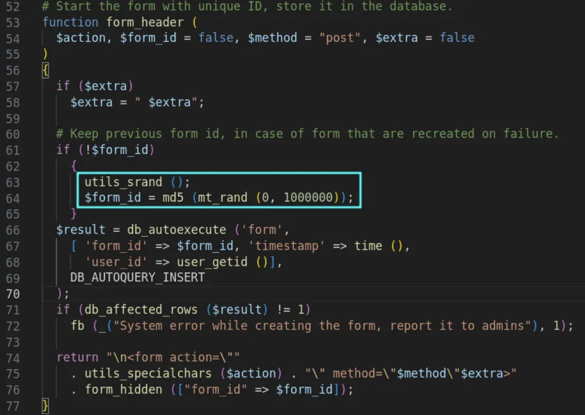

## URL

https://medium.com/@allypetitt/how-i-found-3-cves-in-2-days-8a135eb924d3

## Target

- Savane <= 3.12

## Explain

프로젝트 관리 및 협업을 위한 웹 애플리케이션 Savane에서 CSRF 취약점이 발견되었습니다.
취약점은 CSRF 토큰을 생성하는 데 사용되는 PRNG(난수 생성기)에서 Unix timestamp를 시드로 사용하는 것이 원인이었습니다.



`form_header()` 함수는 CSRF 토큰 값(`form_id`)을 생성하기 전에 `utils_srand()` 함수를 호출하고 PRNG에서 생성된 값을 MD5 해시 후 CSRF 토큰 값으로 사용합니다.

```
function utils_srand ()
{
  mt_srand ((int)((double)microtime () * 1000000));
}
```

`utils_srand()` 함수에서  `microtime()`을 사용해 현재 시간을 PRNG의 시드로 사용합니다. 

현재 시간은 예측 가능한 값이므로, 공격자가 정확한 시간 정보를 알고 있다면 유효한 CSRF 토큰을 독립적으로 생성할 수 있게 됩니다.

이를 통해, 공격자는 생성된 CSRF 토큰으로 CSRF 취약점 검증을 우회하고 계정 탈취 등의 악의적인 행위로 이어질 수 있습니다.

해당 취약점은 `random_bytes()` 함수를 사용해 예측하기 어려운 seed 값을 생성하도록 [패치](https://git.savannah.nongnu.org/cgit/administration/savane.git/commit/?h=i18n&id=dee5195d18f9ab16c860e8114819083673f66b95) 되었습니다.


## Reference

- https://github.com/ally-petitt/CVE-2024-27632?tab=readme-ov-file