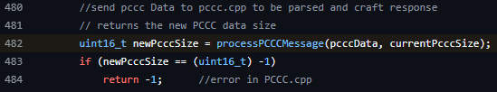

## URL

https://www.talosintelligence.com/vulnerability_reports/TALOS-2024-2004

## Target

- OpenPLC _v3 b4702061dc14d1024856f71b4543298d77007b88

## Explain

OpenPLC는 저비용 산업 자동화와 연구를 위한 솔루션을 제공하며 주로 산업 보안 연구에 활용되고 있습니다.

취약점은 지원하지 않는 명령/함수 쌍이 포함된 PCCC 요청이 컨트롤러 내에서 `-1` 값을 리턴하면서 발생합니다.


```
/* Determine the Command that is being requested to execute */
uint16_t Command_Protocol(pccc_header header, unsigned char *buffer, int buffer_size)
{
    uint16_t var_pccc_length;

    /*If Statement to determine the command code from the Command Packet*/
    if(((unsigned int)*header.HD_CMD_Code == 0x0f) && ((unsigned int)*header.HD_Data_Function_Code == 0xA2))//Protected Logical Read
    {	
        var_pccc_length = Protected_Logical_Read_Reply(header,buffer,buffer_size);
        return var_pccc_length;
    }
    else if(((unsigned int)*header.HD_CMD_Code == 0x0f) && ( ((unsigned int)*header.HD_Data_Function_Code == 0xAA) || ((unsigned int)*header.HD_Data_Function_Code == 0xAB)))//Protected Logical Write
    {	
        var_pccc_length = Protected_Logical_Write_Reply(header,buffer,buffer_size);
        return var_pccc_length;
    }
    else
    {
        /*initialize logging system*/
        char log_msg[1000];
        sprintf(log_msg, "PCCC: Unsupportedd Command/Data Function Code!\n");
        log(log_msg); 
        return -1;
    }//return length as -1 to signify that the CMD Code/Function Code was not recognize
}

```

`Command_Protocol` 함수는 `*header.HD_CMD_Code` 와 `*header.HD_Data_Function_Code` 값을 통해 PCCC 요청이 올바른 명령과 함수 코드로 이루어졌는지 확인합니다.
만약, 지원하지 않는 명령 또는 함수 코드일 경우 로그 메시지와 함께 `-1` 값을 리턴합니다.


```
//send pccc Data to pccc.cpp to be parsed and craft response
// returns the new PCCC data size
uint16_t newPcccSize = processPCCCMessage(pcccData, currentPcccSize);
if (newPcccSize == -1)
	return -1;	//error in PCCC.cpp

```

`Command_Protocol` 함수에서 리턴된 `-1` 값은 `ParsePCCCData`와`processPCCCMessage`함수를 거쳐 newPcccSize 변수 값으로 사용됩니다. 

이때, newPcccSize 변수 타입이 uint16_t이므로 `-1` 값이 `0xFFFF` 값으로 해석되어 if 문을 우회할 수 있습니다.


```
int sendRRData(int enipType, 
               struct enip_header *header, 
               struct enip_data_Unknown *enipDataUnknown, 
               struct enip_data_Unconnected *enipDataUnconnected, 
               struct enip_data_Connected *enipDataConnected)
{
    if (enipType == 1)
    {	
        ...
    }
    else if (enipType == 2)
    {	
        ...

        //send pccc Data to pccc.cpp to be parsed and craft response
        // returns the new PCCC data size
        uint16_t newPcccSize = processPCCCMessage(pcccData, currentItem2Size - 13); // get length of new pccc size
        if (newPcccSize == -1)                                                                                                    
            return -1;	//error in PCCC.cpp

        ...
        
        //move data forward
        memmove(&enipDataUnconnected->request_path[2], enipDataUnconnected->requestor_idLength, newPcccSize + 7);//11);
       
        ...
    }

```

CVE-2024-36980 취약점은 enipType이 0x02인 sendRRData 요청을 보낼 경우 트리거 할 수 있습니다. 

if 문 이후 `memmove` 함수 세 번째 매개 변수로 newPcccSize + 0x7 값을 사용하는데 세 번째 매개 변수 타입은 size_t이므로 0xFFFF + 0x7 = 0x10006 값이 됩니다.


```
user@machine:$ cat /proc/705332/maps
...
ffffa4960000-ffffa5160000 rw-p 00000000 00:00 0 
ffffa5160000-ffffa5170000 ---p 00000000 00:00 0 
...

```

`memmove` 함수 실행 시 size 값(0x10006)이 비정상적으로 커지면서 PCCC 요청 메모리 영역을 넘는 OOB Read가 발생합니다. 이때 외부 영역은 read 권한이 없기 때문에 `SIGSEV` 오류가 발생하게 됩니다.

따라서, 공격자는 PCCC 요청을 반복적으로 보내 DoS를 트리거 할 수 있습니다.

CVE-2024-36981 취약점의 경우 sendUnitData 함수에서 newPcccSize 값 검증을 하기 때문에 CVE-2024-36980과 유사하게 트리거 할 수 있습니다.




해당 취약점은 `-1` 값을 `(uint16_t)-1`로 캐스팅하여 `newPcccSize`와 타입을 일치시키도록 패치되었습니다.
