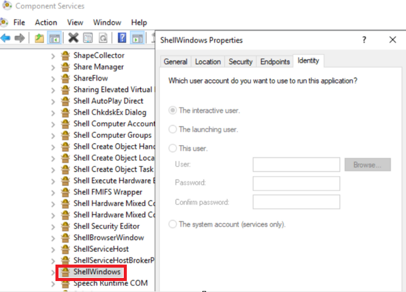
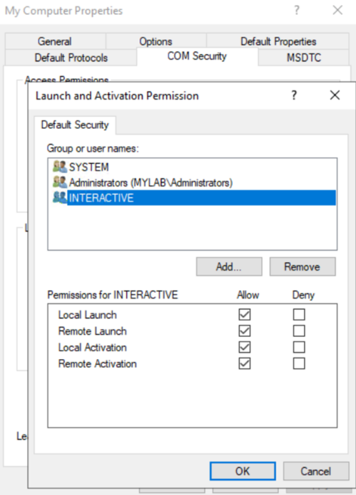
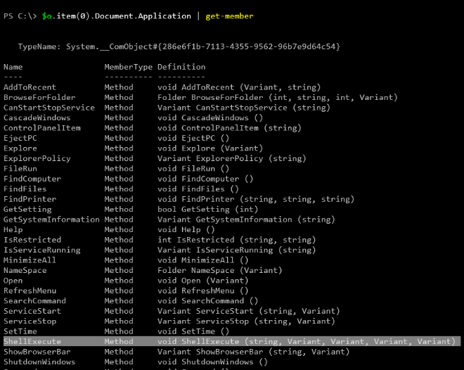
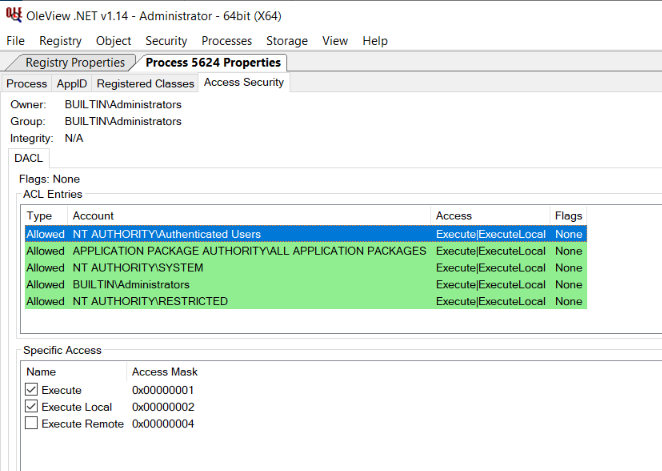
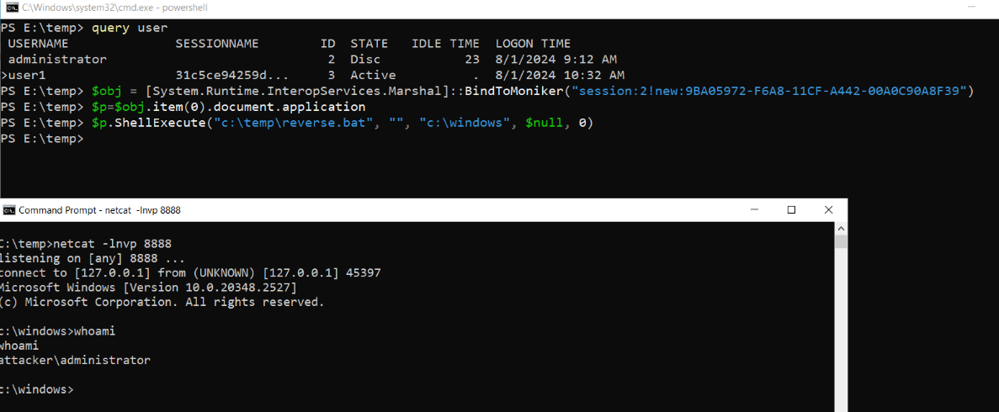
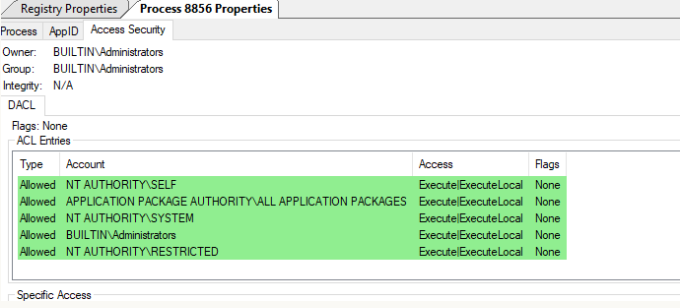

## URL

https://decoder.cloud/2024/08/02/the-fake-potato/

## Target

- windows_server_2016 Up to (excluding)10.0.14393.7159
- windows_server_2019 Up to (excluding)10.0.17763.6054
- windows_server_2022 Up to (excluding)10.0.20348.2582
- windows_server_2022_23h2 Up to (excluding)10.0.25398.1009

## Explain

Windows server의 파일 탐색기(explorer) 프로세스 내에 존재하는 DCOM 객체를 통해 권한 상승 취약점이 발생했습니다.

취약점은 Explorer가 High Integrity Level로 실행될 때, Access Security에 불필요한 권한이 있어 발생했습니다.

CLSID 값 {9BA05972-F6A8-11CF-A442-00A0C90A8F39}인 ShellWindows는 Explorer 내에 존재하는 DCOM 객체입니다.

ShellWindows의 Identity를 확인하면, Interactive user이므로 로그인한 사용자 세션과 동일한 보안 컨텍스트로 객체가 실행됩니다.

Launch and Activation을 확인하면, INTERACTIVE의 모든 권한이 있으므로 로그인한 사용자는 해당 객체를 실행할 수 있습니다.

CLSID를 통해 ShellWindows를 인스턴스화한 후, 구현된 메소드를 살펴보면 권한 상승에 필요한 `ShellExecute` 메소드를 확인할 수 있습니다.

OleView.NET 도구를 통해 High Integrity Level로 실행되는 Explorer 프로세스의 Access Security를 살펴보면, Authenticated Users의 Execute 권한이 있는 것을 확인할 수 있습니다.

취약점은 아래와 같이 COM Cross-Session Activation을 통해 트리거 할 수 있습니다.

- user1이 `BindToMoniker` 메소드를 통해 세션 2(administrator)의 ShellWindows DCOM 객체를 생성합니다.
- Access Security와 Launch and Activation Permissions에서 권한 검증을 수행하는데 각각 Authenticated Users의 Execute 권한와 INTERACTIVE 포함되어 있어 객체가 생성됩니다.
- ShellWindows는 Interactive user이므로 세션 2의 권한인 administrator로 생성됩니다.
- user1에서 `ShellExecute` 메소드를 통해 리버스 쉘을 실행하여 권한 상승을 트리거 할 수 있습니다.

해당 취약점은 Explorer가 High Integrity Level 실행될 때, Authenticated Users 그룹의 권한이 삭제되는 것으로 패치 되었습니다.

## Reference

- https://msrc.microsoft.com/update-guide/vulnerability/CVE-2024-38100
- https://nvd.nist.gov/vuln/detail/cve-2024-38100
