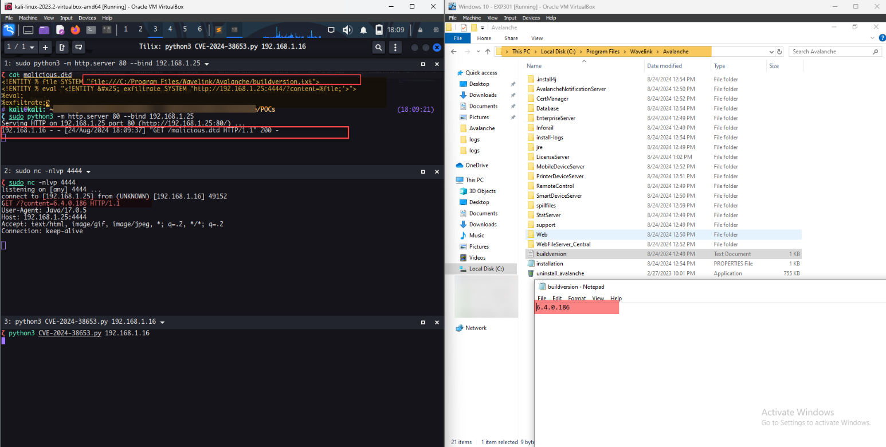

## URL

https://github.com/D4mianWayne/POCs/tree/main/CVE%202024-38653

## Target

- Ivanti Avalanche 6.3.1, 6.3.4, 6.4.0, 6.4.1

## Explain

Ivanti Avalanche는 모바일 장치 관리 솔루션(MDM)으로 소프트웨어 배포, 알림 및 보고서 관리를 제공합니다.

CVE-2024-38653은 XXE 취약점으로 공격자가 `/mdm/checkin` 엔드포인트로 PUT 요청을 보낼 경우 시스템에서 임의 파일을 읽을 수 있습니다.

```
sin = Utility.readFile((InputStream)req.getInputStream());

String sessionId = req.getParameter("sessionId");
String udidForVendor = req.getParameter("udid");
boolean deviceSimulator = ServletUtil.parseBoolean(req.getParameter("deviceSimulator"));
IDeviceAPI dapi = this.m_apiVector.getDbDeviceAPI();

Map<String, String> pairs = PList.decodeToMap(sin);

```

취약점은`CheckinServlet.java` 파일의 `doPut` 메소드에서 발생합니다.

`/mdm/checkin` 엔드포인트로 PUT 요청이 들어오면, `doPut` 메소드는 요청의 본문을`PList.decodeToMap` 메소드로 전달합니다.


```

public static Map<String, String> decodeToMap(String xml) throws XMLStreamException {
    Map<String, String> pairs = new HashMap<>();

    XMLInputFactory xmlInputFactory = XMLInputFactory.newFactory();
    XMLStreamReader xmlStreamReader = xmlInputFactory.createXMLStreamReader(new StringReader(xml));

    do {
        xmlStreamReader.next();
        String name = getName(xmlStreamReader);
        if (name == null)
            continue;  
        String value = getValue(xmlStreamReader);
        if (value == null)
            continue;  
        pairs.put(name, value);
    } while (xmlStreamReader.getEventType() != 8);

    return pairs;
}

```

`PList.decodeToMap` 메소드는 전달받은 본문에서 XML 데이터를 파싱합니다.

구체적으로 `XMLInputFactory`를 사용해 `XMLStreamReader`를 생성하고, `XMLStreamReader`가 XML 데이터를 처리합니다.

문제는 `XMLInputFactory`가 외부 엔티티를 처리하도록 기본 설정되어 있어 XXE 취약점이 발생합니다.



공격자는 [PoC](https://github.com/D4mianWayne/POCs/blob/main/CVE%202024-38653/ivanti-avalanche-cve-2024-38653.py)를 통해 시스템에서 임의의 파일을 읽을 수 있습니다.

하지만, XML 파서가 줄 바꿈 문자(`\n`)를 제거해버리기 때문에 파일이 여러 줄로 이루어져 있으면 첫 줄만 읽는 제한 사항이 있습니다.

해당 취약점은 `sds_server\com\wavelink\sds\ios\*` 경로에 있는 iOS 관련 클래스를 삭제하는 것으로 패치되었습니다.