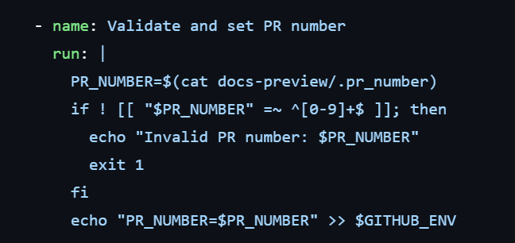

## URL

- https://github.com/litestar-org/litestar/security/advisories/GHSA-4hq2-rpgc-r8r7#event-274768

## Target

- Litestar <= 2.10.0

## Explain

Litestar는 Python 기반의 ASGI(Asynchronous Server Gateway Interface) 프레임워크로, 비동기 웹 애플리케이션과 API 개발에 사용됩니다.

취약점은 `docs-preview.yml` 워크플로우에서 발생하며, Environment Variable Injection을 트리거해 정보 유출 및 저장소 공격이 가능합니다.


```
on:
  workflow_run:
    workflows: [Tests And Linting]
    types: [completed]

```

`Tests And Linting` 워크플로우가 완료되면, `docs-preview.yml` 워크플로우가 실행됩니다.


```
- name: Download artifact
uses: dawidd6/action-download-artifact@v6
with:
  workflow_conclusion: success
  run_id: ${{ github.event.workflow_run.id }}
  path: docs-preview
  name: docs-preview

```

이때 `Tests And Linting` 워크플로우에서 생성된 아티팩트를 다운로드하고 압축을 해제합니다.


```
- name: Set PR number
  run: echo "PR_NUMBER=$(cat docs-preview/.pr_number)" >> $GITHUB_ENV

```

그 후 `docs-preview/.pr_number` 파일의 내용을 읽어 `PR_NUMBER` 환경 변수로 설정하고 `$GITHUB_ENV` 파일에 저장합니다.

`$GITHUB_ENV` 파일은 GitHub Actions에서 환경 변수를 정의할 때 사용하는 파일로 `KEY=VALUE` 형식으로 값을 추가하면, GitHub Actions는 새로운 환경 변수로 인식해 사용합니다.

취약점은 `.pr_number` 파일의 내용을 검증하지 않아 공격자가 `.pr_number` 파일에 여러 줄을 포함시켜 추가 환경 변수를 생성할 수 있습니다.


```
111
LD_PRELOAD=/home/runner/work/litestar/litestar/inject.so

```
공격자는 위와 같이 `.pr_number` 파일 내용을 작성할 경우 `PR_NUMBER` , `LD_PRELOAD` 두 개의 환경 변수를 생성할 수 있습니다.

따라서 공격자는 `LD_PRELOAD` 환경 변수를 통해 악성 라이브러리를 로드할 수 있게 됩니다.


```
- name: Deploy docs preview
  uses: JamesIves/github-pages-deploy-action@v4
  with:
    folder: docs-preview/docs/_build/html
    token: ${{ secrets.DOCS_PREVIEW_DEPLOY_TOKEN }}
    repository-name: litestar-org/litestar-docs-preview
    clean: false
    target-folder: ${{ env.PR_NUMBER }}
    branch: gh-pages
```
이후 `docs-preview`를 배포하는 과정에서 `JamesIves/github-pages-deploy-action` Actions이 실행되고 내부적으로 node 명령어를 사용하기 때문에 공격자 라이브러리를 로드하게 됩니다.

```
Issues: write
Metadata: read
PullRequests: write

```

해당 취약점을 통해 공격자는 위와 같은 권한을 얻을 수 있고, `DOCS_PREVIEW_DEPLOY_TOKEN` 토큰 정보를 유출할 수 있습니다.



해당 취약점은 정규 표현식을 통해 `.pr_number`파일 내용이 숫자인지 검증하도록 [패치](https://github.com/litestar-org/litestar/blob/main/.github/workflows/docs-preview.yml)되었습니다.


## Reference

- https://nvd.nist.gov/vuln/detail/CVE-2024-42370