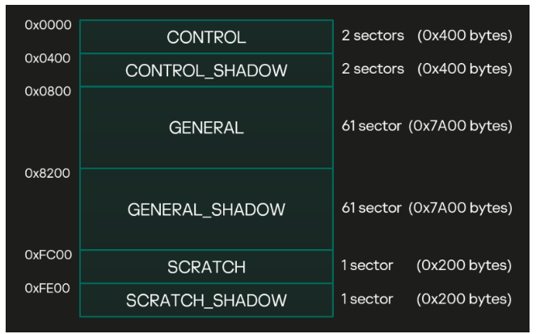
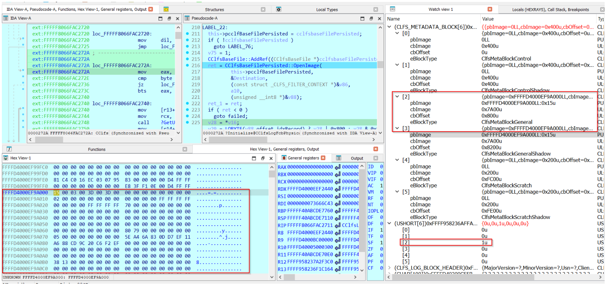
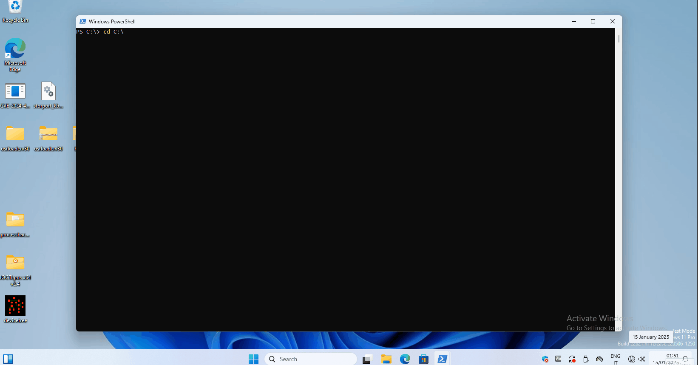
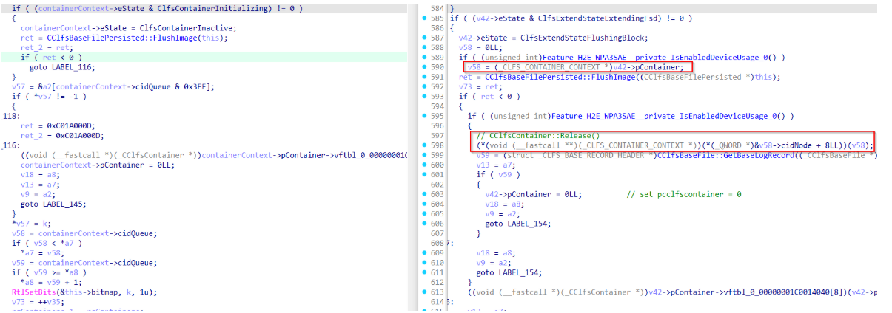

## URL

- https://security.humanativaspa.it/cve-2024-49138-windows-clfs-heap-based-buffer-overflow-analysis-part-1/

## Target

- KB5048685 이전 버전

## Explain

Windows CLFS (Common Log File System)는 로깅 또는 복구 지원이 필요한 모든 사용자 모드 애플리케이션에서 CLFS를 사용할 수 있습니다.

CVE-2024-49138 취약점은 BLF(Base Log File)의 GENERAL 블록이 free 된 것을 확인하지 않아, GENERAL 블록 내부 커널 객체 포인터(`containerContext->pContainer`)를 조작해서 EoP 취약점이 발생했습니다.

### Layout of a BLF file


먼저 BLF 파일은 컨테이너와 클라이언트를 추적하는 데 사용하는 파일로 여기서 컨테이너는 BLF와 연결된 사용자 데이터 파일입니다. `CreateLogFile()`와 `AddLogContainer()` API를 통해 BLF 파일을 열고 컨테이너에 데이터를 쓸 수 있습니다.

BLF 파일은 그림과 같이 6개 메타데이터 블록으로 구성되며 취약점이 GENERAL 블록에서 발생하고 클라이언트와 컨테이너에 대한 정보를 포함하고 있어 GENERAL 블록을 살펴보도록 하겠습니다.

```cpp
typedef struct _CLFS_LOG_BLOCK_HEADER
{
    UCHAR MajorVersion;
    UCHAR MinorVersion;
    UCHAR Usn;
    CLFS_CLIENT_ID ClientId;
    USHORT TotalSectorCount;
    USHORT ValidSectorCount;
    ULONG Padding;
    ULONG Checksum;
    ULONG Flags;
    CLFS_LSN CurrentLsn;
    CLFS_LSN NextLsn;
    ULONG RecordOffsets[16];
    ULONG SignaturesOffset;
} CLFS_LOG_BLOCK_HEADER, *PCLFS_LOG_BLOCK_HEADER;
```

GENERAL 블록은 다른 모든 블록과 같이 `CLFS_LOG_BLOCK_HEADER`로 시작하고, 이어서 `BASE_RECORD_HEADER`가 나옵니다.

```cpp
typedef struct _CLFS_BASE_RECORD_HEADER
{
    CLFS_METADATA_RECORD_HEADER hdrBaseRecord;
    CLFS_LOG_ID cidLog;
    ULONGLONG rgClientSymTbl[CLIENT_SYMTBL_SIZE];
    ULONGLONG rgContainerSymTbl[CONTAINER_SYMTBL_SIZE];
    ULONGLONG rgSecuritySymTbl[SHARED_SECURITY_SYMTBL_SIZE];
    ULONG cNextContainer;
    CLFS_CLIENT_ID cNextClient;
    ULONG cFreeContainers;
    ULONG cActiveContainers;
    ULONG cbFreeContainers;
    ULONG cbBusyContainers;
    ULONG rgClients[MAX_CLIENTS_DEFAULT];
    ULONG rgContainers[MAX_CONTAINERS_DEFAULT];  <- here!
    ULONG cbSymbolZone;
    ULONG cbSector;
    USHORT bUnused;
    CLFS_LOG_STATE eLogState;
    UCHAR cUsn;
    UCHAR cClients;
} CLFS_BASE_RECORD_HEADER, *PCLFS_BASE_RECORD_HEADER;
```

여기서 `rgContainers` 필드는 `CLFS_CONTAINER_CONTEXT` 구조체에 대한 오프셋을 저장한 배열이며 `CLFS_CONTAINER_CONTEXT` 구조체는 각 컨테이너에 대한 정보를 포함하고 있습니다.

```cpp
typedef struct _CLFS_CONTAINER_CONTEXT
{
    CLFS_NODE_ID cidNode;
    ULONGLONG cbContainer;
    CLFS_CONTAINER_ID cidContainer;
    CLFS_CONTAINER_ID cidQueue;
    union
    {
        CClfsContainer* pContainer; <-here
        ULONGLONG ullAlignment;
    };
    CLFS_USN usnCurrent;
    CLFS_CONTAINER_STATE eState;
    ULONG cbPrevOffset;
    ULONG cbNextOffset;
} CLFS_CONTAINER_CONTEXT, *PCLFS_CONTAINER_CONTEXT;
```

`CLFS_CONTAINER_CONTEXT` 구조체에서는 `pContainer` 필드 값이 중요합니다. 디스크에서는 0으로 설정되지만, BLF가 메모리에 로드되면 `CClfsContainer` 객체를 가리키는 커널 포인터에 해당합니다.

```cpp
struct __unaligned __declspec(align(8)) _CClfsBaseFilePersisted
{
  _CClfsBaseFilePersisted_VTABLE_0_00000001C0014000::vtable *vftbl_0_00000001C0014000;
  ULONG m_cref;
  _BYTE gapC[4];
  PUCHAR m_pbImage;
  ULONG m_cbImage;
  _BYTE gap1C[4];
  __int64 m_presImage;
  USHORT m_cBlocks;
  _BYTE gap2A[6];
  CLFS_METADATA_BLOCK *m_rgBlocks;    <- here!
  PUSHORT m_rgcBlockReferences;       <- here!
  CLFSHASHTBL m_symtblClient;
  CLFSHASHTBL m_symtblContainer;
  CLFSHASHTBL m_symtblSecurity;
  ULONGLONG size;
  ULONG m_cbRawSectorSize;
  BOOLEAN m_fgeneralBlockReferenced;
  __declspec(align(4)) __int64 pCclfsContainer;
  __int64 event_a0;
  __int64 field_A8;
  char file_ea_info[16];
  __int64 field_C0;
  int field_C8;
  _BYTE gapCC[4];
  __int64 field_D0;
  _UNICODE_STRING filepath;
  RTL_BITMAP bitmap;
  char bitmapBuf[128];
  int field_178;
  _BYTE gap17C[4];
  char field_180[16];
  char field_190[16];
  char n_writes[16];
  __int64 field_1B0;
  __int64 controlrecord;
  int field_1C0;
};
```

`CreateLogFile()` API를 통해 BLF 파일을 열면 clfs.sys는 CClfsBaseFilePersisted 클래스를 통해 메모리 있는 BLF 파일을 나타냅니다.

CClfsBaseFilePersisted 클래스에서 중요한 필드는 아래와 같습니다.

- `m_rgBlocks` : CLFS_METADATA_BLOCK 구조체 배열을 가리키는 포인터로 배열 값으로 CONTROL, GENERAL 등 블록들에 대한 포인터가 존재합니다.
- `m_rgcBlockReferences` : 각 블록에 대한 참조 카운트(reference count)를 저장하는 배열을 가리키는 포인터입니다. 따라서, 배열 값을 통해 해당 블록이 현재 몇 군데에서 사용하고 있는지를 확인할 수 있습니다.

```cpp
struct _CLFS_METADATA_BLOCK
{
  PUCHAR pbImage;
  ULONG cbImage;
  ULONG cbOffset;
  CLFS_METADATA_BLOCK_TYPE eBlockType;
};
```

CLFS_METADATA_BLOCK 구조체에서 `pbImage` 필드는 메모리 내 블록의 시작 주소를 가리키는 포인터이고 `eBlockType`는 메타데이터 블록의 종류를 나타냅니다.

```cpp
typedef enum _CLFS_METADATA_BLOCK_TYPE
{
    ClfsMetaBlockControl,
    ClfsMetaBlockControlShadow,
    ClfsMetaBlockGeneral,      <- here
    ClfsMetaBlockGeneralShadow,
    ClfsMetaBlockScratch,
    ClfsMetaBlockScratchShadow
} CLFS_METADATA_BLOCK_TYPE, *PCLFS_METADATA_BLOCK_TYPE;
```

_CLFS_METADATA_BLOCK_TYPE를 확인하면, GENERAL 블록의 `eBlockType`은 `ClfsMetaBlockGeneral`이며, 이 값은 2에 해당합니다.

### root cause

```cpp
__int64 __fastcall CClfsBaseFile::AcquireMetadataBlock(
        _CClfsBaseFilePersisted *this,
        enum _CLFS_METADATA_BLOCK_TYPE blockType)
{
  __int64 BlockType; // rsi
  unsigned int v4; // edx
  int v5; // r8d
  int v6; // r9d

  BlockType = blockType;
  v4 = 0;
  if ( (int)BlockType < 0 || (int)BlockType >= this->m_cBlocks )
    return 0xC0000225LL;
  if ( ++this->m_rgcBlockReferences[BlockType] != 1 )
    return v4;
  v4 = ((__int64 (__fastcall *)(_CClfsBaseFilePersisted *, _QWORD))this->vftbl_0_00000001C0014000->CClfsBaseFilePersisted::ReadMetadataBlock(ulong))(
         this,
         (unsigned int)BlockType);
  if ( (v4 & 0x80000000) != 0 )
  {
    --this->m_rgcBlockReferences[BlockType];
    return v4;
  }
  if ( this->m_rgBlocks[BlockType].pbImage )
    return v4;
[...]
}
```

`CreateLogFile()` API를 통해 BLF 파일을 열면 아래 순서로 함수가 호출됩니다.

`CClfsLogFcbPhysical::Initialize()` → `CClfsBaseFilePersisted::OpenImage() -> ReadImage()` → `CClfsBaseFile::AcquireMetadataBlock()` 

`Initialize()` 내부에서 CClfsBaseFilePersisted 객체를 생성하고 `AcquireMetadataBlock()` 함수는 블록의 `m_rgcBlockReferences`의 참조 카운트가 0이라면, `ReadMetadataBlock()`을 호출해 블록을 메모리에 로드합니다. 이때 `_CClfsBaseFilePersisted.m_rgBlocks` 배열의 해당 `pbImage` 필드에 블록의 메모리 주소가 설정되고, `m_rgcBlockReferences` 배열의 해당 인덱스에 참조 카운트가 1로 설정됩니다.




위는 `OpenImage()` 함수가 완료된 후의 상태로 GENERAL 블록이 `CClfsBaseFilePersisted.m_rgBlocks[2].pbImage = 0xFFFFD4000EF9A000`에 로드되었고 해당 참조 카운트가 1로 설정된 것을 확인할 수 있습니다.

```cpp
__int64 __fastcall CClfsBaseFilePersisted::LoadContainerQ(
        _CClfsBaseFilePersisted *this,
        unsigned int *const a2,
        int a3,
        unsigned __int8 a4,
        char a5,
        union _CLS_LSN a6,
        unsigned int *a7,
        unsigned int *a8,
        unsigned __int64 *pcbContainer)
{
[...]
 BaseLogRecord = CClfsBaseFile::GetBaseLogRecord(this);
[...]
 rgContainers = BaseLogRecord->rgContainers;
[...]
 rgContainers_1 = rgContainers;
[..]
 while ( (unsigned int)k < MAX_CONTAINERS_DEFAULT )
  {
[...]
    offset = rgContainers_1[k];
    if ( offset )
    {
      if ( offset < 0x1338 )
        goto error;
      if ( (int)CClfsBaseFile::GetSymbol(this, offset, k, (UCHAR **)&container_context) < 0 )
        goto error;
      container_context_2 = (CLFS_CONTAINER_CONTEXT *__shifted(_CLFSHASHSYM,0x30))CClfsBaseFile::OffsetToAddr(
                                                                                    this,
                                                                                    offset);
      if ( !container_context_2 )
        goto error;
      v40 = (CLFS_CONTAINER_CONTEXT *)CClfsBaseFile::OffsetToAddr(this, ADJ(container_context_2)->cbSymName);
      v41 = v40;
      if ( !v40 )
[...]
      }
      j_1 = (_CClfsContainer *)pcbContainer;
      containerContext = container_context;
[...]
 if ( (containerContext->eState & ClfsContainerInitializing) != 0 )
        {
          containerContext->eState = ClfsContainerInactive;
          ret = CClfsBaseFilePersisted::FlushImage(this);  
          ret_2 = ret;
          if ( ret < 0 )
            goto LABEL_116;
        }
        v57 = &a2[containerContext->cidQueue & 0x3FF];
        if ( *v57 != -1 )
        {
LABEL_118:
          ret = 0xC01A000D;
          ret_2 = 0xC01A000D;
LABEL_116:
          ((void (__fastcall *)(_CClfsContainer *))containerContext->pContainer->vftbl_0_00000001C0014040->CClfsContainer::Release(void))(containerContext->pContainer);
          containerContext->pContainer = 0LL;
          v19 = a8;
          v13 = a7;
          v9 = a2;
          goto LABEL_145;
[...]
  }
[...]
}
```

`OpenImage()` 함수 이후 `LoadContainerQ()`함수를 호출합니다.

`LoadContainerQ()` 함수는 `_CLFS_BASE_RECORD_HEADER.rgContainers`에 연결된 각 컨테이너에 대해 `containerContext->eState`가 `ClfsContainerInitializing` 값을 가지면 `ClfsContainerInactive` 값으로 변경하고 변경된 컨테이너 상태 정보를 디스크에 반영하기 위해 `CClfsBaseFilePersisted::FlushImage(this);` 함수를 호출합니다.

```cpp
_int64 __fastcall CClfsBaseFilePersisted::WriteMetadataBlock(
        _CClfsBaseFilePersisted *this,
        enum _CLFS_METADATA_BLOCK_TYPE blocktype,
        char a3)
{
  [...]
  blockType_1 = (unsigned int)blocktype;
  pbImage = (CLFS_LOG_BLOCK_HEADER *)this->m_rgBlocks[blockType_1].pbImage;
  v27 = pbImage;
  if ( !pbImage )
  {
    ret = 0xC01A000D;
    ret_1 = 0xC01A000D;
    goto LABEL_23;
  }
  pbImagenotnull = 1;
  recordOffset = pbImage->RecordOffsets[0];
  v11 = ++*(_QWORD *)(&pbImage->MajorVersion + recordOffset) & 1LL;
  m_rgBlocks = this->m_rgBlocks;
  [...]
LABEL_9:
  if ( v11 )
    ++pbImage->Usn;
  container_idx = 0;
[...]
 while ( container_idx < MAX_CONTAINERS_DEFAULT )
  {
    ret_1 = CClfsBaseFile::AcquireContainerContext(this, container_idx, &containercontext);
    v15 = &this->vftbl_0_00000001C0014000 + container_idx;
    if ( ret_1 >= 0 )
    {
      containercontext_1 = containercontext;
      v15[56] = (_CClfsBaseFilePersisted_VTABLE_0_00000001C0014000::vtable *)containercontext->pContainer;
      containercontext_1->pContainer = 0LL;
      CClfsBaseFile::ReleaseContainerContext(this, &containercontext);
    }
    else
    {
      v15[56] = 0LL;
    }
    v25 = ++container_idx;
  }
[...]
ret = ClfsEncodeBlock(pbImage, pbImage->TotalSectorCount << 9, pbImage->Usn, 0x10u, 1u);
  ret_1 = ret;
if ( ret >= 0 )
  {
    encodeBlock_successul = 1;
    ret = CClfsContainer::WriteSector(
            (_CClfsContainer *)this->pCclfsContainer,
            (PRKEVENT)this->event_a0,
            0LL,
            this->m_rgBlocks[blockType].pbImage,
            pbImage->TotalSectorCount,
            &a6);
    ret_1 = ret;
[...]
 if ( pbImagenotnull )
  {
    if ( encodeBlock_successul )
    {
      v17 = ClfsDecodeBlock(pbImage, pbImage->TotalSectorCount, pbImage->Usn, 0x10u, (unsigned int *)&a6);
      if ( v17 < 0 ){
            CClfsBaseFile::ReleaseMetadataBlock(this, (enum _CLFS_METADATA_BLOCK_TYPE)blockType_1);
       }
[...]
```

`FlushImage()` 함수 내부에서 `CClfsBaseFilePersisted::WriteMetadataBlock()` 함수를 호출해 아래와 같이 동작합니다.

1. 컨테이너 `pContainer` 필드 초기화
    - 컨테이너들을 순회하면서, 각 컨테이너의 `CLFS_CONTAINER_CONTEXT.pContainer` 필드를 0으로 설정합니다. (`containercontext_1->pContainer = 0LL;`). 이는 디스크에 저장되기 전에 `CClfsContainer` 객체를 가리키는 커널 포인터를 비워두는 것입니다.
2. 인코딩 → 디스크 쓰기 → 디코딩
    - `ClfsEncodeBlock()` 함수를 호출하여 블록을 디스크에 저장하기 위해 인코딩합니다.
    - 인코딩이 성공하면 `CClfsContainer::WriteSector()`를 호출하여 메타데이터 블록을 BLF 파일에 씁니다.
    - 디스크 쓰기 이후에는 `ClfsDecodeBlock()` 함수를 호출하여 블록을 다시 디코딩 합니다 (메모리에서 사용하기 위해 원래 상태로 복원)
3. `ClfsDecodeBlock()` 실패 시 처리
    - 만약 `ClfsDecodeBlock()`이 실패하면, `CClfsBaseFile::ReleaseMetadataBlock()` 함수 호출을 통해 `CClfsBaseFilePersisted->m_rgcBlockReferences` 배열에서 해당 블록의 참조 카운트를 감소시키고, 만약 참조 카운트가 0이 되면 해당 블록의 메모리를 해제합니다.

취약점은 `ReleaseMetadataBlock()` 함수 호출로 GENERAL 블록이 해제되어도 이후에 확인하지 않아 커널 객체 포인터인 `containerContext->pContainer`를 컨트롤할 수 있어 발생했습니다.

### exploit



익스플로잇을 하기 위해서는 `ClfsEncodeBlock()`함수는 성공하고, `ClfsDecodeBlock()`함수는 실패해야 합니다.

공격자 악성 BLF 파일을 통해 clfs.sys가 메모리 해제 후 유효하지 않은 주소를 참조하게 만듭니다. 이때, 공격자 주소에 매핑해 둔 fake 객체를 통해 nt!DbgkpTriageDumpRestoreState 함수를 호출해 8바이트 임의 쓰기를 얻어 현재 스레드의 권한 필드(PreviousMode)를 0으로 변경하여 EoP를 트리거 합니다.

PreviousMode를 통해 Full Arbitrary Kernel Read/Write 프리미티브를 얻는 과정은 아래 연구글을 참고하면 됩니다! (샤라웃 L0ch)

- https://hackyboiz.github.io/2025/01/12/l0ch/bypassing-kernel-mitigation-part2/ko/


### patch


해당 취약점은 `FlushImage()` 호출 전에 `pContainer` 값을 변수에 미리 저장함으로써, `ClfsDecodeBlock()` 함수에서 실패하더라도 미리 저장된 `pContainer` 값을 사용하도록 패치되었습니다.


## Reference

- https://github.com/MrAle98/CVE-2024-49138-POC/tree/master