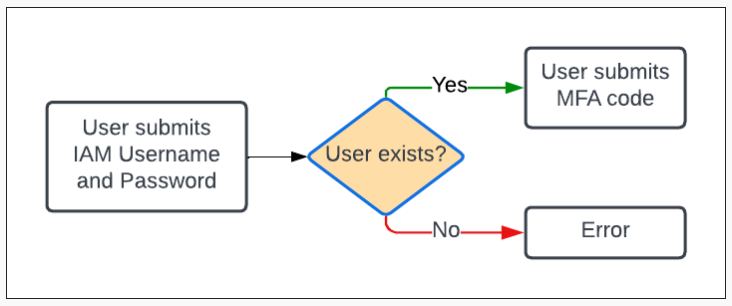
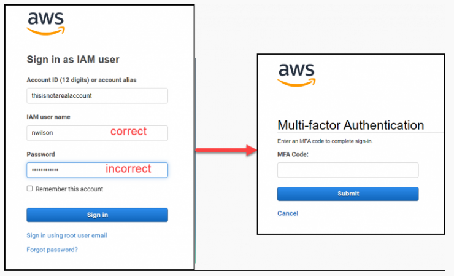
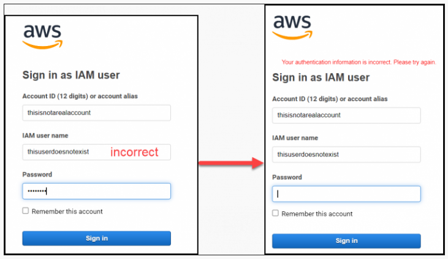
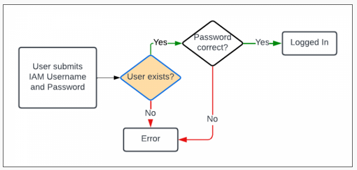
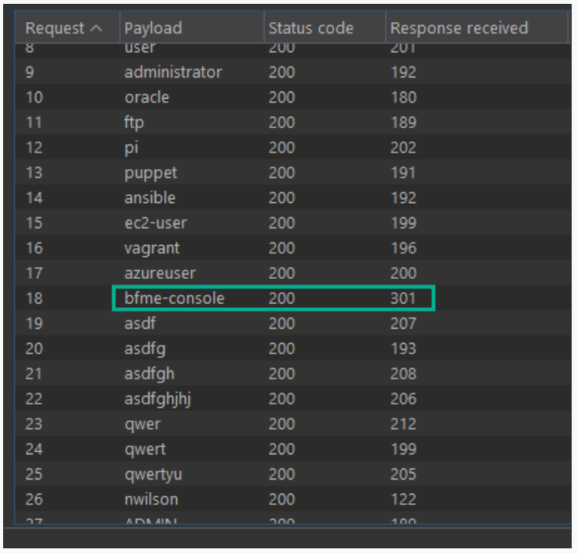

## URL

- https://rhinosecuritylabs.com/research/unauthenticated-username-enumeration-in-aws/

## Target

- 2025년 1월 16일 이전 버전의 AWS Sign-in IAM 사용자 로그인 흐름

## Explain

AWS IAM(Identity and Access Management)은 AWS 리소스에 대한 액세스를 안전하게 관리할 수 있는 웹 서비스입니다.

IAM 콘솔 로그인이 활성화된 모든 사용자에 대해 존재 여부를 확인할 수 있는 두 가지 취약점이 발견되었습니다.

### **Finding 1 - User name Enumeration (Users w/ MFA)**

AWS IAM 사용자가 MFA(다중 인증)를 활성화했을 경우, 로그인 흐름의 차이로 인해 해당 사용자의 존재 여부를 확인할 수 있습니다.

IAM 사용자가 AWS 웹 콘솔에 로그인하면 다음과 같이 동작합니다.

사용자가 존재하면 MFA 코드 입력 페이지로 이동하고, 존재하지 않으면 오류 메시지가 표시됩니다.

사용자가 존재하면 비밀번호가 틀려도 MFA 코드 입력 페이지로 이동하기 때문에, IAM 사용자의 존재 여부를 쉽게 확인할 수 있습니다.

해당 취약점은 AWS에서 허용 가능한 위험(Accepted Risk)으로 판단해, CVE가 할당되지 않았습니다.

### **Finding 2 (CVE-2025-0693) - User name Enumeration via Timing Attack (no MFA)**

MFA를 사용하지 않는 IAM 사용자는 Timing Attack을 통해 User Enumeration 취약점을 트리거 할 수 있습니다.

MFA가 비활성화된 IAM 사용자가 로그인하면 다음과 같이 동작합니다.

- 사용자가 존재하면, 비밀번호 검증 과정을 거친 후 응답이 반환됩니다.
- 사용자가 존재하지 않으면, 즉시 오류가 반환됩니다.

이때, 서버 응답 시간에 측정 가능한 차이가 발생한다면, 공격자는 여러 사용자명을 입력하고 응답 시간을 분석하여 사용자 존재 여부를 추측할 수 있습니다.

Burp Suite를 통해 테스트한 결과, 실제 존재하는 IAM 사용자(bfme-console)의 경우, 응답 시간이 약 100ms 증가해 실제 사용자 존재 여부를 알아낼 수 있습니다.

해당 취약점은 CVE-2025-0693 할당받았으며, AWS는 모든 인증 실패 시나리오에서 응답 시간을 동일하게 지연시키는 방식으로 패치를 진행했습니다.

## Reference

- https://aws.amazon.com/ko/security/security-bulletins/AWS-2025-002/