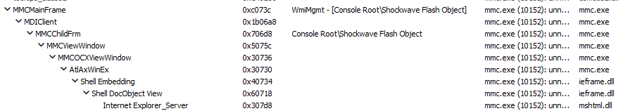

## URL

- https://www.trendmicro.com/en_us/research/25/c/cve-2025-26633-water-gamayun.html

## Target

- 지원되는 모든 버전의 Windows

## Explain

러시아 랜섬웨어 그룹 Water Gamayun(EncryptHub, Larva-208로도 불림)이 MMC(Microsoft Management Console)의 제로데이 취약점(CVE-2025-26633)을 활용해 악성코드 실행 및 데이터 탈취을 수행한 것으로 밝혀졌습니다.

MMC는 Windows의 각종 설정(장치 관리자, 작업 스케줄러 등)을 한곳에서 할 수 있게 해주고 여러 설정을  .msc 파일로 저장할 수 있습니다.

취약점은 .msc 파일과 MUIPath(Multilingual User Interface Path)를 처리할 때 발생했습니다.

MMC가 .msc 파일을 실행하면 내부적으로 `ScOnOpenDocument` 함수를 호출합니다. 

`ScOnOpenDocument`는 `ScGetMuiPath` 함수를 통해 MUIPath(en-US) 폴더에 동일한 이름의 .msc 파일이 있는지 확인합니다. 

만약 MUIPath(en-US) 폴더에 같은 이름의 .msc 파일이 존재하면, 원본 .msc 파일 대신 MUIPath(en-US) 폴더의 .msc를 우선 로드하여 실행합니다.

따라서, 공격자는 동일한 이름의 악성 .msc를 en-US 폴더에 넣어으로써 악성 파일이 실행되도록 만들 수 있습니다.

공격자는 MMC의 ActiveX 컨트롤 스냅인 내에서 ExecuteShellCommand 메서드를 통해 악성코드를 다운로드하고 실행한다고 합니다.

## Reference

- https://www.securityweek.com/russian-ransomware-gang-exploited-windows-zero-day-before-patch/
- https://www.ncsc.go.kr:4018/main/cop/bbs/selectBoardArticle.do?bbsId=Notification_main&nttId=202421&pageIndex=1&searchCnd2=