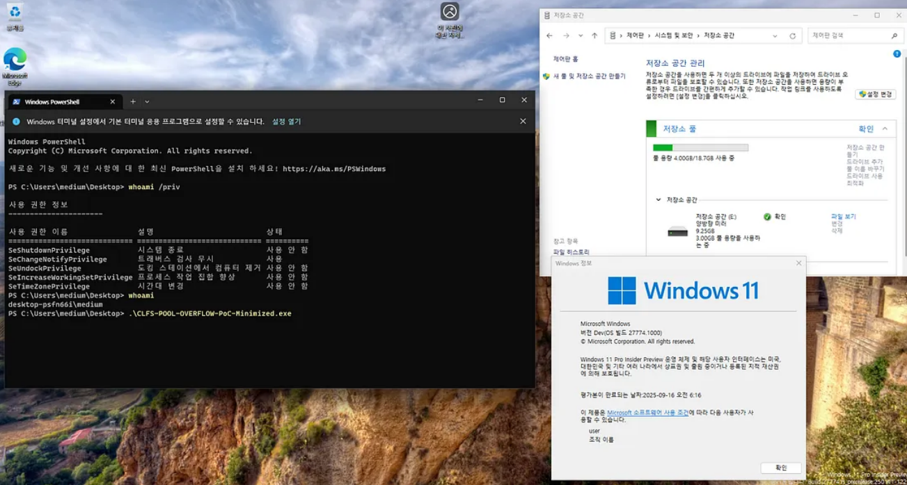

## URL

- https://medium.com/s2wblog/analysis-of-windows-common-log-file-system-driver-vulnerability-cve-2025-32713-97422b699d54

## Target

- 2025년 6월 누적 업데이트 이전 clfs.sys 파일
   - https://msrc.microsoft.com/update-guide/vulnerability/CVE-2025-32713

## Explain

Windows Common Log File System에서 Pool Overflow로 인한 LPE 취약점이 발생했습니다.

취약점은 로그 블록(Log Block)을 읽을 때 ClfsContextForward가 아닌 다른 컨텍스트 모드를 사용하고, 논리 섹터 크기(Logical Sector Size)가 512byte보다 큰 볼륨에서 발생합니다.

먼저 CLFS에서 로그 레코드를 읽기 전 아래 순서를 거칩니다.

1. **로그 마샬링 영역(Log Marshalling Area) 생성**
    - `CreateLogMarshallingArea` 함수를 호출해 로그 마샬링 영역을 생성합니다.
    - 해당 영역은 로그 데이터를 안전하게 옮기고 처리하기 위한 작업 공간 역할을 수행합니다.
2. **로그 레코드 읽기**
    - 이후, `ReadLogRecord` 함수를 호출해 마샬링 영역의 핸들과 읽고 싶은 로그 레코드의 시퀀스 번호(Log Sequence Number)를 전달합니다.
    - 여기서 시퀀스 번호는 로그 데이터 몇 번째를 읽을지를 지정하는 번호입니다.

### **Root Cause**

CLFS 드라이버에서 디스크에 저장된 컨테이너 파일 내에 로그 레코드를 읽을 때, `CClfsLogFcbPhysical::ReadLogBlock` 함수가 호출됩니다.

```cpp
// Pseudo code of CClfsLogFcbPhysical::ReadLogBlock function
// Execution flows not related to the bug are omitted.
__int64 __fastcall CClfsLogFcbPhysical::ReadLogBlock(
        CClfsLogFcbPhysical *this,
        struct _FILE_OBJECT *CachedFileObject,
        const union _CLS_LSN *a3,
        int a4,
        const struct _CLFS_READ_BUFFER *a5,
        unsigned int a6,
        struct IClfsRequestAsync *a7,
        char a8,
        union _CLS_LSN *a9,
        unsigned int *a10)
{
  ...
  **v75 = a4;**
  ...
  **// Get sector size of the volume which contains log container**
  **// This value is set during execution of CClfsBaseFilePersisted::OpenImage function**
  **_ContainerRawSectorSize = this->BaseFilePersisted->ContainerRawSectorSize;**
  **ContainerRawSectorSize = _ContainerRawSectorSize;**
  ...
  **v64 = *(_OWORD *)a5;**
  ...
  Address = (struct _CLFS_LOG_BLOCK_HEADER *)_CLFS_READ_BUFFER::GetAddress(a5);
  ...
  if ( Address )
  {
    **Buffer = _CLFS_READ_BUFFER::GetAddress((_CLFS_READ_BUFFER *)&v64);**
    if ( Buffer )
    {
      ...
      if ( (_BYTE)v52
        || CachedFileObject->PrivateCacheMap
        || (v13 = (*(__int64 (__fastcall **)(CClfsLogFcbPhysical *, struct _FILE_OBJECT *, CClfsLogFcbPhysical *))this->field_0)(
                    this,
                    CachedFileObject,
                    this),
            v13 >= 0) )
      {
        ...
        if ( (*(unsigned __int8 (__fastcall **)(CClfsLogFcbPhysical *))(this->field_0 + 312))(this) && (a8 & 8) != 0 )
        {
          ...
        }
        else if ( (this->field_168 & 0x100000000000i64) != 0 )
        {
          ...
        }
        else
        {
          ...
          if ( a3 && a3->ullOffset < (unsigned __int64)v20 )
          {
            ...
          }
          else
          {
            ...
            if ( !(unsigned __int8)operator>=(a3, &this->field_1E0) )
            {
              ...
              while ( 1 )
              {
                ...
                if ( **(v75 & 1) != 0** ) **// [1] Check the fourth argument**
                {
                  v45 = 0;
                  if ( !*a10 ) **// It is true when entering the loop for the first time**
                  {
                    **Length = ContainerRawSectorSize; // Set Length as sector size**
                    ...
                  }
                }
                if ( (_BYTE)v52 )
                {
                  ...
                }
                else
                {
                  ...
                  if ( FileOffset.HighPart < 0 || v34 < 0 )
                    ...
                  if ( v34 < v33.QuadPart + Length )
                  {
                    ...
                  }
                  v59.ullOffset = 0i64;
                  if ( v33.QuadPart < 0
                    || (int)RtlLongLongAdd(v33.QuadPart, Length, (__int64 *)&v59) < 0
                    || (__int64)v59.ullOffset > this->field_50 )
                  {
                    ...
                  }
                  // [2] **Pool overflow will occur if Length (sector size) is larger than the size of Buffer**
                  if ( **CcCopyRead**(CachedFileObject, &FileOffset, **Length**, 1u, **Buffer**, &IoStatus) )
                  {
                    ...
                  }

[...]
```

`CClfsLogFcbPhysical::ReadLogBlock` 함수의 네 번째 인자가 1로 설정된 경우 아래와 같이 동작을 합니다.

[1] 로그 컨테이너가 있는 볼륨의 논리 섹터 크기(ContainerRawSectorSize)를 Length 변수 값으로 설정합니다. [2] `CcCopyRead` 함수에서 Length 변수 값(섹터 크기)만큼 데이터를 Buffer에 write 하는데 이때, Length(섹터 크기)가 Buffer의 크기보다 크면 Pool Overflow가 발생합니다.

```cpp
// Pseudo code of CClfsRequest::ReadLogBlock function
// Execution flows not related to output buffer size constraints are omitted.
__int64 __fastcall CClfsRequest::ReadLogBlock(CClfsRequest *this)
{
  ...
  v2 = *(_QWORD *)(*((_QWORD *)this + 6) + 184i64);
  nOutBufferSize = *(unsigned int *)(v2 + 8);
  *((_DWORD *)this + 66) = nOutBufferSize;
  // **Check OutBufferSize constraints**
  // **It does not prevent pool overflow when sector size is larger than 512 bytes**
  if ( **(unsigned int)nOutBufferSize >= 0x28**
    && **(((_DWORD)nOutBufferSize + 0x1D7) & 0xFFFFFE00) != 0**
    && **((nOutBufferSize + 0x1D7) & 0xFFFFFFFFFFFFFE00ui64) == (unsigned int)nOutBufferSize - 0x28i64**
    && *(_DWORD *)(v2 + 16) >= 8u )
  {
    // Calling CClfsLogXXXXXXX::ReadLogBlock
    ...
  }
  ...
}
```

해당 취약점은 섹터 크기(ContainerRawSectorSize)가 512byte 보다 커야 발생하는데, 그 이유는 `ClfsRequest::ReadLogBlock` 함수에서 최소 출력 버퍼(Buffer) 크기가 552byte로 제약이 걸려있기 때문입니다.

### **Direct call to CLFS.sys using DeviceIoControl**

추가로 일반적인 로그 레코드 읽기 과정에서는 로그 마샬링 영역이 메모리를 관리(크기 검사 및 보호 역할) 하기 때문에 취약점을 트리거 할 수 없습니다. 

이때, `CClfsLogFcbPhysical::ReadLogBlock` 함수를 IOCTL로 호출할 수 있고, 해당 함수의 네 번째 인자(a4) 값이 ReadLogRecord의 eContextMode 인자에 의해 결정된다는 것을 확인했습니다.

```cpp
// Implementation taken from "CClfsMarshallingContext::ReadLogRecord" and "NtReadLogRecordInternal" in clfsw32.dll
BOOL ReadLogRecordWithDeviceIoControl(HANDLE hLog, CLFS_LSN targetLsn, CLFS_CONTEXT_MODE eContextMode, PVOID OutBuffer, DWORD OutBufferSize) {
	PVOID InBuffer = (PVOID)malloc(0x10);
	if (!InBuffer) {
		printf("Failed to allocate InBuffer.\\n");
		exit(-1);
	}
	*(CLFS_LSN*)InBuffer = targetLsn;
	*(INT*)((CHAR*)InBuffer + 8) = (eContextMode == ClfsContextForward) + 1;
	return DeviceIoControl(hLog, 0x80076832, InBuffer, 0x10, OutBuffer, OutBufferSize, &OutBufferSize, 0);
}
```

따라서 `ReadLogRecordWithDeviceIoControl` 함수를 아래와 같이 사용해 취약점을 트리거 할 수 있습니다.

- 유효한 로그 시퀀스 번호(Log Sequence Number) 사용
- eContextMode 값을 ClfsContextNone으로 설정
- 논리 섹터 보다 작은 `OutBufferSize` 사용




해당 취약점은 BLF(Base Log File)이나 컨테이너 자체를 직접 수정하지 않기 때문에 최근 CLFS에 도입된 [HMAC 기반 검증 기능](https://www.securityweek.com/microsoft-tackling-windows-logfile-flaws-with-new-hmac-based-security-mitigation/)으로는 막을 수 없다고 합니다.

Windows 11 Insider Preview Canary Channel (빌드: 27774.1000.amd64fre.rs_prerelease.250111-1221) 환경에서 CLFS HMAC 기능을 활성화하고 테스트 한 결과(clfs.sys 10.0.27774.1000) 취약점을 트리거 할 수 있다고 합니다.

### **Patch Analysis**

```cpp
**// Pseudo code of CClfsLogFcbPhysical::ReadLogBlock function**
**// Execution flows not related to the patch are omitted.**
__int64 __fastcall CClfsLogFcbPhysical::ReadLogBlock(
        CClfsLogFcbPhysical *this,
        struct _FILE_OBJECT *a2,
        const union _CLS_LSN *a3,
        int a4,
        const struct _CLFS_READ_BUFFER *a5,
        unsigned int a6,
        struct IClfsRequestAsync *a7,
        char a8,
        union _CLS_LSN *a9,
        unsigned int *a10)
{
  ...
  if ( (_BYTE)v50
    || a2->PrivateCacheMap
    || (v13 = (**(__int64 (__fastcall ***)(CClfsLogFcbPhysical *, struct _FILE_OBJECT *, CClfsLogFcbPhysical *))this)(
                this,
                a2,
                this),
        v42 = v13,
        v13 >= 0) )
  {
    ...
    if ( ClfsLsnLess(a3, (const CLFS_LSN *)this + 59) )
    {
      ...
      for ( i = a6; ; v22 = i )
      {
        ...
        **// Check if the size of a block to be read is not divisible by the logical sector size of the volume where the container is located**
        if ( (unsigned int)Feature_4118818104__private_IsEnabledDeviceUsage() && **CopyLength % ContainerRawSectorSize** )
        {
          v13 = 0xC000000D; **// STATUS_INVALID_PARAMETER**
LABEL_51:
          v42 = v13;
          goto LABEL_18;    **// Release resources and return**
        }
        ...
        if ( (_BYTE)v50 )
        {
          ...
        }
        else
        {
          ...
          if ( FileOffset.HighPart < 0 || v29 < 0 )
          {
LABEL_65:
            v13 = 0xC01A000D; **// STATUS_LOG_METADATA_CORRUPT**
            goto LABEL_51;
          }
          ...
          **// Check if the data to be copied exceeds the remaining space in the Buffer passed to the CcCopyRead function**
          if ( (unsigned int)Feature_4118818104__private_IsEnabledDeviceUsage() )
          {
            if ( FileOffset.QuadPart < 0 || **v30 - *a10 < CopyLength** ) **// v30 - *a10 means the remaning space in the Buffer**
              goto LABEL_65; **// Release resources and return STATUS_LOG_METADATA_CORRUPT**
          }
          ...
          **// Copy data**
          if ( CcCopyRead(a2, &FileOffset, CopyLength, 1u, Buffer, &IoStatus) )
          {
            ...
          }
  ...
LABEL_18:
  v14 = v40;
  ...
  return (unsigned int)v13;
}
```

해당 취약점은 Windows 6월 누적 업데이트를 통해 `CClfsLogFcbPhysical::ReadLogBlock` 함수 내부 overflow를 검사하는 로직을 추가해 패치되었습니다.

1. 읽으려는 블록 크기(`CopyLength`)가 볼륨의 논리 섹터 크기(ContainerRawSectorSize)로 나누어떨어지는지 검사
2. `CcCopyRead` 함수 실행 전, 남아 있는 버퍼 공간( `v30 - *a10` )이 복사할 데이터 크기(`CopyLength`)보다 작은지 검사

## Reference

- https://www.securityweek.com/microsoft-tackling-windows-logfile-flaws-with-new-hmac-based-security-mitigation/