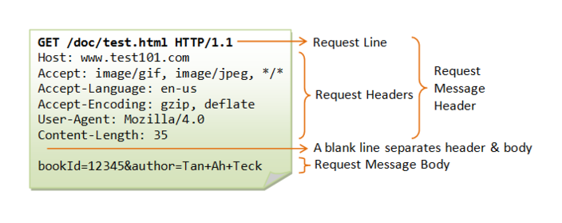

HTTP Message는 Server와 Client가 HTTP 통신을 할 때 주고받는 메시지입니다. 이때 메시지 타입으로는 두 가지가 있습니다.  클라이언트가 서버에게 자료를 요청하는 **Request Message,** 서버가 클라이언트에게 요청에 대한 응답하는 **Response Message** 입니다.

## Request Message

Request Mesaage Format은 세 가지로 구분됩니다.

1. Request Line
2. Request Headers
3. Request Message Body

**Request Line**는 사용자가 서버에 요청 시 수행하고자 하는 동작인 **Method(GET)**, 요청하는 앱 리소스의 경로인 **Path(/doc/test.html)**, 사용하는 HTTP의 버전을 나타내는 **Version(HTTP/1.1)**으로 구성됩니다.

**Request Headers**는 서버에 추가 정보를 전달하는 데이터 부분입니다.

Host, Cookie, User-Agent, Referer 등  **Header**는 상황에 따라 더 많은 데이터를 전송할 수 있습니다. 각 헤더 항목 줄에는 **'이름:  값'** 형식의 구성을 합니다. 그리고 하나의 항목에 복수의 값을 가질 수 있습니다.

**A blank line**는 **Header** 부분의 끝을 표시하기 위한 공백입니다.

**Request Message Body**는 사용자가 입력한 데이터가 서버에 전달 시 데이터를 담는 부분입니다. 단, 요청 방법의 **Method(POST)**가 아니면, 항상 비어있는채로 전달됩니다.

## Response Message

Response Message Format은 세 가지로 구분됩니다.

1. Status Line
2. Response Headers
3. Response Message Body

**Status Line**은 HTTP **Version(HTTP/1.1)**, 사용자의 요청에 대한 서버의 응답 코드인 **상태 코드(200 OK)**로 구성됩니다.

**상태 코드(Status-code)**

- 1xx : Informational
- 2xx : Success
- 3xx : Redirection
- 4xx : Client Error
- 5xx : Server Error

**Response Headers**는 Server, Set-Cookie, Content-Type, Content-Length 등 사용자와 상호작용하기 위한 데이터를 담는 부분으로 사용됩니다.

**A blank line**은 **Header** 부분의 끝을 표시하기 위한 공백입니다.

**Response Message Body**는 서버의 응답 부분으로 클라이언트가 요청한 리소스 또는 요청한 작업상태에 대한 일부 정보를 포함합니다.