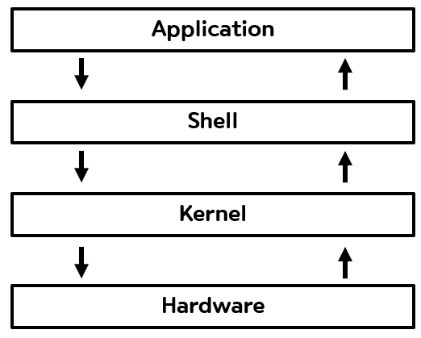

**쉘(Shell)**은 운영체제상에서 커널과 상호작용하여 다양한 기능과 서비스를 구현하고 실행하는 인터페이스를 제공하는 프로그램입니다. 즉, 사용자가 입력한 값(명령어, 클릭 등 ...)을 해석하여 커널에 전달하는 역할을 하는 **명령어 해석기(Command Interpreter)**라고 할 수 있습니다.

### 왜 이름이 쉘(Shell)일까요?

위에서 설명하였듯이 쉘은 사용자와 커널간의 소통창구 역할을 합니다. 사용자가 커널에 접근하기 위해서는 반드시 쉘을 거쳐야 해 쉘이 커널을 감싸고 있는 형태가 조개 껍데기와 비슷하다고 하여 조개껍데기를 뜻하는 쉘이라는 이름이 부여되었습니다.

### 쉘의 종류

쉘은 명령어를 사용해 작동하는 **CLI(Command Line Interface) 기반 쉘**, 그래픽 요소를 사용해 작동하는 **GUI(Graphical User Interface) 기반 쉘**이 있습니다.

**CLI 기반 쉘**은 명령어를 터미널에 입력해 디렉터리 이동, 파일 복사 등 사용자가 원하는 작업을 수행할 수 있습니다. 또한, GUI 기반 쉘과 다르게 그래픽을 사용하지 않아 요청에 대한 수행 속도가 빠릅니다. 하지만 여러 동작을 위해서는 명령어를 기억해야 하기 때문에 미숙한 사용자에게는 불편할 수 있습니다. CLI 기반 쉘의 대표적인 예시로는 Windows의 CMD, Mac의 터미널이 있습니다.

**GUI 기반 쉘**은 창, 아이콘 등의 그래픽 요소와 상호작용을 통해 원하는 작업을 수행할 수 있습니다. 하지만 그래픽적인 요소를 사용하기 때문에 CLI 기반 쉘보다 훨씬 더 많은 리소스를 사용하고 수행 속도가 느립니다. 하지만 그래픽 요소와 간단한 상호작용만으로도 여러 작업에 대한 처리가 가능해 사용자가 명령어를 기억할 필요가 없어 미숙한 사용자라도 큰 불편함 없이 대부분의 작업을 처리할 수 있습니다. Windows의 파일 탐색기가 대표적인 GUI 기반 쉘의 예시로 들 수 있습니다.