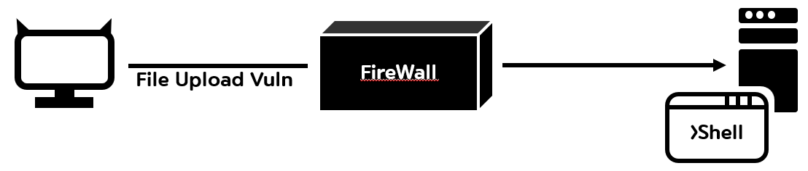

사용자와 OS간 중계자 역할을 하며 다양한 기능과 서비스를 제공해주는 [쉘](https://hackyboiz.github.io/2021/09/17/poosic/Shell/)처럼 웹 쉘(Web Shell)도 웹상 취약점을 이용해 시스템에 명령을 내릴 수 있는 코드나 스크립트 혹은 시스템에 명령을 내릴 수 있는 코드나 스크립트를 삽입하는 공격을 부르는 말입니다. 

### 왜 위험할까요?

웹 쉘은 제작 방법도 간단하고 서버에 미칠 수 있는 파급력도 크기 때문에 무서운 공격입니다. 웹 쉘은 ASP,JSP,PHP등의 서버 스크립트를 이용해 간단한 코드만으로도 제작이 가능합니다. 그렇기 때문에 마음만 먹으면 누구나 쉽게 제작이 가능합니다. 또한, 서버에 업로드만 가능하다면 서버의 모든 제어권을 장악해 정보 탈취, 변조, 악성 스크립트 삽입 등 다양한 악성행위가 보안 프로그램이나 인증 시스템 등의 방해 없이 가능하기 때문에 웹 서버에 웹 쉘이 설치되는 순간부터 이미 해커에게 서버를 장악당했다고 봐도 무방합니다.

### 어떻게 막을 수 있을까요?

웹 쉘의 근본적인 원인은 개발 과정에서 발생하는 업로드 취약점입니다. 그렇기에 개발 시에 불필요한 업로드 기능을 제거하거나 필요한 경우에는 업로드 가능한 확장자에 대한 화이트 리스트를 작성하는 등의 시큐어 코딩(Secure Coding)에 힘써야 합니다. 웹 서버 업로드 기능 구현 시 업로드 파일 전용 폴더를 만들어 해당 폴더에서의 파일 실행을 제한하는 것 또한 좋은 예방책이 될 수 있습니다.