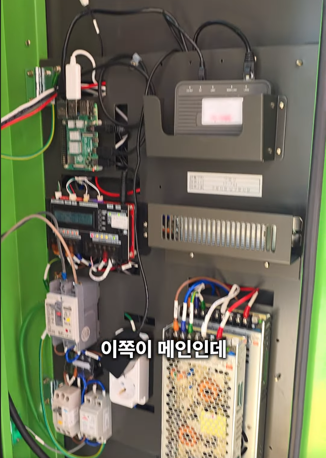
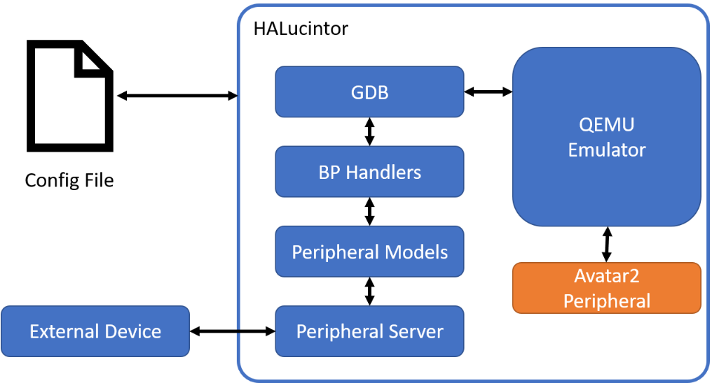

## Intro

Hello! It's tobe back with a research post. After getting feedback that my nickname poosic sounded like the sound of pooping, I was so shocked I changed it to tobe. Personally, I liked the original nickname because I thought it sounded like laughter, but everyone has their own perspective, sigh. Still, getting the nice nickname tobe feels like a good opportunity >_-

Getting back to the main topic, today's research post is a review of HALucinator! Think of HALucinator as a hardware emulator. However, while FirmAE is software for emulating the entire firmware system, HALucinator focuses on solving hardware dependencies and emulating RTOS or bare-metal firmware. Honestly, I started studying it thinking, ‘Is this an amazing tool that can replace emulators?!’ but it turned out to be more like an advanced application of emulators, which left me quite flustered.

Before diving into the review, I'll first explain some concepts that might be unfamiliar (like rehosting, HAL, bare-metal firmware, etc.), then proceed with the main review.

## 1. About Rehosting


Rehosting is conceptually similar to emulation in that it separates firmware from hardware and ports it to a software-based virtual environment running on a computer. However, the goals of the two technologies differ slightly. An emulator aims to reproduce all the functions and behaviors of a specific SoC or board as accurately and comprehensively as possible within a virtual environment. Rehosting, however, does not aim for a perfect replica; its goal is to **build the minimal environment necessary for the specific function being analyzed to execute correctly**.

Naturally, if perfect reproduction in a virtual environment were possible, emulation would be preferable. While feasible for single-board devices, it is practically impossible for systems requiring interaction with diverse peripherals.



Just look at the inside of the village bus electronic display in the image above—various devices like Raspberry Pi and routers are interacting with each other. (~~I've never had the chance to see a village bus display board either, so this was fascinating~~)

Take the AEB (Autonomous Emergency Braking) system in cars as an example. Its firmware interacts with peripheral devices like the front sensor for obstacle detection, the brake actuator controlling actual brake hydraulic pressure, and the CAN bus for internal communication. What happens if you just emulate the main board with the AEB firmware? Without the CAN bus, you can't even receive vehicle speed data, causing it to stall. Even if you implement a virtual CAN bus, there are no sensors to send data, making proper analysis impossible. On the other hand, analyzing and emulating all these peripherals would be exhausting before you even start.

From a vulnerability analyst's perspective, trying to examine a single feature could lead to the unfortunate situation of having to meticulously analyze and code multiple boards just to virtualize them. It's like filling the bathtub to the brim, adding bath salts, lighting candles, and even floating rose petals (~~I don't usually go to such lengths for a bath~~) only to end up just washing your face and getting out.

### 1.1. Firmware Type


Rehosting is not always more effective than emulation for all firmware. From a firmware virtualization perspective, firmware types can be broadly categorized into the following three types:

1. Type I Firmware (Application-based): This is firmware that runs as a single application on top of a general-purpose OS like Linux or Windows.
2. Type II Firmware (OS-Based): Firmware that includes a customized OS, such as Linux or VxWorks.
3. Type III Firmware (Bare-Metal): Firmware that directly controls hardware without an OS. This includes most small IoT devices with MCUs, automotive ECUs, and industrial control equipment.

Rehosting technology primarily evolved for analyzing **Type III, bare-metal firmware**. While Types I and II include some abstraction layer via the OS, Type III firmware, which directly controls hardware without an OS, exhibits extremely high hardware dependency.

Bare-metal literally means ‘bare metal’. Figuratively, it implies ‘nothing is layered over the hardware’. It refers to a method where firmware directly controls all aspects of the hardware in its raw state, without the abstraction layer provided by an OS.

Typically, on a PC, when a program saves a file, clicking the `Save` button triggers the OS to write it to disk. In contrast, bare-metal firmware must perform this save operation by 'sends a ‘ready’ signal to address `0x40011000` on the disk controller, writes the first byte of data to address `0x40011004`, then waits until a specific bit in the status register turns to 1'. Because all communication is handled via **MMIO (Memory-Mapped I/O)** reading and writing values to specific memory addresses the firmware becomes a stubborn child without the corresponding hardware.

### 1.2. The Difference Between Rehosting and Emulating

While emulation aims to perfectly execute a CPU's instruction set within a virtual environment, rehosting focuses less on perfect instruction replication and more on ensuring **specific firmware functions execute as a complete flow**.

While I mentioned ‘differences,’ Rehosting is closer to a complementary technology developed to address the shortcomings of Emulation. After all, implementing functionality via Rehosting requires an engine to execute the instructions composing that function, and this engine utilizes Emulation technology. In other words, **the underlying technology is Emulation**.

### 1.3. Various Rehosting Methods

There are three main approaches to rehosting. The first is an error-based inference method that **runs the firmware through an emulator to analyze crash points and make corrections**. While not strictly necessary for analysis, replacing error-prone code with nops or setting flag values to True unconditionally during emulation can also be considered part of this approach. This is the most suitable method if you build an emulator specifically for a particular firmware function.

The second is an **analysis-based method that analyzes the firmware before execution and performs rehosting**. This involves understanding the interaction logic with other hardware through code analysis and building virtual hardware based on that. While analysis can achieve high functional execution rates and high fidelity to actual behavior, rehosting itself takes a significant amount of time. However, this very aspect allows for analysis in an environment that closely mirrors actual operation!

The third method is **rehosting using HAL layer hooking**, which I learned while writing this research paper. This is a very smart approach that leverages the fact most embedded systems rely on vendor-provided SDKs. Instead of directly analyzing and reproducing complex low-level register manipulations, it utilizes functions in the HAL layer or drivers where these register operations are abstracted.

### 1.4. About HAL(Hardware Abstraction Layer)


Before that, let's briefly cover what HAL is. HAL stands for Hardware Abstraction Layer. It abstracts low-level operations that require direct hardware access and control, providing them at a higher level. Simply put, it enables C coding instead of assembly coding. HAL provides APIs that allow developers to work with hardware using standardized HAL libraries, even if they don't know the hardware's detailed operations. It's a valuable tool that shields developers from the complexity and diversity of hardware.

The way hardware is controlled can vary between chip manufacturers, and even between chips from the same manufacturer.

```c
// 1. GPIOC 포트의 클럭을 켜준다.
*(volatile uint32_t*)0x40023830 |= (1 << 2);
// 2. PC13 핀을 출력 모드로 설정한다.
*(volatile uint32_t*)0x40020800 &= ~(3 << 26);
*(volatile uint32_t*)0x40020800 |= (1 << 26);
// 3. PC13 핀의 출력 값을 0으로 만든다 (LED ON)
*(volatile uint32_t*)0x40020814 &= ~(1 << 13);
```

For example, let's consider turning on an LED by controlling a **GPIO (General-Purpose Input/Output) pin**. Without HAL, developers would have to pore over dozens of pages of the chip's datasheet and directly write values to specific memory addresses (registers), as shown in the example above. But as mentioned, even this approach requires re-reading the datasheet and rewriting the code whenever the chip changes.

```c
HAL_GPIO_WritePin(GPIOC, GPIO_PIN_13, GPIO_PIN_RESET);
```

However, using the API provided by HAL, it can be written as easily and quickly as shown above with just one line of code. From a developer's perspective, development becomes possible without needing to understand the hardware's structure or operation in detail. The HAL library internally handles the complex register manipulation required for the currently used chip. 

## 2. HALucinator

HALucinator, as you might infer from its name, is a firmware rehosting framework that utilizes the previously described HAL (Hardware Abstraction Layer) hooking method. (The concept of hallucination and rehosting blend so perfectly that I was truly impressed by the incredible naming sense.)



Let's take a look at HALucinator's architecture diagram. It is structured as follows:

- Config File: A YAML-formatted configuration file defining all operational settings for HALucinator.
- QEMU Emulator: An emulator that understands architectures like ARM and MIPS and executes firmware binaries in a virtual environment.
- GDB: A debugging interface utilizing QEMU's debugging capabilities.
- BP Handler: The core component of HALucinator's hooking functionality, the breakpoint handler. When the address specified in the Config file is reached, it takes control and executes user-defined actions.
- Peripheral Models: This is where the actual behavior of the virtual hardware is defined. The hooking logic we write in Python resides here.
- Peripheral Server: Acts as a relay, either outputting the UART output of the emulated firmware to a real serial port or reading values from external sensors.
- External Device: The actual hardware connected via the Peripheral Server. This enables a hybrid approach where complex chip operations, beyond simulation capabilities, are handled by the real device.

Just reading the descriptions of each component might not make it clear, so let me briefly explain the flow of operation. The user writes the memory map information for the binary to be rehosted, the addresses of functions to hook, etc., into the `Config File`. HALucinator references this file to run the firmware in the `QEMU Emulator`. When the firmware reaches the address of a function to hook, the `BP Handler` intercepts the execution flow and calls the Python code defined in the `Peripheral Model`. During this process, data can be exchanged with the actual device via the `Peripheral Server` as needed. After the `Peripheral Model`'s code executes, the result is returned back to the `QEMU Emulator`.


As a result, one might mistakenly believe that interactions with peripheral devices are being handled correctly using this `BP Handler`, enabling dynamic analysis of normal logic. Of course, if the Handler code is not written with care, it could lead to unfortunate consequences such as overlooking vulnerabilities arising from peripheral interactions or diverging from the actual execution flow. However, since the existing task of analyzing all low-level MIMO registers for building an analysis environment can now be focused solely on hooking HAL functions, resources can be drastically reduced. This means it should be covered diligently with a little(?) effort. Furthermore, HALucinator allows this hooking logic to be written directly in the familiar Python language, instilling confidence that it can cover all the shortcomings.

### 2.1. Env Setting

We will set up the environment within the Ubuntu environment of WSL. Since Avatar2, included in the submodule, has dependencies on Ubuntu, it is recommended to proceed within WSL.

You can download it via Git using the command below and conveniently retrieve the necessary files using the Git submodule. Afterwards, build and run it using Docker.

```python
git clone https://github.com/halucinator/halucinator.git
cd ./halucinator
git submodule update --init
docker build -t halucinator ./
docker run --name halucinator --rm -i -t halucinator bash
```

Now it's time to see if it works properly! To run HALucinator, you need the following:

- Firmware file
- Memory layout configuration
- Address file
- Interceptor file (interceptor function and its corresponding handler)

Just to check if it runs, I have to do all this work! If I finish all the setup only to find it doesn't run, I'll be pretty exhausted... Fortunately, the HALucinator Repo includes example files, so I'll use those for testing.

In the current terminal, run the command `hal_dev_uart -i=1073811456`. This command creates a virtual UART to attach to the firmware being emulated.

Now, open another terminal window and connect to the built Docker container using `docker exec -it halucinator bash`. Then, run the `./test/STM32/example/run.sh` command to emulate the MCU implemented in the example.

```python
#in current terminal
hal_dev_uart -i=1073811456

#in new terminal
docker exec -it halucinator bash
./test/STM32/example/run.sh
```


If you type `hackyboiz` into the first terminal where you previously ran the virtual UART, you can see the virtualized device receiving this data (rx_data) in the second terminal!

## Outro

That's all for today's research post! We've covered everything from rehosting to a brief overview of HALucinator. I intended to cover actual debugging with GDB and fuzzing using AFL on the built emulator, but I ended up rambling on about necessary concepts. To avoid oversizing the post and to provide a higher-quality example by showing application to an actual binary, I'll cover this part in the upcoming Part 2! Part 2 will cover developing HAL directly using STM32, emulating the developed binary using HALucinator, and debugging with GDB. I'd appreciate it if you could come back for the next article.

I actually considered including the HALucinator installation process in Part 2 as well, but for those interested, I recommend following the [tutorial](https://github.com/halucinator/halucinator/blob/master/doc/tutorial/2_run_uart_example.md) on the HALucinator GitHub. In my case, I spent a lot of time building Docker on Windows, so I hope no one gets stuck during the installation phase...

I'll see you in the next post. Thank you!

## Ref

- [HALucinator github](https://github.com/halucinator/halucinator)
- [Usenix-HALucinator: Firmware Re-hosting Through Abstraction Layer Emulation](https://www.usenix.org/conference/usenixsecurity20/presentation/clements)