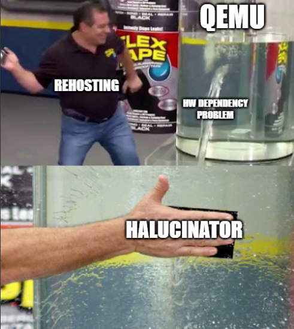
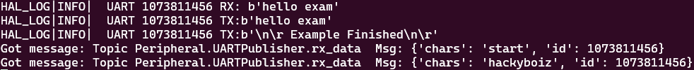

## Intro

안녕하세요! 연구글로 소식을 들고 돌아온 tobe 입니다. poosic이라는 닉네임이 똥싸는 소리 같다는 피드백을 듣고 충격에 tobe로 닉네임을 바꾸게 되었습니다. 개인적으로 원래 닉네임이 웃음소리 같다고 생각해서 좋아했는데 역시 각자의 관점이 다릅니다ㅠㅠ. 그래도 tobe라는 좋은 닉네임을 얻게되어 좋은 기회였던거 같습니다 >_-

본론으로 돌아가자면, 오늘의 연구글은 HALucinaotr 리뷰입니다! HALucinator은 하드웨어 에뮬레이터라고 생각하시면 편합니다. 다만, FirmAE는 펌웨어의 전체 시스템 에뮬레이션용 소프트웨어라면 HALucinator는 RTOS나 베어메탈 펌웨어의 하드웨어 dependency를 해결하고 에뮬레이션 하는데 중점을 둔 소프트웨어입니다. 사실 ‘Emulator를 대체할 수 있는 엄청난 친구인가?!’하고 공부해보려했던 건데 실상은 에뮬레이터 고급 활용인 것 같아서 적잖이 당황했었습니다.

리뷰에 앞서 생소하실 것 같은 개념들(rehosting, HAL 베어메탈 펌웨어 등..)에 대해 먼저 설명하고 본격적인 리뷰를 하도록 하겠습니다.

## 1. About Rehosting



Rehosting은 펌웨어를 하드웨어로부터 분리해 컴퓨터에서 실행되는 소프트웨어 기반의 가상 환경으로 이식한다는 점에서 Emulating과 개념이 비슷합니다. 하지만 두 기술이 목표하는 바는 조금 다릅니다. 에뮬레이터는 특정 SoC나 보드의 모든 기능과 동작을 가능한 한 정확하고 포괄적으로 가상환경에서 재현하는 것을 목표로 하지만, Rehosting은 완벽한 복제가 아니라 **분석하고자 하는 특정 기능이 정상적으로 실행되는 데 필요한 최소한의 환경을 구축**하는 것을 목표로 합니다.

당연히 완벽하게 가상환경에서 재현 가능하다면 에뮬레이팅을 하는 것이 좋겠지만 단일보드의 기기에 대해서는 가능할 수 있는 얘기지만 다양한 주변기기들과 상호작용해야하는 시스템에 대해서는 현실적으로 불가능한 얘기입니다.


| [출처: 뻘짓연구소 Youtube](https://www.youtube.com/shorts/MRu8wNogkjk)

당장 위 이미지의 마을버스 전광판 내부만 보더라도 라즈베리파이나 공유기 등 다양한 기기들이 상호작용하고 있으니까요.(~~저도 마을버스 전광판을 볼 기회는 없어 너무 신기했습니다~~)

예시로 자동차의 긴급 자동 제동 시스템, AEB 펌웨어를 들어보자면, 장애물 인식을 위한 전방 센서, 실제 브레이크 유압을 제어해하는 브레이크 액츄에이터, 내부 통신을 전달할 CAN 버스, 등의 주변기기와 상호작용 할텐데요. AEB 펌웨어가 올라간 메인 보드만 덜렁 에뮬레이팅하면 어떻게 될까요? CAN 버스가 없으니 차량 속도 데이터조차 받지 못해 멈춰버리고, CAN 버스를 가상으로 구현한다 해도 데이터를 보내줄 센서가 없어 결국 정상적인 분석이 불가능하겠죠. 그렇다고 이 모든 주변기기를 분석해서 에뮬레이팅하자니 분석도 전에 지쳐버리는 상황이 발생합니다.

취약점 분석하는 입장에서는 기능 하나 보려다가, 잘못하면 보드 여러 개를 가상화하기 위해 일일이 분석하고 코드를 짜야 하는 불상사가 생겨버립니다. 마치 반신욕 하려고 욕조에 물 가득 담고, 입욕제 풀고, 촛불 켜고, 장미 꽃잎까지 띄웠는데(~~평소에 제가 이렇게 반신욕을 하진 않습니다~~) 세수만 하고 나오는 느낌이랄까요.

### 1.1. 펌웨어 유형


Rehosting은 모든 펌웨어에 대해 에뮬레이터보다 효과적인 것은 아닙니다. 펌웨어를 가상화하는 입장에서 펌웨어 유형은 크게 아래 세 가지로 나눌 수 있는데요.

1. I형 펌웨어(애플리케이션형): Linux, Windows 같은 범용 OS 위에서 실행되는 단일 애플리케이션 형태의 펌웨어입니다.
2. II형 펌웨어(OS 기반형): Linux, VxWorks 등 커스터마이징된 OS를 포함하고 있는 펌웨어입니다
3. III형 펌웨어(베어메탈형): OS 없이 하드웨어를 직접 제어하는 펌웨어. MCU가 탑재된 대부분의 소형 IoT, 자동차 ECU, 산업용 제어 장비 등이 여기에 해당합니다.

리호스팅 기술은 주로 **III형, 베어메탈 펌웨어**(Bare-metal) 분석을 위해 발전했습니다. I형, II형은 OS를 통해 어느 정도의 추상화 계층을 포함하지만, OS 없이 직접 하드웨어를 제어하는 III형 펌웨어는 하드웨어 의존성이 극도로 높기 때문입니다.

베어메탈은 직역하자면 '맨몸의 금속'을 뜻합니다.의역을 하자면 ‘하드웨어 위에 아무것도 걸치지 않았다’는 뜻 정도가 되겠네요. OS라는 추상화 계층 없이 펌웨어가 하드웨어의 모든 것을 날것 그대로 직접 제어하는 방식입니다.

일반적으로 PC에서는 프로그램이 파일을 저장할 때 `저장` 버튼만 딸깍하면 OS가 알아서 디스크에 써주지만, 베어메탈 펌웨어는 이 저장 작업을 위해서 ‘디스크 컨트롤러의 0x40011000번 주소에 '준비' 신호를 보내고, 0x40011004번 주소에 데이터의 첫 바이트를 쓴 다음, 상태 레지스터의 특정 비트가 1이 될 때까지 기다린다’ 와 같은 저수준의 작업을 모두 직접 수행해야 합니다. 이처럼 모든 통신을 특정 메모리 주소에 값을 읽고 쓰는 **MMIO(Memory-Mapped I/O)** 방식으로 처리하기 때문에 해당 하드웨어가 없으면 펌웨어는 말 안듣는 금쪽이가 되어버립니다.

### 1.2. Rehosting과 Emulating의 차이

Emulating이 CPU의 Instruction Set(명령어 집합)을 가상 환경에서 완벽하게 실행하는 것을 목표로 한다면, Rehosting은 명령어의 완벽한 재현보다는 **펌웨어의 특정 기능이 완전한 흐름(Flow)으로 실행되는 것**을 목표로 합니다.

사실 '차이'라고 언급했지만, Rehosting은 Emulating의 단점을 보완하기 위해 나온 보완 기술에 가깝습니다. 어쨌든 Rehosting으로 기능을 구현하려면 그 기능을 구성하는 명령어(Instruction)를 실행할 엔진이 반드시 필요하고, 이 엔진으로 Emulating 기술을 이용하기 때문이죠. 즉, **기반 기술은 Emulating**이라고 할 수 있습니다. 

### 1.3. 다양한 Rehosting 방식

Rehosting을 하는 방식은 크게 3가지가 존재합니다. 첫번째로는 에뮬레이터를 통해 **펌웨어를 실행하여 Crash 지점을 분석하고 수정해나가는 오류 기반 추론 방식**이 있습니다. 분석에 있어 필요는 없지만 오류가 나는 코드에 대해 nop으로 바꾸거나 flag값을 무조건 True로 설정해 에뮬레이팅하는 경우도 이러한 방식중 하나라고 볼 수 있겠네요. 펌웨어의 특정 기능만을 위한 에뮬레이터를 구성한다면 가장 적합한 방법입니다. 

두번째로는**실행 전 펌웨어를 분석해 Rehosting을 하는 분석 기반 방법**도 있습니다. 코드 분석을 통해 다른 하드웨어와의 상호작용 로직을 파악하고 이를 통해 가상 하드웨어를 구축하는 방식입니다. 분석을 통해 높은 기능 실행률과 실제 동작의 카피율을 달성할수 있지만 그만큼 Rehosting을 위해 걸리는 시간이 오래걸립니다. 하지만 그렇기에 더욱 실제 동작과 같은 환경에서 분석이 가능하겠죠!

세번째는 이번 연구글을 작성하면서 알게된 **HAL 계층 후킹을 활용한 Rehosting 방식**입니다. 대부분의 임베디드는 벤더사가 제공하는 SDK에 의존한다는 점을 이용한 매우 smart한 발상의 방식입니다. 아무래도 저수준의 복잡한 레지스터 조작을 직접 분석하고 재현하는 방식 대신 이 레지스터 조작이 추상화된 HAL 계층이나 드라이버의 함수를 이용합니다. 

### 1.4. About HAL(Hardware Abstraction Layer)


그전에 HAL이 무엇인지 간단히 짚고 넘어가 보겠습니다. HAL은 Hardware Abstraction Layer인데요. 하드웨어에 직접 접근해 제어해야하는 low level의 동작들을 추상화하여 high level로 제공해주는 layer입니다. 쉽게 말하자면 asm coding이 아닌 c coding을 할 수 있도록 제공합니다. HAL은 개발자가 하드웨어의 상세한 동작을 모르더라도 표준화된 HAL 라이브러리를 통해 하드웨어 개발을 할 수있도록 API를 제공해줍니다. 하드웨어의 복잡성과 다양성으로 부터 개발자를 지켜주는 고마운 존재라고 할 수 있죠.

칩 제조사마다 심지어는 같은 제조사라도 칩마다 하드웨어를 제어하는 방식이 달라질 수 있는데요. 

```c
// 1. GPIOC 포트의 클럭을 켜준다.
*(volatile uint32_t*)0x40023830 |= (1 << 2);
// 2. PC13 핀을 출력 모드로 설정한다.
*(volatile uint32_t*)0x40020800 &= ~(3 << 26);
*(volatile uint32_t*)0x40020800 |= (1 << 26);
// 3. PC13 핀의 출력 값을 0으로 만든다 (LED ON)
*(volatile uint32_t*)0x40020814 &= ~(1 << 13);
```

예시로 **GPIO(General-Purpose Input/Output) 핀**을 제어하여 LED를 켜는 경우를 생각해 봅시다. HAL이 없다면, 개발자는 칩의 데이터시트를 수십 페이지씩 뒤져가며 위의 예시처럼 특정 메모리 주소(레지스터)에 직접 값을 써야 합니다. 하지만 말했듯이 이마저도 칩이 바뀐다면 다시 데이터시트를 찾아보며 작성해야하죠. 

```c
HAL_GPIO_WritePin(GPIOC, GPIO_PIN_13, GPIO_PIN_RESET);
```

하지만 HAL이 제공하는 API를 이용한다면 위처럼 쉽고 빠르게 한줄의 코드로 작성 가능합니다. 개발자 입장에서는 하드웨어의 구조나 동작을 자세히 이해하지 않아도 개발이 가능해집니다. HAL 라이브러리가 내부적으로 현재 사용 중인 칩에 맞는 복잡한 레지스터 조작을 대신 처리해주는 것이죠. 

## 2. HALucinator

HALucinator는 이름에서도 유추하실 수 있겠지만 앞서 설명한 HAL(Harware Abstraction Layer) 후킹 방식을 사용하는 펌웨어 Rehosting 프레임워크 입니다. (환각을 뜻하는 hallcination과 Rehosting의 개념이 절묘하게 어울려서 엄청난 네이밍 센스에 감탄했습니다.)


HALucinator의 구조도를 한번 보겠습니다. 다음과 같이 구성되어 있습니다.

- Config File: HALucinator의 모든 동작 설정을 정의하는 YAML 형식의 설정 파일입니다.
- QEMU Emulator: ARM, MIPS 등의 아키텍쳐를 이해하고 가상환경에서 펌웨어 바이너리를 실행시켜줄 에뮬레이터입니다.
- GDB: QEMU의 디버깅 기능을 활용한 디버깅 인터페이스입니다.
- BP Handler:HALucinator 후킹 기능의 핵심인 브레이크포인트 핸들러입니다. Config 파일에 설정된 주소에 도달하면 제어권을 가져와 사용자가 정의한 동작을 수행합니다.
- Peripheral Models: 가상 하드웨어의 실제 동작이 정의된 부분입니다. 우리가 Python으로 작성한 후킹 로직이 바로 여기에 해당합니다.
- Peripheral Server: 에뮬레이션 중인 펌웨어의 UART 출력을 실제 시리얼 포트로 내보내거나, 외부 센서 값을 읽어오는 등의 중계기 역할을 합니다.
- External Device: Peripheral Server를 통해 연결되는 실제 하드웨어입니다. 시뮬레이션만으로는 한계가 있는 복잡한 칩의 동작을 실제 장치에 맡기는 하이브리드 방식을 가능하게 해줍니다.

각 구성 요소에 대한 설명만 보면 이해가 잘 안 갈 수도 있으니, 동작 흐름을 간단히 설명하겠습니다. 사용자는 `Config File`에 리호스팅할 바이너리의 메모리 맵 정보, 후킹할 함수 주소 등을 작성합니다. HALucinator는 이 파일을 참조하여 `QEMU Emulator`로 펌웨어를 실행합니다. 펌웨어가 후킹 대상 함수 주소에 도달하면, `BP Handler`가 실행 흐름을 가로채 `Peripheral Model`에 정의된 Python 코드를 호출합니다. 이 과정에서 필요에 따라 `Peripheral Server`를 통해 실제 기기와 데이터를 주고받을 수도 있습니다. `Peripheral Model`의 코드가 실행된 후, 그 결과는 다시 `QEMU Emulator` 쪽으로 반환됩니다.


결과적으로, 이 `BP Handler`를 이용해 주변기기와의 상호작용을 정상적으로 처리했다고 착각하게 되고 이를 통해 사용자는 정상 로직에 대한 동적 분석이 가능해집니다. 물론 Handler code를 신경써서 작성하지 않는다면 주변기기와 상호작용에서 나올 수 있는 취약점을 놓친다던가, 실제 동작 흐름과 달라진다던가 하는 불상사가 있을 수 있습니다. 하지만 분석환경 구축을 위해 저수준의 MIMO 레지스터를 모두 분석해야하는 기존의 작업을 HAL 함수 후킹에만 집중하면 되기 때문에 리소스가 압도적으로 줄일 수 있어 약간의(?) 노력으로 열심히 커버해야합니다. 또한, HALucinator는 이 후킹 로직을 익숙한 Python으로 직접 작성 가능해 단점을 모두 커버할 수 있을 것만 같은 자신감이 생깁니다.

### 2.1. Env Setting

환경세팅은 WSL의 Ubuntu 환경에서 하도록 하겠습니다. submodule에 포함된 Avatar2에서 Ubuntu에 대한dependency가 존재하기 때문에 WSL에서 진행하시는 것이 좋습니다.

아래의 명령어를 이용하여 git 을 통해 다운로드하고 필요한 파일들을 간편하게 git submodule을 이용해 받을 수 있습니다. 이후 도커를 통해 빌드 후 실행 줍니다.

```python
git clone https://github.com/halucinator/halucinator.git
cd ./halucinator
git submodule update --init
docker build -t halucinator ./
docker run --name halucinator --rm -i -t halucinator bash
```

이제 잘 작동하는지 확인해 봐야겠죠! HALucinator를 구동하기 위해서는 아래와 같은 것들이 필요한데요.

- 펌웨어 파일
- 메모리 레이아웃 설정
- 주소 파일
- 인터셉터 파일(인터셉터 함수 및 해당 함수의 핸들러)

구동여부만 확인 하려는데 이 모든 작업을 해줘야 한다니! 모든 설정 작업을 마치고 구동이 되지 않는걸 확인하면 상당히 피곤해질것 같습니다… 다행히 HALucinator Repo에 예제 파일이 있기 때문에 이것을 이용하여 t테스트해보겠습니다.

현재 실행한 터미널에 `hal_dev_uart -i=1073811456` 명령어를 실행시킵니다. 해당 명령어는 에뮬레이팅할 펌웨어에 붙일 가상의 UART를 실행하는 명령어 입니다. 

이제 다른 터미널 창을 띄워 `docker exec -it halucinator bash` 를 통해 build한 도커에 접속합니다. 이후 `./test/STM32/example/run.sh` 명령어로 예제에 구현되어 있는 MCU를 에뮬레이팅 해줍시다.

```python
#in current terminal
hal_dev_uart -i=1073811456

#in new terminal
docker exec -it halucinator bash
./test/STM32/example/run.sh
```



이전에 가상의 UART를 실행했던 첫 번째 터미널에 `hackyboiz`라고 입력하면, 두 번째 터미널에서 가상화된 기기가 이 데이터를 수신(rx_data)하는 것을 확인할 수 있습니다!

## Outro

오늘의 연구글은 여기까지 입니다! Rehosting부터 HALucinator의 간단한 개요까지 살펴보았는데요. GDB로 실제 디버깅하는 것과 구축한 에뮬레이터에서 AFL을 이용해 Fuzzing 하는 부분까지 다루어보려 했지만 아무래도 필요한 개념들을 주저리주저리 쓰다보니 글 분량조절 실패와 실제 binary에 적용한 예시를 보여드리는게 조금 더 퀄리티 있는 글이 될것 같아 이 부분은 이어질 Part2에서 작성해보도록 하겠습니다! Part2에서는 STM32를 이용해 직접 HAL 개발도 해보고 개발한 바이너리를 HALucinator를 이용해 에뮬레이팅 해보는 과정과 gdb를 이용해 디버깅하는 과정에 대해 다룰 예정이니 다음 글에도 찾아와 주시면 감사하겠습니다. 

사실 HALucinator를 설치하는 내용또한 Part2에 포함시킬까 했지만 관심이 있으신 분들은 HALucinator github에서 [tutorial](https://github.com/halucinator/halucinator/blob/master/doc/tutorial/2_run_uart_example.md)을 따라해보시면 좋을 것 같아 이렇게 포함시키게되었습니다. 저같은 경우에 Windows에서 docker build하는데 시간을 많이 써서 설치 단계에서 막히는 분들이 없길 바라는 마음이었달까요…?

그럼 다음글로 찾아뵙겠습니다. 감사합니다!

## Ref

- [HALucinator github](https://github.com/halucinator/halucinator)
- [Usenix-HALucinator: Firmware Re-hosting Through Abstraction Layer Emulation](https://www.usenix.org/conference/usenixsecurity20/presentation/clements)