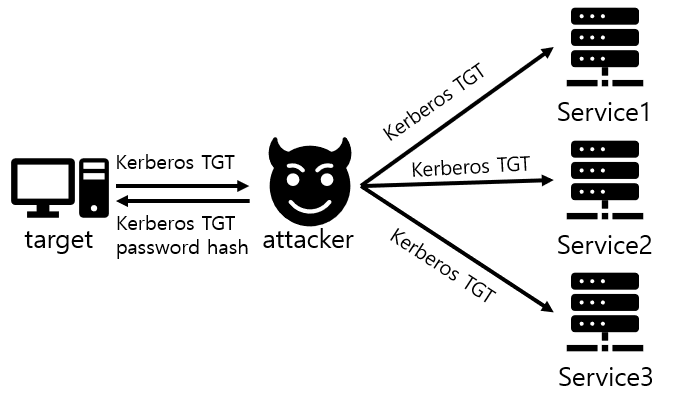

# Golden Ticket Attack

지난 [Kerberos 인증 프로토콜](https://hackyboiz.github.io/2022/02/04/poosic/kerberos/) 설명에 이어서 Kerberos 관련 공격기법인  Golden Ticket Attack에 대해 알아보도록 하겠습니다. Golden Ticket Attack은 post-exploitation 공격으로써, 피싱 메일과 같은 경로를 통해 타겟 pc에 대해 선행 작업이 이루어져야 합니다.

Golden Tickcet을 처음 들었을 때 찰리와 초콜릿 공장에 나오는 비밀에 둘러싸인 윙카의 초콜릿 공장을 입장하고 돌아 다닐 수 있는 Golden Ticket을 떠올렸는데요, 그 영화처럼  Golden Ticket Attack을 통해 Golden Ticket을 얻게 된다면 모든 사용자의 세션을 조작할 수 있어 네트워크의 모든 항목에 접근이 가능해집니다. 그럼 Golden Ticket의 정체가 무엇일까요? 바로 도메인 관리자로서 도메인 컨트롤러에 대한 액세스 권한을 부여하는 Kerberos TGT(Ticket Granting Ticket)입니다. 그렇기 때문에 Golden Ticket을 얻게 된다면 Kerberos의 인증 프로토콜이 사실상 의미가 없어지게 됩니다. 따라서 공격자는 자유롭게 네트워크의 모든 도메인, 그룹 또는 리소스에 액세스 할 수 있습니다. 그럼 공격이 어떻게 이루어지는지 살펴보겠습니다.

# Flow of GTA

우선 간단히 Golden Ticket Attack의 큰 흐름을 살펴보고 그런 다음 자세히 짚어가며 살펴보도록 하겠습니다.

1. 공격자가 사용자 계정을 활용해 네트워크 리소스에 접근할 수 있도록 감염
2. DC 액세스 권한이 있는 계정에 대한 액세스 권한 획득
3. DC에 로그인 후,KRBTGT 계정의 암호 해시를 덤프해 Golen ticket 생성(암호 해시 덤프 시에 mimikatz같은 애플리케이션 사용)
4. 모든 사용자의 세션에 Kerberos token을 로드하고,네트워크의 모든 항목에 접근

큰 흐름을 대강 이해했다면 자세한 과정들을 살펴보겠습니다.

우선, post-exploitation 공격인 Golden Ticket Attack 미리 타겟의 pc를 감염 시켜 놓아야 합니다. 피싱 이메일이나 기타 방법을 통해 타겟의 pc를 감염시키는 데 성공했다면 공격자는 본격적으로 Golden Ticket을 위해 Windows에서 whoami와 같은 명령으로 해당 pc의 도메인 네임 및 SID(도메인 보안 식별자) 등의 도메인 정보를 수집합니다. 

왜 도메인 정보를 수집하는 이유는 DC에 대한 로컬 관리자 수준의 액세스 권한을 얻어 KRBTGT 계정의 암호 해시를 얻어 내기 위함입니다. 공격자가 DC에 대한 액세스 권한을 획득하는데에 성공하였다면 Mimikatz와 같은 툴을 실행시켜 인증에 대한 정보를 수집합니다. 다른 방법으로는  Pass-the-Hash, DCsync같은 공격을 통해 인증을 하지 않고도 KRBTGT 암호 해시를 얻을수 도 있습니다.

공격자는 이렇게 얻은 암호 해시를 통해 Kerberos TGT(Ticket to Get Ticket) 획득하여 네트워크의 모든 항목에 접근이 가능해집니다.

Golden Ticket Attack은 도용된 사용자의 암호를 재설정하더라도 Golden Ticket의 사용이 차단되지 않고 심지어는 DC를 재작성해도 발급받은 Ticket이 유효합니다.

## How to defend?

그렇다면 Golden Ticket Attack을 막을 방법은 없을까요? 가장 좋은 방법은 Golden Ticket Attack의 사전 작업을 막는게 최선입니다. 일단 의심스럽거나 출처가 불분명한 이메일을 주의하는 가장 기본적인 대책이 있습니다.

또한 Kerberos 이벤트 로그 모니터링을 통해 Golden Ticket Attack이 감지된 경우 한 번은 새로운 키의 생성을 위해, 한번은 조작된 키를 지우기 위해 KRBTGT서비스를 총 2번 리셋시켜야합니다. 그러면 도난당한 KRBTGT 해시와 그것으로 부터 만들어진 티켓들을 모두 무효화 할 수 있습니다. 다른 방법으로는 모든 티켓이 합법적으로 발행이 되었는지 확인하는 Kerberos 프로토콜 외의 검증절차를 두는 방법을 사용할 수 있습니다.

# Silver Ticket Attack

하루한줄에서는 [Bronze Bit Attack](https://hackyboiz.github.io/2020/12/11/l0ch/2020-12-11/)에 대해 다루던데 이러다가 Iron도 시리즈로 나올수도 있을거 같네요. 

Silver Ticket Attack은 이름에서도 알수 있듯이 Golden Ticket Attack과 같은 종류의 Kerberos 관련 공격 기법입니다. Golden,Silver Ticket Attack 모두 같은 시기에 발표된 공격기법이지만 Silver Ticket Attack은 Golden Ticekt Attack에 비해 공격범위가 비교적 제한적이라 당시에는 알려지지 않았으나 이후에 Golden Ticket보다 수행 조건이 까다롭지 않고 TGT 발급을 위해 도메인 컨트롤러와 통신하지 않아도 된다는 장점이 부각되었죠.

Silver Ticket Attack도 Golden Ticket Attack과 마찬가지로 post-exploitation 공격으로써, 피싱 메일과 같은 경로를 통해 타겟 pc에 대해 선행 작업이 이루어져야 합니다. 위에서 Golden Ticket은 TGT 티켓을 가리켰다면, Silver Ticket은 무엇을 가리킬까요? 

Silver Ticket은 TGS티켓을 가리킵니다. Silver Ticket Attack에서는 TGS티켓을 위조해서 사용하기  때문에 아까 위에서 말한것 처럼 모든 서비스에 액세스 할 수 있었던 Golden Ticket과 달리 Silver Ticket은 애플리케이션의 단일 서비스에 대해서만 액세스 가능하기 때문에 공격 범위가 제한적입니다. 그럼에도 Silver Ticket Attack이 사용되는 이유를 공격과정에 대해 살펴보겠습니다.

## Flow of STA

1. 사전 작업을 통해 시스템 손상

2. 도메인에 대한 정보 수집.

3. mimikatz와 같은 프로그램을 이용해 로컬 NTML암호(=암호 해쉬) 획득

4. Kerberos TGS티켓 위조

5. TGS티켓을 로컬 서비스에 직접 인증

6. 권한 상승

마찬가지로 post-exploitation 공격이므로 공격자가 타켓의 정보를 탈취할 수 있도록 사전 작업이 이루어져 있어야 합니다. 사전작업이 이루졌다면 공격자는 Silver Ticket을 얻기 위해,다시 말하자면 TGS 티켓을 위조하기 위해 도메인 보안 식별자와 같은 정보를 수집하거나  계정에 대한 NTML 암호 해시를 탈취합니다. 이후 탈취한 정보를 기반으로 mimikatz와 같은 프로그램을 이용해 Kerbeos TGS티켓을 위조합니다. 그리고 공격자는 위조한 Kerberos TGS 티켓을 로컬 서비스에 직접 전달해 인증받습니다.

여기서 가장 중요한 것은 공격자가 위조한 Kerberos TGS 티켓을 직접 전달한다는 점 입니다. 공격자가 TGS 티켓을 직접 전달하기 때문에 TGT티켓을 얻기 위해 도메인 컨트롤러와 통신할 필요가 없이 로컬로 서비스 인증이 가능합니다. 도메인 컨트럴로와의 통신이 이루어지지 않기 때문에 타겟은 공격 시도를 감지하기가 어렵고 공격 흔적이 Golden Ticket Attack에 비해 적게 남습니다. 또한 Goldent Ticket Attack에서 처럼 도메인 컨트롤러에 대한 자격증명도 필요 없기 때문에 Golden Ticket Attack보다 간단합니다.

## 대책

Silver Ticket을 방지 할수 있는 대응책은 뭘까요? 꼼꼼한 모니터링과 프로그램에 대한 패치 외에도 여러가지 방법이 있습니다. 

첫번째 방법은 유효성 검사 프로토콜입니다. Silver Ticket Attack은 KDC에서 배포된 TGS가 아닌 공격자가 임의로 만든 TGS를 통해 인증이 이루어지기 때문에 모든 티켓이 합법적으로 KDC에서 발급되었는지 유효성을 검사할 수 있는 프로토콜을 마련한다면 방지할 수 있습니다. 두번째 방법은 Kerberos PAC (Privileged Attribute Certificate)에 대한 유효성 검사를 활성화하는 방법입니다. TGS PAC 유효성 검사를 활성화하게 된다면 TGS PAC 유효성 검사시에 한번더 TGS에 대해 확인이 되기 때문에  Silver Ticket의 모니터링에 도움이 됩니다.