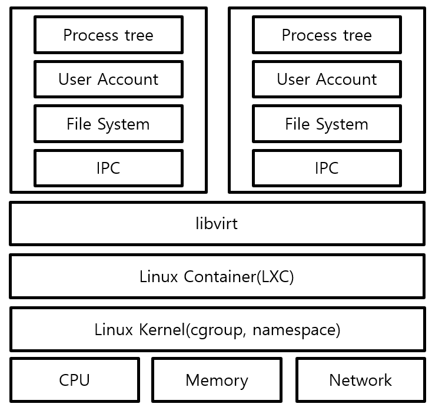

Linux Container는 chroot의 단점을 보완하기 위해 나온 기술입니다. chroot의 단점은 무엇이었을 까요? 바로 라이브러리 문제입니다. 프로세스 상에서 chroot를 통해 root directory를 변경하게 된다면 기존에 참조해서 사용하던 library가 변경된 root directory의 상위 directory에 존재하게 된다면 당연히 사용하지 못하게 됩니다. 

만약 위의 예시에서 처럼 `/A`가 root directory로 지정되었는데 사용하는 라이브러리가 `/B`에 존재할 경우 라이브러리에 접근이 불가능 하기 때문에 `/A`의 하위 폴더에 `/B` directory를 새로 생성하고 라이브러리 파일을 복사해줘야 합니다.

이러한 단점을 보완하기 위해 등장한 개념이 바로 Linux Container입니다. LXC는 시스템 레벨의 가상화 기술입니다.

가상화 기술이라고 하면 Virtual Machine을 생각 할 수도 있지만 Virtual Machine과는 다르게 OS자체는 가상화하지 않습니다. LXC는 호스트의 OS를 그대로 이용합니다. 

process tree, user account, file system, IPC 등을 컨테이너 마다 격리시켜 호스트와 별개의 가상 공간을 만들고 CPU,메모리,네트워크 등의 자원을 컨테이너마다 할당해줍니다. 이 때 libvirt는 Linux의 가상화를 지원하기 위해 API, 데몬, 그리고 관리 툴들의 집합입니다. 즉, 가상환경 관리를 위한 C 라이브러리입니다.

LXC는 이러한 시스템 레벨 가상화 기술을 통해 chroot의 단점을 보완하였습니다.

