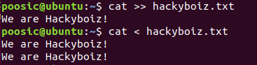

리다이렉션은 대부분의 CLI(Command Line Interpreter)에서 사용되는 일반적인 명령입니다. 해당 명령어는 표준 입출력에 대한 방향을 바꿔 파일로 입력을 받거나 파일로 출력을 하도록 변경할 수 있도록 합니다.

### 명령어

```bash
명령어1 > 파일

명령어1 >> 파일

명령어1 < 파일
```

`>`는 표준 출력 재지정 명령어로써, 명령어의 실행 결과를 표준 출력이 아닌 재지정한 곳으로 보내 저장합니다. `>>`는 똑같은 표준 출력 재지정 명령어지만, 실행 결과를 재지정한 파일의 뒤쪽에 이어서 저장합니다.

`<`는 이와 반대로 표준 입력 재지정 명령어입니다. 명령어의 입력으로써 표준 입력과 연결된 키보드 대신 재지정한 곳을 입력으로 받아 명령어를 실행합니다.

아래 실제 사용 예시를 살펴보도록 하겠습니다.


 cat 명령어와 텍스트 파일로 구현한 간단한 리다이렉션의 예시입니다. cat 명령어로 표준 출력을 통해 화면에 출력되던 "We are Hackyboiz!"라는 문장을 hackyboizt.txt로 리다이렉션시켜 출력 결과를 저장했습니다. 이후 다시 hackyboiz.txt 파일을 리다이렉션시켜 해당 파일을 입력으로 받아 cat 명령어를 실행시켰습니다.



이후 `>>` 명령어를 사용해 저장된 "We are Hackyboiz!"라는 문장은 위에서 설명하였듯이 파일의 뒷 부분에 표준 출력의 결과가 이어서 저장되는 것을 확인할 수 있습니다.


