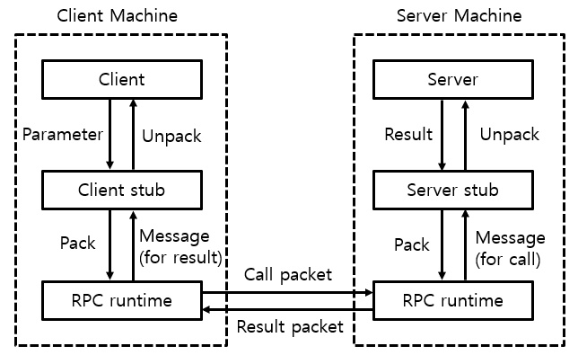

RPC(Remote Procedure Call) 컨트롤을 위한 코딩 없이  다른 공간에 함수 혹은 프로시저를 실행할 수 있게 해주는 통신 기술입니다. 즉, 다른 프로세스에 접근해 해당 프로세스의 프로시저나 함수를 호출해 자신의 것처럼 사용할 수 있게 해주는 기술이라고 할 수 있습니다.

### **왜 개발되었을까요?**

항상 '왜 나온 거지?'라는 의문에 대한 답은 기능 그 자체에 있습니다! 인터넷이 등장하며 사람들은 '여러 컴퓨터를 묶어 사용할 수 없을까?'라는 의문을 가지기 시작했고 이로부터 여러 컴퓨터들이 연결되어 사용되는 분산 컴퓨팅 기술이 발달했습니다. 그리고 RPC는 분산 컴퓨팅 환경에서 프로세스 간 상호 통신 및 컴퓨팅 자원의 효율적인 사용을 위해 발전된 기술입니다.

현재 대부분의 서비스가 작고, 독립적으로 배포 가능한 각각의 기능을 수행하는 서비스로 구성된 프레임워크인 MSA(Micro Service Architecture 형태로 개발되고 있기 때문에 이 경우 RPC를 이용할 수 있습니다.

### 작동과정

이제 RPC를 이용해 다른 프로시저를 호출하는 과정을 간단히 살펴 보겠습니다.

1. Client측에서 프로시저 호출을 위한 매개변수(parameter)을 `Client stub`에 전달.
2. Client stub에서 받은 매개변수들을 Server측에 전달하기 위해 Packet으로 변환
3. 해당 Packet을 Trasport layer(`RPC runtime`)으로 주고 Server 측에 전달.
4. Server측 Trasport layer에서 이를 전달 받아 Server stub으로 전달.
5. `Server stub`는 해당 Packet을 변환해 전달하며 Server에 Client측이 요구한 프로시저 호출.
6. Server는 요구한 프로시저를 처리하고 결과 값을 다시 `Server stub`에 전달
7. `Server stub`는 결과 값을 Packet으로 만들어 Transport layer를  통해 Client에 전달.
8. `Client stub`는 전달 받은 Packet에서 결과 값을 추출해 Client측이 결과 값 획득

### Stub

위의 과정을 살펴보다 보면 stub이라는 개념이 생소할 수도 있습니다. stub이란 Client와 Server 간의 매개 변수와 같은 데이터를 각 머신에 맞게 변환해주는 코드의 조각입니다. 만약 stub이 없이 포인터가 Client측에서  전달되는 매개변수로 사용되면 어떻게 될까요? Client와 Server는 전혀 다른 메모리 공간을 사용하고 있기 때문에 Client측 에서 가리키던 포인터가 Server측으로 넘어가게 되면서 전혀다른 곳을 가리키고 있게 될 것입니다. 또 만약 Client는 리틀 엔디안 형식을 사용하지만 Server측은 빅 엔디안 형식을 사용한다면 어떨까요? 의도한 바와 전혀 다른 데이터들이 전달이 될 것 입니다. 때문에 각 데이터들은 stub을 거쳐 Packet의 형태로 전달이 되게 됩니다.

### RPC runtime

`RPC runtime`이라는 부분도 보입니다. `RPC runtime`은 RPC 사용을 위해 네트워크 통신에 사용되는 함수와 루틴을 모아놓은 라이브러리입니다. 주로 네트워크 간 주고받은 Packet들을 관리하고 전송, 승인, 라우팅 및 암호화, 오류 처리 등 다양한 작업이 처리 가능합니다.

### 장점과 단점

RPC의 장단점에 대해 살펴보며 마무리하겠습니다. 장점부터 살펴보면 당연히 다른 프로세스의 함수나 프로시저를 사용할 수 있어 개발자 입장에서는 다른 하부 네트워크 프로토콜에 신경을 쓰지 않아도 되어 편리합니다. 또한, 다양한 언어를 사용해야 하는 MSA구조에서도 쉽게 언어를 확장할 수 있고 코드를 재작성해야 하는 번거로움도 사라진다는 것도 큰 장점입니다.

이제 단점도 살펴보겠습니다. stub에서 처리할 수 없거나 허용되지 않은 매개변수를 전달할 경우가 존재해 RPC를 이용할 수 없는 경우가 있습니다. 또한, 네트워크 상황에 따라 프로시저 호출과 반환에 대한 시간이 보장되지 않습니다. 특히, 네트워크를 통해 RPC 통신을 할 때 네트워크가 끊기게 된다면 RPC를 이용하지 못합니다.
