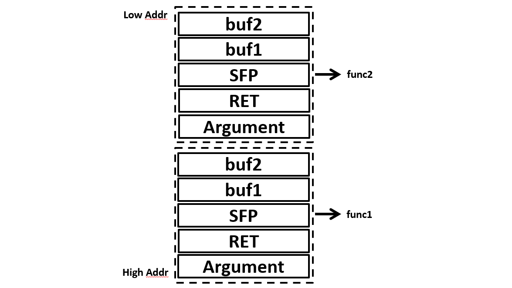

스택 프레임이란 스택 영역의 사용단위를 의미합니다. 스택 영역에는 호출되는 함수의 지역 변수, 전달될 인자 값 등을 저장하기 위해 사용 되는데, 함수의 호출마다 새로운 스택 프레임을 생성하고 종료 시 해제하여 해당 함수에서 사용하는 데이터를 관리합니다.

위 그림은 func1과 func2을 차례로 호출하여 2개의 스택 프레임이 생성된 모습을 간략하게 나타낸 그림입니다. 현재 스택 프레임에 들어가 있는 각 요소들에 대해 설명하겠습니다. Argument는 말그대로 함수에 전달될 인자를 뜻합니다.

RET는 return address를 뜻 하는데요. retrun address란 말 그대로 함수가 모든 작동을 무사히 마치고 종료될 경우, 원래 실행 중이던 명령어가 있는 주소를 뜻합니다. 즉, 함수가 종료될 경우 이동할 명령어가 있는 주소인 것입니다.

SFP는 Stack Frame Pointer를 줄인 단어입니다. 아까 RET은 함수가 종료될 경우 이동할 명령어가 있는 주소였다고 하면 SFP는 함수가 종료될 경우 이동할 스택 프레임의 주소를 의미합니다.

