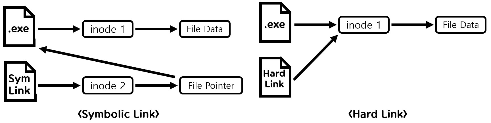

심볼릭 링크(Symbolic Link)란 절대 경로 또는 상대 경로의 형태로 된 다른 파일이나 디렉터리를 **가리키는** 하나의 **독립적인** **파일**이라고 할 수 있습니다. 다시 말해서, 어떤 파일이나 디렉토리를 가리키고 있는 파일이라고 할 수 있습니다. 심볼릭 링크와 비슷한 개념으로는 Windows의 바로가기가 있습니다.

### 왜 사용할까요?

첫 번째 이유는 **데이터 손실 방지**를 위해 사용합니다. 만약 바로가기 기능 없이 `.exe` 확장자의 실행파일을 직접 바탕화면에 꺼내놓고 사용한다고 가정해봅시다. 바탕화면을 정리한다고 모르고 실행파일을 삭제하게 된다면 어떻게 될까요? 혹은 파일을 여러 명과 공유하는데 누군가 삭제해버리면 어떻게 될까요? 이후 사용할 때 다시 다운로드하거나 파일을 다시 작성하는 불상사가 발생할 겁니다. 하지만 심볼릭 링크를 이용한다면 해당 심볼릭 링크 파일을 삭제하더라도 원본 파일이 삭제되지는 않기 때문에 이러한 불상사를 방지할 수 있습니다.

두 번째 이유는 **편리성**입니다. 바로가기 기능만 보아도 실행파일이 설치된 폴더까지 찾아가지 않고 파일을 실행할 수 있는 것을 보면 알 수 있습니다. 이런 편리성을 프로그램도 이용이 가능합니다. 프로그램들은 심볼릭 링크를 사용해 마치 운영체제가 직접 대상 파일에 읽고 쓰는 작업을 하는 것처럼 작업을 수행하기 때문에 심볼릭 링크를 다양하게 조합하고 조작하여 이용한다면 프로그램이 설치, 삭제를 조작할 수 있게 합니다.

### 하드 링크와 심볼릭 링크

하드 링크는 심볼릭 링크와 비슷한 링크 방식 혹은 파일입니다. 다만 차이점이 존재하는데, 이는 Linux 시스템에서 심볼릭 링크와 하드링크가 어떻게 작동하는지 살펴보며 설명하겠습니다. 심볼릭 링크는 파일 시스템 내부에 파일을 유지하는 중요한 정보를 담고 있는 자료구조인 inode 구조체를 생성시 따로 가지고 있어 File Pointer를 따라 원본 파일을 가리키지만 하드링크 파일은 원본 파일과 동일한 inode 값을 가지며 생성됩니다. 그렇기 때문에 심볼릭 링크 파일은 가리키는 원본 파일이 삭제된다면 제 기능을 못 하지만 하드 링크 파일은 원본 파일이 삭제되더라도 같은 inode 값을 가지고 있으므로 원본 파일의 데이터가 사라지지 않고 그대로 기능을 하게 됩니다. 또한, 하드링크는 심볼릭 링크와 달리 원본 파일을 참조하여 데이터를 수정, 삭제하는 것이 아니라 직접 수정, 삭제를 하게 됩니다.

