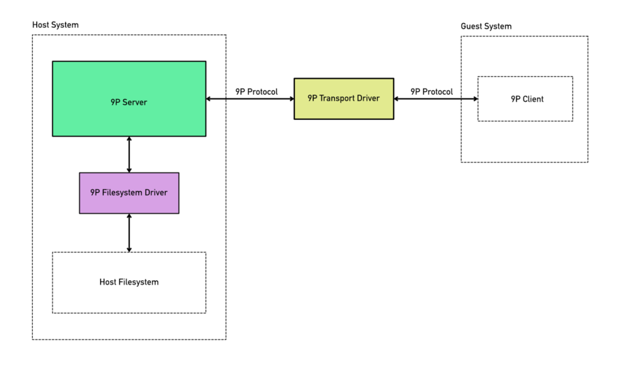

## URL

[CVE-2023-2861 QEMU: 9pfs: improper access control on special files](https://bugzilla.redhat.com/show_bug.cgi?id=2219266)

## Target

- qemu < 8.1.0

## Explain

9pfs(9p passthrough filesystem)는 9p 프로토콜이란 Plan 9 운영체제에서 파일 공유, IPC 등에 사용되는 네트워크 프로토콜을 사용해 원격지의 파일에 접근할 수 있도록 하는 파일 시스템의 구현입니다.

아래의 그림처럼 호스트의 9p server와 게스트의 9p client가 9p transport driver를 통해 9p 프로토콜로 통신합니다. 9p server는 파일에 대한 실제 처리에 9p fs(filesystem) driver를 통해 VFS(Virtual File System) 레이어를 사용하기에 파일 스토리지 데이터의 출처나 실제로 데이터에 접근하는 방식 등을 유연하게 사용할 수 있습니다.



9p 클라이언트의 구현은 qemu 9pfs 구현의 일부가 아니기에 다양한 구현체가 존재합니다. 또한 9p 프로토콜에서 클라이언트가 특수 파일을 열려고 할 때 어떻게 동작해야 하는지 구체적인 정의는 제공하지 않기에 qemu의 9pfs 구현에서는 호스트 측에서 특수 파일이 열리는 것을 금지하지 않고 있었습니다.

Linux 9p Client와 같은 정상적인 클라이언트는 특수 파일에 대한 작업을 guest side에서 처리하지만 악의적인 클라이언트를 사용해서 서버 측에서 특수 파일이 열어서 작업을 처리하도록 만들 수 있습니다.

qemu의 9pfs 구현에서는 이러한 특수 파일에 대한 접근을 통제하지 않아 취약점이 발생했습니다. 이는 잠재적으로 악의적인 9pfs 클라이언트가 장치 파일을 생성하고 이를 통해 제공된 9p tree로부터 벗어나는 것을 허용할 수 있습니다.

취약점은 아래의 두 세팅 중 하나를 사용하는 것으로 트리거할 수 있습니다.

```
1. qemu를 root로 실행 & 9f local fs driver와 passthrough security model 사용
2. 9p proxy fs driver 사용
```

첫 번째 세팅에서 사용되는 local fs(filesystem) driver는 가장 보편적으로 사용되는 fs driver로 VFS(Virtual File System) 함수를 호스트의 파일 시스템의 `open`, `read`, `write` 등의 함수에 직접 매핑하는 방식입니다. local fs driver는 호스트 측 파일의 권한을 리맵핑하는 것으로 게스트의 높은 권한 수준의 유저(root)가 호스트 파일 시스템에 대한 모든 제어를 갖지 못하도록 만듭니다. qemu 바이너리를 root 권한으로 실행해서 취약한 환경을 만들 필요가 있습니다.

두 번째 세팅에서 사용되는 proxy fs driver는 proxy helper라는 별도의 프로세스에 의해 VFS 함수들이 호출됩니다. proxy helper 프로세스가 root 권한으로 실행되기 때문에 호스트 측에 특수 파일을 root 권한으로 생성하거나 여는 것이 가능합니다.

해당 취약점을 악용하면 장치 파일 등을 생성하고 접근하는 등의 방법으로 제공된 파일 트리를 벗어난 작업을 수행할 수 있습니다.

위의 첫 번째 세팅에서 qemu를 root 권한으로 실행하는 것은 보안 측면에서 취약해지기에 사용하지 않는 것을 권고하고 있고 두 번째 세팅에서 사용되는 proxy fs driver는 qemu 8.1 버전 이후로 deprecate되어 사용되지 않지만 파일을 생성하거나 열 때 특수 파일인지 확인하는 루틴을 추가하는 방식으로 [패치](https://gitlab.com/qemu-project/qemu/-/commit/f6b0de53fb87ddefed348a39284c8e2f28dc4eda)가 이루어졌습니다.

## Reference

- [qemu 9p documentation](https://wiki.qemu.org/Documentation/9p)