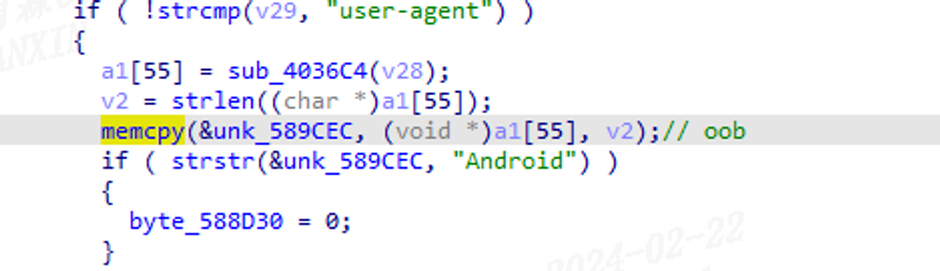

## URL

[https://calm-healer-839.notion.site/D-LINK-DIR-823G-OOBW-0x41D5B0-462500887ea3464692e3e697cc43838c](https://www.notion.so/D-LINK-DIR-823G-OOBW-0x41D5B0-462500887ea3464692e3e697cc43838c?pvs=21)

## Target

- DIR-823G Firmware version V1.0.2B05

## Explain

D-Link사의 라우터 제품인 DIR-823G의 펌웨어에서 OOB Write 취약점이 발견되었습니다.

취약점은 아래의 HTTP 요청 헤더를 파싱하는 함수에서 `User-Agent`를 파싱하는 과정에서 발생합니다.



위의 `memcpy`함수로 헤더의 `User-Agent` 필드 값을 `unk_589CEC`로 복사할 때 길이를 검사하지 않아 OOB Write가 발생합니다.

따라서 공격자는 별다른 인증을 거칠 필요 없이 아래처럼 `User-Agent`에 매우 긴 문자열이 담긴 HTTP 요청을 전달하기만 하면 Denial of Service 공격이 가능합니다.

```python
buf = b'GET / HTTP/1.1\r\nUser-Agent: ' + b'A'*0x300 + b"\r\n\r\n"
```


취약한 버전의 펌웨어에서는 헤더의 `Cookie` 필드 등을 처리하는 과정에서 이와 동일한 방식으로 발생하는 OOB Write 취약점과 파라미터를 파싱할 때 검증 미흡으로 인한 Null-pointer Dereference 취약점이 다수 발견되었습니다.

## Reference

[https://www.cvedetails.com/vulnerability-list/vendor_id-899/product_id-51034/version_id-1775826/year-2024/D-link-Dir-823g-Firmware.html](https://www.cvedetails.com/vulnerability-list/vendor_id-899/product_id-51034/version_id-1775826/year-2024/D-link-Dir-823g-Firmware.html)