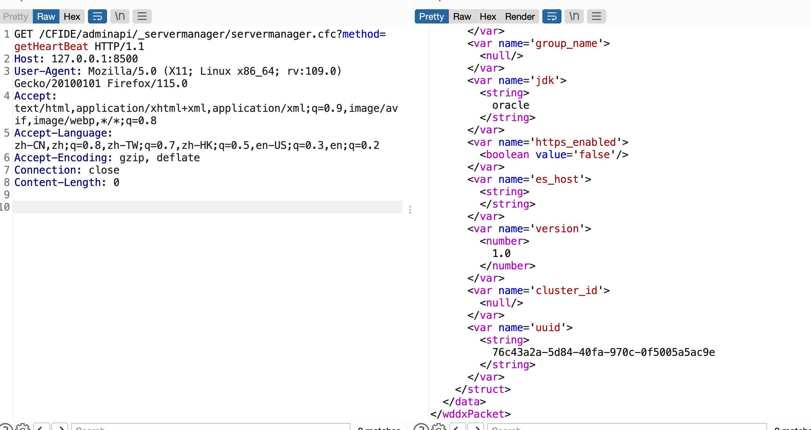

## URL

[https://jeva.cc/2973.html#/](https://jeva.cc/2973.html#/)

## Target

- Adobe ColdFusion ≤ 2023.6
- Adobe ColdFusion ≤ 2021.12

## Explain

Adobe의 웹 애플리케이션 개발 플랫폼인 ColdFusion에서 임의 파일 읽기 취약점이 발생했습니다.

취약점은 Performance Monitoring Toolset(PMS)의 `logging`, `heap_dump`모듈에서 발생하고 이에 접근하려면 먼저 `coldfusion.monitor.Configuration`의 UUID값이 필요합니다.

 해당 UUID값은 아래와 같이 `CFIDE/adminapi/_servermanager/servermanager.cfc`에 GET 요청을 보낼 때 `method` 파라미터를 `getHeartBeat`로 지정하여 이를 호출하는 것으로 얻을 수 있습니다.

이후 UUID를 헤더에 포함시켜 `/pms`에 GET 요청을 보내면 아래와 같이 `module` 파라미터로 지정한 모듈이 실행됩니다.

`logging` 모듈의 경우에는 아래처럼 `invokeLoggingModule` 메소드에서 `file_name` 파라미터로 지정한 파일의 이름과 `System.getProperty("log_dir")`이 반환한 로그 디렉터리를 통해 로그 파일의 경로를 알아냅니다. 이때 `file_name`에 아무런 검사를 수행하지 않기 때문에  `..`를 포함하여 Path Traversal이 가능합니다.

이를 악용하면 위처럼 특정 파일의 데이터를 유출하는 것이 가능합니다.

`heap_dump` 모듈도 이와 마찬가지로 아래의 `invokeHeapDumpModule` 메소드에서 GET 요청에 포함된 `username` 파라미터를 생성할 덤프 파일의 경로에 아무런 검사 없이 포함시키기 때문에 특정 경로에 파일을 생성하는 것이 가능하지만 생성될 파일의 데이터는 조작할 수 없습니다. 파일의 이름의 끝에 현재 시간 정보와 확장자 명이 추가되는 것은 `username` 파라미터의 마지막에 `%00`을 추가하는 것으로 우회할 수 있고 이를 통해 임의의 파일을 덮어쓰는 것이 가능합니다.

