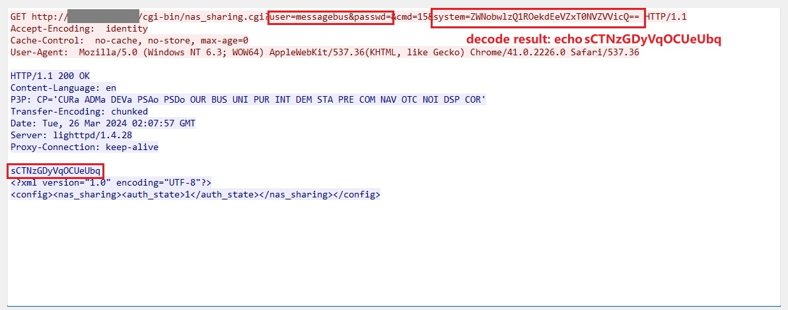

## URL

[https://github.com/netsecfish/dlink](https://github.com/netsecfish/dlink)

## Target

- DNS-320L Version 1.11, Version 1.03.0904.2013, Version 1.01.0702.2013
- DNS-325 Version 1.01
- DNS-327L Version 1.09, Version 1.00.0409.2013
- DNS-340L Version 1.08

## Explain

D-Link 사의 여러 NAS 제품들에서 Command Injection 취약점이 발생했습니다.

취약점은 아래의 `/cgi-bin/nas_sharing.cgi` 엔드포인트에 존재하며 이곳에 GET 요청을 보낼 때는 아래와 같이 `user`와 `passwd` 파라미터로 사용자 정보와 `system` 파라미터로 실행할 커맨드를 base64 인코딩하여 전달합니다.

```python
GET /cgi-bin/nas_sharing.cgi?user=messagebus&passwd=&cmd=15&system=<BASE64_ENCODED_COMMAND_TO_BE_EXECUTED>
```

아래는 해당 취약점을 악용하여 임의의 OS 명령어를 실행하는 HTTP 요청과 응답입니다.



위의 요청에서는 사용자 정보로 `messagebox`(user)와 빈 패드워드를 전달하는 것을 확인할 수 있습니다. 이는 하드 코딩된 인증 정보를 사용하기에 권한이 없는 사용자가 시스템에 접근하는 백도어로 사용됩니다.

이를 통해 공격자는 시스템에 대한 접근 권한을 얻을 수 있고 이후 `system` 파라미터에 base64로 인코딩된 실행할 OS 명령어를 전달하여 Command Injection이 이루어집니다.