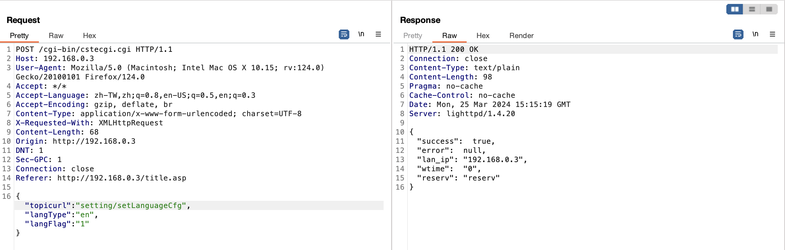
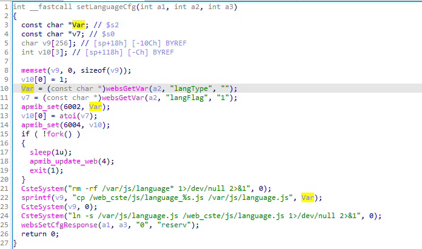

## URL

[https://github.com/4hsien/CVE-vulns/blob/main/TOTOLINK/EX200/CI_1_setLanguageCfg/CI.md](https://github.com/4hsien/CVE-vulns/blob/main/TOTOLINK/EX200/CI_1_setLanguageCfg/CI.md)

## Target

- TOTOLINK EX200 firmware version V4.0.3c.7646_B20201211

## Explain

TOTOLINK 사의 wireless range extender 제품인 EX200의 펌웨어에서 command injection 취약점이 발견되었습니다.

취약점은 `/cgi-bin/cstecgi.cgi` 엔드포인트에 존재하며 [global.so](http://global.so) 파일에 존재하는 `setLanguageCfg` 함수에서 발생했습니다.

아래의 디컴파일된 코드를 살펴보면 HTTP 요청으로 전달 받은 파라미터를 `websGetVar` 함수를 통해 파싱합니다. 이들 중 `langType` 파라미터의 값은 `sprintf` 함수의 인자로 사용됩니다.

사용되는 포맷스트링인 `cp /web_cste/js/language_%s.js /var/js/language.js` 은 사용자가 전달한 값인 `langType`을 아무런 검사 없이 `%s`로 사용하고 포맷된 문자열을 `CsteSystem` 함수의 인자로 사용합니다.

`CsteSystem` 함수는 인자로 전달 받은 command 문자열을 `execv` 함수 호출을 통해 실행하는 기능을 하고 이전에 다룬 TOTOLINK A3300R 펌웨어의 Command Injection 취약점이 발생하는 기능에서 동일하게 사용되었습니다.

때문에 공격자는 아래의 poc처럼 `langType`에 OS command를 삽입하는 것으로 임의의 명령어를 실행하는 것이 가능하고 명령어 실행 결과를 파일에 저장 후 해당 경로로 GET 요청함으로써 명령어 실행 결과를 확인할 수 있습니다.

또한 TOTOLINK A3300R의 펌웨어와 마찬가지로 EX200의 펌웨어에서도 Command Injection을 비롯한 다수의 취약점이 발견되었습니다.

## Reference

- [Related CVEs](https://www.cvedetails.com/vulnerability-list/vendor_id-16807/product_id-107259/version_id-1781153/Totolink-Ex200-Firmware--.html)
- [PoC](https://github.com/4hsien/CVE-vulns/tree/main/TOTOLINK/EX200)