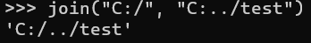

## URL

[https://cn-sec.com/archives/2928066.html](https://cn-sec.com/archives/2928066.html)

## Target

- Splunk Enterprise for Windows
    - 9.2.0 ~ 9.2.1
    - 9.1.0 ~ 9.1.4
    - 9.0.0 ~ 9.0.9

## Explain

Splunk Enterpirse는 데이터 분석 플랫폼으로 서버 등에서 생성되는 모든 로그와 이벤트 등을 수집 및 저장, 이를 통한 분석과 시각화까지 가능한 솔루션입니다. 보안을 비롯하여 운영과 비즈니스 등 다양한 분야에서 폭넓게 활용되고 있고 사용자는 웹기반 인터페이스인 Splunk Web을 통해 기능들을 사용할 수 있습니다.

이번에 발견된 취약점은 이 Splunk Web의 `/modules/messaging/` 엔드포인트에 존재하는 경로 탐색 취약점입니다.

`/modules/messaging/[파일경로]`과 같은 경로로 GET 요청을 보내면 응답으로는 해당 파일의 데이터가 전달됩니다.

이 과정에서 특정 폴더의 경로와 GET 요청으로 전달된 파일 경로가 python의 `os.path.join` 함수를 사용해서 join되었고 Windows에서는 `join` 함수로 인해 아래처럼 중복되는 같은 드라이브 문자는 없어지는 것을 볼 수 있습니다.

또한 파일 탐색이 이루어지는 폴더는 `C:\Program Files\Splunk`에  위치하기 때문에 위 기법을 사용한다면 `C:\Program Files\Splunk\etc\passwd` 처럼 민감한 내용의 파일을 사용자 인증 없이 읽는 것이 가능합니다.

아래의 poc에서는 `C:\Program Files\Splunk\etc\passwd`와 `C:\Windows\win.ini` 파일에 접근하고 있습니다.

또한 poc에서 여러 개의 `C:../` 반복적으로 쓰인 것으로 보아 `/modules/messaging` 엔드포인트에서는 `join` 함수를 아래와 같이 사용했을 것으로 보입니다.

이러한 `join`함수의 동작은 오직 Windows 환경에서만 이루어지기 때문에 취약점 또한 Windows용 Splunk Enterprise에서만 발생한다는 특징이 있습니다.
