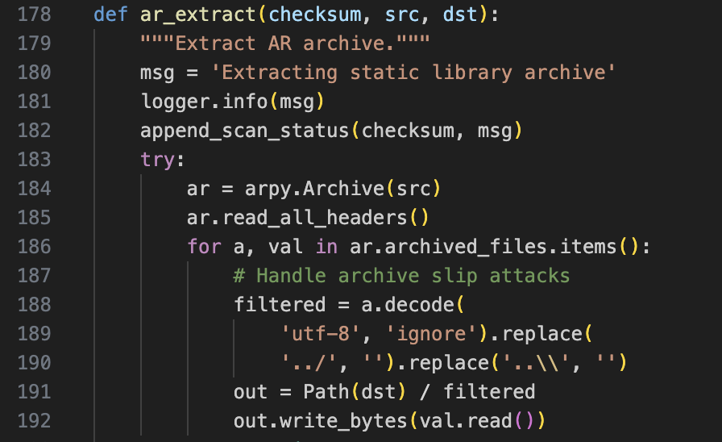

## URL

[https://github.com/MobSF/Mobile-Security-Framework-MobSF/security/advisories/GHSA-4hh3-vj32-gr6j](https://github.com/MobSF/Mobile-Security-Framework-MobSF/security/advisories/GHSA-4hh3-vj32-gr6j)

## Target

- MobSF < 4.0.7

## Explain

MobSF(Mobile Security Framework)는 android, ios, Windows 어플리케이션 대상의 정적/동적 분석 등의 기능을 제공하는 자동화된 pen testing 프레임워크입니다.

제공하는 정적 분석 기능을 사용하면 `.a` 확장자의 static library를 분석하는 것도 가능한데 이때 이루어지는 파일 추출 과정에서 zip slip 취약점이 발생합니다.

위는 `mobsf/StaticAnalyzer/views/common/shared_func.py`소스코드의 일부로 static library에서 파일을 추출하는 기능을 합니다. 188번 라인을 보면 파일의 이름에서 `../`와 `..\`를 필터링하는 것을 볼 수 있으나 이는 `….//`와 `….\\`를 사용하는 것으로 우회하는 것이 가능합니다.

따라서 zip slip을 통한 path traversal로 파일을 덮어쓰는 것이 가능하고 이를 이용해서 `.bashrc` 파일을 덮어쓰는 방법 등으로 Remote code execution까지 이어질 가능성이 있습니다.