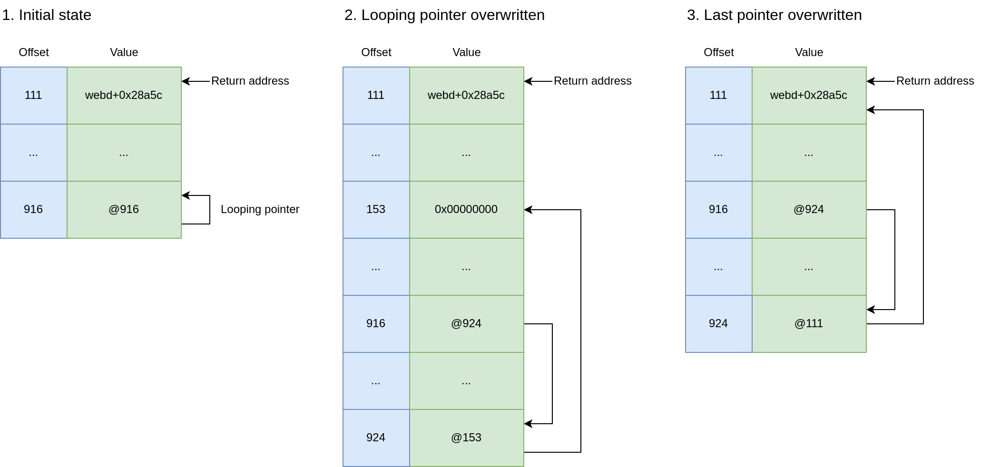

## URL

[https://www.synacktiv.com/publications/exploiting-a-blind-format-string-vulnerability-in-modern-binaries-a-case-study-from](https://www.synacktiv.com/publications/exploiting-a-blind-format-string-vulnerability-in-modern-binaries-a-case-study-from)

## Target

- TC500, BC500, CC400W Firmware < 1.1.3-0442

## Explain

Synology의 보안 카메라 제품인 TC500, BC500, CC400W의 펌웨어에서 HTTP 요청을 처리하는 과정 중 Format String Bug가 발생하여 원격 코드 실행이 가능한 취약점이 발견되었습니다.

취약한 코드는 아래와 같습니다.

```c
void parse_http_request(struct mg_request_info *conn) {
    pthread_t tid;
    char buf[0x80];

    /* [...] */
    tid = pthread_self();
    /* [...] */
    memset(buf, 0, sizeof(buf));
    mg_snprintf(0, 0, buf, 0x80u, "%s%s", hostname, conn->request_uri);  //[1]
    if ( debug_table ) {
        print_debug_msg(tid, buf);  //[2]
    }
    /* [...] */
}
```

취약점은 포맷 스트링을 uri에 포함시킨 HTTP 요청을 보내는 것으로 트리거할 수 있고 이때 위의  `parse_http_request` 함수가 호출되어 HTTP 요청을 파싱합니다. `[1]`에서 호출되는 `mg_snprintf`로 인해 호스트 이름(`hostname`)과 요청 URI(`conn→request_uri`)가 연결되어 `buf`에 저장되고 `[2]`에서 `print_debug_msg`의 인자로 사용되는 것을 볼 수 있습니다. 

이후 `print_debug_msg`에서는 아래와 같이 두 번째 파라미터인 `fmt`를 인자로 사용해서 `mg_snprintf`를 호출합니다(`[3]`).

`mg_snprintf`에서는 다시 `mg_vsnprintf`를 호출하고(`[4]`) 여기서 parse_http_request에서 호스트명과 요청 URI를 결합한 문자열이 `vsnprintf`의 포맷 스트링으로 사용되면서(`[5]`) format string bug가 발생합니다.

```c
void print_debug_msg(pthread_t thread_id, const char *fmt) {
  int i;

  if ( workerthreadcount > 0 ) {
    i = 0;
    do {
      if ( debug_table[i].tid == thread_id ) {
        mg_snprintf(0, 0, debug_table[i].buf, 0x80u, fmt);  //[3]
        debug_table[i].buf[strlen(fmt)] = 0;
      }
      ++i;
    } while ( i < workerthreadcount );
  }
}

void mg_snprintf(const struct mg_connection *conn, int *truncated, char *buf, size_t buflen, const char *fmt, ...) {
  va_list ap;

  va_start(ap, fmt);
  mg_vsnprintf(conn, truncated, buf, buflen, fmt, ap);//[4]
}

void mg_vsnprintf(const struct mg_connection *conn, int *truncated, char *buf, size_t buflen, const char *fmt, va_list ap) {
  int n;
  int ok;

  if ( buflen ) {
    n = vsnprintf(buf, buflen, fmt, ap);//[5]
    ok = (n & 0x80000000) == 0;
    if ( n >= buflen ) {
      ok = 0;
    }
    if ( ok ) {
      if ( truncated ) {
        *truncated = 0;
      }
      buf[n] = 0;
    } else {
      if ( truncated ) {
        *truncated = 1;
      }
      mg_cry(conn, "mg_vsnprintf", "truncating vsnprintf buffer: [%.*s]", (int)((buflen > 200) ? 200 : (buflen - 1)), buf);
      buf[n] = '\0';
    }
  } else if ( truncated ) {
    *truncated = 1;
  }
}
```

HTTP 요청을 처리하는 바이너리에는 PIE가 적용되어 있고 ASLR이 활성화되어 있는 상태이며 `vsnprintf`의 출력을 직접 볼 수 없는 상황에 더해 포맷 스트링의 최대 길이가 0x80바이트로 제한되고 특정 범위(0x00 ~ 0x1F)의 바이트를 페이로드에 포함시키지 못하는 등 많은 제약 사항이 존재함에도 아래와 같은 방식으로 RCE 익스플로잇이 이루어졌습니다.

먼저 스택에 존재하는 스스로를 가리키는 포인터(looping pointer, 오프셋 916)를 `%916$hhn` ****과 같은 포맷스트링을 통해 partial overwrite해서 또다른 스택 포인터(오프셋 924)를 가리키게 만듭니다. 이후 변조된 스택 포인터를 통해 다시 한번 partial overwrite를 하는 것으로 ASLR을 우회하고 넓은 영역의 스택 메모리에 FSB를 통한 데이터 읽기 쓰기가 가능해집니다.



이후 `%*111$c`와 같은 포맷 스트링을 사용해서 오프셋 111에 위치한 리턴 주소의 값만큼의 문자를 출력시키고 이를 오프셋 924에 위치한 스택 포인터를 통해 스택에 리턴 주소 값을 저장하는 것이 가능합니다. 이렇게 스택의 특정 위치에 저장된 리턴 주소를 다시 FSB를 통해 partial overwrite해서 PIE를 우회하고 이를 반복하여 ROP chain을 구성하는 것이 가능합니다.

ROP chain은 최종적으로 `system` 함수를 호출해서 `sh${IFS}-c${IFS}'echo${IFS}synodebug:synodebug|chpasswd;telnetd`라는 커맨드를 실행하고 그 결과 synodebug 유저의 패스워드를 synodebug로 설정한 다음 telnet 데몬을 실행하고 공격자는 실행된 telnet에 접속해서 루트 권한의 쉘을 획득합니다.