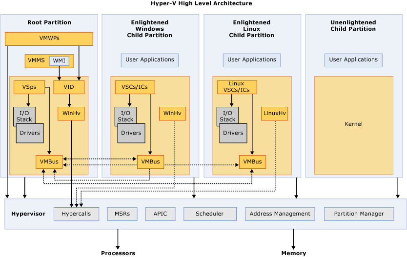
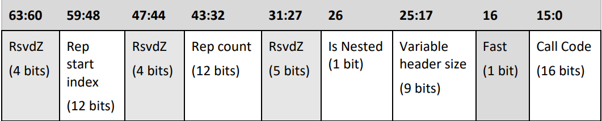
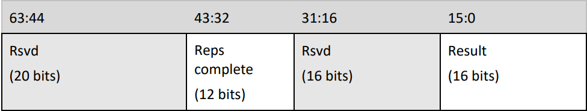

안녕하세요! pwndorei입니다.

이번 글부터  L0ch님과 함께 프로젝트로 Hyper-V 1-day 취약점을 연구하면서 정리한 글을 바탕으로 Hyper-V 시리즈를 연재하게 되었습니다! 이전 [Pwn Cool Sexy](https://hackyboiz.github.io/2021/01/31/l0ch/pwncoolsexy-part1/)라는 미쳐버린 네이밍 센스를 보여준 L0ch가 정한 저희 프로젝트의 이름은 무려 NewJeans' Hyper-V였습니다!... 

무튼 이번 첫 글의 주제는 Hyper-V의 아키텍처입니다. 본격적으로 아키텍처를 살펴보기 전에 Hyper-V가 무엇인지 알아보시죠!
# Hyper-V

Hyper-V는 Microsoft의 Type 1 Hypervisor기반의 가상화 플랫폼입니다. VMware나 VirtualBox와 마찬가지로 가상머신을 생성하고 실행하고 관리하는 등의 기능들을 제공합니다. Type 2 하이퍼바이저를 사용하는 VMware Workstation, Play와 VirtualBox 등이 호스트 OS의 애플리케이션으로 작동하는 것과 달리 Type 1 하이퍼바이저를 사용하는 Hyper-V는 이를 구동하는 호스트 OS 또한 하이퍼바이저의 위에서 구동하게 됩니다. 아래는 Type 1과 Type 2의 차이를 나타낸 그림입니다.

> 출처: [Wikipedia](https://ko.wikipedia.org/wiki/%ED%95%98%EC%9D%B4%ED%8D%BC%EB%B0%94%EC%9D%B4%EC%A0%80)

## 가상화

그럼 이런 가상화는 어째서 사용하는 것일까요?... 해킹을 사랑하시는 독자분들은 이미 다양한 이유로 VMware나 VirtualBox 등을 통해 가상머신을 사용해 보셨겠지만 아직 사용해보신 적이 없으신 분들을 위해 제가 생각하는 가상화를 사용하는 가장 큰 이유를 말씀드리자면 하나의 하드웨어로 여러 개의 OS를 사용할 수 있다는 점인 것 같습니다. 저도 처음 가상머신을 사용하게 된 계기가 포너블을 공부하기 위해 Ubuntu를 설치하기 위함이었습니다. 
또한 생성된 가상머신의 게스트 OS들과 호스트 OS는 서로 격리되어있기 때문에 게스트 OS에서 랜섬웨어나 멀웨어 등을 실행해보면서 작동 원리를 분석하는 등 다양한 분야에서 사용될 수 있습니다.

# Hyper-V Architecture

> 출처: [Microsoft](https://learn.microsoft.com/en-us/virtualization/hyper-v-on-windows/reference/hyper-v-architecture)

위는 ~~한동안 제 바탕화면이었던~~ Hyper-V의 아키텍처에 대한 그림입니다. 주변 사람들에게 보여주면 높은 확률로 눈살을 찌푸리는 것을 볼 수 있습니다 ㅋㅋㅋㅋㅋ 그럼 그림에 나와있는 컴포넌트들을 하나 씩 살펴보시죠!

# Partition

가장 먼저 살펴볼 컴포넌트는 파티션입니다! 사무실 등의 업무 환경에서 책상들을 분리시키는 파티션처럼 Hyper-V의 파티션은 논리적 격리의 단위로서 시스템 간의 격리를 지원합니다. 파티션 간의 격리는 하이퍼바이저의 EPT(확장 페이지 테이블)에 의한 물리적 메모리 격리를 통해 이루어지고 이에 따라 파티션간 간섭이 불가능합니다.
파티션에는 루트 파티션과 자식 파티션이 있고 자식 파티션은 다시 Enlightened 여부에 따라 나뉩니다. Enlightened에 대해서는 뒤에서 다시 다루도록 하고 먼저 루트 파티션에 대해 알아보겠습니다!
## Root Partition
마이크로소프트 하이퍼바이저는 하나 이상의 Windows가 실행되는 루트 파티션을 필요로 합니다. 위에서 격리를 통해 파티션간 간섭이 불가능하다고 말씀드렸지만 루트 파티션은 예외적으로 다른 파티션의 물리적 메모리에 접근하는 것이 가능하고 하드웨어에도 직접 접근할 수 있습니다.
## Child Partition
반면 자식 파티션은 다른 파티션에 접근하거나 하드웨어에 직접 접근하는 것이 불가능합니다. 따라서 자식 파티션이 루트 파티션이나 하이퍼바이저와 통신하기 위해서는 WinHv(LinuxHv)나 VMBus 등의 인터페이스를 사용해야 합니다.  하드웨어에 대한 접근은 가상 디바이스를 통해 이루어집니다. 
### Enlightened
위에서 자식 파티션은 Enlightened 여부에 따라 나뉜다고 말씀드렸는데 Enlightened를 번역해보면 무려 "계몽한"이라는 엄청난 단어가 나옵니다 ㅋㅋㅋㅋㅋㅋ 계몽한 자식 파티션... 뭔가 엄청난 의미인 것 같지만 Enlightened라는 것은 자식 파티션의 시스템이 가상화되어 구동되고 있다는 것을 인지하고 있다는 뜻입니다.

> ~~빨간약 줄까 파란약 줄까~~

Enlightened 게스트에서는 Enlightend I/O 라는 방식의 입출력이 가능해집니다. 이를 통해 반 가상화(para-virtualized)된 디바이스를 사용하는 것으로 에뮬레이션을 건너뛰어 더 빠른 입출력이 가능해집니다. 

가상 디바이스에 대한 더 자세한 내용은 뒤에서 다루도록 하고 다음으로 VMMS에 대해 알아보시죠!

# VMMS

VMMS(Virtual Machine Management Service)는 루트 파티션의 유저 모드 프로세스로 후술할 WMI가 제공하는 가상머신 관리 및 제어 API를 사용하여 가상머신들을 제어합니다. 가상머신의 생성/제거는 물론 가상머신에 할당할 프로세서의 수, 메모리 용량, 하드웨어 자원 등 또한 관리하고 가상머신이 켜질 때 해당 가상머신을 담당할 VMWP를 생성하는 역할도 합니다. 위 그림에서 보면 VMMS 안에 있는 WMI에서 VID에 화살표가 뻗어 있고 다시 VID에서 WinHv를 거쳐 하이퍼바이저에 있는 Hypercall을 가리키고 있죠? 이 부분에 대해 자세히 알아봅시다!
## WMI
마이크로소프트에선 WMI(Windows Management Instrumentation)를 마이크로소프트의 WBEM(웹 기반 엔터프라이즈 관리) 구현이라고 설명하고 있습니다. WMI는 CIM(Common Information Model)
을 통해 시스템과 네트워크, 장치 등 관리 요소의 정보를 나타내고 사용자는 Powershell, wmic, wbemtest 등의 도구를 통해 WMI를 사용해서 Windows 시스템을 관리하는 것이 가능합니다. Hyper-V용 WMI Provider를 사용하면 가상 머신의 구성을 변경하거나 전원, 검사점 등을 관리하는 것이 가능하고 VMMS도 WMI의 기능을 사용해서 가상 머신들을 관리합니다. 다른 사용 예시로는 프로젝트 제로에서 개발한 Hyper-V의 Emulated Device 퍼저인 [Hyntrospect](https://github.com/googleprojectzero/hyntrospect/)가 타겟 가상 머신의 검사점을 적용하는 등의 기능을 사용합니다. Hyntrospect에 대해서는 다른 글에서 다뤄보도록 하겠습니다!
## VID
그래서 WMI는 관리 기능을 제공하는 건 알겠는데 VID는 또 뭘까요?... VID(Virtual Infrastructure Driver)는 자식 파티션에 필요한 Infrastructure 컴포넌트나 자원을 관리하는 역할을 합니다. 하지만 여기서 끝이 아닙니다....
## WinHv(LinuxHv) ~~진짜 끝~~
WinHv는 Windows HyperVisor 인터페이스 라이브러리로 루트 파티션이나 Windows 운영체제를 사용하는 자식 파티션에서는 WinHv, 리눅스를 사용하는 자식 파티션에서는 LinuxHv를 사용합니다. 이름 그대로 하이퍼바이저와의 인터페이스를 제공하고 이 인터페이스가 바로 Hypercall입니다. Hyper-V 관리자에서 어떤 가상 머신의 가상 프로세서 수나 할당된 메모리 등을 변경하면 WMI, VID, WinHv를 거쳐 하이퍼바이저에 요청이 전달되는 것이죠...

# VMWP

VMWP(Virtual Machine Worker Process)는 루트 파티션의 유저 모드 프로세스로 VMMS가 가상머신이 부팅될 때 해당 가상머신을 위한 vmwp.exe를 생성합니다. vmwp.exe의 대표적인 컴포넌트는 아래의 네 가지가 있습니다.
- Virtual Device
- Integrated Components
- Plan9FS
- vSMB Server
이 중에서도 Virtual Device와 Integrated Component에 대해 자세히 알아보시죠!

## Integrated Component
가상머신과 호스트의 통신을 위한 서비스들입니다. 대표적으로 아래와 같은 서비스들이 있습니다
- Hyper-V Heartbeat Service
    - 가상머신이 제대로 부팅했는지, 또는 동작하고 있는지 알 수 있는 서비스
- Hyper-V Guest Shutdown Service
- Hyper-v volume shadow copy requestor
	- 검사점(Checkpoint) 생성 및 적용을 위한 서비스
- Hyper-V Time Synchronization
	- 가상머신의 시간과 호스트의 시간을 동기화

## Virtual Device
아까 파티션에 대한 설명에서 자식 파티션은 하드웨어에 직접 액세스할 수 없기에 가상 디바이스를 사용한다고 했었죠? 가상 디바이스는 크게 아래의 세 카테고리로 나눌 수 있습니다
- Emulated Device
- Para-virtualized Device
- Direct Access(Passthrough)

Para-virtualized Device에 대한 설명은 드렸으니 건너뛰고 Emulated Device부터 살펴보시죠!

Emulated Device는 말 그대로 에뮬레이트된 디바이스입니다. 이들은 vmwp.exe나 vmwp.exe가 로드하는 VmEmulatedStorage.dll, VmEmulatedNic.dll 등의 dll에 구현되어 있습니다.
Direct Access는 특정 자식 파티션에서 특정 디바이스에 직접 접근하게 하는 방식입니다.

Emulated Device는 루트 파티션의 vmwp에 있고 가상머신들은 자식 파티션에 있으니 이들을 이어줄 무언가가 필요하겠죠?... 가상머신에서 가상 디바이스에 접근하면 하이퍼바이저에 의해 인터셉트되고 VID 알림(Notification)이란게 발생합니다. 또한 VND(VID Notification Dispatcher)를 이용하면 특정 VID 알림이 발생할 때 특정 동작을 수행할 수 있게 되어 vmwp에서 가상 디바이스를 에뮬레이션할 수 있게 됩니다.

### Instruction Decoder
그럼 게스트에서 `in`, `out` 명령을 통한 port io나 mmio 명령을 실행할 때마다 게스트 파티션(Driver)과 호스트 파티션(VMWP) 사이에서 context 전환(vmentry/vmexit)이 계속 일어난다면 이런 명령이 밀집된(Intercept-intensive) 부분에서는 말도 안되는 성능이 나와 버리겠죠?... 그래서 vmwp에는 x86과 x64 명령을 에뮬레이션해주는 `EmulatorVp`라는 클래스가 존재합니다. IO 에뮬레이션 이후 바로 게스트 파티션으로 전환되는 것이 아니라 vmwp에서 다른 instruction도 에뮬레이션하는 것이죠. 이를 통해 vmwp의 context에 머무는 시간이 증가하여 성능에도 좋은 영향을 미칩니다.

# VMBus & VSP & VSC

Emulated Device에 대해 알아봤으니 이번엔 Para-virtualized Device에 대해 알아보시죠. 위에서 파티션에 대해 말씀드릴 때 Enlightened Guest Partition에서 사용되며 Enlightened I/O를 통해 더 나은 성능을 발휘한다고 말씀 드렸는데요? Para-virtualized device stack에 사용되는 VMBus, VSP, VSC에 대해 알아보시죠!
## VMBus
가장 먼저 VMBus입니다. VMBus는 Hyper-V가 반가상화 지원을 위해 사용하는 메커니즘 중에 하나로 호스트와 게스트 사이에 가상의 채널을 만들어 이를 통해 VSP와 VSC가 통신할 수 있습니다. VMBus의 채널은 공유 메모리 방식의 ring buffer로 채널 당 upstream과 downstream가 하나씩 할당되고 이를 통해 데이터를 보내거나 받을 수  있고 채널에 읽을 수 있는 데이터가 있으면 하이퍼바이저가 가상 인터럽트를 통해 VSP나 VSC에 알려줍니다. 메시지를 받으면 공유 메모리에서 공유되지 않은 메모리로 데이터를 복사하고 추가적인 정보는 메시지에 GPADL(Guest Physical Address Descriptor List)를 첨부하는 것을 통해 데이터의 위치를 알려줍니다.
## VSC(Virtualization Service Consumer)
VSC는 자식 파티션의 커널 영역에 존재하고 다른 디바이스 드라이버에서 발생한 IO 작업을 루트 파티션의 VSP에게로 리다이렉션합니다. 
## VSP(Virtualization Service Provider)
루트 파티션의 커널 영역에 존재하며 VMBus를 통해 VSC가 보낸 데이터를 읽어 루트 파티션의 I/O Stack이 처리하도록 만듭니다.

# Hypervisor
마지막으로 알아볼 컴포넌트는 하이퍼바이저입니다!... 하이퍼바이저가 수행하는 기능이 굉장히 많은 만큼 전부 알아보는 것은 불가능할 것 같습니다.~~전부 알았으면 마소에 갔겠지~~ 그래서 딱 하나만 골라보자면 당연 하이퍼콜이라고 생각합니다 ㅋㅋㅋㅋ 앞 부분부터 계속 키워드가 등장했는데 뭔지 알아보지 않고 끝나면 찝찝하잖아요...
## Hypercall
하이퍼콜은 하이퍼바이저가 게스트에게 제공하는 호출 메커니즘입니다. 시스템콜에 의해 ring3에서 ring0로 컨텍스트 스위칭이 되는 것처럼 하이퍼콜은 ring 0에서 하이퍼바이저로 컨텍스트 스위칭이 일어납니다. 또한 하이퍼콜은 반드시 커널 레벨에서 이루어져야 하고 `vmcall`이나 `vmmcall` 명령을 통해 이루어집니다. 하이퍼콜에 대한 인자 전달은 시스템콜과 유사하게 레지스터를 사용합니다. 

### Hypercall Classes
하이퍼콜에는 simple과 repeat, 두 종류가 있습니다. simple 하이퍼콜은 한 번의 하이퍼콜을 고정된 크기를 가지는 인풋, 아웃풋 파라미터로 호출합니다. repeat 하이퍼콜은 simple 하이퍼콜을 여러 번 반복하는 것처럼 동작합니다. 또한 고정된 크기의 인풋/아웃풋 파라미터의 리스트를 통해 지정된 반복 횟수만큼 반복합니다.

### Hypercall Input/Output
#### Input
리눅스 x86-64의 시스템 콜에서 call code를 rax에 전달하는 것처럼 Hyper-V의 하이퍼콜은 RCX에 하이퍼콜 인풋을 전달하고 구조와 각 필드의 의미는 아래와 같습니다.

> 출처: [MicrosoftDocs](https://github.com/MicrosoftDocs/Virtualization-Documentation/blob/main/tlfs/Hypervisor%20Top%20Level%20Functional%20Specification%20v6.0b.pdf)

- Call Code: 호출될 하이퍼콜의 번호
- Fast: 호출될 하이퍼콜이 레지스터 기반의 호출 규약을 사용함(1), 사용하지 않음(0)
- Variabe Header Size: variable header의 크기
- Is Nested: 중첩 가상화 환경에서 해당 하이퍼콜이 L0 하이퍼바이저(가상화되지 않은 하이퍼바이저)에 의해 처리되어야함(1), 게스트 하이퍼바이저에 의해 처리될 수 있음(0)
- Rep Count: Repeat 방식의 하이퍼콜에서 반복할 횟수, Simple인 경우에는 0으로 설정
- Rep Start Index: Repeat 방식의 하이퍼콜에서 반복을 시작할 인덱스, Simple의 경우에는 0으로 설정
- RsvdZ: 사용되지 않는 필, 반드시 0으로 설정
##### Parameter
인풋 파라미터를  Fast의 경우에는 RDX와 R8에 값으로 Non-Fast의 경우에는 RDX에 메모리 주소가 전달됩니다. Fast(Register-Based)에서는 메모리 접근 과정이 생략되기 때문에 Fast인 것이죠. 메모리를 통한 Non-Fast(Memory-Based)에서 사용되는 메모리 주소는 GPA(Guest Physical Address)가 사용되고 이 주소는 8바이트로 Align되어야만 합니다. 또한 Repeat 방식으로 전달된 list일 경우 리스트가 다른 리스트와 겹치거나 페이지 경계에 걸쳐있게 되면 하이퍼콜이 실패하게 됩니다.

Fast 하이퍼콜을 위한 파라미터가 겨우 두 개밖에 없진 않겠죠?... Extended Fast Hypercall(XMM Fast Hypercall)의 경우에는 기존 RDX와 R8 뿐만 아니라 XMM0 ~ XMM5까지 파라미터 전달에 사용할 수 있습니다! 이 경우에는 최대 112 바이트의 파라미터를 전달할 수 있게 됩니다!
#### Output
모든 하이퍼콜은 64비트의 Hypercall result 값이 RAX(x86에서는 EAX:EDX)를 통해 반환되고 아래와 같은 구조를 가지고 있습니다.

> 출처: [MicrosoftDocs](https://github.com/MicrosoftDocs/Virtualization-Documentation/blob/main/tlfs/Hypervisor%20Top%20Level%20Functional%20Specification%20v6.0b.pdf)

- Result: 하이퍼콜의 결과를 나타내는 HV_STATUS 코드(성공 혹은 실패)
- Reps Complete: Repeat 방식의 하이퍼콜에서 완수된 반복 횟수
- Rsvd: 사용되지 않는 값

하이퍼콜이 아웃풋 파라미터를 가지면 Non-Fast의 경우에는 R8로 전달한 메모리 주소에 아웃풋 파라미터가 저장되고 Extended Fast Hypercall의 경우에는 인풋 파라미터를 전달하는데 사용되지 않은 레지스터에 아웃풋 파라미터가 저장됩니다.

### Hypercall Continuation
하이퍼콜은 많은 사이클을 잡아먹는 복잡한 동작이기 때문에 하이퍼바이저는 하이퍼콜의 실행 시간을 약 50 마이크로초 이하로 제한하고 제한된 시간이 다 되면 하이퍼콜을 호출한 가상 프로세서에게 제어를 반환합니다. 그럼 제한시간 보다 오래 걸리는 복잡한 하이퍼콜의 경우에는 어떻게 하는 걸까요?... 제한시간이 지나면 하이퍼콜의 완료 여부와 상관 없이 하이퍼콜을 호출한 가상 프로세서에 제어를 돌려주지만 하이퍼콜이 완료되지 않은 경우에는 하이퍼콜을 호출한 부분에서 Instruction Pointer가 움직이지 않습니다! 이후 스케쥴링을 통해 실행이 중단된 시점부터 다시 진행해서 하이퍼콜을 완료하게 됩니다.

# 마치며
여기까지 Hyper-V의 아키텍처에 대해 ~~간략히~~ 알아봤는데요? 저도 아직 부족해서 더 많은 정보를 드릴 수가 없었고 잘못된 정보가 있을 수도 있습니다~~태클은 언제나 환영입니다~~ 이렇게 많은 컴포넌트들 중에서 공격 대상이 되는 부분은 주로 루트 파티션에 있습니다. 대표적으로 VSP의 경우에는 자식 파티션에 있는 VSC가 보낸 데이터를 파싱하면서 취약점이 발생하기도 하고 vmwp에서도 가상 디바이스의 에뮬레이션 부분에서 취약점이 발생하기도 합니다. 다음 글은 vmwp의 IDE 장치 에뮬레이션에서 발생한 취약점으로 VM Escape까지 가능한 CVE-2018-0959 분석으로 찾아뵙도록 하겠습니다!
