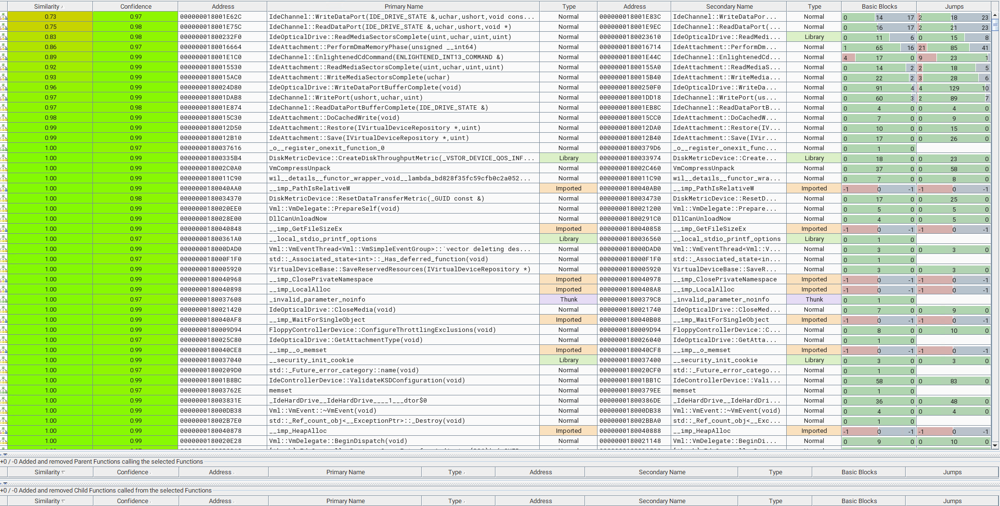
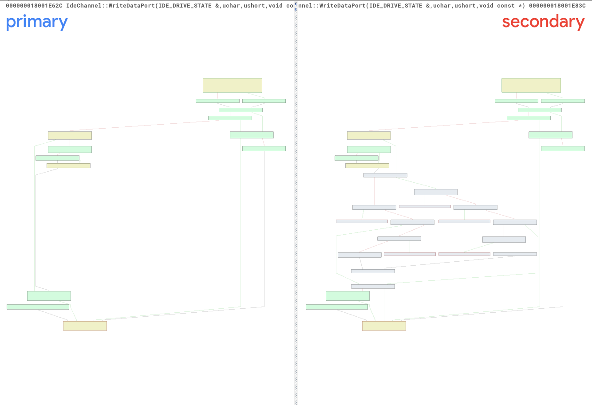
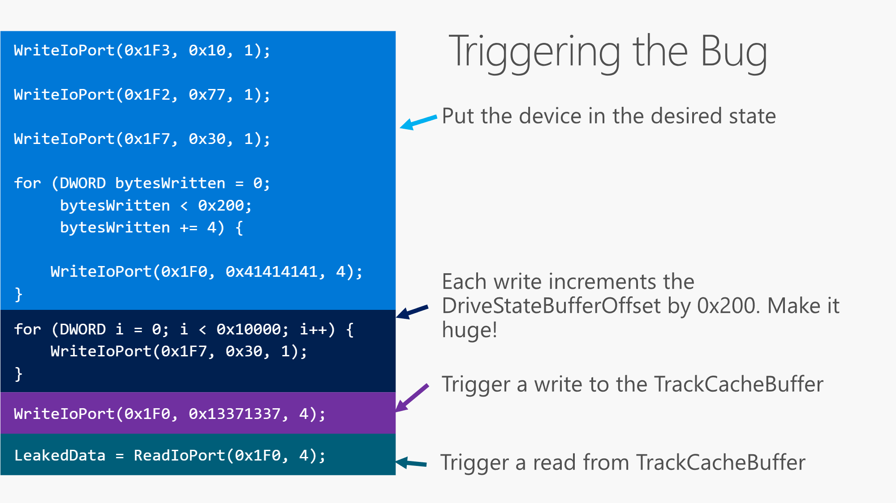
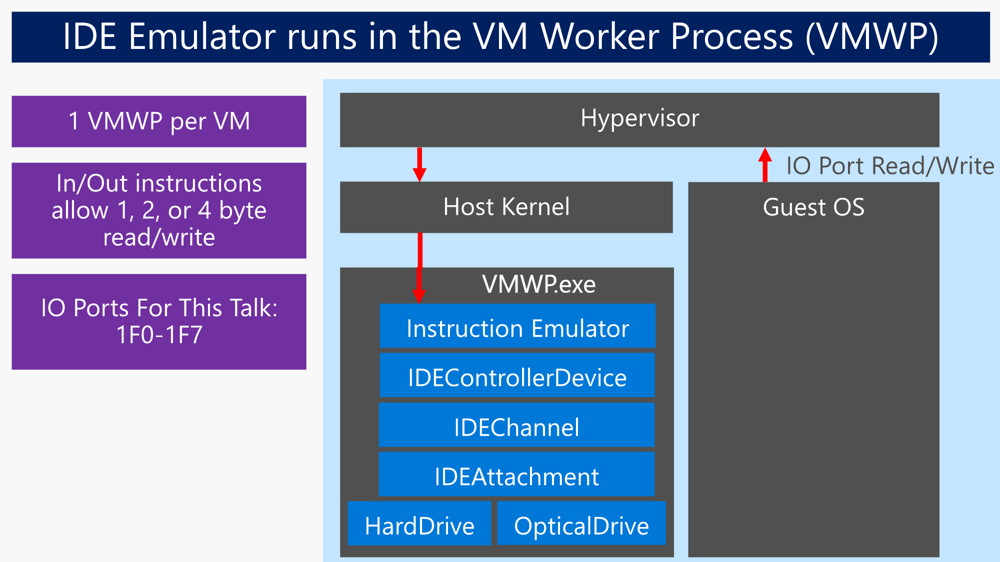

지난 파트 보러가기
[[Research] NewJeans' Hyper-V Part 1 - Hyper-V Architecture](https://hackyboiz.github.io/2023/09/30/pwndorei/newjeans-hyper-v-pt1/)
**[Research] NewJeans' Hyper-V Part 2 - CVE-2018-0959 Analysis(1) (Here)**

안녕하세요! 일주일 만에 돌아온 pwndorei입니다.
지난 Part 1에서는 Hyper-V 아키텍처에 대해 알아봤었죠? 이번 편은 지난 글에서 예고한 대로 CVE-2018-0959에 대한 분석입니다!!

# 5년 전 취약점을 왜 이제!...
때는 프로젝트 초반, 제가 Hyper-V 아키텍처를 공부하며 vmwp에 대한 정보를 수집하던 시기였습니다. 구글링을 열심히 하다 보니 [이런 글](https://msrc.microsoft.com/blog/2019/09/attacking-the-vm-worker-process/)을 찾아버렸죠! 사실 전 편의 vmwp에 대한 정보는 이 글에서 많이 얻었습니다. 
무튼! 이 글에서 예시로 설명한게 바로 CVE-2018-0959였습니다. 더 찾아보니 블랙햇 2019에서의 [발표자료](https://github.com/microsoft/MSRC-Security-Research/blob/master/presentations/2019_08_BlackHatUSA/BHUSA19_Exploiting_the_Hyper-V_IDE_Emulator_to_Escape_the_Virtual_Machine.pdf)와 함께 해당 취약점을 분석한 내용과 대략적인 익스플로잇 방법까지 나와있더군요. 이 정도 정보가 있으면 익스플로잇 못하진 않겠다 싶었던 저는 본격적으로 1-day 분석 기간에 이 취약점을 살펴보게 됩니다!

# CVE-2018-0959
CVE-2018-0959는 Hyper-V의 1세대 가상머신(Unenlightned Guest Partition)의 Emulated Device 중 IDE 장치의 에뮬레이션에서 발생한 Relative OOB Read/Write 취약점입니다. 이를 통해 최종적으로는 VM escape까지 가능합니다.

## VM Escape(Guest-to-Host Escape)
VM Escape란 공격자가 하이퍼바이저 등 가상화 기술에 존재하는 취약점을 이용해 가상머신에서 격리된 환경을 탈출하는 것을 말합니다. 이런 딱딱한 정의만으로는 너무 추상적이고 감도 잘 안오는데요? 간단한 예시를 통해 알아봅시다! 
가상머신이 격리된 환경에서 작동하긴 하지만 그렇다고 하이퍼바이저나 호스트와 아무런 통신도 하지 않으면 정상적으로 작동할 수 없겠죠?... 따라서 가상머신과 호스트(하이퍼바이저)간의 상호작용은 필연적입니다. 가상머신이 보낸 데이터를 호스트나 하이퍼바이저가 파싱하거나 가상머신이 사용하는 가상 디바이스를 에뮬레이션하는 등의 작업을 처리합니다. 주로 이러한 동작을 수행하는 부분이 어택 벡터가 됩니다. CVE-2018-0959 또한 가상머신이 사용하는 Emulated Device를 vmwp가 에뮬레이트하는 과정에서 취약점이 발생해 vmwp의 권한으로 임의 코드를 실행할 수 있습니다.

### VM Escape의 위험성
그럼 VM Escape는 얼마나 위험한 걸까요? 버그 바운티 포상금을 보면 이 취약점이 얼마나 심각한 것인지 단번에 알 수 있습니다 ㅋㅋㅋㅋㅋㅋ Hyper-V 버그 바운티의 경우 RCE(VM Escape)는 최대 포상금이 $250,000로 약 3억 3천만원입니다;; 개인 사용자에게 입힐 피해도 크겠지만 Hyper-V가 마이크로소프트의 클라우드 서비스인 Azure의 기반이 되는 만큼 Hyper-V의 취약점이 Azure에 악용될 수 있습니다.
Azure에도 적용 가능했던 Hyper-V 취약점 하나를 알아보시죠! 지난 Part 1에서 알아본 Hyper-V의 Enlightened I/O에 사용되는 VSP, VSC, VMBus를 알아봤었죠? 이 중에서 가상 스위치가 구현된 VSP인 `vmswitch.sys`에서 발생한 취약점인 CVE-2021-28476는 DoS와 VM Escape(RCE)가 모두 가능한 취약점이었습니다. Azure 입장에서는 둘 다 치명상급의 익스플로잇입니다. `vmswitch.sys`에서 크래시가 발생하여 종료되면 Azure의 중요 컴포넌트들이 정상적으로 작동하지 못하고 같은 물리적 시스템을 공유하는 모든 VM들이 종료될 것입니다!....

# Analysis
## Patch Diffing
그럼 일단 patch diffing부터 해봅시다! patch diffing에 대한 정보는 [이 글](https://hackyboiz.github.io/2020/11/15/l0ch/windows-patch-diffing-part1/)에서  패치 추출 스크립트 등의 정보를 얻으실 수 있습니다. 현재는 저 글이 쓰인 시점과 패치 파일 구성이 약간 변화해서 최신 패치에 사용하면 정상 작동 하지 않을 수도 있습니다...
디핑에 사용할 패치는 [KB4103731](https://catalog.update.microsoft.com/Search.aspx?q=kb4103731)(패치 후)와 [KB4056891](https://catalog.update.microsoft.com/Search.aspx?q=kb4056891)(패치 전)을 사용했고 취약점은 VmEmulatedStorage.dll의 어떤 함수들에 있으니 바로 BinDiff로 확인해봅시다! 


맨 위에 누가 봐도 많이 달라진 두 함수가 신경 쓰이는군요 ㅋㅋㅋㅋㅋ ~~OOB Read Write인데 마침 이름도...~~ `IdeChannel::WriteDataPort`부터 보자면 아래와 같습니다


primary가 패치 전, secondary가 패치 후입니다. 그래프에 뭔가 굉장히 많이 생긴 것을 확인할 수 있는데요? 패치 전후의 함수를 IDA로 디컴파일한 것을 보며 비교해보시죠!

### `IdeChannel::WriteDataPort` 패치 전
```C
void __fastcall IdeChannel::WriteDataPort(IdeChannel *this, struct IDE_DRIVE_STATE *Drive, unsigned __int8 AccessSize, __int64 AccessCount, const void *Buffer)
{
  __int64 CurrentBuffer; // rdi
  __int64 CurrentByte; // rbp
  unsigned int length; // esi
  IdeChannel *v9; // rcx
  unsigned int v10; // ebp

  if ( *((_BYTE *)Drive + 77) )                 // Drive.Saved.UseCommandBuffer
    CurrentBuffer = *((_QWORD *)Drive + 20);    // Drive.CommandBuffer
  else
    CurrentBuffer = *((_QWORD *)Drive + 21) + *((unsigned int *)Drive + 16);// Drive.TrackCacheBuffer + Drive.Saved.DriveStateBufferOffset
  if ( CurrentBuffer && *((_BYTE *)Drive + 76) )
  {
    CurrentByte = *((unsigned int *)Drive + 18);// Drive.Saved.CurrentByte
    length = AccessSize;
    if ( AccessSize + (unsigned int)CurrentByte > *((_DWORD *)Drive + 17) )// CurrentByte + length > Driver.Saved.TotalBytes
    {
      if ( (unsigned int)VmlIsDebugTraceEnabled(16592i64) )
        VmlDebugTrace(16592i64, L"[IDE ] Write to data port exceeds TotalBytes.");
      length = *((_DWORD *)Drive + 17) - CurrentByte;// Drive.Saved.TotalBytes
    }
    memcpy_0((void *)(CurrentBuffer + CurrentByte), Buffer, length);
    v10 = length + CurrentByte;
    *((_DWORD *)Drive + 18) = v10;
    if ( v10 >= *((_DWORD *)Drive + 17) )//CurrentByte >= TotalBytes
      IdeChannel::WriteDataPortBufferComplete(v9, Drive);
  }
  else if ( (unsigned int)VmlIsDebugTraceEnabled(16592i64) )
  {
    VmlDebugTrace(16592i64, L"[IDE ] Write to data port, but no data expected");
  }
}
```
조건에 따라 CommandBuffer나 TrackCacheBuffer에 오프셋을 더한 것을 CurrentBuffer로 사용하고 최종적으로 `memcpy`가 호출되어 데이터의 복사가 일어납니다. `IdeChannel:ReadDataPort`에선 반대로 데이터를 읽습니다. 또한 쓰인(읽은) 데이터만큼 CurrentByte가 증가하는 것을 알 수 있습니다. 읽기/쓰기가 반복되어 CurrentByte가 TotalBytes보다 크거나 같아지면 `IdeChannel::WriteDataportBufferComplete`도 호출되는 군요.
그래도 이것만 봐서는 어디가 취약한지 감이 오질 않는군요. 패치 후의 함수도 한번 보도록 하죠!
### `IdeChannel::WriteDataPort` 패치 후
```C
void __fastcall IdeChannel::WriteDataPort(IdeChannel *this, struct IDE_DRIVE_STATE *Drive, unsigned __int8 AccessSize, __int64 AccessCount, const void *Src)
{
  __int64 CurrentBuffer; // r14
  __int64 CurrentByte; // rsi
  unsigned int length; // ebx
  unsigned int DriveStateBufferOffset; // eax
  unsigned int v10; // ecx
  unsigned int v11; // edx
  unsigned int TrackCacheSize; // ecx
  IdeChannel *v13; // rcx
  unsigned int v14; // esi

  if ( *((_BYTE *)Drive + 77) )                 // Drive.Saved.UseCommandBuffer
    CurrentBuffer = *((_QWORD *)Drive + 20);    // Drive.CommandBuffer
  else
    CurrentBuffer = *((_QWORD *)Drive + 21) + *((unsigned int *)Drive + 16);// Drive.TrackCacheBuffer + Drive.Saved.DriveStateBufferOffset
  if ( CurrentBuffer && *((_BYTE *)Drive + 76) )// Drive.Saved.BufferPtrValid
  {
    CurrentByte = *((unsigned int *)Drive + 18);// Drive.Saved.CurrentByte
    length = AccessSize;
    if ( AccessSize + (unsigned int)CurrentByte > *((_DWORD *)Drive + 17) )// CurrentByte + length > Drive.Saved.TotalBytes
    {
      if ( (unsigned int)VmlIsDebugTraceEnabled(16592i64) )
        VmlDebugTrace(16592i64, L"[IDE ] Write to data port exceeds TotalBytes.");
      length = *((_DWORD *)Drive + 17) - CurrentByte;
    }
    if ( *((_BYTE *)Drive + 77) )
    {
      if ( length + (unsigned int)CurrentByte < (unsigned int)CurrentByte )
        msl::utilities::SafeIntErrorPolicy_SafeIntException::SafeIntOnOverflow();
      if ( length + (unsigned int)CurrentByte > 0x10000 )
      {
        if ( (unsigned int)CurrentByte > 0x10000 )
          msl::utilities::SafeIntErrorPolicy_SafeIntException::SafeIntOnOverflow();
        length = 0x10000 - CurrentByte;
      }
    }
    else
    {
      DriveStateBufferOffset = *((_DWORD *)Drive + 16);// Drive.Saved.DriveStateBufferOffset
      v10 = DriveStateBufferOffset + CurrentByte;
      if ( DriveStateBufferOffset + (unsigned int)CurrentByte < DriveStateBufferOffset )// Overflow check
        msl::utilities::SafeIntErrorPolicy_SafeIntException::SafeIntOnOverflow();
      v11 = v10 + length;
      if ( v10 + length < v10 )
        msl::utilities::SafeIntErrorPolicy_SafeIntException::SafeIntOnOverflow();
      TrackCacheSize = *((_DWORD *)Drive + 44); // Drive.TrackCacheSize
      if ( v11 > TrackCacheSize )               // TrackCacheSize > DriveStateBufferOffset + CurrentByte + length
      {
        if ( DriveStateBufferOffset + (unsigned int)CurrentByte > TrackCacheSize )
          msl::utilities::SafeIntErrorPolicy_SafeIntException::SafeIntOnOverflow();
        length = TrackCacheSize - (DriveStateBufferOffset + CurrentByte);
      }
    }
    if ( length )
    {
      memcpy_0((void *)(CurrentBuffer + CurrentByte), Src, length);
      v14 = length + CurrentByte;
      *((_DWORD *)Drive + 18) = v14;            // Drive.Saved.CurrentByte
      if ( v14 >= *((_DWORD *)Drive + 17) )
        IdeChannel::WriteDataPortBufferComplete(v13, Drive);
    }
  }
  else if ( (unsigned int)VmlIsDebugTraceEnabled(16592i64) )
  {
    VmlDebugTrace(16592i64, L"[IDE ] Write to data port, but no data expected");
  }
}
```
패치 전보다 코드가 확실히 더 길어지고 중간 중간 Integer Overflow도 검사하네요! 추가적으로 `DriveStateBufferOffset + (unsigned int)CurrentByte + length > TrackCacheSize`를 통해 TrackCacheSize보다 BufferOffset + CurrentByte + length가 크지 않은지 검사하는데 이 값들은 어떤 의미를 갖는 걸까요?...
패치 전 함수의 디컴파일된 결과를 다시 보면서 이 검사가 이루어지지 않았을 때의 영향을 생각해봅시다!

```C
void __fastcall IdeChannel::WriteDataPort(IdeChannel *this, struct IDE_DRIVE_STATE *Drive, unsigned __int8 AccessSize, __int64 AccessCount, const void *Buffer)
{
  __int64 CurrentBuffer; // rdi
  __int64 CurrentByte; // rbp
  unsigned int length; // esi
  IdeChannel *v9; // rcx
  unsigned int v10; // ebp

  if ( *((_BYTE *)Drive + 77) )                 // Drive.Saved.UseCommandBuffer
    CurrentBuffer = *((_QWORD *)Drive + 20);    // Drive.CommandBuffer
  else
    CurrentBuffer = *((_QWORD *)Drive + 21) + *((unsigned int *)Drive + 16);// Drive.TrackCacheBuffer + Drive.Saved.DriveStateBufferOffset
  if ( CurrentBuffer && *((_BYTE *)Drive + 76) )
  {
    CurrentByte = *((unsigned int *)Drive + 18);// Drive.Saved.CurrentByte
    length = AccessSize;
    if ( AccessSize + (unsigned int)CurrentByte > *((_DWORD *)Drive + 17) )// CurrentByte + length > Driver.Saved.TotalBytes
    {
      if ( (unsigned int)VmlIsDebugTraceEnabled(16592i64) )
        VmlDebugTrace(16592i64, L"[IDE ] Write to data port exceeds TotalBytes.");
      length = *((_DWORD *)Drive + 17) - CurrentByte;// Drive.Saved.TotalBytes
    }
    memcpy_0((void *)(CurrentBuffer + CurrentByte), Buffer, length);
    v10 = length + CurrentByte;
    *((_DWORD *)Drive + 18) = v10;//CurrentByte += `data length`
    if ( v10 >= *((_DWORD *)Drive + 17) )
      IdeChannel::WriteDataPortBufferComplete(v9, Drive);
  }
  else if ( (unsigned int)VmlIsDebugTraceEnabled(16592i64) )
  {
    VmlDebugTrace(16592i64, L"[IDE ] Write to data port, but no data expected");
  }
}
```
일단 `memcpy`로 데이터가 복사될 주소인 `CurrentBuffer + CurrentByte`에 대해 분석해봅시다.
맨 처음의 if문에서 `Drive.Saved.UseCommandBuffer`가 0이면 `Drive.TrackCacheBuffer + Drive.Saved.DriveStateBufferOffset`이 `CurrentBuffer`로 사용된다는 것을 알 수 있습니다. 해당 부분은 TrackCacheBuffer에서 데이터가 쓰일 부분을 가리키고 쓰일 데이터의 길이는 인자로 전달된 `AccessSize`의 값이 대입된 `length` 입니다. 따라서 현재 데이터를 쓸 부분에 `length`만큼 데이터를 썼을 때 버퍼의 크기를 벗어나서 쓰게 되는 지를 검사하는 것이죠!

## Vulnerability
위의 취약점이 `IdeChannel:ReadDataPort`에서도 같은 방식으로 발생해 이 두 함수를 통해 OOB Read/Write가 가능합니다. `TrackCacheBuffer`의 크기인 `TrackCacheSize`보다  `DriveStateBufferOffset`을 크게 만들면 OOB Read/Write가 발생하고 읽은 데이터나 쓸 데이터는 게스트 파티션의 커널 드라이버에서 `in`, `out` 명령을 통해 입출력될 것입니다.

하지만 아직도 많은 의문이 남습니다... `DriveStateBuffer`는 어떻게 증가 시키는지, 어떤 포트에 `in`, `out`을 해야 취약한 함수까지 도달하는지 등등! 다행히 이러한 의문의 전반을 블랙햇 2019 발표 자료를 통해 해결할 수 있었습니다. 버그를 트리거하는 방법부터 알아보시죠!

# Bug Trigger
아래는 발표 자료의 일부입니다.

> [출처](https://github.com/microsoft/MSRC-Security-Research/blob/master/presentations/2019_08_BlackHatUSA/BHUSA19_Exploiting_the_Hyper-V_IDE_Emulator_to_Escape_the_Virtual_Machine.pdf)


위 코드의 `WriteIoPort`같은 함수는 실제로 있는 함수가 아니고 의사코드 같은 느낌으로 표현만 한 것일 뿐입니다! OOB Read/Write를 위해 버그를 트리거하는 과정을 보면 아래의 세 단계로 이루어진 다는 것을 알 수 있습니다.
1. Emulated Device를 특정 상태로 만든다
2. 이후 0x1f7 포트에 데이터(0x30)을 쓸 때마다 `DriveStateBufferOffset`이 0x200씩 증가한다
3. OOB Read/Write 한다

어느 포트에 어떤 데이터를 얼마나 써야하는지까지 아주 상세하게 나와있지만 이걸 알았다고 바로 익스플로잇하러 떠날 제가 아니죠... 각 과정이 어떤 의미를 가지는지 자세히 분석해봤습니다!
세부 과정을 분석하기 전에 각 포트가 어떤 의미를 가지는지 알아보시죠

# IDE Emulation
이 취약점과 연관된 가상 디바이스는 VmEmulatedStorage.dll의 IDE 장치입니다. vmwp의 IDE 에뮬레이션 스택은 아래와 같습니다

> [출처](https://github.com/microsoft/MSRC-Security-Research/blob/master/presentations/2019_08_BlackHatUSA/BHUSA19_Exploiting_the_Hyper-V_IDE_Emulator_to_Escape_the_Virtual_Machine.pdf)

IDE는 아래와 같이 컨트롤러 레지스터들이 0x1f0부터 0x1f7까지의 포트를 부여 받고 해당 포트에서 데이터를 읽거나 쓰는 것으로 동작합니다.

|Port Num|하드디스크 컨트롤러 레지스터|설명|레지스터 값 설명|필요 레지스터|
|---|---|---|---|---|
|0x1F0|데이터 레지스터|하드디스크로 데이터 송신 / 수신된 데이터를 읽는 레지스터|||
|0x1F1|에러 레지스터|에러 저장|||
|0x1F2|섹터 수 레지스터(count)|읽거나 쓸 섹터 수 저장|||
|0x1F3|섹터 번호 레지스터(number)|접근할 섹터 번호를 저장|||
|0x1F4|실린더 LSB 레지스터|하위 8비트|||
|0x1F5|실린더 MSB 레지스터|상위 8비트|||
|0x1F6|드라이브/헤드 레지스터|접근할 드라이브 번호와 헤드 번호를 저장|||
|0x1F7|읽기 : 상태 레지스터, 쓰기 : 커맨드 레지스터|읽기 : 하드디스크 상태를 저장, 쓰기 : 하드디스크로 송신할 커맨드 저장|0x20 : 읽기, 0x30 : 쓰기, 0xEC : 정보 인식|섹터수레지스터, 섹터번호레지스터, 실린더 LSB/MSB 레지스터, 드라이브/헤드 레지스터|

위 표만 보더라도 아까 본 버그 트리거 과정이 일부 이해되실 겁니다! 가장 먼저 0x1f2, 0x1f3 포트에 데이터를 써서 섹터 수와 섹터 번호를 각각 0x77과 0x10으로 설정했네요! 0x1f7에 0x30을 써서 드라이브에 데이터를 쓰기 전에 필요한 데이터를 세팅해주는 과정이라고 볼 수 있습니다.
그럼 이제 IDE 포트에서 데이터를 읽거나 포트에 데이터를 쓰면 vmwp에서는 어떤 함수가 호출되는지 살펴보시죠!

# `IdeControllerDevice::NotifyIoPortRead/Write`
IDE 포트 범위에 해당하는 port IO가 발생하면 `in`, `out`에 따라 `NotifyIoPortRead`나 `NotifyIoPortWrite`가 호출됩니다. 버그를 발생시키는 과정은 `out` 명령을 통한 Write가 중점적인지라 분석한 내용 중에서도 Write 위주로 설명 드리겠습니다.

`NotifyIoPortWrite`를 IDA로 디컴파일한 결과를 보면 아래와 같습니다.
```C
__int64 __fastcall IdeControllerDevice::NotifyIoPortWrite(IdeControllerDevice *this, __int16 port, __int16 AccessSize, unsigned int Data)
{
  char v4; // di
  __int64 v8; // rbx
  unsigned __int16 v9; // dx
  IdeChannel *v10; // rcx
  IdeChannel *v11; // rcx

  v4 = port;
  if ( (unsigned __int16)(port - 0x1F0) <= 7u )// port range (0x1f0 ~ 0x1f7)
  {
    v8 = *((_QWORD *)this + 4);
    EnterCriticalSection((LPCRITICAL_SECTION)(v8 + 0x228));
    v9 = v4 & 7;
LABEL_7:
    v10 = (IdeChannel *)*((_QWORD *)this + 4);
LABEL_11:
    IdeChannel::WritePort(v10, v9, AccessSize, Data);
LABEL_19:
    LeaveCriticalSection((LPCRITICAL_SECTION)(v8 + 552));
    return 0i64;
  }
  if ( (unsigned __int16)(port - 0x170) <= 7u )
  {
    v8 = *((_QWORD *)this + 5);
    EnterCriticalSection((LPCRITICAL_SECTION)(v8 + 552));
    v9 = v4 & 7;
LABEL_10:
    v10 = (IdeChannel *)*((_QWORD *)this + 5);
    goto LABEL_11;
  }
  if ( port == 0x3F6 )
  {
    v8 = *((_QWORD *)this + 4);
    EnterCriticalSection((LPCRITICAL_SECTION)(v8 + 552));
    v9 = 8;
    goto LABEL_7;
  }
  if ( port == 0x376 )
  {
    v8 = *((_QWORD *)this + 5);
    EnterCriticalSection((LPCRITICAL_SECTION)(v8 + 552));
    v9 = 8;
    goto LABEL_10;
  }
  if ( (unsigned __int16)(port - 0x1E0) <= 0xFu )
  {
    v8 = *((_QWORD *)this + 4);
    EnterCriticalSection((LPCRITICAL_SECTION)(v8 + 552));
    if ( AccessSize != 4 )
      goto LABEL_19;
    v11 = (IdeChannel *)*((_QWORD *)this + 4);
LABEL_18:
    IdeChannel::EnlightenedWritePort(v11, v4 & 0xF, 4u, Data);
    goto LABEL_19;
  }
  if ( (unsigned __int16)(port - 0x160) <= 0xFu )
  {
    v8 = *((_QWORD *)this + 5);
    EnterCriticalSection((LPCRITICAL_SECTION)(v8 + 552));
    if ( AccessSize != 4 )
      goto LABEL_19;
    v11 = (IdeChannel *)*((_QWORD *)this + 5);
    goto LABEL_18;
  }
  if ( (*((_BYTE *)this + 80) & 1) != 0 )
    IdeChannel::WriteBusMasterReg(
      *((IdeChannel **)this + ((unsigned __int64)(port & 0xF) >> 3) + 4),
      port & 7,
      AccessSize,
      Data);
  return 0i64;
}
```
인자로는 port, AccessSize, Data가 있는데요? 게스트의 커널 드라이버에서 `out` 명령에 사용된 값이 그대로 전달됩니다. Read의 경우에는 data 대신 읽은 데이터가 쓰일 메모리 주소를 가리키는 포인터가 전달되고 읽은 데이터는 게스트에 전달됩니다.
포트가 0x1f0 ~ 0x1f7 범위라면 IO Port Base인 0x1f0 뺀 값과 AccessSize, Data를 인자로 `IdeChannel::WritePort`를 호출하는 것을 볼 수 있습니다. `NotifyIoPortRead`에서는 `IdeChannel::ReadPort`가 호출됩니다.

# `IdeChannel::WritePort`
마찬가지로 IDA로 디컴파일한 결과입니다
```C
void __fastcall IdeChannel::WritePort(IdeChannel *this, unsigned __int16 port, unsigned __int8 AccessSize, int Buffer)
{
  unsigned int Data; // esi
  __int64 v8; // rdx
  _BOOL8 v9; // rax
  char *v10; // rcx
  __int64 v11; // rax
  __int64 v12; // rax
  IdeChannel *v13; // rcx
  __int64 v14; // r9
  unsigned int v15; // [rsp+78h] [rbp+20h] BYREF

  v15 = Buffer;
  Data = Buffer;
  if ( AccessSize == 1 )
  {
    Data = (unsigned __int8)Buffer;
LABEL_5:
    v15 = Data;
    goto LABEL_9;
  }
  if ( AccessSize == 2 )
  {
    Data = (unsigned __int16)Buffer;
    goto LABEL_5;
  }
  if ( AccessSize != 4 && (unsigned int)VmlIsDebugTraceEnabled(0x40D0u) )
    VmlDebugTrace(16592i64, L"[IDE ] Incorrect access size passed when trying to write to a IDE port.");
LABEL_9:
  if ( *((_BYTE *)this + 40) )
  {
    if ( port )
    {
      if ( port == 1 )
      {
        if ( (unsigned int)VmlIsDebugTraceEnabled(0xC0D0u) )
          VmlDebugTrace(
            49360i64,
            L"[IDE ] WritePort(%d) Precomp(0x%x): 0x%x",
            *((unsigned __int8 *)this + 16),
            1i64,
            Data);
        *(_BYTE *)(*((_QWORD *)this + 61) + 4i64) = Data;
      }
      else if ( port == 2 )
      {
        if ( (unsigned int)VmlIsDebugTraceEnabled(0xC0D0u) )
          VmlDebugTrace(
            49360i64,
            L"[IDE ] WritePort(%d) SectorCount(0x%x): 0x%x",
            *((unsigned __int8 *)this + 16),
            2i64,
            Data);
        *(_DWORD *)(*((_QWORD *)this + 61) + 0x54i64) = (unsigned __int8)Data | (*(unsigned __int8 *)(*((_QWORD *)this + 61) + 0x54i64) << 8);
        v12 = *((_QWORD *)this + 61);
        if ( (_BYTE)Data )
          *(_DWORD *)(v12 + 8) = (unsigned __int8)Data;
        else
          *(_DWORD *)(v12 + 8) = 0x100;
      }
      else
      {
        if ( port != 3 )
        {
          if ( port == 4 )
          {
            if ( (unsigned int)VmlIsDebugTraceEnabled(0xC0D0u) )
              VmlDebugTrace(
                49360i64,
                L"[IDE ] WritePort(%d) CylinderLSB(0x%x): 0x%x",
                *((unsigned __int8 *)this + 16),
                4i64,
                Data);
            *(_BYTE *)(*((_QWORD *)this + 61) + 0x52i64) = *(_BYTE *)(*((_QWORD *)this + 61) + 0x4Fi64);
            *(_BYTE *)(*((_QWORD *)this + 61) + 0x4Fi64) = Data;
            **((_BYTE **)this + 61) = 0;
          }
          else
          {
            if ( port != 5 )
            {
              switch ( port )
              {
                case 6u:
                  if ( (unsigned int)VmlIsDebugTraceEnabled(0xC0D0u) )
                    VmlDebugTrace(
                      49360i64,
                      L"[IDE ] WritePort(%d) DriveHead(0x%x): 0x%x. CurrentDrive: %d. NewDrive: %d",
                      *((unsigned __int8 *)this + 16),
                      6i64,
                      Data,
                      *(_DWORD *)(*(_QWORD *)(*((_QWORD *)this + 61) + 0x98i64) + 0x6Ci64),
                      (Data >> 4) & 1);
                  v9 = (Data & 0x10) != 0;
                  *((_BYTE *)this + 0x30) = v9;
                  v10 = (char *)this + 0xB8 * v9 + 0x78;
                  *((_QWORD *)this + 61) = v10;
                  v10[2] = Data;
                  *(_BYTE *)(*((_QWORD *)this + 61) + 3i64) = Data & 0xF;
                  if ( (*(unsigned int (__fastcall **)(_QWORD))(**(_QWORD **)(*((_QWORD *)this + 61) + 0x98i64) + 0xD0i64))(*(_QWORD *)(*((_QWORD *)this + 61) + 0x98i64)) )
                  {
                    v11 = *((_QWORD *)this + 61);
                    if ( !*(_DWORD *)(v11 + 0x10) )
                      *(_DWORD *)(v11 + 0x10) = 0x50;
                  }
                  break;
                case 7u:
                  if ( (unsigned int)VmlIsDebugTraceEnabled(0xC0D0u) )
                    VmlDebugTrace(
                      49360i64,
                      L"[IDE ] WritePort(%d) CommandReg(0x%x): 0x%x",
                      *((unsigned __int8 *)this + 16),
                      7i64,
                      Data);
                  *(_BYTE *)(*((_QWORD *)this + 61) + 0xCi64) = Data;
                  *(_BYTE *)(*((_QWORD *)this + 61) + 0xDi64) = (*(_BYTE *)(*((_QWORD *)this + 61) + 2i64) & 0x40) != 0;
                  if ( (*(unsigned int (__fastcall **)(_QWORD))(**(_QWORD **)(*((_QWORD *)this + 61) + 0x98i64) + 0xD0i64))(*(_QWORD *)(*((_QWORD *)this + 61) + 0x98i64)) )
                    IdeAttachment::HandleCommand(*(IdeAttachment **)(*((_QWORD *)this + 61) + 0x98i64), v8, 0);
                  break;
                case 8u:
                  if ( (unsigned int)VmlIsDebugTraceEnabled(0xC0D0u) )
                    VmlDebugTrace(
                      49360i64,
                      L"[IDE ] WritePort(%d) AdapterCtlReg(0x%x): 0x%x",
                      *((unsigned __int8 *)this + 16),
                      8i64,
                      Data);
                  *((_BYTE *)this + 49) = Data;
                  if ( (Data & 4) != 0 )
                  {
                    if ( (unsigned int)VmlIsDebugTraceEnabled(0xC0D0u) )
                      VmlDebugTrace(
                        49360i64,
                        L"[IDE ] WritePort(%d) AdapterCtlReg(0x%x): RESET",
                        *((unsigned __int8 *)this + 16),
                        8i64);
                    IdeChannel::ResetChannel(this);
                    if ( (unsigned int)VmlIsDebugTraceEnabled(0xC0D0u) )
                      VmlDebugTrace(
                        49360i64,
                        L"[IDE ] WritePort(%d) AdapterCtlReg(0x%x): RESET (done)",
                        *((unsigned __int8 *)this + 16),
                        8i64);
                  }
                  break;
                default:
                  if ( (unsigned int)VmlIsDebugTraceEnabled(0x40D0u) )
                    VmlDebugTrace(16592i64, L"WritePort: unknown port 0x%08X", port);
                  break;
              }
              return;
            }
            if ( (unsigned int)VmlIsDebugTraceEnabled(0xC0D0u) )
              VmlDebugTrace(
                49360i64,
                L"[IDE ] WritePort(%d) CylinderMSB(0x%x): 0x%x",
                *((unsigned __int8 *)this + 16),
                5i64,
                Data);
            *(_BYTE *)(*((_QWORD *)this + 61) + 0x53i64) = *(_BYTE *)(*((_QWORD *)this + 61) + 0x50i64);
            *(_BYTE *)(*((_QWORD *)this + 61) + 0x50i64) = Data;
            LOWORD(Data) = (_WORD)Data << 8;
            *(_BYTE *)(*((_QWORD *)this + 61) + 1i64) = 0;
          }
          **((_WORD **)this + 61) |= Data;
          return;
        }
        if ( (unsigned int)VmlIsDebugTraceEnabled(0xC0D0u) )
          VmlDebugTrace(
            49360i64,
            L"[IDE ] WritePort(%d) SectorNumber(0x%x): 0x%x",
            *((unsigned __int8 *)this + 16),
            3i64,
            Data);
        *(_BYTE *)(*((_QWORD *)this + 61) + 0x51i64) = *(_BYTE *)(*((_QWORD *)this + 61) + 0x4Ei64);
        *(_BYTE *)(*((_QWORD *)this + 61) + 0x4Ei64) = Data;
        *(_BYTE *)(*((_QWORD *)this + 61) + 5i64) = Data;
      }
    }
    else
    {
      if ( (unsigned int)VmlIsDebugTraceEnabled(0xC0D0u) )
        VmlDebugTrace(49360i64, L"[IDE ] WritePort(%d) Data(0x%x): 0x%x", *((unsigned __int8 *)this + 16), 0i64, Data);
      IdeChannel::WriteDataPort(v13, *((struct IDE_DRIVE_STATE **)this + 61), AccessSize, v14, &v15);
    }
  }
  else if ( (unsigned int)VmlIsDebugTraceEnabled(0xC0D0u) )
  {
    VmlDebugTrace(
      49360i64,
      L"[IDE ] WritePort(%d) Data(0x%x): 0x%x: no valid drives",
      *((unsigned __int8 *)this + 16),
      port,
      Data);
  }
}
```
AccessSize에 따라 `Buffer`에서 데이터를 1, 2, 4 바이트만 사용하고 포트에 따라 다른 동작을 하는 것을 알 수 있습니다. 포트 별 동작은 이미 알고 있으니 쓴 데이터가 어디에 저장되는지 확인해보죠
## WriteIoPort(0x1f3, 0x10, 1)
가장 먼저 0x1f3 포트에 0x10을 쓰면 아래의 코드가 실행되겠죠?
```C
*(_BYTE *)(*((_QWORD *)this + 61) + 0x51i64) = *(_BYTE *)(*((_QWORD *)this + 61) + 0x4Ei64);
*(_BYTE *)(*((_QWORD *)this + 61) + 0x4Ei64) = Data;
*(_BYTE *)(*((_QWORD *)this + 61) + 5i64) = Data;
```

`IdeChannel::Write/ReadPort`를 보다 보면 `*((_QWORD *)this + 61) + 오프셋`으로 접근하는 것이 굉장히 자주 보입니다. 해당 부분에 대한 힌트는 port가 0일 때(0x1f0) 실행되는 부분을 통해 얻을 수 있습니다. 
```C
IdeChannel::WriteDataPort(v13, *((struct IDE_DRIVE_STATE **)this + 61), AccessSize, v14, &v15);
```
`struct IDE_DRIVE_STATE *`네요!! 독자 여러분의 이해를 돕기 위해 제가 최대한 분석해본 IDE_DRIVE_STATE의 구조를 먼저 보여드리겠습니다.
```
IDE_DRIVE_STATE
	+0000 Saved                   : IDE_DRIVE_SAVED_STATE
        IDE_DRIVE_SAVED_STATE
                +0000 Cylinder                : UInt2B
                +0002 port 1f6's data         : UInt1B
                +0003 data(1f6)&0xf           : UInt1B
                +0005 SectorNumber            : UInt1B
                +0008 Sectorcount             : UInt1B
                +000c port 1f7's data         : UInt1B
                +000d data(1f6)&0x40!=0       : UInt1B
                +0020 IoType(?)               : UInt4B
                +0040 DriveStateBufferOffset  : UInt4B
                +0044 TotalBytes              : UInt4B
                +0048 CurrentByte             : UInt4B
                +004c BufferPtrValid          : Int1B
                +004d UseCommandBuffer        : Int1B
    +0098 Attachment              : Void*
    +00a0 CommandBuffer           : Void*
    +00a8 TrackCacheBuffer        : Void*
    +00b0 TrackCacheSize          : UInt4B   0x10000 (65536)
```

필드 이름과 자료형은 제가 임의로 지정한 것들도 있고 발표 자료에서 가져온 것들도 있으니 이게 꼭 정답인 건 아닙니다 ㅋㅋㅋㅋ 그래도 오프셋으로 설명하는 것 보단 명칭이 있는 편이 이해에 도움이 될 것 같으니 위 자료를 참고해주시길 바랍니다

무튼! 0x1f3에 쓴 데이터는 IDE_DRIVE_SAVED_STATE의 SectorNumber와 IDE_STATE_DRIVE의 오프셋 0x4e에 쓰이고 0x51의 데이터에 변화를 주네요. 

## WriteIoPort(0x1f2, 0x77, 0x1)
이번에는 0x1f2 포트에 0x77을 썼고 아래의 코드가 실행될 겁니다.
```C
*(_DWORD *)(*((_QWORD *)this + 61) + 0x54i64) = (unsigned __int8)Data | (*(unsigned __int8 *)(*((_QWORD *)this + 61) + 0x54i64) << 8);
v12 = *((_QWORD *)this + 61);
if ( (_BYTE)Data )
    *(_DWORD *)(v12 + 8) = (unsigned __int8)Data;
else
    *(_DWORD *)(v12 + 8) = 0x100;
```
데이터는 SectorCount에 저장되고 데이터가 0이면 0 대신 0x100을 저장합니다. 또한 IDE_DRIVE_STATE의 오프셋 0x54를 왼쪽으로 8비트 만큼 시프트한 값과 데이터를 OR한 값으로 대체합니다.

## WriteIoPort(0x1f7, 0x30, 0x1)
0x1f7 포트는 커맨드 레지스터로 이 포트에 0x30을 쓰면 섹터에 쓰기가 발생합니다.
`IdeChannel::WritePort`에서는 아래와 같이 IDE_DRIVE_STATE의 오프셋 0xc에 데이터를 쓰고 오프셋 0xd에 0x1f6 포트에 쓰인 드라이브/헤드 번호 데이터를 0x40과 AND한 값이 0이 아닌 지를 저장합니다.
```C
*(_BYTE *)(*((_QWORD *)this + 61) + 0xCi64) = Data;
*(_BYTE *)(*((_QWORD *)this + 61) + 0xDi64) = (*(_BYTE *)(*((_QWORD *)this + 61) + 2i64) & 0x40) != 0;
if ( (*(unsigned int (__fastcall **)(_QWORD))(**(_QWORD **)(*((_QWORD *)this + 61) + 0x98i64) + 0xD0i64))(*(_QWORD *)(*((_QWORD *)this + 61) + 0x98i64)) )
    IdeAttachment::HandleCommand(*(IdeAttachment **)(*((_QWORD *)this + 61) + 0x98i64), v8, 0);
```
이후 `IdeAttachment::HandleCommand`가 호출되어 데이터가 지정하는 커맨드를 호출합니다

### `IdeAttachment::HandleCommand`
```C
void __fastcall IdeAttachment::HandleCommand(IdeAttachment *this, __int64 a2, int a3)
{
  __int64 CommandDispatchTable; // rax
  struct IDE_DRIVE_STATE *DriveState_1; // rdx
  signed __int32 v7; // er8
  __int64 DriveState; // rcx

  CommandDispatchTable = (*(__int64 (__fastcall **)(IdeAttachment *, __int64))(*(_QWORD *)this + 0xB8i64))(this, a2);// IdeOpticalDrive::GetCommandDispatchTable
  DriveState_1 = (struct IDE_DRIVE_STATE *)*((_QWORD *)this + 62);// v6 = IDE_DRIVE_STATE
  _m_prefetchw((char *)DriveState_1 + 0x10);
  do
    v7 = *((_DWORD *)DriveState_1 + 4);
  while ( v7 != _InterlockedCompareExchange((volatile signed __int32 *)DriveState_1 + 4, v7 | 0x80, v7) );
  if ( (v7 & 0x80u) == 0 )
  {
    *(_DWORD *)(*((_QWORD *)this + 62) + 0x20i64) = a3;//0
    _InterlockedAnd((volatile signed __int32 *)(*((_QWORD *)this + 62) + 0x10i64), 0xFFFFFFFE);
    *(_BYTE *)(*((_QWORD *)this + 62) + 0x14i64) = 0;
    DriveState = *((_QWORD *)this + 62);
    LOBYTE(DriveState_1) = *(_BYTE *)(DriveState + 0xC);
    (*(void (__fastcall **)(IdeAttachment *, struct IDE_DRIVE_STATE *, _QWORD, _QWORD))(CommandDispatchTable + 16i64 * (unsigned __int8)DriveState_1))(
      this,
      DriveState_1,
      *(_QWORD *)(DriveState + 0x38),
      *(_QWORD *)(CommandDispatchTable + 16i64 * (unsigned __int8)DriveState_1 + 8));
  }
}
```
CommandDispatchTable에서 IDE_DRIVE_STATE의 오프셋 0xc에 저장된 1바이트 값 즉, 0x1f7 포트에 쓴 데이터를 인덱스로 활용하여 호출될 함수를 지정합니다. 쓴 데이터가 0x30인 경우 호출되는 함수는 `IdeAttachment::CommandWriteMultiSectors`입니다.
### `IdeAttachment::CommandWriteMultiSectors`
```C
void __fastcall IdeAttachment::CommandWriteMultiSectors(IdeAttachment *this, __int64 a2, __int64 a3, const unsigned __int16 *a4)
{
  *(_DWORD *)(*((_QWORD *)this + 62) + 0x20i64) |= 0x11u;
  (*(void (__fastcall **)(IdeAttachment *, __int64, __int64, const unsigned __int16 *))(*(_QWORD *)this + 0x128i64))(
    this,
    a2,
    a3,
    a4);
}
```
IDE_DRIVE_STATE의 오프셋 0x20의 값을 0x11과 OR하고 다른 함수를 호출합니다. 디버깅을 통해 확인한 오프셋 0x20의 `IdeAttachment::HandleCommand`에서 세 번째 인자(0)으로 초기화되었고 이를 0x11과 OR했으니 0x11이 되겠네요. 이후 호출되는 함수는 `IdeAttachment::Write`입니다.

# `IdeAttachment::Write`
`IdeAttachment::Write`에는 ~~그토록 찾아 헤맨~~ DriveStateBufferOffset이 증가하는 코드가 존재합니다!!! 이 부분을 분석해서 어떤 상태를 만족해야 DriveStateBufferOffset을 임의로 증가시킬 수 있고 그 조건은 또 무엇인지 알아보시죠!

우선 아래는 IDA로 디컴파일해본 결과입니다
```C
void __fastcall IdeAttachment::Write(IdeAttachment *this, __int64 a2, __int64 a3, const unsigned __int16 *a4)
{
  __int64 CurrentSectorNum; // rax
  __int64 DriveState; // rcx
  unsigned __int64 CurrentSectorNum_1; // rbp
  unsigned int SectorCount; // esi
  int SectorCount_1; // eax
  struct IDE_DRIVE_STATE *v10; // rdx
  unsigned __int64 CommandTotalSector_1; // rax
  __int64 DriveState_1; // rdx
  __int64 v13; // r8
  _QWORD *v14; // r9
  unsigned __int64 CommandTotalSector; // rax
  struct IDE_DRIVE_STATE *v16; // rdx
  unsigned __int64 v17; // r8
  unsigned __int64 v18; // rax
  __int64 v19; // r8
  const unsigned __int16 *v20; // r9
  __int64 v21; // rdi
  const wchar_t *v22; // rbx
  const wchar_t *v23; // r13
  char v24; // al
  const wchar_t *v25; // r8
  __int64 DriveState_2; // rdx
  __int64 BufferOffset; // r8
  __int64 v28; // rdx
  signed __int32 v29; // ett
  __int64 v30; // rdx
  __int64 i; // rcx
  __int64 v32; // rsi
  int v33; // edi
  const wchar_t *v34; // r13
  unsigned __int64 v35; // rbx
  char v36; // al
  const wchar_t *v37; // r8
  __int64 v38; // rdx
  signed __int32 v39; // ett

  CurrentSectorNum = IdeAttachment::ComputeCurrentSectorNumber(this, *((struct IDE_DRIVE_STATE **)this + 62));
  DriveState = *((_QWORD *)this + 62);
  CurrentSectorNum_1 = CurrentSectorNum;
  SectorCount = *(_DWORD *)(DriveState + 8);
  if ( (*(_BYTE *)(DriveState + 0x20) & 0x20) != 0 )
  {
    if ( SectorCount > 0x80 )
      SectorCount = 0x80;
  }
  else if ( SectorCount > *(_DWORD *)(DriveState + 0x18) )
  {
    SectorCount = *(_DWORD *)(DriveState + 0x18);
  }
  SectorCount_1 = SectorCount;
  if ( (*(_BYTE *)(DriveState + 0x20) & 0x10) != 0 )// (0x11 & 0x10) != 0
    SectorCount_1 = 1;
  *(_DWORD *)(DriveState + 0x1C) = SectorCount_1;
  *((_BYTE *)this + 0x240) = 0;
  if ( *((_BYTE *)this + 82)
    || CurrentSectorNum_1 >= IdeAttachment::GetCommandTotalSectors(this, *((struct IDE_DRIVE_STATE **)this + 62))
    || (CommandTotalSector_1 = IdeAttachment::GetCommandTotalSectors(this, v10),
        CurrentSectorNum_1 + *(unsigned int *)(DriveState_1 + 8) > CommandTotalSector_1) )
  {
    ...
  }
  else                                          
  {
    *(_BYTE *)(DriveState_1 + 0x14) = 0;
    v13 = *(_QWORD *)(*((_QWORD *)this + 73) + 8i64);
    v14 = *(_QWORD **)(v13 + 1496);
    if ( v14 )
      _InterlockedExchangeAdd64(
        (volatile signed __int64 *)(*v14 + *(unsigned int *)(*(_QWORD *)(v13 + 1504) + 124i64)),
        (unsigned int)(*(_DWORD *)(*((_QWORD *)this + 62) + 28i64) << 9));
    CommandTotalSector = IdeAttachment::GetCommandTotalSectors(this, *((struct IDE_DRIVE_STATE **)this + 62));
    if ( v17 > CommandTotalSector
      || (v18 = IdeAttachment::GetCommandTotalSectors(this, v16), CurrentSectorNum_1 > v18 - v19) )
    {
      SectorCount = IdeAttachment::GetCommandTotalSectors(this, v16) - CurrentSectorNum_1;
    }
    if ( (unsigned int)VmlIsDebugTraceEnabled(0xC0D1u) )
    {
      ...
    }
    if ( *((_BYTE *)this + 0x1F9) && *((_BYTE *)this + 0x22D) )// Increase BufferOffset
    {
      DriveState_2 = *((_QWORD *)this + 62);
      BufferOffset = (unsigned int)(*((_DWORD *)this + 0x80) * (*((_DWORD *)this + 0x84) - *((_DWORD *)this + 0x82)));
      *((_QWORD *)this + 0x42) += *(unsigned int *)(DriveState_2 + 0x1C);// += 1
    }
    else                                        // Initialize BufferOffset
    {
      DriveState_2 = *((_QWORD *)this + 62);
      BufferOffset = 0i64;
      *((_DWORD *)this + 0x80) = 0x200;
      *((_QWORD *)this + 0x41) = CurrentSectorNum_1;//*((_DWORD *)this + 0x82)
      *((_QWORD *)this + 0x42) = CurrentSectorNum_1 + *(unsigned int *)(DriveState_2 + 0x1C);// CurrentSectorNum + 1
    }
    *((_BYTE *)this + 0x22C) = SectorCount > *(_DWORD *)(DriveState_2 + 0x1C)
                            && (*(_BYTE *)(DriveState_2 + 0x20) & 0x10) != 0;
    if ( *((_BYTE *)this + 0x22C)
      && (unsigned __int64)*((unsigned int *)this + 0x80) * (*((_QWORD *)this + 66) - *((_QWORD *)this + 0x41)) >= (unsigned __int64)*(unsigned int *)(DriveState_2 + 0xB0) >> 1 )
    {
      *((_BYTE *)this + 0x22C) = 0;
    }
    *(_DWORD *)(DriveState_2 + 0x40) = BufferOffset;
    *(_WORD *)(*((_QWORD *)this + 62) + 76i64) = 1;// BufferPtrValid
    *(_DWORD *)(*((_QWORD *)this + 62) + 68i64) = *(_DWORD *)(*((_QWORD *)this + 62) + 28i64) << 9;
    *(_DWORD *)(*((_QWORD *)this + 62) + 72i64) = 0;
    v28 = *((_QWORD *)this + 62);
    _m_prefetchw((const void *)(v28 + 16));
    do
      v29 = *(_DWORD *)(v28 + 16);
    while ( v29 != _InterlockedCompareExchange((volatile signed __int32 *)(v28 + 16), v29 & 0xFFFFFF7F | 8, v29) );
    v30 = *((_QWORD *)this + 62);
    if ( (*(_BYTE *)(v30 + 32) & 0x20) != 0 )
      IdeAttachment::ReportReadyForDmaMemoryPhase(this, (struct IDE_DRIVE_STATE *)v30, BufferOffset, v20);
  }
}
```

그냥 보면 너무 길어서 불필요한 부분을 없앴음에도 아직도 많네요! 차근차근 분석해보면서 이해해봅시다!
먼저 변수들을 초기화하는 부분을 볼 수 있는데요
```C
CurrentSectorNum = IdeAttachment::ComputeCurrentSectorNumber(this, *((struct IDE_DRIVE_STATE **)this + 62));
DriveState = *((_QWORD *)this + 62);
CurrentSectorNum_1 = CurrentSectorNum;
SectorCount = *(_DWORD *)(DriveState + 8);
...
if ( (*(_BYTE *)(DriveState + 0x20) & 0x10) != 0 )// (0x11 & 0x10) != 0
	SectorCount_1 = 1;
*(_DWORD *)(DriveState + 0x1C) = SectorCount_1;
```
0x1f2에 쓴 데이터인 섹터 수가 SectorCount 변수에 들어가고 `IdeAttachment::ComputeCurrentSectorNumber`의 반환 값이 CurrentSectorNum 변수에 저장됩니다. 이후 `IdeAttachment::CommandWriteMultiSectors`에서 값이 0x11이 된 IDE_DRIVE_STATE + 0x20을 0x10과 AND한 값은 0이 아니기 때문에 if 문안으로 분기해서 SectorCount는 1이 되고 이 값으로 IDE_DRIVE_STATE의 오프셋 0x1c를 초기화합니다
이후 아래와 같은 if-else문이 보이는데 여기서 else로 분기해야 DriveStateBufferOffset의 증가나 초기화가 일어납니다
```C
if ( *((_BYTE *)this + 82)
    || CurrentSectorNum_1 >= IdeAttachment::GetCommandTotalSectors(this, *((struct IDE_DRIVE_STATE **)this + 62))
    || (CommandTotalSector_1 = IdeAttachment::GetCommandTotalSectors(this, v10),
        CurrentSectorNum_1 + *(unsigned int *)(DriveState_1 + 8) > CommandTotalSector_1) )
{
	...
}
else
{
	...
}
```
else로 진입하려면 if문의 조건을 모두 만족하지 않아야 하는데 디버깅으로 확인해본 `IdeAttachment`+ 82의 값은 항상 0이었으니 CurrentSectorNum + SectorCount가 CommandTotalSector보다 크지 않으면 else로 분기하겠네요! CurrentSectorNum은 맨 처음 호출된 `IdeAttachment::ComputeCurrentSectorNumber`의 반환 값이었으니 이를 분석해봅시다.
## `IdeAttachment::ComputeCurrentSectorNumber`
```C
__int64 __fastcall IdeAttachment::ComputeCurrentSectorNumber(IdeAttachment *this, struct IDE_DRIVE_STATE *DriveState)
{
  __int64 v2; // r8
  unsigned int v4; // ecx
  unsigned __int8 *v5; // rdx
  __int64 v6; // rax
  __int64 v7; // rax
  int SectorNumber; // er9
  int Cylinder; // er10
  int DriveNumber; // ecx

  v2 = 0i64;
  if ( (*((_DWORD *)DriveState + 8) & 0x200) != 0 )// SectorCount & 0x200
  {
    ...
  }
  else
  {
    SectorNumber = *((unsigned __int8 *)DriveState + 5);// Sector Number(0x1f3)
    Cylinder = *(unsigned __int16 *)DriveState; // Cylinder Register Value(0x1f4, 0x1f5)
    DriveNumber = *((unsigned __int8 *)DriveState + 3);// Drive Number(Data Written 0x1f6 & 0xF)
    if ( *((_BYTE *)DriveState + 0xD) )         // (Data Written 0x1f6)&0x40 != 0
      v2 = (unsigned int)(SectorNumber + ((Cylinder + (DriveNumber << 16)) << 8));// Controlled Data
    else
      v2 = (unsigned int)(*((_DWORD *)this + 21) * (DriveNumber + Cylinder * *((_DWORD *)this + 23)) + SectorNumber - 1);
  }
  return v2;
}
```
SectorCount와 0x200을 AND한 값이 0이면 else로 분기하고 else에서는 반환될 값을 port IO를 통해 완전히 조작할 수 있습니다! 후술할 TotalSector가 굉장히 큰 값이어서 저는 적당히 작은 값이 반환되도록 값을 설정했지만 이 과정을 하지 않아도 조건을 만족하더군요
## `IdeAttachment::GetCommandTotalSectors`
```C
unsigned __int64 __fastcall IdeAttachment::GetCommandTotalSectors(IdeAttachment *this, struct IDE_DRIVE_STATE *DriveState)
{
  unsigned __int64 result; // rax

  if ( (*((_DWORD *)DriveState + 8) & 0x200) != 0 )
    return *((_QWORD *)this + 12);
  if ( !*((_BYTE *)DriveState + 0xD) )
    return (unsigned int)(*((_DWORD *)this + 21) * *((_DWORD *)this + 22) * *((_DWORD *)this + 23));
  result = *((_QWORD *)this + 12);
  if ( result > 0xFFFFFFF )
    result = 0xFFFFFFFi64;
  return result;
}
```
IDE_DRIVE_STATE의 오프셋 0x20의 값은 0x11이기 때문에 첫 번째 if 문으로는 분기하지 않을 것입니다. 이후 if문은 CurrentSectorNumber를 설정하면서 0x1f6 포트에 0xe0을 썼고 따라서 IDE_DRIVE_STATE의 오프셋 0xd는 1의 값을 가져 조건을 만족하지 않게 됩니다. 최종적으로 반환되는 값은 `IdeAttachment` + 0x60인데 디버깅으로 확인해봤을 때 0x6400000이었습니다. 반면 제가 설정한 CurrentSectorNum은 0x2f8c4였고 SectorCount인 0x77을 더해도 TotalSector보다는 훨씬 작아서 else로 분기할 수 있었습니다!

# Part 3 예고
이번 파트에서는 너무 코드만 본 감이 있는데요 ㅠㅠ 아쉽지만 분석은 다음 파트에서도 이어진 답니다... Part 3에서는 버그를 트리거하는 과정에 대한 분석을 마무리하고 익스플로잇 방법에 대해 간단히 다뤄보겠습니다!
