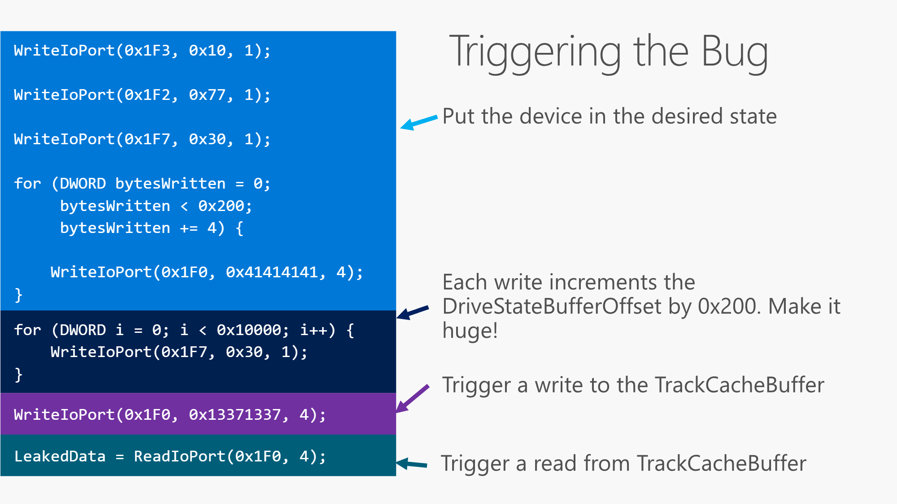

지난 파트 보러가기
[[Research] NewJeans' Hyper-V Part 1 - Hyper-V Architecture](https://hackyboiz.github.io/2023/09/30/pwndorei/newjeans-hyper-v-pt1/)
[[Research] NewJeans' Hyper-V Part 2 - CVE-2018-0959 Analysis(1)](https://hackyboiz.github.io/2023/10/08/pwndorei/newjeans-hyper-v-pt2/)
**[Research] NewJeans' Hyper-V Part 3 - CVE-2018-0959 Analysis(2) (Here)**

안녕하세요! 쉬지도 않고 또 돌아온 pwndorei입니다.
이번 Part 3에서는 지난 파트에서 다룬 버그 트리거 과정에 대한 분석을 끝내고 이 취약점을 어떻게 익스플로잇 할 수 있는지 다뤄보겠습니다! 그럼 Part 2에 이어서 `IdeAttachment::Write`를 마저 분석해보죠!!

# `IdeAttachment::Write`
```C
void __fastcall IdeAttachment::Write(IdeAttachment *this, __int64 a2, __int64 a3, const unsigned __int16 *a4)
{
  __int64 CurrentSectorNum; // rax
  __int64 DriveState; // rcx
  unsigned __int64 CurrentSectorNum_1; // rbp
  unsigned int SectorCount; // esi
  int SectorCount_1; // eax
  struct IDE_DRIVE_STATE *v10; // rdx
  unsigned __int64 CommandTotalSector_1; // rax
  __int64 DriveState_1; // rdx
  __int64 v13; // r8
  _QWORD *v14; // r9
  unsigned __int64 CommandTotalSector; // rax
  struct IDE_DRIVE_STATE *v16; // rdx
  unsigned __int64 v17; // r8
  unsigned __int64 v18; // rax
  __int64 v19; // r8
  const unsigned __int16 *v20; // r9
  __int64 v21; // rdi
  const wchar_t *v22; // rbx
  const wchar_t *v23; // r13
  char v24; // al
  const wchar_t *v25; // r8
  __int64 DriveState_2; // rdx
  __int64 BufferOffset; // r8
  __int64 v28; // rdx
  signed __int32 v29; // ett
  __int64 v30; // rdx
  __int64 i; // rcx
  __int64 v32; // rsi
  int v33; // edi
  const wchar_t *v34; // r13
  unsigned __int64 v35; // rbx
  char v36; // al
  const wchar_t *v37; // r8
  __int64 v38; // rdx
  signed __int32 v39; // ett

  ...
  if ( *((_BYTE *)this + 82)
    || CurrentSectorNum_1 >= IdeAttachment::GetCommandTotalSectors(this, *((struct IDE_DRIVE_STATE **)this + 62))
    || (CommandTotalSector_1 = IdeAttachment::GetCommandTotalSectors(this, v10),
        CurrentSectorNum_1 + *(unsigned int *)(DriveState_1 + 8) > CommandTotalSector_1) )
  {
    ...
  }
  else                                          
  {
   ...
    if ( *((_BYTE *)this + 0x1F9) && *((_BYTE *)this + 0x22D) )// Increase BufferOffset
    {
      DriveState_2 = *((_QWORD *)this + 62);
      BufferOffset = (unsigned int)(*((_DWORD *)this + 0x80) * (*((_DWORD *)this + 0x84) - *((_DWORD *)this + 0x82)));
      *((_QWORD *)this + 0x42) += *(unsigned int *)(DriveState_2 + 0x1C);// += 1
    }
    else                                        // Initialize BufferOffset
    {
      DriveState_2 = *((_QWORD *)this + 62);
      BufferOffset = 0i64;
      *((_DWORD *)this + 0x80) = 0x200;
      *((_QWORD *)this + 0x41) = CurrentSectorNum_1;//*((_DWORD *)this + 0x82)
      *((_QWORD *)this + 0x42) = CurrentSectorNum_1 + *(unsigned int *)(DriveState_2 + 0x1C);// CurrentSectorNum + 1
    }
    *((_BYTE *)this + 0x22C) = SectorCount > *(_DWORD *)(DriveState_2 + 0x1C)
                            && (*(_BYTE *)(DriveState_2 + 0x20) & 0x10) != 0;
    if ( *((_BYTE *)this + 0x22C)
      && (unsigned __int64)*((unsigned int *)this + 0x80) * (*((_QWORD *)this + 0x42) - *((_QWORD *)this + 0x41)) >= (unsigned __int64)*(unsigned int *)(DriveState_2 + 0xB0) >> 1 )
    {
      *((_BYTE *)this + 0x22C) = 0;
    }
    *(_DWORD *)(DriveState_2 + 0x40) = BufferOffset;
    *(_WORD *)(*((_QWORD *)this + 62) + 76i64) = 1;// BufferPtrValid
    *(_DWORD *)(*((_QWORD *)this + 62) + 68i64) = *(_DWORD *)(*((_QWORD *)this + 62) + 28i64) << 9;
    ...
}
```
다른 부분은 크게 신경 쓸 필요 없으니 바로 else 문 안쪽부터 보시죠! else문 안에는 다시 if-else 문이 있고 주석에 나와있는 것처럼 DriveStateBufferOffset이 if 에서는 증가하고 else에서는 초기화됩니다.

초기화되는 부분부터 살펴보시죠!
```C
DriveState_2 = *((_QWORD *)this + 62);
BufferOffset = 0i64;
*((_DWORD *)this + 0x80) = 0x200;//IdeAttachment + 0x80 * 4
*((_QWORD *)this + 0x41) = CurrentSectorNum_1;//IdeAttachment 0x41 * 8
*((_QWORD *)this + 0x42) = CurrentSectorNum_1 + *(unsigned int *)(DriveState_2 + 0x1C);
```
BufferOffset은 0으로 초기화하고 `IdeAttachment` 오프셋 0x200에 0x200을 저장합니다. 오프셋 0x208은 CurrentSectorNum으로 초기화하고 0x210은 CurrentSectorNum + 1로 초기화합니다. 이 값들이 어떤 의미를 갖는지 알기 위해서는 if문에서 DriveStateBufferOffset을 증가시킬 때 사용되는 방식을 살펴봐야 합니다

```C
if ( *((_BYTE *)this + 0x1F9) && *((_BYTE *)this + 0x22D) )// Increase BufferOffset
{
	DriveState_2 = *((_QWORD *)this + 62);
    BufferOffset = (unsigned int)(*((_DWORD *)this + 0x80) * (*((_DWORD *)this + 0x84) - *((_DWORD *)this + 0x82)));
    *((_QWORD *)this + 0x42) += *(unsigned int *)(DriveState_2 + 0x1C);// += 1
}
```
if문으로 진입하기 위해서는 `IdeAttachment`의 오프셋 0x1f9와 0x22d가 모두 0이 아니어야 하네요. 이 부분은 뒤에서 다시 설명 드리겠습니다. 중요한 것은 증가한 BufferOffset을 계산하는 부분입니다.  `(unsigned int)(*((_DWORD *)this + 0x80) * (*((_DWORD *)this + 0x84) - *((_DWORD *)this + 0x82)));` 를 보면 `IdeAttachment`의 오프셋 0x210의 값과 0x208의 값을 뺀 것에 0x200을 곱한다는 것을 알 수 있습니다.  이후 오프셋 0x210의 값을 1 씩 증가시킵니다.
제 나름대로 의미를 부여해보자면 오프셋 0x208은 기준이 되는 섹터 번호(base)인 것 같고 오프셋 0x210은 기준으로부터의 오프셋인 것 같네요. 그리고 0x200씩 증가하니 섹터 당 0x200바이트라는 것 같기도 합니다.
이후 아래의 코드가 실행됩니다
```C
*((_BYTE *)this + 0x22C) = SectorCount > *(_DWORD *)(DriveState_2 + 0x1C) && (*(_BYTE *)(DriveState_2 + 0x20) & 0x10) != 0;
if ( *((_BYTE *)this + 0x22C)
      && (unsigned __int64)*((unsigned int *)this + 0x80) * (*((_QWORD *)this + 0x42) - *((_QWORD *)this + 0x41)) >= (unsigned __int64)*(unsigned int *)(DriveState_2 + 0xB0) >> 1 )
{
    *((_BYTE *)this + 0x22C) = 0;
}
*(_DWORD *)(DriveState_2 + 0x40) = BufferOffset;
*(_WORD *)(*((_QWORD *)this + 62) + 76i64) = 1;// BufferPtrValid
```
그 결과 `IdeAttachment`의 오프셋 0x22c에는 `0x77 > 1 && (0x11 & 0x10) != 0`의 결과인 1이 저장됩니다. 이후 DriveStateBufferOffset이 TrackCacheSize >> 1 보다 작지 않으면 `IdeAttachment`의 오프셋 0x22c를 0으로 바꾸지만 초기화 단계에선 이 조건을 만족하지 않아 그냥 넘어가고 초기화 또는 증가한  BufferOffset을 `Drive.Saved.DriveStateBufferOffset`에 저장합니다.

정리하자면 조건을 만족하고 `IdeAttachment::Write`가 호출되면 DriveStateBufferOffset이 0x200 씩 증가하겠군요. 그렇다면 이 조건은 어떻게 만족할 수 있을까요? 버그 트리거 과정을 다시 살펴보시죠

# Bug Trigger


> [출처](https://github.com/microsoft/MSRC-Security-Research/blob/master/presentations/2019_08_BlackHatUSA/BHUSA19_Exploiting_the_Hyper-V_IDE_Emulator_to_Escape_the_Virtual_Machine.pdf)

0x1f3과 0x1f2 포트에 각각 0x10, 0x77을 쓴 뒤 0x1f7에 0x30을 써서 호출된 `IdeAttachment::Write`를 디버깅 해봤을 때 `IdeAttachment`의 오프셋 0x1f9는 1이었지만 0x22d는 0이었습니다. 위 그림 상으로는 이후 0x1f0 포트에 데이터를 총 0x200 바이트만큼 쓰는데요? 아까 추측한 바로는 0x200은 섹터 당 크기입니다. 섹터를 전부 다 쓰면 어떤 일이 발생하는 건 아닐까요? 그리고 마침 데이터를 다 쓴 다음 0x1f7에 0x30을 쓰면 DriveStateBufferOffset이 증가한다고 하네요! 
그럼 0x1f0 포트에 데이터를 쓰면 어떤 일이 일어나는지 다시 살펴봅시다!

## WriteIoPort(0x1f0, 0x41414141, 4)
`IdeChannel::WritePort`에서 port가 0이면 `IdeChannel::WriteDataPort`가 호출됩니다.
```C
void __fastcall IdeChannel::WriteDataPort(IdeChannel *this, struct IDE_DRIVE_STATE *Drive, unsigned __int8 AccessSize, __int64 AccessCount, const void *Buffer)
{
  __int64 CurrentBuffer; // rdi
  __int64 CurrentByte; // rbp
  unsigned int length; // esi
  IdeChannel *v9; // rcx
  unsigned int v10; // ebp

  if ( *((_BYTE *)Drive + 77) )                 // Drive.Saved.UseCommandBuffer
    CurrentBuffer = *((_QWORD *)Drive + 20);    // Drive.CommandBuffer
  else
    CurrentBuffer = *((_QWORD *)Drive + 21) + *((unsigned int *)Drive + 16);// Drive.TrackCacheBuffer + Drive.Saved.DriveStateBufferOffset
  if ( CurrentBuffer && *((_BYTE *)Drive + 76) )//BufferPtrValid
  {
    CurrentByte = *((unsigned int *)Drive + 18);// Drive.Saved.CurrentByte
    length = AccessSize;
    if ( AccessSize + (unsigned int)CurrentByte > *((_DWORD *)Drive + 17) )// CurrentByte + length > Driver.Saved.TotalBytes
    {
      if ( (unsigned int)VmlIsDebugTraceEnabled(16592i64) )
        VmlDebugTrace(16592i64, L"[IDE ] Write to data port exceeds TotalBytes.");
      length = *((_DWORD *)Drive + 17) - CurrentByte;// Drive.Saved.TotalBytes
    }
    memcpy_0((void *)(CurrentBuffer + CurrentByte), Buffer, length);
    v10 = length + CurrentByte;
    *((_DWORD *)Drive + 18) = v10;//CurrentByte += `data length`
    if ( v10 >= *((_DWORD *)Drive + 17) )//CurrentByte >= TotalBytes(0x200)
      IdeChannel::WriteDataPortBufferComplete(v9, Drive);
  }
  else if ( (unsigned int)VmlIsDebugTraceEnabled(16592i64) )
  {
    VmlDebugTrace(16592i64, L"[IDE ] Write to data port, but no data expected");
  }
}
```
Part 2에서 살펴봤던 그 취약한 함수죠. Part 2에선 간단히 보고 넘어간 `IdeChannel::WriteDataPortBufferComplete`를 볼 필요가 있습니다. 왜냐면 위 그림대로 포트 0x1f0에 총 0x200바이트 만큼의 데이터를 쓴다면 CurrentByte가 TotalBytes와 같아지면서 이 함수가 호출되거든요.
### `IdeChannel::WriteDataPortBufferComplete`
```C
void __fastcall IdeChannel::WriteDataPortBufferComplete(IdeChannel *this, struct IDE_DRIVE_STATE *a2)
{
  signed __int32 v3; // ett
  __int64 v4; // rcx

  if ( (unsigned int)VmlIsDebugTraceEnabled(0xC0D0u) )
    VmlDebugTrace(49360i64, L"[IDE ] WriteDataPortBufferComplete");
  *((_DWORD *)a2 + 17) = 0;//TotalBytes
  *((_DWORD *)a2 + 18) = 0;//CurrentBytes
  _m_prefetchw((char *)a2 + 16);
  do
    v3 = *((_DWORD *)a2 + 4);
  while ( v3 != _InterlockedCompareExchange((volatile signed __int32 *)a2 + 4, v3 & 0xFFFFFFF7 | 0x80, v3) );
  v4 = *((_QWORD *)a2 + 19);
  *((_BYTE *)a2 + 76) = 0;//BufferPtrValid
  (*(void (__fastcall **)(__int64))(*(_QWORD *)v4 + 280i64))(v4);
}
```
TotalBytes와 CurrentByte, BufferPtrValid를 0으로 초기화하고 다른 함수를 호출합니다. 호출되는 함수는 `IdeAttachment::WriteDataPortBufferComplete`입니다
### `IdeAttachment::WriteDataPortBufferComplete`
```C
void __fastcall IdeAttachment::WriteDataPortBufferComplete(IdeAttachment *this)
{
  (*(void (__fastcall **)(IdeAttachment *))(*(_QWORD *)this + 0x130i64))(this);
}
```
.... 별다른 동작은 하지 않고 바로 다음 함수를 호출하는데 호출되는 함수는 `IdeAttachment::DoCachedWrite`입니다.
### `IdeAttachment::DoCachedWrite`
```C
void __fastcall IdeAttachment::DoCachedWrite(IdeAttachment *this)
{
  __int64 v2; // rdx
  __int64 v3; // r8
  __int64 v4; // r9
  unsigned __int8 (__fastcall *v5)(IdeAttachment *, _QWORD, __int64, __int64, _QWORD, int); // r10

  if ( *((_BYTE *)this + 0x1F9) && *((_BYTE *)this + 0x22C) )
  {
    *((_BYTE *)this + 0x22D) = 1;
  }
  else
  {
	  ...
  }
  (*(void (__fastcall **)(IdeAttachment *))(*(_QWORD *)this + 344i64))(this);
}
```
여기에선 `IdeAttachment::Write`에서 DriveStateBufferOffset이 증가하는 분기로 진입하기 위해 0이 아닐 필요가 있는 `IdeAttachment`의 오프셋 0x22d에 1을 저장합니다! ~~정말 길고 긴 여정이었습니다...~~ `IdeAttachment`의 오프셋 0x1f9는 별다른 동작을 하지 않아도 1이고 오프셋 0x22c는 `IdeAttachment::Write`에서 1로 설정되었으니 조건을 만족합니다! 이후 호출되는 것은 `IdeAttachment::WriteMediaSectorsComplete`입니다.

### `IdeAttachment::WriteMediaSectorsComplete`
```C
void __fastcall IdeAttachment::WriteMediaSectorsComplete(IdeAttachment *this, char a2)
{
  __int64 v2; // rax
  __int64 v4; // rdx
  signed __int32 v5; // ett
  unsigned int v6; // er8
  char v7; // di
  __int64 v8; // rax
  _QWORD *v9; // r9
  __int64 v10; // rcx
  int v11; // eax
  __int64 DriveState; // rax
  __int64 v13; // rdx
  __int64 v14; // rdx
  signed __int32 v15; // ett
  __int64 v16; // rcx

  v2 = *((_QWORD *)this + 62);
  if ( !a2 )
  {
    v6 = *(_DWORD *)(v2 + 0x1c);
    v7 = 0;
    *(_DWORD *)(v2 + 8) -= v6;//SectorCount -= 1
    v8 = *(_QWORD *)(*((_QWORD *)this + 73) + 8i64);
    v9 = *(_QWORD **)(v8 + 1496);
    if ( v9 )
      _InterlockedExchangeAdd64(
        (volatile signed __int64 *)(*v9 + *(unsigned int *)(*(_QWORD *)(v8 + 1504) + 60i64)),
        v6);
    v10 = *((_QWORD *)this + 62);
    v11 = *(_DWORD *)(v10 + 0x20);
    if ( (v11 & 0x20) != 0 )//0x11 & 0x20 == 0
    {
      ...
    }
    v7 = 1;
LABEL_11:
    DriveState = *((_QWORD *)this + 62);
    if ( *(_DWORD *)(DriveState + 8) )          // SectorCount > 0
    {
      if ( IdeAttachment::AdvanceToNextSector(this, *((struct IDE_DRIVE_STATE **)this + 62), v6) )
      {
        *(_BYTE *)(*((_QWORD *)this + 62) + 20i64) = 0x80;
        *(_DWORD *)(*((_QWORD *)this + 62) + 32i64) = 0;
        v14 = *((_QWORD *)this + 62);
        _m_prefetchw((const void *)(v14 + 16));
        do
          v15 = *(_DWORD *)(v14 + 16);
        while ( v15 != _InterlockedCompareExchange((volatile signed __int32 *)(v14 + 16), v15 & 0xFFFFFF7F | 0x51, v15) );
        goto LABEL_21;
      }
      if ( (unsigned int)(*(_DWORD *)(*((_QWORD *)this + 73) + 508i64) - 6) <= 1 )
      {
        v16 = *((_QWORD *)this + 62);
        LOBYTE(v13) = *(_BYTE *)(v16 + 12);
        (*(void (__fastcall **)(IdeAttachment *, __int64, _QWORD, const wchar_t *))(*(_QWORD *)this + 0x128i64))(// IdeAttachment::Write
          this,
          v13,
          *(_QWORD *)(v16 + 56),
          L"Write(WriteComplete)");
      }
      else
      {
        *((_BYTE *)this + 576) = 1;
      }
    }
    else
    {
      _InterlockedAnd((volatile signed __int32 *)(DriveState + 16), 0xFFFFFF7F);
    }
    if ( !v7 )
      return;
    goto LABEL_21;
  }
  *(_BYTE *)(v2 + 20) = 0x80;
  *(_DWORD *)(*((_QWORD *)this + 62) + 32i64) = 0;
  v4 = *((_QWORD *)this + 62);
  _m_prefetchw((const void *)(v4 + 16));
  do
    v5 = *(_DWORD *)(v4 + 16);
  while ( v5 != _InterlockedCompareExchange((volatile signed __int32 *)(v4 + 16), v5 & 0xFFFFFF7F | 0x51, v5) );
LABEL_21:
  IdeChannel::RequestInterrupt(*((IdeChannel **)this + 73));
}
```
`IdeAttachment::DoCachedWrite`에서 인자 전달하는 부분이 정확히 나와있지 않지만 두 번째 인자 `a2`로는 0이 전달되었습니다. 따라서 `if(!a2)`를 만족합니다. 이후 섹터 수를 1 감소시키고 섹터 수가 0이 아니면 `IdeAttachment::AdvanceToNextSector`가 호출됩니다.

### `IdeAttachment::AdvanceToNextSector`
```C
unsigned __int8 __fastcall IdeAttachment::AdvanceToNextSector(IdeAttachment *this, struct IDE_DRIVE_STATE *Drive, int a3)
{
  char v3; // di
  int v4; // esi
  char *v7; // r8
  __int64 v8; // rdx
  unsigned __int8 *v9; // r9
  unsigned int i; // ecx
  __int64 v11; // rax
  __int64 v12; // rax
  unsigned __int64 v13; // rdx
  unsigned int j; // ecx
  unsigned __int64 v15; // rax
  bool v16; // cf
  char v17; // cl
  __int16 v18; // dx
  int v19; // ecx
  unsigned int v20; // eax

  v3 = 0;
  v4 = a3;
  if ( a3 )                                     // 1
  {
    while ( (*((_DWORD *)Drive + 8) & 0x200) == 0 )//true
    {
      if ( *((_BYTE *)Drive + 0xD) )//1
      {
        v17 = *((_BYTE *)Drive + 5);
        if ( v17 == -1 )
        {
          v18 = *(_WORD *)Drive;
          if ( *(_WORD *)Drive == 0xFFFF )
          {
            *((_BYTE *)Drive + 2) ^= (*((_BYTE *)Drive + 2) ^ (*((_BYTE *)Drive + 2) + 1)) & 0xF;
            ++*((_BYTE *)Drive + 3);
          }
          *(_WORD *)Drive = v18 + 1;
        }
        *((_BYTE *)Drive + 5) = v17 + 1;        // increase SectorNumber
        goto LABEL_22;
      }
      if ( (unsigned int)(unsigned __int8)++*((_BYTE *)Drive + 5) > *((_DWORD *)this + 0x15) )
      {
        ...
      }
LABEL_22:
      if ( !--v4 )
        return v3;                              // return 0
    }
    if ( !*((_BYTE *)Drive + 0xD) && (unsigned int)VmlIsDebugTraceEnabled(g_BreakOnChildAssert == 0 ? 0x4000 : 0) )
      VmlDebugTrace(
        g_BreakOnChildAssert == 0 ? 0x4000 : 0,
        L"%hs(%u) : assertion failed : %hs\n",
        "vm\\dv\\storage\\emulated\\ideattachment.cpp",
        3789i64,
        "Drive.Saved.LbaAddressing");
    ...
  }
  return v3;
}
```
이름처럼 다음 섹터로 넘어가는 동작을 수행합니다. SectorNumber도 1만큼 증가하는 것을 확인할 수 있고요. 그 외 중요한 동작은 하지 않고 0을 반환합니다.
0을 반환했기 때문에 `IdeAttachment::WriteMediaSectorsComplete`으로 돌아왔을 때 if문 안으로 진입하지 않고 다음 if문으로 갑니다만...
`if ( (unsigned int)(*(_DWORD *)(*((_QWORD *)this + 73) + 508i64) - 6) <= 1 )`라는 조건이 어떤 의미인지는 끝내 알 수 없었습니다... 조건 자체는 만족해서 if문에 진입하고 안에서 또 다시 `IdeAttachment::Write`가 호출됩니다 ~~또?...~~

## 정리

> [출처](https://github.com/microsoft/MSRC-Security-Research/blob/master/presentations/2019_08_BlackHatUSA/BHUSA19_Exploiting_the_Hyper-V_IDE_Emulator_to_Escape_the_Virtual_Machine.pdf)

정리하자면 위 그림에서 가상 디바이스를 특정 상태로 만든다는 것은 섹터 수와 번호를 세팅하고 `IdeAttachment::Write`를 한 번 호출해서 `DriveStateBufferOffset`을 초기화한 다음에 포트 0x1f0에 데이터를 총 0x200 바이트만큼 써서 `IdeAttachment::Write`가 호출될 때마다 `DriveStateBufferOffset`이 증가하는 분기로 진입하는 상태가 되게 하는 것이겠네요.
이후 포트 0x1f7에 0x30을 쓸 때마다 `DriveStateBufferOffset`은 0x200씩 증가할 것이며 `IdeChannel::Read/WriteDataPort` 가 호출될 때마다 `AccessSize`씩 증가하는 `CurrentByte`로 하위 9비트를, `DriveStatebufferOffset`으로 나머지 상위 23비트를 조작해서 OOB Read/Write를 할 수 있게 되는 것이죠!!
버그가 발생하는 과정까지 이해했으니 이젠 익스플로잇에 대해 알아봅시다!
# Exploit
대략적인 익스플로잇은 아래와 같은 과정으로 이루어집니다
1. OOB Read로 힙에 있는 데이터를 읽어 `combase.dll`, `rpcrt4.dll`, `KERNELBASE.dll`의 베이스 주소를 알아낸다.
	1. 이 주소들은 페이로드에서 CFG(Control Flow Guard)를 무력화하는데 사용된다.
2. OOB Write로 힙에 있는 특정 클래스의 인스턴스의 vftable을 덮어쓰고 페이로드를 삽입한다
3. 가상머신을 재부팅하는 것으로 페이로드를 트리거시킨다
4. ~~익스플로잇 겟-또다제~~

~~말로는 뭐가 어렵겠습니까...~~
위 과정은 Windows 10 Version 1709에서 익스플로잇하는 과정인데 Windows Server 2012 R2에서는 OOB Read/Write로 접근할 수 있는 범위 내에 스택이 있어서 ROP로 익스플로잇합니다. CFG를 무력화하는 과정 없이 바로 ROP를 하면 되기 때문에 페이로드가 단순합니다. Windows 10 Version 1709에서는 OOB로 스택에 접근할 수 없어 위의 ~~복잡한~~ 방법으로 익스플로잇합니다....
이번 편에서는 간단히 OOB Read/Write로 어떤 힙의 데이터를 읽고 쓰는지만 알아보시죠!

## Memory Layout

위는 vmwp의 TrackCacheBuffer 근처의 메모리를 [vmmap](https://learn.microsoft.com/en-us/sysinternals/downloads/vmmap)으로 살펴본 것입니다.
128KB인 메모리들이 TrackCacheBuffer들입니다. 각 버퍼의 크기는 64KB이죠. 그리고 이들과 인접한 8MB(8192KB)의 거대한 메모리는 VRAM Buffer입니다. 
vmwp가 생성될 때마다 메모리 레이아웃도 변해서 인접하지 않게 되는 경우는 있지만 이 둘 사이의 거리는 VRAM Buffer의 크기인 8MB를 넘지 않습니다. 그리고 VRAM Buffer 끝으로부터 대략 5MB 정도 떨어진 거리에 있는 힙이 우리가 데이터를 읽고 써야할 힙입니다. 이하 타겟 힙이라고 부르겠습니다.
타겟 힙과 VRAM Buffer 사이의 거리는 대략 5MB라고 말씀드렸지만 환경에 따라 다른 것으로 보입니다. 제가 참고한 발표자료만 보더라도 둘 사이의 거리가 1KB 정도라고 나와있습니다. 그리고 가끔씩 TrackCacheBuffer 보다도 낮은 주소에 위치하여 OOB로 접근조차 못하는 경우도 있습니다!... 
다음 파트에서 더 상세히 다루겠지만 이러한 이유들로 인해 익스플로잇의 성공률이 체감상 10%도 되지 않습니다 ㅠㅠ 그래도 최대한 Reliable하게 타겟 힙에 접근하는 방법이 존재하긴 합니다!

## Jump To Target Heap
위에서 VRAM Buffer의 끝과 타겟 힙 사이의 거리가 대략 5MB로 일정하다고 말씀드렸습니다. 또한 TrackCacheBuffer와 VRAM Buffer도 VRAM Buffer의 크기인 8MB 이하로 떨어져 있습니다. 
슬슬 감이 오시나요? ㅎㅎ 일단 첫 번째로 DriveStateBufferOffset을 8MB 만큼 증가시켰을 때 CurrentBuffer가 가리킬 부분은 거의 99% VRAM Buffer입니다! 문제는 VRAM Buffer의 어디를 가리키는지 알 수 없다는 것이죠. 이 문제는 VRAM Buffer에 패턴을 띈 데이터를 써놓는 것으로 해결할 수 있습니다.

### VRAM
VRAM이란 Video RAM을 뜻합니다. Hyper-V에서는 Aperture라는 것을 통해 호스트에서 게스트의 물리 메모리에 매핑된 가상 메모리를 얻을 수 있는데 vmwp의 VRAM Buffer 또한 이 Aperture를 통해 가상머신의 Hyper-V 비디오 장치의 MMIO에 쓰이는 물리 메모리에 매핑된 것입니다. 전 처음에 당연히 Virtual RAM이겠거니 생각해서 꽤 오래 삽질을 했었죠 ㅋㅋㅋㅋㅋ 무튼 VRAM Buffer에 저장되는 데이터는 게스트에서 보여줄 화면의 픽셀 데이터입니다. 게스트의 화면이니까 당연히 게스트에서도도 접근할 수 있겠죠?

위처럼 게스트의 장치관리자에서 Hyper-V 비디오 장치를 찾을 수 있고 MMIO를 통해 접근할 수 있습니다. 게스트의 커널 드라이버에서 `MmMapIoSpace`함수로 해당 범위의 물리 메모리에 매핑된 가상 메모리를 얻을 수 있습니다. 이후 여기에 패턴을 가진 데이터를 8MB 만큼 씁니다. 처음엔 A~H까지 각 1MB씩 썼으나 정확성을 높히기 위해 마지막 1MB를 다시 128KB씩 쪼개고 또 마지막 128KB를 16KB씩 쪼개서 패턴의 마지막 16KB가 'V'가 되도록 만들었습니다.
따라서 맨 처음 8MB만큼 DriveStateBufferOffset을 증가시키면 VRAM Buffer의 어딘가에 착지한 다음 읽은 데이터에 따라 오프셋을 조금씩 증가시켜서 최종적으로 읽은 데이터가 'V'일 때 대략 5MB 정도 오프셋을 증가시키면?...

위처럼 크래시가 발생하는 일 없이 타겟 힙에 도달할 수 있습니다!!

# Part 4 예고
이번 Part 3에서는 분석을 끝내고 간단하게 익스플로잇 방법까지 알아보았는데요? 다음 Part 4에서는 CFG, ACG 등의 미티게이션에 대해 알아본 다음 제가 작성한 익스플로잇 코드를 보면서 실제로는 어떻게 익스플로잇 했는지 자세히 다뤄보겠습니다.


