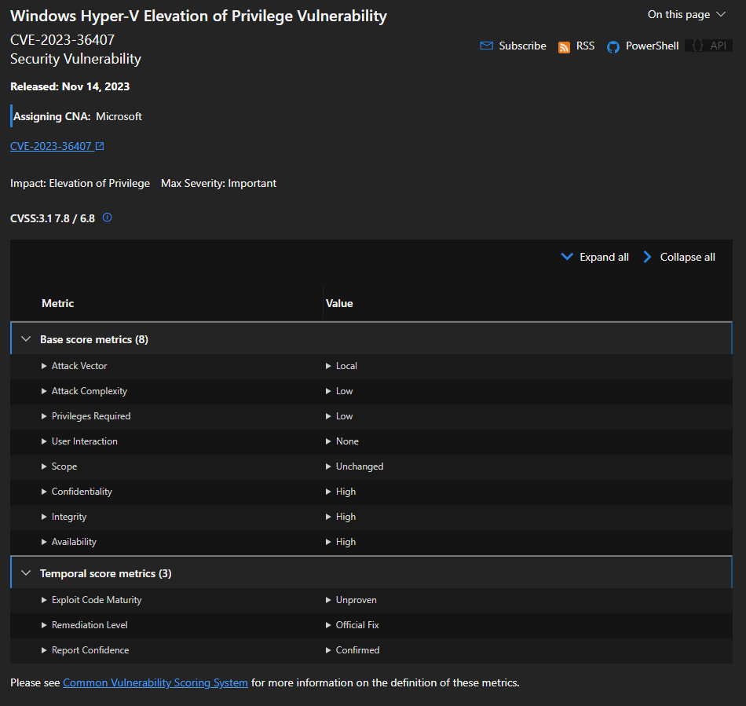
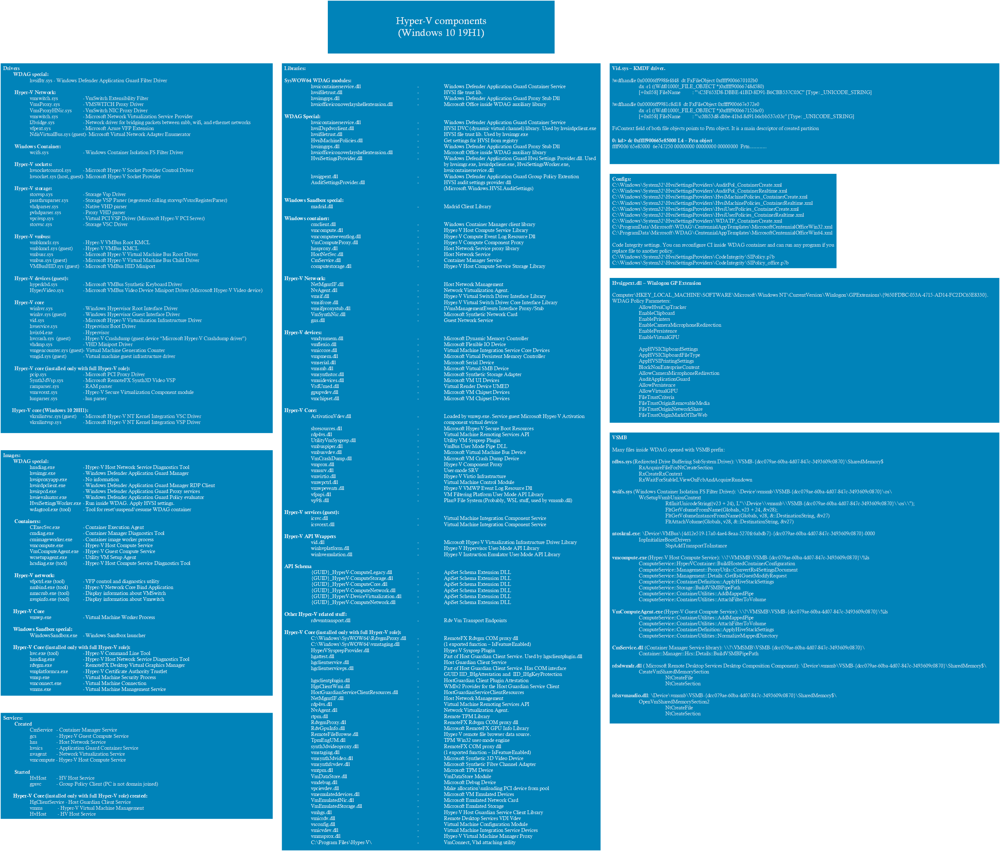
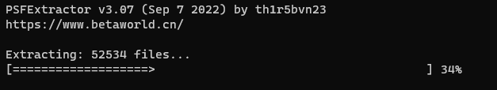
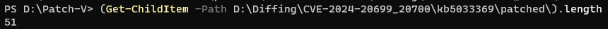
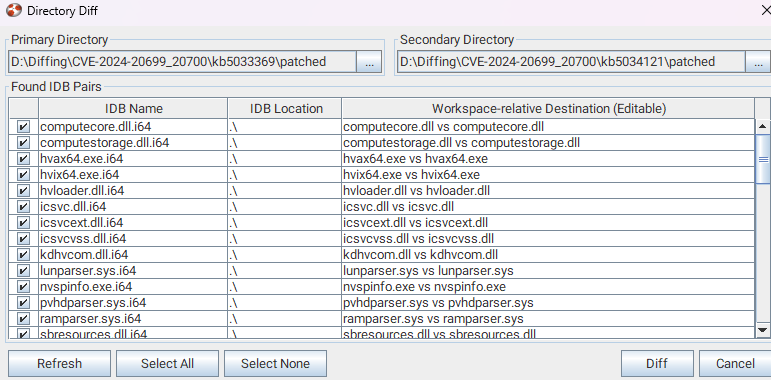
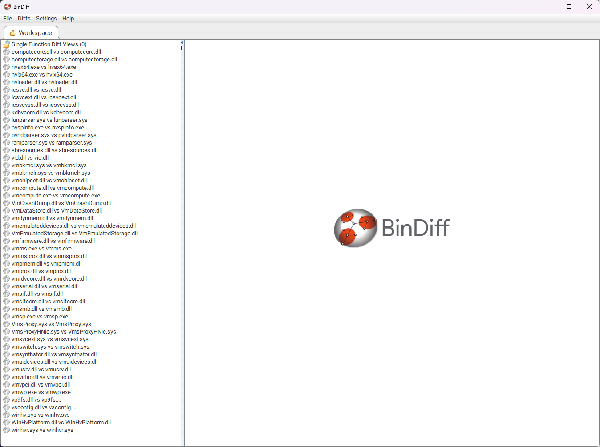

안녕하세요! 오랜만에 Hyper-V 연구글로 돌아온 pwndorei입니다!
Part 6는 원래 L0ch님이 분석한 취약점에 대해 쓸 예정이었는데요? 취업과 졸업 준비라는 치트키를 써가면서 버티길 약 반년, 이제는 기억이 나지 않아 쓸 수 없는 상태가 되면서 제가 쓰게 되었습니다 ^^....

~~사냥감의 기분을 알게 된 버그 헌터 L0ch~~

아무튼 이번 글에서는 L0ch님이 취업하고 Hyper-V를 등한시~~유기~~하면서 혼자 남은 제가 쓸쓸히 진행 중인 프로젝트에 대한 글입니다! 

# Hyper-V Patch Diffing
---
제목으로 눈치채셨겠지만 이 프로젝트의 주제는 Hyper-V Patch Diffing입니다! 대부분의 Hyper-V 취약점은 공개된 정보가 극히 제한적입니다!... 아래의 [CVE-2023-36407](https://msrc.microsoft.com/update-guide/vulnerability/CVE-2023-36407)을 예시로 살펴보자면 취약점을 악용하여 권한 상승을 달성할 가능성이 있다는 것 정도는 알 수 있어도 어떤 컴포넌트에서 어떤 취약점이 발생하는지는 공개되어 있지 않습니다...


따라서 어디가 어떻게 취약한 지는 Patch Diffing을 통해 알아내야 합니다. 하지만 프로젝트를 시작도 하기 전에 큰 문제에 직면했으니...

>출처: https://github.com/gerhart01/Hyper-V-Internals

바로 Hyper-V 관련 바이너리가 말도 안되게 많다는 거죠 ㅋㅋㅋㅋㅋㅋㅋㅋㅋ [Part2](https://hackyboiz.github.io/2023/10/08/pwndorei/newjeans-hyper-v-pt2/#Patch-Diffing)에서 CVE-2018-0959를 patch diffing으로 분석했던 것을 기억하시나요? 그때는 `VmEmulatedStorage.dll`이 취약하다는 것을 알고 있었기에 패치에 큰 힘을 들일 필요가 없었지만 지금 그때처럼 하나씩 패치했다간 분석하기도 전에 뒷목 잡고 쓰러질 것 같더라고요 ㅋㅋ

그래서! 추출된 패치에서 Hyper-V 관련 바이너리만 전부 쏙쏙 뽑아 자동으로 패치해줄 스크립트를 작성하기로 했습니다...

# Patch-V
---
Hyper-V Diffing을 위한 패치 자동화 스크립트라서 [Patch-V](https://github.com/pwndorei/Patch-V)라고 명명했습니다 ㅋㅋㅋㅋㅋ
Powershell로 작성된 스크립트이고 간단히 설명 드리자면 `Patch-V.ps1`에서는 `-Path`로 전달된 패치가 추출되어있는 경로에서 Hyper-V 관련 패치들을 위의 컴포넌트 리스트를 바탕으로 작성된 `components.txt`를 참고하여 가져오고 `delta_patch.py`를 실행해서 Reverse/Forward patch합니다. 초기 버전의 파일들은 `C:\Windows\WinSxS`를 통해 구해지고 `.\base`경로에 저장되어 다음 실행에서 재사용할 수 있고 패치된 바이너리들을 `.\patched` 에 저장됩니다.

백문이 불여일견! 바로 한번 써봅시다...

## Example: CVE-2024-20699 & CVE-2024-20700
올해 첫 번째 Patch Tuesday로 패치된 Hyper-V 취약점인 CVE-2024-20699와 CVE-2024-20700을 diffing해봅시다! 분석은 Windows 11 21H2를 기준으로 진행해보겠습니다!

먼저 취약점이 패치된 업데이트와 그 직전 업데이트를 가져옵시다. Windows 11 version 21H2 for x64-based Systems 기준으로 각각 KB5034121와 KB5033369네요!

### Extract
파일을 받았으면 이제 추출을 해야겠죠? 패치 추출에는 [windows patch extractor](https://github.com/star-sg/windows_patch_extractor)를 사용했습니다!
무려 5만 개의 파일을 추출하고 있는 모습입니다... 하지만 밥 시간에 맞춰 추출하라던 L0ch님의 발언이 무색할 정도로 빠르게 추출이 완료되었습니다 ㅋㅋㅋㅋㅋ


추출된 경로에서는 아래와 같은 파일 구성을 확인할 수 있었고 이들 중에서 `Windows10_0-{KB_Number}-x64_cab` 폴더 아래에 패치 데이터들이 저장되어 있었습니다. 저대로는 경로가 너무 기니까 저는 각각 `kb5034121`과 `kb5033369` 폴더 밑의 `expand` 폴더로 옮겨줬습니다!

### Patch
그럼 이제 패치를 진행해볼까요? 초기 버전의 바이너리는 로컬에서 가져오는데 스크립트를 실행하는 환경은 Windows 11 22H2여서 사전에 구해놓은 21H2의 초기 버전 바이너리를 스크립트 파일이 위치한 경로의 `.\base\` 폴더 밑에 위치시키고 `-SkipRev` 옵션을 주면 Reverse patch를 건너뛸 수도 있습니다!

```
PS D:\Patch-V> .\Patch-V.ps1 -Path D:\Diffing\CVE-2024-20699_20700\kb5033369\expand\ -SkipRev:$true
base dir is not empty, skip reverse patching?[y/n]: y


    디렉터리: D:\Patch-V


Mode                 LastWriteTime         Length Name
----                 -------------         ------ ----
d-----      2024-03-06   오후 6:23                patched
ActivationVdev.dll not found from patch
AuditSettingsProvider.dll not found from patch
c4d66f00-b6f0-4439-ac9b-c5ea13fe54d7_HyperV-ComputeCore.dll not found from patch
CExecSvc.exe not found from patch
Applied 1 patch successfully
Final hash: 3VrNDy1c7YdPw6MHlSORGeZl9nTdC5xkzl/pf+fAFzg=
computelibeventlog.dll not found from patch
Applied 1 patch successfully
Final hash: +xo3Jz9vEFp+h/oWEwWzyRJgfNSHQe6Otm9yw2wXtHY=
f1db7d81-95be-4911-935a-8ab71629112a_HyperV-IsolatedVM.dll not found from patch
gpupvdev.dll not found from patch
hcsdiag.exe not found from patch
hgattest.dll not found from patch
hgclientservice.dll not found from patch
hgclientserviceps.dll not found from patch
hgsclientplugin.dll not found from patch
HgsClientWmi.dll not found from patch
hnsdiag.exe not found from patch
hnsproxy.dll not found from patch
HostGuardianServiceClientResources.dll not found from patch
HostNetSvc.dll not found from patch
Applied 1 patch successfully
Final hash: sIaFcBVT6l7CHA+LExy1tovaKDvrWSiB+RLsxgoC5nw=
hvc.exe not found from patch
hvcrash.sys not found from patch
hvhostsvc.dll not found from patch
Applied 1 patch successfully
Final hash: sV/M+AIr8W/0mTVHsx7YUSicQHtDveT1Iz2rw620UNU=
```
스크립트를 실행시키면 위와 같이 패치가 진행되고 `.\patched` 경로에 패치된 바이너리가 저장되는 것을 확인할 수 있습니다.

```
PS D:\Patch-V> Get-ChildItem .\patched\


    디렉터리: D:\Patch-V\patched


Mode                 LastWriteTime         Length Name
----                 -------------         ------ ----
-a----      2024-03-06   오후 6:23         902512 computecore.dll
-a----      2024-03-06   오후 6:23         460256 computestorage.dll
-a----      2024-03-06   오후 6:23        1586656 hvax64.exe
-a----      2024-03-06   오후 6:23        1775064 hvix64.exe
-a----      2024-03-06   오후 6:23         152960 hvloader.dll
-a----      2024-03-06   오후 6:23         316896 icsvc.dll
-a----      2024-03-06   오후 6:23         143360 icsvcext.dll
-a----      2024-03-06   오후 6:23         349664 icsvcvss.dll
-a----      2024-03-06   오후 6:23          58752 kdhvcom.dll
-a----      2024-03-06   오후 6:23          66928 lunparser.sys
-a----      2024-03-06   오후 6:23         370144 nvspinfo.exe
-a----      2024-03-06   오후 6:23          91520 pvhdparser.sys
...
```

다른 패치 적용하기 전에 `.\patched` 폴더는 적당한 곳에 옮겨주고 다시 스크립트를 실행해서 이와 비교할 다른 버전의 바이너리들도 패치해줍시다!...

### Diffing
비교할 버전의 바이너리들이 모두 갖춰졌으니 이제 Diffing을 하면 되겠죠? BinDiff로 Diffing을 진행하려면 바이너리를 IDA로 분석해서 `.i64`나 `.idb` 확장자의 IDB 파일이 필요합니다... 파일을 열기만 하면 되는 간단한 작업이지만....

51개요?... 패치가 두 개니까 대략 102개?... 제가 미쳤다고 이걸 다 하나씩 ida로 열고 있진 않겠죠 ^^.... `CreateIDB.ps1` 스크립트를 활용하면 같은 이름의 파일 간의 해시값 비교로 패치로 변경된 점이 있는지 확인하고 다른 점이 존재하는 파일을 아키텍처에 따라 `idat.exe` 또는 `idat64.exe`로 분석해서  `.idb` 혹은 `i64` 포맷의 IDB 파일을 생성해준답니다 ^^b

```
PS D:\Patch-V> .\CreateIDB.ps1 -Primary D:\Diffing\CVE-2024-20699_20700\kb5033369\patched\ -Secondary D:\Diffing\CVE-2024-20699_20700\kb5034121\patched\ -IDA 'D:\IDA Pro 7.5\' -Arch amd64
primary computecore.dll vs secondary computecore.dll
primary computestorage.dll vs secondary computestorage.dll
primary hvax64.exe vs secondary hvax64.exe
primary hvix64.exe vs secondary hvix64.exe
primary hvloader.dll vs secondary hvloader.dll
primary icsvc.dll vs secondary icsvc.dll
primary icsvcext.dll vs secondary icsvcext.dll
primary icsvcvss.dll vs secondary icsvcvss.dll
primary kdhvcom.dll vs secondary kdhvcom.dll
primary lunparser.sys vs secondary lunparser.sys
primary nvspinfo.exe vs secondary nvspinfo.exe
...
```

모든 변경된 파일에 대한 IDB 파일 생성이 완료된 다음 BinDiff를 열고 Directory Diff를 추가해주면?...



커맨드 몇 줄 치고 마우스 좀 딸깍이면 Hyper-V 바이너리만 모아놓은 BinDiff Workspace가 뚝딱입니다 ㅋㅋㅋㅋㅋㅋ

# Part 7 예고
이로써 분석할 환경은 갖추어졌습니다... 하지만 가만히 있는다고 취약점이 어디 있는지는 알 수 없겠죠?... 다음 파트에서는 Hyper-V LPE 취약점인 CVE-2023-36407을 patch diffing으로 분석한 내용과 익스플로잇 과정에 대해 다뤄보겠습니다!
